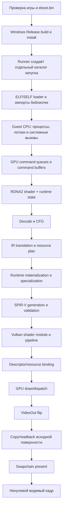

# Ghost of Yōtei в KytyPS5 на Windows: прогресс и план запуска

Обновлено **7 сентября 2026 года**. Игра: **Ghost of Yōtei, PPSA26344**.
Рабочая ветка — `main` fork `fxpw/KytyPS5`.

**Эмулятор доходит до Vulkan dispatch и показа подготовленных поверхностей, но
первый ненулевой кадр, меню и управляемая сцена пока не подтверждены.** В
последнем измерительном запуске `203231-2bbe49` счётчик дошёл до frame 18,
эмулятор подготовил 5 GPU flips и показал 4. Проверочный readback соседнего
запуска доказал, что исходная поверхность 1920×1080 действительно содержит
нулевой RGB, поэтому чёрное окно уже нельзя объяснить одним swapchain.

Persistent Vulkan pipeline cache работает и переживает перезапуск. Он убрал
примерно 60-секундную первую компиляцию самого тяжёлого pipeline, но не устранил
постоянное время GPU-исполнения: после прогрева два compute-шейдера занимают
примерно 8,4 и 6,1 секунды на кадр. Половинное внутреннее разрешение подняло
служебный FPS примерно с 0,03 до 0,068, но изображение осталось чёрным.

Этот документ — текущая сводка, а не первоначальный план от 5 сентября.
Ожидание загрузки файлов, первый запуск Windows-сборки и поиск начального
MIMG/DPP8 препятствия уже пройдены. Исторические результаты вынесены ниже;
они не заменяют последнюю проверку игры.

Текущий быстрый цикл аудита исправил общий случай buffer descriptor table,
где индекс образован unsigned bitfield extraction. Native Windows-сборка
`shader_cfg_tests` прошла, а `cs_00010f14` и `cs_000153d4` теперь доходят до
`compute_execution_precheck` в обеих конфигурациях барьеров. Из прежней группы
из семи shader Phi-барьер также снят для `cs_00016ff4`, `cs_00016cd4` и
`cs_00017c74`: они доходят до следующего общего precheck и останавливаются уже
на ограничениях cooperative wave64/ImageWrite либо loop memory independence.
Два shader пока остаются на сложном lane/selector выражении. Полный batch после
этих изменений ещё не запускался, поэтому итог `731/825` ниже пока не пересчитан.
Требуемые позже регрессии записываются в
[emulator-test-debt.md](emulator-test-debt.md).

## Полный поток от запуска до кадра



Один кадр проходит следующие этапы. Статус `PASS` означает только указанную
границу; он не переносится автоматически на следующий этап.

| № | Этап | Что происходит | Как подтверждаем | Текущий статус |
| ---: | --- | --- | --- | --- |
| 0 | Входные данные | Runner проверяет каталог игры, `eboot.bin` и выбранный executable. | Preflight без `-Run`, затем `run.json` с абсолютными путями и SHA-256 emulator. | **PASS** для `PPSA26344`, APP_VER `01.512.000`. Текущий `eboot.bin` локально и обратимо переведён с 3840×2160 на 1920×1080; оригинал сохранён отдельно. |
| 1 | Сборка | CMake/Ninja собирают Release `kyty_emulator`, тесты и install tree с DLL/plugins. | Native Windows build, CTest, hash установленного executable. | **PASS для последнего стабильного этапа: 48/48**. После отката невыгодного dispatcher-optimizer текущие исходники ещё нужно пересобрать и повторить целевые тесты. |
| 2 | Загрузка гостя | Loader читает executable и модули, разрешает импорты, создаёт память и стартовые потоки. | Отсутствие loader/import fatal; прогресс гостевого лога. | **PASS**. Игра многократно доходит до графической инициализации. |
| 3 | Команды GPU | Guest записывает PM4/compute/draw команды; Kyty разбирает очереди и формирует renderer calls. | Логи `GraphicsRenderDispatchDirect`, draw/dispatch counters. | **PASS** для достигнутого пути. Выполнены сотни команд и повторяющиеся кадры. |
| 4 | Поиск и декодирование shader | Hash и статическое состояние образуют ключ программы; RDNA2 инструкции декодируются, строится CFG. | Capture/audit каждого manifest, точная фаза ошибки. | **Частично**. Последний полный batch: 731/825 дошли до своей проверяемой границы; это не означает 731 готовый Vulkan pipeline. |
| 5 | IR и ресурсы | Строится IR, доказывается происхождение buffer/image/sampler descriptors, runtime выбирает допустимую specialization. | Синтетический RED/GREEN, ResourceTracking tests, materialization с реальными runtime данными. | **PASS для текущего игрового пути**. Ранее блокировавшие finite selectors, SRT snapshots, HTile/DCC и wave64 случаи пройдены. |
| 6 | CFG → SPIR-V | CFG структурируется; затем выпускается SPIR-V. Если структурирование невозможно, используется большой dispatcher с `OpSwitch`. | SPIR-V validation, размер модуля, отсутствие dispatcher fallback там, где добавлено доказательство. | **Текущий performance-блокер.** `e52e19c6923301d0` остаётся dispatcher-модулем примерно на 241 тыс. слов из-за внешнего входа в selection region. |
| 7 | Vulkan pipeline и кэш | Создаются shader modules/layout/pipelines. In-process cache переиспользует их в одном запуске; `VkPipelineCache` сохраняет driver blob между запусками. | Сообщения `loaded/saved`, одинаковая build/GPU/driver signature, сравнение холодного и тёплого запуска. | **PASS для persistent cache.** Загружено 5,4 MiB, после запуска сохранено обновлённое содержимое. Жёсткое убийство процесса всё ещё не гарантирует сохранение новых записей. |
| 8 | Исполнение GPU | Bind ресурсов, barriers, draw/dispatch и ожидание выполнения. | Синхронные timing-прогоны отдельно от обычной асинхронной проверки. | **Текущий performance-блокер.** Прогретые `e52e…` и `916e…` занимают около 8,4 и 6,1 с соответственно; RTX 4060 загружена реальной работой. |
| 9 | VideoOut | Готовая гостевая поверхность ставится в очередь flip и передаётся presentation path. | `prepared/ready/shown`, flip counters, отсутствие зависшего процесса после timeout. | **PASS механически.** Последний запуск: 5 GPU flips, 4 shown. Это ещё не доказывает полезные пиксели. |
| 10 | Содержимое поверхности | До преобразования и swapchain читаются пиксели source image. | GPU readback: размеры, формат, min/max RGB/A. | **FAIL / текущий correctness-блокер.** Два readback 1920×1080: RGB полностью 0, alpha 3. |
| 11 | Видимый кадр | Swapchain показывает ненулевое изображение, затем должны появиться меню и ввод. | Screenshot/readback + стабильный прогон без fatal/VUID. | **Не достигнут.** Служебные `frame` и `shown` нельзя считать первым кадром. |

### Где кэшируются шейдеры и что это даёт

Сейчас есть два уровня переиспользования:

1. `ProgramCache` хранит переведённые shader permutations и созданные Vulkan
   shader modules в памяти процесса. Повтор того же состояния внутри одного
   запуска не переводит программу заново.
2. Persistent `VkPipelineCache` хранит непрозрачные данные драйвера в
   `_PipelineCache/PPSA26344.bin`. Подпись включает полный commit, fingerprint
   dirty worktree, GPU, версию драйвера и Vulkan cache UUID. Несовместимый файл
   отвергается, а нормальное закрытие сохраняет обновление.

Заранее «посчитать все 825 шейдеров» недостаточно. Manifest хранит код и часть
контекста, но реальный pipeline также зависит от runtime descriptor contents,
resource specialization, layout, render state и выбранных игрой permutations.
Некоторые варианты появляются только в следующих сценах. Driver cache к тому же
ускоряет создание pipeline, а не само выполнение shader на GPU.

Практический результат уже измерен: пустой cache дал около **60,15 с** на первую
компиляцию `916e…`; повторный запуск с cache убрал этот пик, но steady dispatch
остался около **24,32 с** в 4K. После согласованного перехода внутренних targets
на 1920×1080 он снизился примерно до **6,13 с**. Значит, прогрев уменьшает
стартовые заикания, а нормальный FPS требует исправления структуры и стоимости
исполнения shader.

### Текущий порядок работ и границы коммитов

1. **Pipeline cache:** пересобрать исходники после отката невыгодной оптимизации,
   повторить identity test и тёплый запуск, затем сделать отдельный коммит.
2. **Dispatcher `e52e…`:** воспроизвести форму CFG небольшим синтетическим
   тестом, получить RED, добавить общий безопасный rewrite внешнего входа,
   добиться structured SPIR-V и измерить реальный dispatch. Коммит только при
   GREEN и подтверждённом выигрыше.
3. **Compute `916e…`:** после снятия первого bottleneck профилировать постоянные
   операции scheduler/LDS и убирать доказанную общую стоимость. Каждый выигрыш —
   отдельный regression-first коммит.
4. **Чёрный source:** когда кадр станет достаточно быстрым для итераций, найти
   первую запись/clear в выводимую image и проверить формат, layout, DCC/HTile,
   aliasing и synchronization. Цель этапа — первый readback с ненулевым RGB.
5. **Прогрев:** пройти от первого изображения до меню, сохраняя cache после
   каждого нормального закрытия. Только после этого оценить отдельный offline
   warm-up для реально наблюдавшихся permutations.
6. **Стабилизация:** асинхронный запуск без диагностических sync, проверка ввода,
   длинный прогон, полный CTest и обновлённый batch audit.

Сейчас работа находится между пунктами **1 и 2**: persistent cache уже доказан,
невыгодная попытка оптимизировать dispatcher отклонена по замеру и убрана из
исходников; требуется пересборка, затем структурирование `e52e…`. Параллельно
зафиксирован отдельный correctness-блокер пункта 4 — source image остаётся
чёрной даже при успешных flips.

## Состояние по уровням проверки

<!-- STATUS: обновлять вместе с LATEST-RUNTIME и CORPUS; не переносить PASS между уровнями. -->

| Уровень | Последний подтверждённый результат | Что этим ещё не доказано |
| --- | --- | --- |
| Установленный эмулятор | Последний запущенный experimental executable: `1798df1-dirty`, SHA-256 `64130f7b26dc2628a258bcfa95bd74385127090798e8561ecb60daa2bd44d880`. В нём включалась проверяемая попытка оптимизации dispatcher; по замеру она не помогла и уже откатана в исходниках. | Установленный executable сейчас не соответствует текущим исходникам; перед новым игровым прогоном нужна пересборка/install. |
| Полная native Windows-сборка и CTest | Последняя завершённая стабильная серия: **48/48 PASS**. | После добавления persistent cache и последнего точечного отката полный suite ещё не повторён. |
| Дополнительные CPU-проверки | Новый `pipeline_cache_identity` — **PASS**; прежний `--cooperative-wave64-admission-only` также PASS. | Нужен повтор после окончательной пересборки текущего дерева. |
| Дополнительные проверки GPU/Vulkan | Persistent cache создан, загружен и сохранён при graceful timeout; прежний полный `--wave64-multiwave-lds-only`: **9/9 readback PASS**. | Cache не доказывает корректность пикселей и не сокращает steady GPU execution автоматически. |
| CPU-аудит корпуса | Последний полный отчёт: **825 manifests: 731 passed / 94 failed**. | `passed` означает достигнутую стадию статического аудита, а не готовность к GPU. |
| Реальная игра | `203231-2bbe49`: frame 18, FPS 0,068494, 5 GPU flips, 4 shown; graceful timeout, exit 0. Соседний half-resolution readback подтвердил полностью нулевой RGB. | Первый ненулевой видимый кадр ещё не достигнут. |

Доказательства предыдущего GDS-этапа:
`_Build/gds-append-offset-regression/native-validation.json` и
`_Build/logs/gds-offset-final-ctest.log`. Пять GPUAV readbacks используют
compute-test SHA-256
`53590ffe5ceedd42c3c4440dae54fbf7b5967b8cfa059399071d66a0d3890cc4`;
CPU admission и новый аудит — shader-cfg executable
`e0b017f2e1988ec47e6851b1409c27beb4d1511ebb237b8f028842e019f1e5cf`.
Их hashes не относятся к установленному emulator.

Предыдущий LDS-этап, **47/47 CTest за 44,31 с**:
`_Build/lds-same-address-regression/native-validation.json` и
`_Build/logs/lds-store-final-ctest.log`. Все 14 заключительных GPUAV readback
используют compute-test executable SHA-256
`4b9dc97e6b4372bf7f6dcf73dafa18268687c7659c5b65902ec84f32f3171361`.
Это отдельный executable; его hash нельзя переносить в карточку emulator.

Предыдущий этап workgroup snapshots: **47/47 за 41,55 с**,
`_Build/workgroup-srt-regression/native-validation.json`,
`_Build/logs/wg-srt-final-ctest.log`. Два заключительных validation-запуска
проверили GPU readback всех **16516 DWORD** коэффициентного сценария и оба
clear classifier, без VUID. Classifiers проверяют допустимость ускорения и
состояние cache, а не второй GPU readback. Compute-test SHA-256:
`161d82ed04cec3c16cf74ef2b66b63b3689e51d2323ad644be48aeaabfbe1039`;
resource-tracking executable для двух CPU selectors:
`87bdd4cd5840a0b6ff9269a9bcaeaf54541f69a44f2997311c70ba018a314c4b`.

Предыдущие этапы сохранены для сравнения: 47/47 за 41,02 с с 20 сценариями
аудитора — `_Build/shader-audit-precheck/native-validation.json`; интеграция
cooperative SSBO, #459 и #476 — 46/46 за 39,24 с и 9 последовательных запусков
с 12 GPU readback и одной renderer binding проверкой, 0 VUID:
`_Build/upstream-pr-audit/20260906/native-validation.json`.

Каталоги `_Build` содержат локальные, исключённые из Git доказательства. Эти пути
служат указателями для рабочего стенда; опубликованный документ не предоставляет
сами журналы, игровые бинарные данные или captures.

## Последний реальный запуск и ближайший блокер

<!-- LATEST-RUNTIME-BEGIN: заменять карточку только по завершённому run.json и логам. -->

| Поле | Значение |
| --- | --- |
| Версия игры | `APP_VER = 01.512.000` |
| Каталог игры на стенде | `G:\games\Kyty\PPSA26344\PPSA26344` |
| Каталог последнего запуска | `_Build/runs/yotei-integrated-20260906-203231-2bbe49` |
| SHA-256 запущенного emulator | `64130f7b26dc2628a258bcfa95bd74385127090798e8561ecb60daa2bd44d880` |
| Время UTC | `2026-09-06T20:32:31.1035390Z` → `20:34:01.8565919Z` |
| Режим | Fast, sync diagnostics, Immediate, окно 640×360; внутренние основные targets 1920×1080 |
| Завершение | Лимит 90 с; graceful close выполнен успешно; exit 0; pipeline cache сохранён |
| Наблюдаемое исполнение | frame 18; FPS 0,068494; flips CPU/GPU 0/5; prepared 5, ready 5, shown 4 |
| Изображение | Чёрное. Отдельный readback двух source frames 1920×1080: RGB min=max=0, alpha=3 |
| Главные bottlenecks | `e52e19c6923301d0` ≈8,37 с и `916ea8893e5b276a` ≈6,13 с после прогрева |
| Точность состояния | Этот executable содержит отклонённый dispatcher-optimizer experiment; текущие исходники уже возвращены к безопасному admission и требуют rebuild/install |

Текущий game executable получен из сохранённого исходного файла обратимым
диагностическим преобразованием. Все три начальных значения 3840×2160 и полная
16-уровневая таблица dynamic resolution согласованно уменьшены вдвое. Исходный
SHA-256 — `5178cf80b86e3b6644a3324ebb4f61a3336ee5ccc17d83e84f71bfee86134d86`;
полученный — `7bc35323d468239219bca56b1fec0c67e57ac4cba2cd00e18f7771d543972ad5`.
Это локальная диагностическая модификация игры, не production-условие Kyty и не
основание для title/hash-specific кода в эмуляторе.

Persistent cache проверен двумя последовательными запусками одного emulator.
Первый начал с пустого cache и сохранил 5 408 282 байта driver payload.
Второй загрузил его и сохранил обновлённый payload. У главного shader первая
компиляция/создание pipeline занимала около 60,15 с; после загрузки cache первый
вызов приблизился к steady времени. Подпись cache версии `KytyPC2` связывает
его с точным worktree fingerprint и Vulkan device/driver/cache UUID, поэтому
после изменения исходников старый blob корректно не переиспользуется.

Согласованное половинное разрешение уменьшило dispatch `916e…` с 240×135 до
120×68 и steady время примерно с 24,32 до 6,13 с. Shader `e52e…` сохранил
геометрию 1×64×36 и примерно 8,37 с. Попытка пропустить его большой
dispatcher-SPIR-V через bounded optimizer уменьшила модуль с 241 100 до 215 072
слов, но не улучшила минимальное runtime-время (примерно 8,367 → 8,365 с) и
добавила compile cost. Изменение отклонено и убрано из исходников.

Readback `_Build/analysis/yotei-half-resolution-readback.txt` снят с source
image до оконного масштабирования. В обоих кадрах все 2 073 600 пикселей имели
R=G=B=0 и A=3. Поэтому presentation path способен принять и показать surface,
но полезное содержимое либо не записывается предыдущим render/compute pass,
либо обнуляется/теряется до flip. Поиск продолжится от первой записи в эту image
с проверкой layout, format, compression metadata, alias ownership и barriers.

<!-- LATEST-RUNTIME-END -->

## Что уже сделано

В таблице указаны реализованные механизмы и проверенная область их применения.
Это не заявление о полной поддержке соответствующей подсистемы PS5.

| Слой | Реализованный результат | Сохраняющиеся границы |
| --- | --- | --- |
| Windows и первые ISA-препятствия | Native emulator/launcher, IMAGE_ATOMIC_FMIN/FMAX, DPP8; исправление numeric class atomic image. Исходные коммиты #490 включены в fork. | Старые отчёты `doesnt-boot`, MIMG `0x1f` и `LocalSize Z 256 > 64` — история, а не нынешняя точка отказа. |
| Дескрипторы и SRT | Compact/full inline images, sampler pairs, ограниченные динамические таблицы; лимиты 128 buffers/images/samplers и 256 pairs с host-budget guards. | Не все виды динамической адресации, неоднородных image candidates и происхождения дескрипторов доказаны. |
| Scalar masks и инструкции | Числовые EXEC/VCC, ballot, raw-word aliases, SCC/ветвления, проверенные SAVEEXEC/WQM_B64, SDWA MOV и четыре неформатных D16 MUBUF операции. | `S_WQM_B32` и форматные D16 остаются отдельными задачами; старую boolean-only модель маски возвращать нельзя. |
| Wave64 на native subgroup32 | Логические lane/mask, обмен между половинами, корректные guest IDs; разделение независимых волн и отдельный cooperative режим с одной полной host workgroup. | Каждый режим проходит проверку применимости. Перенос индекса через `&31`, пропуск волн или снятие всех guards не заменяют wave64. |
| LDS и cooperative исполнение | Shared LDS, min/max/OR, guest barriers, разные числа итераций волн, раннее завершение и разные acyclic static barrier sites одного rendezvous. Конкурирующие DWORD stores используют Workgroup atomic store; четыре collision-регрессии и семь multiwave-сценариев проходят с GPUAV. `916e…` выполнился в игре. | Wide stores остаются отдельными DWORD-записями, а не одной транзакцией; cyclic guest barriers и остальные неподтверждённые случаи отвергаются. |
| Cooperative SSBO | Ограниченный producer/consumer сценарий; `Coherent` buffer declarations и публикация через Workgroup barrier с `UniformMemory`. Полный readback, включая guards, проходит. | Общий BDA/SSBO alias-обмен и image publication не включены автоматически. Для доказанных коэффициентных чтений добавлены отдельные immutable snapshots. |
| Depth/HTile | Раздельные comparison bindings, законное R32 → отдельное D32 представление, проверенный PCF; coherent импорт канонических HTile clear 0/1, metadata-only переходы, сохранение native depth owner/subview. | Смешанное/неизвестное HTile состояние, опасные writable aliases и неподдержанные layout/lifecycle переходы отвергаются. Это не общий HTile decompressor. |
| FP64 | Точные I32/U32 → F64 bit pairs; сертифицированный конечный zero/normal класс MUL/FMA/RCP/F64 → F32 с проверкой FP mode и возможностей устройства. | Произвольные raw FP64, subnormal/Inf/NaN и недоказанные режимы не поддерживаются этим контрактом. Native FMA требует `OpFmaKHR`; подробности в tools README. |
| Bounded scalar loops | Доказанное `i=0; i<N; ++i`, invariant bound, clean SRT snapshots, четыре коррелированных столбца buffer descriptor, разные strides, zero-trip и alias guards. `d895…` прошёл в игре. | Нельзя выбирать начальную ветвь Phi или считать изменяемую память константой без доказательства. |
| Коэффициенты по workgroup ID | Доказанные affine-адреса scalar reads по X/Y/Z преобразуются в индексируемые immutable SRT snapshots. Границы берутся из фактической guest-сетки до host partitioning; общие roots сохраняются при DCE. | Не произвольный BDA доступ. Нужны доказанные адреса, доступная coherent память, ограниченный размер и отсутствие writable aliases. |
| Dispatch и ускоренные clear | Безопасный ceil для перевода числа потоков в guest groups; исходная сетка согласована со snapshot/cache layout. Оба fastpath отказывают при bounded snapshots/immutable ranges до изменения image, HTile или DCC state. | Constant-clear baseline сохранён. Snapshot-зависимый store нельзя заменять значением из user data без отдельного доказательства. |
| GDS append offset | Для одной полной wave64 допускается aligned 16-bit byte offset **0…65532** к DWORD-счётчику. Общий predicate planner/emitter, прежние M0/backing/EXEC проверки; 18 CPU и 5 GPUAV случаев проходят. `7655…` выполнился в игре. | Интерпретация поддержана LLVM и синтетическими тестами, но не отдельной аппаратной проверкой RDNA2; противоречие руководства описано ниже. Не добавлены CONSUME, LDS append или multiwave cooperative GDS. |
| #459 / #476 | Безопасный raw host-read fallback; сохранение младших битов host byte offset, overflow guards и однократное применение offset для atomic64. RED/GREEN и соседние отрицательные сценарии сохранены. | #459 не назван исправлением текущего игрового пути: ProgramCache уже имел bounded callbacks. Новая renderer admission #476 ограничена доказанными 8-bit компонентами и полным последним DWORD. R16, смешанные обращения и partial tail не объявлены поддержанными. |

Первоначальная Windows baseline `74a78f3` и её **36/36 CTest** относятся к
5 сентября. Они полезны для истории и сравнения, но не являются результатом
текущей установки. Прежние этапы и счётчики корпуса сохраняются для сравнения;
последний полный CTest — 48/48 за 43,05 с, расширенный аудит — 731/94.

### Доказательства GDS append offset в `c226b41`

До production-правки получены три намеренных native RED: один CPU admission
и два GPU-сценария отвергнуты прежним zero-offset guard, без timeout.
Сохранённые oracles затем прошли: **18 CPU случаев и 5 GPUAV readbacks**,
включая два новых сценария и три прежних соседа.

| Новый GPU-сценарий | Полный readback |
| --- | --- |
| `DsAppendWave64OffsetsSelectIndependentCounters` | 1160 DWORD output и 70 DWORD GDS; разные counters, full/sparse/upper/lower/empty EXEC и guards |
| `DsAppendWave64OffsetLoopCompactsSparseReservations` | 520 DWORD output и 70 DWORD GDS; три ограниченных sparse reservations, counter 7 → 19 |

В первом тесте M0 base равен 8 байтам, size — 272; offsets **4, 12, 0x104**
выбирают три независимых счётчика. Проверяются общий pre-operation result для
активных lanes и отдельный MBCNT prefix. Во втором активны lanes 1, 31, 33, 63;
два native subgroup32 не должны выполнять две guest reservations вместо одной.
Соседи: `DsAppendWave64ReturnsOneBaseAcrossNativeHalves`,
`DsAppendWave64BoundedLoopCompactsThreeReservations`, `DsAppendGdsSelector`.

Общий predicate допускает только DWORD-aligned unsigned 16-bit byte offset
**0…65532**. Существующая формула M0 base + byte offset, проверки runtime
backing, EXEC и broadcast результата сохранены. Offset не умножается на четыре
и не обрезается при сложении. Это расширение одной полной гостевой wave64;
CONSUME, LDS append, разделённые multiwave GDS и неподтверждённые зависимости
управления остаются отдельными ограничениями. Новая семантика misaligned M0,
нулевого size или адреса за backing этим изменением не установлена.

Основание именно компиляторное: [LLVM 18.1.8 codegen test](https://github.com/llvm/llvm-project/blob/llvmorg-18.1.8/llvm/test/CodeGen/AMDGPU/llvm.amdgcn.ds.append.ll#L92-L102)
сворачивает GDS pointer + 16383 DWORD в byte offset 65532;
[instruction selector](https://github.com/llvm/llvm-project/blob/llvmorg-18.1.8/llvm/lib/Target/AMDGPU/AMDGPUISelDAGToDAG.cpp#L2280-L2314)
обрабатывает byte displacement отдельно от признака GDS. Эти codegen-тесты
нацелены на gfx6–9 и не являются аппаратной проверкой RDNA2. Подробное описание
DS_APPEND в [AMD RDNA2 ISA](https://docs.amd.com/api/khub/documents/Et~wpu9g~Ffl7d9q0QZ~Og/content)
требует zero GDS immediate, несмотря на общую
формулу base+offset и приведённое compiler/capture evidence. Поэтому здесь
зафиксирован ограниченный compiler-supported контракт, **не безусловная
аппаратная гарантия консоли**. Разбор источников:
`_Build/data-append-regression/nonzero-offset-contract.md`;
`hardware_conformance_tested = false` сохранён в validation manifest.

Доказательства RED/GREEN: `_Build/gds-append-offset-regression/native-red.json`
и `native-validation.json`. Новый игровой запуск `111603-11370e` на
установленном `c226b41` подтвердил выполнение `7655…`, после чего обнаружен
отдельный ResourceTracking-отказ. Это игровой результат сверх CPU-аудита;
сам precheck такого исполнения не доказывает.

### Доказательства LDS-исправления в `ad580fa`

Четыре новых теста получили **намеренный native GPUAV RED до правки**:
одинаковые значения записывались несколькими invocations в один LDS-адрес.
Это `DS_WRITE_B32` и `DS_WRITE_B96`, 128/256 потоков, две workgroup,
полный/разреженный EXEC и ограниченный цикл из двух итераций.
Plain readback мог совпадать даже при гонке, поэтому RED проверял сообщение
работающей GPUAV-инструментации, а не только содержимое буфера.

| Неизменный GPU-сценарий | Проверенные DWORD, включая guards |
| --- | ---: |
| `LdsSameAddressB32Full128` | 1800 |
| `LdsSameAddressB32Sparse256Loop` | 3592 |
| `LdsSameAddressB96Sparse128` | 1800 |
| `LdsSameAddressB96Full256Loop` | 3592 |

Общий helper теперь выпускает `OpAtomicStore` со scope `Workgroup` и relaxed
memory semantics для DWORD-записей в LDS, если host workgroup содержит больше
одной invocation. Сохраняются все активные writers и существующие проверки
EXEC/границ. Один lane не выбирается представителем остальных. Широкие записи
раскладываются на отдельные DWORD; упорядочивание последующих чтений по-прежнему
обеспечивают существующие DS/guest barriers.

Для LDS в storage class `Function` и compute host local size **1×1×1**
конкурирующих invocations нет: DWORD stores остаются обычными, а B8/B16 store
использует обычный read-modify-write. Последний случай отдельно воспроизведён
на неизменном `DsReadWriteVariants`: GPUAV RED на прежнем atomic subword пути,
затем GREEN после устранения ненужного CAS. CAS для конкурирующего LDS,
SSBO и GDS сохранён; scratch остаётся private.

Это также учитывает ограничение проверяемого validation layer
`ad4ed518`: его shared-memory tracker теряет идентичность владельца atomic
access и может сообщать о смешанном atomic/plain доступе даже одной invocation.
Разбор закреплённого исходника сохранён в
`_Build/lds-same-address-regression/gpuav-single-invocation-diagnosis.md`.
Данная особенность не отменяет реальную конкуренцию stores разных invocations
в исходной collision-регрессии и предыдущем игровом запуске.

Все четыре исходных readback-oracle прошли без изменения. Заключительная серия
включает **14 GPUAV readbacks**: эти четыре, пять multiwave LDS и
`DsReadWriteVariants`, `DsReadWrite2EqualOffsetsUseData0`,
`DsWideLdsPartialBounds`, `DsWideGdsPartialBounds`, `ScratchIsPrivatePerInvocation`.
В логах подтверждена `SharedMemoryDataRacePass` instrumentation; все семь
процессов завершились с exit 0, без timeout и ошибок validation.
CPU-проверки дополнительно сохраняют границы host size 1/2, Function LDS
для VS/PS, Workgroup scope/semantics и существующее упорядочивание RAW/WAR.

До исправления: `_Build/lds-same-address-regression/native-red.json`,
compute-test SHA-256
`e98a6aa36b35cde5d6283f505c601c4e9c805e3388126eb9fa5f223597a1176a`.
Заключительные GREEN, hashes исходников, **47/47 CTest за 44,31 с** и hash
установленного emulator: соседний `native-validation.json`.
Последующий реальный запуск `105553-f26fe5` подтвердил выполнение `916e…`
без прежней LDS race; найденный тогда GDS append отказ затем исправлен и
проверен отдельным этапом `c226b41`, описанным выше.

### Доказательства workgroup snapshots в `975f9e3`

Native RED был получен до изменения механизма; после него сохранены прежние
oracles и проверены соседние отрицательные границы. Доказанный класс использует
аффинный адрес одного guest workgroup ID. Scalar U32-offset сохраняет wrap до
отдельного знакового SMEM immediate; общий бюджет snapshot — 65536 DWORD.
Память читается через coherent callback, точные source ranges участвуют в
проверке immutable aliases. Снимок обновляется при каждом dispatch, включая
попадание в shader cache: изменение count/layout меняет специализацию,
изменение только данных обновляет payload без требования нового модуля.
Планирующие roots не теряются при DCE.

GPU-сценарий `Wave64CooperativeBdaCoefficientsByWorkgroup` использует
**2×3 workgroup, по 128 потоков**, разные X/Y-коэффициенты, LDS/barrier и
ограниченный SSBO-цикл. Проверены все **16516 DWORD**, включая входные таблицы,
результаты всех волн, промежутки и guards. Он не требует определённого BDA
lowering в SPIR-V и не доказывает произвольный обмен SSBO → physical pointer.
Оба clear classifier проверены отдельно: допустимые константные очистки
сохранились, snapshot-зависимые варианты не принимаются и не меняют cache.
Два заключительных запуска прошли с загруженным validation layer без VUID.
Следующая найденная в игре LDS race была отдельной регрессией; её исправление
и новый игровой результат описаны выше, в этапе `ad580fa`.

## Аудит всех 825 manifests: известные ошибки и пределы отчёта

<!-- CORPUS-BEGIN: обновлять из report.json + сравнения по каждому manifest, не только totals. -->

### Последний расширенный прогон

Отчёт этапа GDS offset:
`_Build/shader-audits/yotei-gds-offsets-20260906/report.json`,
сравнение по всем manifests — соседний `comparison.json`.
Начало **11:13:19.699 UTC**, время **43,378 с**, timeout **0**.
Auditor SHA-256: `e0b017f2e1988ec47e6851b1409c27beb4d1511ebb237b8f028842e019f1e5cf`.
Профиль RTX 4060 сохранён вместе с отчётом: native subgroup 32,
максимальная workgroup `(1024,1024,64)` / 1024 потока, 49152 байта shared memory.

| Результат нового этапа | Шейдеров | Значение |
| --- | ---: | --- |
| `not_rejected` | 177 | До специализации ресурсов планировщик не нашёл безусловного отказа. У одного шейдера сохранён условный отказ, зависящий от неизвестного ADD_TID. |
| `rejected` | 45 | Дополнительные ранние отказы при выбранном host/header profile. |
| `not_checked` | 603 | 94 прежних отказа на более ранних стадиях и 509 manifests, проверенных только до CFG. |

Итог доступных стадий — **686 passed / 139 failed**. При том же inventory и
host profile относительно предыдущего **681/144** улучшились ровно пять
manifests: `cs_00005474.json`, `cs_00006174.json`, `cs_0000b604.json`,
`cs_000156f4.json`, `cs_00017314.json`. Последние два содержат один и тот же
код, точно совпадающий с игровым `7655afaf219f230f`; это две записи корпуса,
а не два доказательства аппаратного исполнения.
**820 результатов семантически неизменны, регрессий и timeout нет.**
У всех пяти снят zero-offset GDS guard при обоих LDS-barrier и ADD_TID
предположениях. Runtime context, descriptors, materialization, SPIR-V и GPU
этим аудитом по-прежнему не проверены.

Предыдущий snapshot-аудит сохранён:
`_Build/shader-audits/yotei-workgroup-snapshots-20260906/report.json`,
**681/144 за 39,078 с**, 172 precheck / 509 CFG, auditor
`b5ac81a9cc14856050526547015430c0d38081cc7534f729463b9d2bc35b3e71`.
Тогда относительно precheck **680/145** изменился только `cs_00010744.json`
(`916e…`), остальные 824 результата сохранились. Это история отдельного
snapshot-механизма; нынешние пять улучшений относятся к GDS offset.

Прежний baseline **731/94** проверял более ранние стадии. Добавленный precheck
сначала выявил 51 дополнительный отказ, из которых шесть теперь устранены.
Сравнивать 731 с 686 как ухудшение исполнения игры нельзя: глубина аудита разная.
Новый этап использует общий `PlanComputeExecution`, но **не читает гостевые
адреса, не материализует runtime descriptors, не выпускает SPIR-V и не исполняет
GPU-код**. Даже допущенный здесь `916e…` затем выявил реальную LDS race,
исправленную и проверенную отдельным native GPUAV/игровым этапом.

Все **10 групп** оставшихся ранних отказов (вместе с 32 базовыми — **42 группы**).
Из прежних 43 удалена только zero-offset GDS группа из пяти manifests;
числа и состав остальных групп сохранены:

| Причина | Шейдеров |
| --- | ---: |
| Используется возвращаемое значение атомарной операции в wave64 | 12 |
| Не доказана независимость памяти цикла от условия ветвления | 10 |
| Не доказано одинаковое решение ветвления внутри гостевой волны | 5 |
| Неподдержанная shared/scratch память для выбранного режима wave64 | 4 |
| Для выбранного режима wave64 не получен структурированный control flow | 4 |
| Не доказана независимость чтений/записей в циклах от других волн | 4 |
| Сочетание циклических buffer-обращений с другими неподтверждёнными видами доступа | 2 |
| Guest barriers находятся в цикле, не покрытом cooperative scheduler | 2 |
| SharedAtomicIAdd32 не поддержан в выбранном режиме разделения wave64 | 1 |
| GDS append требует полной гостевой волны и допустимых metadata | 1 |

Точные исходные сообщения и manifests находятся в `report.json`/`report.md`.
Исторический контроль `_Build/shader-audits/cooperative-admission-smoke-20260906`
показывал отказ настоящего `916e…` и успешную проверку следующего синтетического
шейдера: пачка не останавливалась на отказе. В текущем полном отчёте этот
manifest уже прошёл precheck; в его прежней группе остались `cs_00017e04.json`
и `cs_0001dee4.json`. Причины разных групп могут пересекаться; их количества
не нужно суммировать в число уникальных отказавших шейдеров.

### Базовые стадии и прежние 94 отказа

Базовый отчёт без нового этапа:
`_Build/shader-audits/yotei-cooperative-upstream-20260906/report.json`.
Начало **09:23:20.129 UTC**, длительность **41,024 с**;
auditor SHA-256 `10ee22b2c4930df18f01c940255d81f13205f07ce9fd2e9df2e5317aefd2d92c`.
В соседнем `comparison.json` нет изменившихся статусов относительно
`yotei-bounded-srt-20260906`: **825 всего, 731 passed, 94 failed**.

В базовом прогоне у 731 успешного manifest были достигнуты разные уровни:

| `checked_through` | Количество | Доказанный результат |
| --- | ---: | --- |
| `resource_tracking` | 222 | Compute translation и resource plan с доступным header profile. |
| `cfg_structured` | 503 | Decode/структурированный CFG; последующие стадии не подтверждены этим статусом. |
| `cfg_dispatcher_fallback_required` | 6 | CFG построен, определена необходимость fallback; его translation/execution этим аудитом не проверены. |

Отчёт не выполняет полный runtime materialization, SPIR-V emission/validation
или GPU dispatch. Извлечённый compute header не содержит всех runtime user-data,
SRT contents и host properties; `metadata_complete` и
`runtime_context_complete` не становятся истинными от одного наличия профиля.
Поэтому прошедший CPU-аудит шейдер может стать следующим отказом в игре.

Ниже **все 32 группы причин прежних 94 отказов**. Число — distinct shaders внутри
одной группы. Один manifest может иметь несколько ошибок, поэтому значения
**пересекаются и не суммируются в 94**. Числовые opcodes оставлены там, где
точная семантика ещё требует самостоятельного разбора поколения ISA. Имена
форматных D16 load `0x80`/`0x83` сверены с определениями GFX10 в
[LLVM BUFInstructions.td, tag llvmorg-18.1.8](https://github.com/llvm/llvm-project/blob/llvmorg-18.1.8/llvm/lib/Target/AMDGPU/BUFInstructions.td#L2740-L2747).

| Слой / причина | Шейдеров | Что известно |
| --- | ---: | --- |
| MUBUF `0x83` | 29 | Не реализован форматный `BUFFER_LOAD_FORMAT_D16_XYZW`. |
| VOPC `0xbd` | 19 | Opcode не реализован. |
| VOPC `0x9e`, SDWA | 13 | Не поддержан данный modifier. |
| SOP1 `0x21` | 11 | Opcode не реализован. |
| MUBUF `0x80` | 11 | Не реализован форматный `BUFFER_LOAD_FORMAT_D16_X`. |
| MIMG `0xe5` | 10 | Opcode не реализован. |
| SOPP `0x19` | 10 | Не реализован control-flow opcode. |
| DS `0xe1` | 10 | Opcode не реализован. |
| SOP1 `0x0c` | 10 | Opcode не реализован. |
| VOP2 `0x00` | 8 | Opcode не реализован. |
| `GetBufferResource`, barriers on | 7 | DWORD 0 не является допустимым runtime value для существующей модели происхождения. |
| VOPC `0xbd`, SDWA | 7 | Отдельная неподдержанная форма modifier. |
| MIMG `0xe6` | 7 | Opcode не реализован. |
| `GetImageResource`, barriers on | 7 | DWORD 0 не является допустимым runtime value. |
| Scalar source `0x73` | 6 | Декодер отвергает код source operand. |
| VOPC `0x99`, SDWA | 6 | Не поддержан данный modifier. |
| MUBUF `0x26` | 4 | Opcode не реализован. |
| MIMG `0x4c` | 3 | Opcode не реализован. |
| MUBUF `0x20` | 2 | Opcode не реализован. |
| MIMG `0xe7` | 2 | Opcode не реализован. |
| SOP1 `0x09` | 2 | `S_WQM_B32`: тестовый черновик подготовлен, production ещё нет. |
| `GetBufferResource`, barriers off | 1 | Отдельный отказ resource tracking без вставки LDS barriers. |
| FLAT `0x24` | 1 | Opcode не реализован. |
| VOPC `0xfc`, SDWA | 1 | Не поддержан данный modifier. |
| Scalar source `0xeb` | 1 | Декодер отвергает код source operand. |
| MUBUF `0x87` | 1 | Opcode не реализован. |
| VOP3 `0x305`, source modifiers | 1 | Не поддержана модифицированная форма. |
| DS `0x40` | 1 | Opcode не реализован. |
| MUBUF `0x27` | 1 | Opcode не реализован. |
| DS `0x4a` | 1 | Opcode не реализован. |
| VOP2 `0x12`, SDWA | 1 | Не поддержан данный modifier. |
| MUBUF `0x84` | 1 | Opcode не реализован. |

**Расширение выполнено:** `-ComputeHostProfile` включает описанный выше
предварительный planner-аудит. После materialization ещё могут измениться
требования, например ADD_TID; неизвестный ADD_TID проверяется при обоих
предположениях, условные ошибки сохраняются отдельно. Возможность compute
derivatives определяется по живому ImageQueryLod. Успех до специализации
не считается успехом после неё. При fatal в translation worker не может
проверить следующие профили этого manifest, но остальные шейдеры продолжаются.
Для дальнейшего полного SPIR-V/GPU-аудита всё ещё нужны runtime descriptors,
содержимое памяти и параметры графических стадий; эти проверки остаются открытыми.

<!-- CORPUS-END -->

## Как выбираются следующие исправления

Первый приоритет — **подтверждённый следующий отказ реального запуска**:
сейчас ResourceTracking для descriptor из `86da5eb7b8257bb0`, PC `0x530`.
Коэффициентные snapshots, LDS-записи и aligned GDS append доставлены;
`916e…` и `7655…` завершились в игре без прежних отказов.
Полный корпус нужен параллельно, чтобы собирать общие группы ошибок и не
исправлять инструкции по одному hash. Закрытие всех 139 текущих отказов не
является доказанным условием первого кадра; неизвестны ни все реально
исполняемые пути, ни будущие runtime отказы.

| Приоритет / слой | Следующая проверяемая работа | Условие завершения |
| --- | --- | --- |
| 1. Runtime buffer descriptor | Воспроизвести выбор descriptor через CNDMASK/ReadFirstLane и scalar address arithmetic из нового класса `86da…`; доказать согласованность четырёх DWORD, bounds и aliases. | Native RED до правки, общий механизм, неизменный полный readback с GPUAV и повторный запуск игры. |
| 2. Batch diagnostics | Ранний planner-аудит выполнен по всему корпусу. Следом — capture недостающих runtime descriptors и параметров графических стадий для materialization/SPIR-V. | Полные стадии проверены с реальным контекстом; неизвестные данные не заменены фиктивными ресурсами. |
| 3. ISA-группы из корпуса | WQM_B32; затем подтверждённые MUBUF/VOPC/SOP/DS/MIMG семейства по семантике, а не только частоте. | Независимые exact oracles, decoder/CPU/GPU проверки; повторный корпус. Для D16 отдельно доказать packing, unused half, преобразования/rounding и OOB. |
| 4. Resource provenance | Оставшиеся buffer/image origins, неоднородные candidates и динамические runtime зависимости. | Корректные correlation/bounds/lifetime/alias правила без подмены ненулевого дескриптора «похожим». |
| 5. Graphics / память | Новые реальные drawing, texture, HTile и synchronization отказы по мере достижения. | Capture с корректным контекстом и регрессия на публичных синтетических данных. Непроверенные состояния не объявлять реализованными. |
| 6. Первый кадр и управление | После снятия compile/admission stops проверить present, меню, ввод и сцену. | Сохранённое изображение и повторяемый сценарий управления на указанной сборке; счётчик frame сам по себе недостаточен. |
| 7. Скорость и устойчивость | Измерить compile/cache/runtime время, загрузку и повторные запуски после корректного изображения. | Сравнимые измерения; синхронный debug режим отделён от обычного исполнения. |

Отдельный неподтверждённый пункт backlog: `SnapshotReader::Ordinary` в
`ResourceMaterialization.cpp` при отсутствующем `read_memory` callback всё ещё
использует raw `memcpy`. Этот старый wrapper может обходить исправленный в #459
безопасный fallback основного evaluator. Для данного пути ещё нет собственного
native RED и исправления. Текущий игровой `ProgramCache` передаёт callback,
поэтому этот пункт не объявляется причиной последней остановки или регрессией
нового snapshot-механизма. Нужен отдельный тест с отсутствующим callback и
недоступным адресом до production-изменения.

Для каждого изменения сохраняется цепочка: **воспроизводящий тест до правки →
подтверждённый нужный отказ → общий механизм → тот же oracle проходит →
соседние границы и независимое review → полный CTest/корпус → новая установка
и запуск игры**. Ошибка сборки, timeout или падение теста по другой причине не
считаются нужным RED. Срок появления меню или геймплея пока не установлен.

### Что дал обзор upstream PR

Обзор от 6 сентября охватил **73 PR по метаданным и 29 адресно по коду**.
Это не полное review всех 73 и не проверка авторских игровых заявлений.
Подробности локально: `_Build/upstream-pr-audit/20260906/REPORT.md`.

| PR / группа | Решение для текущей ветки |
| --- | --- |
| [#490](https://github.com/KytyPS5/KytyPS5/pull/490) | Уже включён; не повторять merge. Дополнительная регрессия numeric class сохранена. |
| [#459](https://github.com/KytyPS5/KytyPS5/pull/459) | Перенесён отдельным исправлением безопасного host-read fallback; восемь native CPU случаев проверены. |
| [#476](https://github.com/KytyPS5/KytyPS5/pull/476) | Адаптирован к текущей модели ресурсов с более узкими admission rules, overflow и atomic64 проверками. Не wholesale merge. |
| [#468](https://github.com/KytyPS5/KytyPS5/pull/468) | Нужен числовой `S_WQM_B32`, а не старый boolean WQM. Подготовлены decoder и wave32/wave64 GPU-тесты raw words, SCC, aliases и сохранения соседнего DWORD. Native RED и production ещё впереди. |
| [#458](https://github.com/KytyPS5/KytyPS5/pull/458) | SAVEEXEC_B32 — отдельный кандидат. В проверенном декодированном инвентаре не найдено его неподдержанных форм; ни один текущий reported failure этим PR пока не объяснён. |
| #338/#340, #361, #457, #470 | Полезные исходные направления уже покрыты или существенно расширены локальными механизмами DPP8, lane/masks, caps и wave64. Старые ветки нельзя накладывать автоматически. |
| #383, #353, #463 и широкие resource/NGG ветки | Требуется отдельный reproducer и проверка совместимости. Не считаются готовыми исправлениями нынешнего отказа. |

Для #468 доказаны **10 инструкций в двух compute manifests**: семь
`VCC_LO ← VCC_LO`, две `VCC_HI ← VCC_LO`, одна `VCC_HI ← s10`.
Устранение этой opcode-группы может закрыть **decode gaps двух шейдеров**;
оно не доказывает переход полного аудита `94 → 92` и тем более GPU PASS.
Инвентарь не основан на поиске случайных DWORD: использованы границы
последовательно декодированных инструкций. В семи manifests декодирование
обрывается на scalar source, поэтому отсутствие #458 нельзя распространять
на неизвестный остаток их кода.

## Воспроизводимая Windows-сборка

Стенд: Windows 11 Pro build 26200, Ryzen 9 5950X, 64 ГБ RAM, RTX 4060 с
**8188 MiB VRAM (около 8 GiB)**, драйвер 610.88, Vulkan 1.4.341.
`maxComputeWorkGroupSize = (1024, 1024, 64)`,
`maxComputeWorkGroupInvocations = 1024`; native subgroup size на стенде — 32.
Это описание проверенного компьютера, не минимальные требования игры.
Vulkan capabilities зафиксированы в `_Build/host-vulkan.txt`.

Текущий checkout: `G:\repos\KytyPS5`, в WSL — `/mnt/g/repos/KytyPS5`.
Старые пути `F:\repos\KytyPS5` в журналах относятся к прежнему расположению.
Сборку и GPU-проверки выполнять нативно в Windows; WSL используется для работы
с исходниками и анализа. Не запускать два экземпляра игры или GPU-тестов
одновременно.

Нужны Git, CMake, Ninja, Visual Studio/Build Tools 2022 с C++/Windows SDK,
**clang-cl** и Qt для MSVC 2022 x64. `cl.exe` не заменяет clang-cl в этой
конфигурации. Проверенный набор: clang-cl 18.1.8, Ninja 1.12.1, CMake 3.31.5,
MSVC toolset 14.42.34433, SDK 10.0.26100.0, Qt 6.10.3
(qtbase/qttools/qtsvg), glslang 16.5.0. Qt и glslang на стенде лежат в
`_Build/tools`; на другом компьютере пути нужно задать явно.

Submodules сохранять на закреплённых ревизиях. Обновление всех зависимостей
до последних версий — отдельное изменение, а не способ починить игровой отказ.
Команды из корня repo в x64 Developer PowerShell:

```powershell
git submodule update --init --recursive
git submodule status --recursive

$glslangPath = (Resolve-Path "_Build/tools/glslang-16.5.0/bin/glslang.exe").Path
$qtPath = (Resolve-Path "_Build/tools/Qt/6.10.3/msvc2022_64").Path
cmake -S . -B _Build/windows -G Ninja `
  -DCMAKE_BUILD_TYPE=Release `
  -DCMAKE_C_COMPILER=clang-cl -DCMAKE_CXX_COMPILER=clang-cl `
  -DCMAKE_PREFIX_PATH="$qtPath" `
  -DKYTY_GLSLANG_VALIDATOR="$glslangPath" `
  -DKYTY_BUILD_ORIGIN=Fork -DKYTY_BUILD_REPOSITORY=fxpw/KytyPS5 `
  -DKYTY_BUILD_LAUNCHER=ON -DBUILD_TESTING=ON
cmake --build _Build/windows --target kyty_emulator launcher kyty_tests --parallel 16
ctest --test-dir _Build/windows --output-on-failure
cmake --install _Build/windows --prefix _Build/windows/install
Get-FileHash .\_Build\windows\install\kyty_emulator.exe -Algorithm SHA256
```

CMake option называется `KYTY_GLSLANG_VALIDATOR`, хотя executable в указанном
архиве — `glslang.exe`. Тесты нужно собирать явно через `kyty_tests`: они
объявлены с `EXCLUDE_FROM_ALL`. Установка должна содержать соседние DLL и Qt
plugins; копирования одного `launcher.exe` недостаточно.

На данном стенде есть локальный `_Build/windows-local.cmd` с действиями
`configure`, `build`, `test`, `install`, а также `build-core`/`build-target`.
Он не входит в Git и не является обязательным файлом свежего clone.
Общие зависимости и параметры: [README](../README.md),
[CMakeLists.txt](../CMakeLists.txt), [Windows CI](../.github/workflows/build.yml).

## Запуск, capture и повторение проверок

### Игра на текущем стенде

Файлы уже доступны, доступ к ним разрешён. Старый запрет запускать игру до
окончания скачивания не является текущим состоянием. Локальный runner
`_Build/run-yotei.ps1` читает `_Build/yotei-session.json`, проверяет каталог с
`eboot.bin`, создаёт уникальный run directory и записывает hash установленного
executable. Сначала можно вывести параметры без запуска; `-Run` выполняет
ограниченный по времени запуск:

```powershell
powershell.exe -NoProfile -ExecutionPolicy Bypass -File .\_Build\run-yotei.ps1 `
  -Build Integrated -CaptureShaders -SyncDispatches -GpuAssistedValidation `
  -TimeoutSeconds 120

powershell.exe -NoProfile -ExecutionPolicy Bypass -File .\_Build\run-yotei.ps1 `
  -Build Integrated -CaptureShaders -SyncDispatches -GpuAssistedValidation `
  -TimeoutSeconds 120 -Run
```

Для обычной быстрой итерации используется отдельный профиль. Сначала его можно
проверить без `-Run`, затем тем же набором параметров выполнить запуск:

```powershell
powershell.exe -NoProfile -ExecutionPolicy Bypass -File .\_Build\run-yotei.ps1 `
  -Build Integrated -Fast -TimeoutSeconds 600

powershell.exe -NoProfile -ExecutionPolicy Bypass -File .\_Build\run-yotei.ps1 `
  -Build Integrated -Fast -TimeoutSeconds 600 -Run
```

`-Fast` сохраняет `_kyty.txt`, использует shader optimization `Performance` и
present mode `Immediate`, но отключает Vulkan validation, SPIR-V validation,
shader/IR files и graphics debug dump. Он не создаёт каталог `shaders/` и не
меняет внутреннее разрешение guest render targets. Runner запрещает совмещать
`-Fast` с `-CaptureShaders`, `-SyncDispatches` или `-GpuAssistedValidation`.
Профиль уменьшает запускной CPU/I/O overhead; сравнимый прирост runtime FPS ещё
нужно измерить на первом корректном изображении.

При необходимости `-GameDirectory "D:\Games\GhostOfYotei"` заменяет локальную
настройку; это пример, не обязательный путь. Runner и portable validation layer
в `_Build/tools/vulkan-validation-ad4ed518` — локальные файлы стенда. Общие
параметры emulator: `--game`, `--printf-direction File`,
`--printf-output-file`, `--vulkan-validation true`, `--shader-validation true`,
`--graphics-debug-dump true`, `--shader-log-direction File`,
`--shader-log-folder`, `--shader-optimization-type Performance`.

Каждый запуск сохраняет `run.json`, `_kyty.txt`, `stdout.txt`, `stderr.txt` и
`shaders/`. Не переиспользовать каталог предыдущего запуска. Перед следующим
процессом нужно подтвердить завершение предыдущего, включая останов по timeout.
Runner скрывает консоль дочернего процесса и читает stdout/stderr асинхронно.

`-SyncDispatches` включает `KYTY_GPU_SYNC_DIAGNOSTICS=1`: ожидание после dispatch
помогает точно назвать сбойную команду, но меняет расписание и не является
проверкой производительности. После получения корректной сцены нужен отдельный
обычный асинхронный запуск. Наличие слоя и нулевое число VUID подтверждать по
реальным логам; отсутствие VUID не доказывает правильность изображения.

### Все manifests и отдельные GPU-сценарии

Подробный формат capture, extractor, coverage и finite FP64 contract описаны в
[tools/README.md](../tools/README.md). Для существующего локального корпуса:

```powershell
cmake --build _Build/windows --target shader_cfg_tests --parallel 16
powershell.exe -NoProfile -ExecutionPolicy Bypass -File .\tools\audit-shaders.ps1 `
  -CorpusDirectory .\_Build\shader-corpus\yotei-all-shaders-profile `
  -ComputeHostProfile .\_Build\shader-audits\rtx4060-compute-host.json `
  -Jobs 4 -TimeoutSeconds 30
```

Профиль текущей RTX 4060 подготовлен локально; формат и пример для других
компьютеров описаны в [tools/README.md](../tools/README.md#check-compute-execution-planning-for-a-host).
Без `-ComputeHostProfile` сохраняется прежняя глубина проверки.

Без `-OutputDirectory` script создаёт уникальный каталог. Если указать его
явно, он должен быть **новым или пустым и вне каталога корпуса**. Сохраняются `report.md`, `report.json`,
`results.jsonl` и логи каждого manifest. CPU workers скрытые, их число и время
ограничены; успешный запуск одного worker не прекращает сбор остальных ошибок.
Четыре CPU worker здесь не означают разрешение четырёх параллельных GPU dispatch.

Для нового стандартного KCAP-контейнера доступен extractor
`tools/extract-shader-corpus.py` с необязательным `--compute-header-profile`.
Он принимает собственный входной файл и новый/пустой каталог. Извлечение не
добавляет недостающий runtime context и само по себе ничего не запускает на GPU.

Именованные синтетические compute-тесты выполняются последовательно:

```powershell
cmake --build _Build/windows --target shader_recompiler_compute_tests --parallel 16
powershell.exe -NoProfile -ExecutionPolicy Bypass -File .\tools\run-compute-cases.ps1 `
  -CasePattern 'Wave64CooperativeBufferProducerConsumer' -TimeoutSeconds 30
```

Проверенный новый этап можно повторить отдельными selectors; executable сначала
нужно собрать, а GPU/Vulkan проверки выполнять последовательно:

```powershell
.\_Build\windows\resource_tracking_tests.exe --workgroup-srt-proof-only
.\_Build\windows\resource_tracking_tests.exe --workgroup-srt-materialization-only
.\_Build\windows\shader_cfg_tests.exe --compute-guest-workgroups-only
.\_Build\windows\shader_cfg_tests.exe --gds-append-admission-only
.\_Build\windows\shader_recompiler_compute_tests.exe --cooperative-bda-coefficients-only
.\_Build\windows\shader_recompiler_compute_tests.exe --compute-clear-snapshots-only
```

Загрузка validation layer зависит от окружения runner; эти команды сами по себе
не являются подтверждением включённого GPUAV. Режим и факт загрузки слоя
сохранены в `native-validation.json` соответствующего запуска.

Для LDS collision-регрессий нужно явно включить GPUAV в compute harness и
указать каталог проверенного слоя. Из корня repo, последовательно и без
одновременно работающей игры:

```powershell
$ldsLayerPath = (Resolve-Path "_Build/tools/vulkan-validation-ad4ed518").Path
$ldsPreviousLayerPath = $env:VK_LAYER_PATH
$ldsPreviousGpuav = $env:KYTY_TEST_GPU_ASSISTED_VALIDATION
$ldsPreviousLayers = $env:VK_INSTANCE_LAYERS
$ldsPreviousInstrumentation = $env:VK_LAYER_GPUAV_DEBUG_PRINT_INSTRUMENTATION_INFO
try {
  $env:VK_LAYER_PATH = if ($ldsPreviousLayerPath) {
    "$ldsLayerPath;$ldsPreviousLayerPath"
  } else { $ldsLayerPath }
  $env:KYTY_TEST_GPU_ASSISTED_VALIDATION = "1"
  $env:VK_INSTANCE_LAYERS = "VK_LAYER_KHRONOS_validation"
  $env:VK_LAYER_GPUAV_DEBUG_PRINT_INSTRUMENTATION_INFO = "1"
  powershell.exe -NoProfile -ExecutionPolicy Bypass -File .\tools\run-compute-cases.ps1 `
    -CasePattern '^LdsSameAddress' -TimeoutSeconds 30
} finally {
  $env:VK_LAYER_PATH = $ldsPreviousLayerPath
  $env:KYTY_TEST_GPU_ASSISTED_VALIDATION = $ldsPreviousGpuav
  $env:VK_INSTANCE_LAYERS = $ldsPreviousLayers
  $env:VK_LAYER_GPUAV_DEBUG_PRINT_INSTRUMENTATION_INFO = $ldsPreviousInstrumentation
}
```

Этот runner сохраняет отдельные stdout/stderr и ограничивает каждый дочерний
процесс по времени. В закреплённом layer `ad4ed518` shared-memory race detection
включена по умолчанию; debug print делает инструментирование видимым в логах.
Те же четыре случая доступны одним selector
`shader_recompiler_compute_tests.exe --lds-same-address-only` в таком же
окружении; сам selector **не включает GPUAV**. Для доказательства нужны строки
`[GPUAV] enabled`, фактическая загрузка нужного layer, работа
`SharedMemoryDataRacePass`, четыре `Readback PASS`, отсутствие validation errors
и подтверждённое завершение процессов. Одних переменных окружения, отсутствия
VUID или совпавшего readback недостаточно. Соседние пять multiwave-сценариев
доступны через `--wave64-multiwave-lds-only`.

Для GDS offset используются то же GPUAV-окружение и существующие имена:
`--compute-case DsAppendWave64OffsetsSelectIndependentCounters` и
`--compute-case DsAppendWave64OffsetLoopCompactsSparseReservations`.
В runner им соответствует `-CasePattern '^DsAppendWave64Offset'`; CPU selector
`--gds-append-admission-only` отдельно проверяет 18 случаев допуска и отказа.

`--list-compute-cases` перечисляет имена без GPU init, `--compute-case NAME`
выполняет один случай; неизвестное имя — ошибка. Общий runner сохраняет все
отказы и подтверждает останов worker. WQM_B32 selectors пока относятся к
игнорируемому тестовому черновику, а не установленной программе.

## Как поддерживать этот статус

1. После завершённого запуска заменить карточку `LATEST-RUNTIME`: commit,
   installed SHA, banner, UTC, параметры, exit/timeout, последний завершённый
   dispatch, точный следующий отказ и наличие изображения. Не переносить hash
   test executable в поле emulator.
2. Для тестов указать конкретный набор и executable: build, CTest, GPU readback,
   renderer admission и VUID имеют разные пределы доказательства. Сбой окружения
   отделять от намеренно воспроизведённой семантической ошибки.
3. После полного batch обновить `CORPUS` из нового `report.json`, сравнить
   статусы **по manifests**, обновить все группы и достигнутые стадии. Сохранять
   прежний отчёт. Изменение покрытия не маскировать простым сравнением totals.
4. Выполненный пункт переносить из backlog в реализованные механизмы только с
   доказательствами. Подготовленный тест, прошедший CPU-аудит, установленный
   binary и реально выполнившийся игровой шейдер отмечать раздельно.
5. После первого подтверждённого кадра записать воспроизводимый путь к меню и
   управлению, затем проверять стабильность. Не назначать неподтверждённую дату
   готовности игры.

Исторические внешние отправные точки:
[compatibility report](https://github.com/KytyPS5/kytyps5.github.io/blob/main/src/content/compat/ghost-of-y-tei-windows.md),
[issue #108](https://github.com/KytyPS5/KytyPS5/issues/108),
[issue #281](https://github.com/KytyPS5/KytyPS5/issues/281).
Их результаты на других ревизиях остаются историей; текущий статус определяется
сохранёнными результатами этого стенда.
