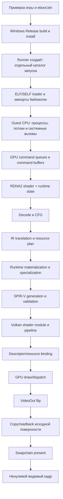

# Ghost of Yōtei в KytyPS5 на Windows: прогресс и план запуска

Checkpoint **2026-10-10 02:27 UTC** (independent bindings regression proved):

- Original5178 / sourcef8b8e2f8 / EXE9b191 run
  `_Build/runs/game-20261010-010007-independent-inline-samplers-native`
  naturally exits321 at01:36:13.035UTC after1270 complete pipelines. Timeout
  and both memory guards=false, minimum available RAM17.67GiB. PS07b3 passes
  tracking but Cartesian candidate duplication exceeds the dense image limit.
  No visually confirmed menu or game entry; no issue108 publication.
- Working fix preserves independent image and sampler slots, separate key
  mappings and class-aware sampled pairs, without multiplying image views or
  raising quotas. Native three-image-budget RED014057 -> GREEN015807;
  resource suite020913 PASS2/2; six unchanged numeric GPUAV cases022433 PASS,
  full T#/wave32/wave64/full backing. Registered neighbors021106 PASS5/5 and
  shared/ordinary image GPUAV022037 PASS. Artifact roots are `_Build/checks/`.
- Next: commit this verified shared fix separately, build native Windows,
  preserve installed EXE and warmed cache, then retry original eboot with
  bounded3600s/32GiB process cap/8GiB Windows reserve/240s close grace.
  Manual independent depth compare and nested image tables remain unsupported;
  other-game runtime coverage, menu and gameplay remain pending.

Checkpoint **2026-10-10 00:46 UTC** (fifth deadline exit; workload-duration adjustment):

- Samef8b8e2f8 / EXE9b191 / original5178 run001242 ends exit0 at
 00:42:50.729UTC,938 pipelines, timedOut=true, memoryGuard=false,
  systemMemoryGuard=false, closeRequested=true/no forced cleanup. Windows
  available RAM minimum18.16GiB. Game28288/tools93739 ended. No menu/post.
- Driver cache payload1101179817/file1101180002 bytes saved unchanged at exit.
  No new semantic fatal, PS07b3 independent-source frontier still pending.
- Repeated1800s runs make cache progress but stop before the real frontier.
  Measured fc6 variants take~128s each; fresh54904/1158 variants also dominate
  creation. Next launcher lifetime3600s, still explicitly bounded, with the
  same32GiB process ceiling/8GiB Windows reserve/240s close grace. This adjusts
  a real-workload supervisor duration, not GPU TDR or a regression-test timeout.
  Source/EXE/resource limits remain unchanged; no emulator fix claimed here.

Checkpoint **2026-10-10 00:09 UTC** (capacity-guard retry ends safely at deadline):

- Sourcef8b8e2f8 / EXE9b191 / original5178 run233618 ends exit0 at
 00:07:25.245UTC,927 complete pipelines, timedOut=true, memoryGuard=false,
  systemMemoryGuard=false, closeRequested=true/no forced cleanup. Game9616
  and tools38250 ended; native slot idle. System available RAM minimum18.09GiB
  with process cap32GiB/system floor8GiB. No production resource limits changed.
- Driver cache payload1086698267/file1086698452 bytes saved unchanged at exit.
  Large54904/da4ff variants still consume the bounded run. No new semantic fatal;
  original PS07b3 independent-source frontier, menu and entry remain pending.
- Next: same-source bounded warm retry; preserve all prior artifacts/caches.
  Continuing cache preparation is not a successful game or cross-game result.

Checkpoint **2026-10-09 23:36 UTC** (third guard exit; capacity-based launcher budget):

- Same sourcef8b8e2f8 / EXE9b191 / original5178 run231847 ends exit0 at
 23:32:42.335UTC,919 pipelines, memoryGuard=true28GiB, timedOut=false,
  closeRequested=true. Game42528 and tools91922 ended; no new semantic fatal.
  Driver cache payload1072063393 bytes/file1072063578 saved. Old PS07b3 pending.
- Live host check after closure:63.93GiB physical/38.93GiB available. Earlier
  process sample showed substantial shared working-set pages. This does not
  establish absence of a leak. No production memory/resource quota was changed.
- ACTIVE fourth same-source retry
  `_Build/runs/game-20261009-233618-independent-inline-samplers-native`,
  PID9616/tools38250. Launcher process ceiling32GiB (about half physical RAM),
  plus new explicit system-free-memory floor8GiB sampled every5s. The runner
  records systemMemoryGuard/minimumObservedAvailableMemoryGiB at completion.
  This is a measured launcher configuration, not a claimed emulator fix.
  Timeout1800s/close grace240s/Performance1280x720 remain unchanged. Source
  inputs fixed; no simultaneous native build/GPU test. Menu/entry/post pending.

Checkpoint **2026-10-09 23:18 UTC** (second retry safely ends at deadline; further warm retry next):

- Sourcef8b8e2f8 / EXE9b191 / original5178 run224616 ends exit0 at
 23:17:17.997UTC,915 complete pipelines, timedOut=true, memoryGuard=false,
  closeRequested=true, no forced cleanup. Game44780 and tools48134 ended.
  Visible loading arc only (`window-warm-progress.png`); no menu/entry/post.
- Five CSfc6f8c56eb7e168f variants1053..1057 create in135880/128713/127649/
 127897/129067ms, consuming about11 minutes of this bounded run. Last driver
  cache payload1069048073 bytes, file1069048258 bytes, saved unchanged at exit.
  New semantic PS07b3 frontier remains pending. No unsupported errors suppressed.
- Next: unchanged source/EXE/1800s/28GiB/240s grace warm retry with this cache;
  do not increase guards or interpret deadline exit0 as successful startup.

Checkpoint **2026-10-09 23:05 UTC** (warm same-source retry has visible loading UI):

- ACTIVE original5178 / sourcef8b8e2f8 / EXE9b191 second run
  `_Build/runs/game-20261009-224616-independent-inline-samplers-native`,
  PID44780, tools exec48134, unchanged1800s/28GiB/240s grace/Performance1280x720.
  Passed first run's794-pipeline memory-guard point; at23:04:57872 pipelines,
  24.77GiB working set. No new semantic fatal. Source inputs remain fixed.
- Owned foreground capture `window-warm-progress.png` visually shows the white
  loading arc on black. This proves pixels/loading UI only, not menu or entry.
  No issue108 publication. Original PS07b3 independent-source frontier still pending.
- Read-only memory sample22:52:19:64GiB host,22.55GiB available; process
  PrivateBytes12.88GB/WorkingSet25.19GB/WorkingSetPrivate2.90GB;
  GPU dedicated9.30GB/shared0.70GB. No guard or emulator limit was increased.

Checkpoint **2026-10-09 22:45 UTC** (new native run ends at memory guard; warm retry next):

- Source `f8b8e2f8` / installed9b191 / original5178 run222335 ends exit0 at
 22:44:13.764UTC,794 complete pipelines, timedOut=false, memoryGuard=true,
  closeRequested=true. This is bounded supervisor shutdown at28GiB, not a
  successful game exit. Native slot is now idle; exec session20142 finished.
- Last snapshots `window-early.png`, `window-progress.png`, `window-778.png`
  are black. No menu/entry or issue108 milestone. Old PS07b3 independent-source
  frontier has not been retried yet. No new semantic fatal was captured.
- Driver cache1037290978 bytes saved. Prior1015211758-byte cache and f268
  EXE preserved. New modules compiled more slowly despite loading the previous
  cache; causal split between ConditionRef and planning-root changes is unproved.
  Next: same source/EXE and unchanged1800s/28GiB limits with the newly warmed
  cache before changing production or relaxing any guard.

Checkpoint **2026-10-09 22:24 UTC** (new native original-game retry active):

- Separate local commits `c01d2892` (ConditionRef) and
  `f8b8e2f893a8169d3dbba6cee679a4fa36cdac7b` (independent direct sources).
  Native emulator build221946 PASS; installed SHA-256
  `9b19143c512a0f05e2e8044f159e04215a5628be92ae3adebed522e87694b9cd`.
  Previous f268 EXE and complete1015211758-byte driver cache preserved in
  `_Build/analysis/independent-inline-samplers-20261010/runtime-20261009T222211Z-62d01351/`.
- ACTIVE original eboot5178 run
  `_Build/runs/game-20261009-222335-independent-inline-samplers-native`,
  PID46160, bounded1800s/28GiB/240s close grace, normal async Performance,
 1280x720, timing only. Foreground controlled runner exec session20142;
  the older detached-background attempt created no game/run evidence and
  is not a runtime result. Source inputs fixed; no native build/GPU test.
- Early owned-window `window-early.png` is black despite shown-frame counters.
  No new visible-menu/game-entry proof. Observe full outcome and old PS07b3
  frontier before another production edit. WSL remains stopped. No push/post.

Checkpoint **2026-10-09 22:19 UTC** (native independent sources proved; emulator build/retry next):

- Native Windows only; WSL remains stopped. Branch `yotei-windows-bringup`,
  local `c01d2892` fixes split-wave64 ConditionRef pointer conversion from
  PR1338, independent emitter RED220232 -> GREEN/GPUAV220352. Ordinary
  branch220023 was already passing and is not claimed as RED.
- Working independent inline-image/sampler correction on this commit:
  distinct material roots and GPU keys, bounded mappings/products, complete
  planning-root lifetime. Admission RED214439/shader RED215357, lifetime
  RED215806 -> GREEN215856; numeric GPUAV215909, full wave32/64 + whole backing
  220509, full eight-word images221416 PASS. Registered GPU neighbors220925
  PASS5/5, final resource tracking/admission221612 PASS2/2, shared/ordinary
  sampler images221724 PASS. Proof artifacts are under `_Build/checks/`.
- Direct compact/full images supported. Nested image tables with independent
  samplers remain explicitly unsupported, with a negative CPU regression;
  valid OOB table[0] requires a separate oracle. Quotas/ownership/unavailable
  memory checks retained. Only Yotei is available in `G:\games\Kyty`; other-game
  runtime compatibility is not established.
- PR inventory and targeted review refreshed in
  `_Build/analysis/pr-review-20261010/` and `docs/open-pr-usefulness-review.md`.
  SharpEmu926 pinned head unchanged;1057 runtime samplers are an additional
  reference. No broad branch port, push or issue108 publication.
- Installed EXE still `f2683c3d99e97cffab8d536ebbbb5abd4d0c485d533f02bc6f5d8003d4b857b9`
  / compiledbc4; original eboot5178 unchanged. Last actual runtime is still
  warmrun200619 fatal at independent inline image/sampler PS07b3 PC6d0.
  New emulator build/install/original retry, menu and game entry are pending.

Checkpoint **2026-10-09 20:34 UTC** (warm original retry reaches independent image/sampler frontier; Windows handoff):

- Tested compiledbc4b4d4d / installedEXEf2683c3d99e97cffab8d536ebbbb5abd4d0c485d533f02bc6f5d8003d4b857b9,
  original5178 run200619 naturally exits32120:28:24UTC,1237 complete pipelines,
  no deadline/memoryguard. Game47764 and supervisor31612 ended; native slot idle.
- Both prioraf9eX/9d4cXYZ resource/pipeline frontiers pass. New fatal pixel
  PS07b3d5ecac4aad8a PC6d0: inline image and sampler require same material buffer
  and selector. Required independent synthetic RED recorded in test debt. No
  fabricated sampler/correlation or limit change. No menu/game entry evidence.
- [Pinned SharpEmu926 audit](sharpemu-pr926-usefulness-review.md) records runtime
  descriptor/image waterfall and storage-only draw candidates plus existing
  DCC/range/cache overlap. No new production port from PR926 at this checkpoint.
- User requests stop at this checkpoint and transfer context AND this Codex
  session to native Windows. Save dedicated shared handoff and one session
  transcript; preserve other sessions/auth/live databases. Resume in
  G:\repos\KytyPS5, same UUID/model, no second model turn from WSL. Issue108
  remains unpublished: no authorized visual menu/entry milestone.


Checkpoint **2026-10-09 20:22 UTC** (current files committed; SharpEmu review and warm original retry):

- Checkpoint bc4b4d4d commits all eight previously dirty source/docs files per
  explicit user instruction. Native build200525 PASS; installedEXEf2683c3d99e97cffab8d536ebbbb5abd4d0c485d533f02bc6f5d8003d4b857b9.
  PriorEXEa2b/cache preserved; original eboot5178 untouched. No push/issue post.
- ACTIVE `_Build/runs/game-20261009-200619-sharpemu-review-warm-native`, game
  PID47764/native supervisor31612, normalasync Performance1280x720/timingonly
 1800s/28GiB/240s closegrace. Source frozen; no simultaneous native tests/builds.
  At20:17:57UTC897 complete pipelines. Read final streams/ownedwindow for outcome.
- [SharpEmu926 audit](sharpemu-pr926-usefulness-review.md), pinned848fceef,
 369files/404commits. Candidate storage-only draws: preserve vertex/pixel writes
  without framebuffer, strict stale-PS behavior and real shader ownership;
  independent RED still required. DCC/range/cache paths partly overlap existing
  Kyty support; no blind369-file transfer. Menu/entry pending.


Checkpoint **2026-10-09 18:40 UTC** (both formatted frontiers compile; clean exit after interruption):

- Native7afac3cd / installed EXEa2b62ef9 / original eboot5178 run181524 ended
  exit0 at18:37:03UTC, timedOut=false/memoryGuard=false,1178 completed pipelines.
  Last previously fatal CS9d4c341d4e05f879 now passes resource planning/SPIR-V
  and actual pipeline1340 creation (165446ms); prioraf9e also passes. The user
  interrupted the chat around this stage; closure cause is not established,
  so exit0 does not establish successful startup. Cache1012582765B saved.
- Last owned-window1824 capture shows loading arc only. No final menu/entry
  evidence. PID36648 ended; no active native game/build/test found. Next: warm
  original retry after preserving current files, and inspect SharpEmu PR926
  for additional shared mechanisms. User explicitly authorizes committing all
  current files and continuing bring-up; no push/merge authorization.


Checkpoint **2026-10-09 18:15 UTC** (wide formatted core installed; original retry active):

- Core `7afac3cd0a7d3cd80035efae70eb4f3be9f5a581` extends formatted GPU-selected
  reads to XY/XYZ/XYZW with common transferred-component bounds. Resource
  RED174837 -> GREEN175338; compute RED175209 -> CPU175420; six width/wave
  numeric/backing/fault GPUAV175543 PASS. Final registered GPUAV180052 PASS10/10
  includes unchanged X numeric oracle. Complete resource tracking/admissions
 181300 PASS3/3 after correcting old GPU-fallback/typed metadata expectations;
  host snapshot/table guards explicitly checked. Other-game/full-wave proof absent.
- Native emulator181435 PASS; installed SHAa2b62ef9fa273ddb903541b72c7b894f1f866ffaeb143766dc100ed1b9c1866c.
  PreviousEXE142a and full driver cache backed up in
  `_Build/analysis/anyps5-continuation-20261009T134838Z/`.
- ACTIVE original eboot5178 run
  `_Build/runs/game-20261009-181524-anyps5-formatted-wide-native`, PID36648,
 1800s/28GiB/240s close grace,1280x720 normal async Performance, timing only.
  Source frozen; no native tests/build concurrently. Await real frontier/menu.
  Previous4d5 run passed af9e pipeline then natural321 at9d4c formattedXYZ,
 1172 pipelines; loading arc then black, no menu/entry or issue108 milestone.


Checkpoint **2026-10-09 17:47 UTC** (formatted-X runtime frontier passed; next XYZ gap):

- Core4d5a2376 / native EXE142a67f7, original eboot5178 run172811 ended
  naturally321 at17:45:22UTC,1172 completed pipelines, no deadline/memory guard.
  Prior fatal CSaf9e passed TrackResources, SPIR-V and actual pipeline1319
  (51434ms); subsequent kernels compile. Window1735 loading arc; window1745
  black. No menu/game entry or issue108 milestone. PID9100 ended/streams drained.
- New fatal CS9d4c341d4e05f879 PC704: private registered source confirms
  MUBUFopcode2 BUFFER_LOAD_FORMAT_XYZ IDXEN; runtimeformat unrecorded. Required
  independent wide-formatted regression added to test debt. Resource admission
  native RED174837 confirmed. Next: shared XY/XYZ/XYZW transfer bounds/conversion
  and width/selector/EXEC/null/full-backing GPU proof before another native retry.
- Original game untouched; installed EXE142a, previous8a9407/cache backed up.
  Existing unrelated dirtydiagnostics/docs preserved. No push/issue108 post.


Checkpoint **2026-10-09 17:28 UTC** (formatted-X core installed; original retry active):

- Separate core `4d5a2376b7a99ea3dc065b55d20b47692b2df344`, native emulator
  build172716 PASS; installed SHA142a67f7a8c7f0bc6bdd5491fbcd273a62e9aa2b379c362151c786aff35a2392.
  Previous EXE8a9407 and full1002959326-byte driver cache preserved under
  `_Build/analysis/anyps5-continuation-20261009T134838Z/`.
- ACTIVE bounded original eboot5178 run
  `_Build/runs/game-20261009-172811-anyps5-formatted-x-native`, PID9100,
 1800s/28GiB/240s close grace,1280x720 normal async Performance, timing-only.
  Source frozen, no simultaneous native tests/build. Original game unchanged.
- At17:45UTC the previously fatal CSaf9e060c8c9207ba passes resource planning,
  SPIR-V and actual pipeline creation1319 (51434ms); subsequent kernels compile.
  Owned-window window-1745.png is black after the earlier visible loading arc.
  Menu/entry pending.
- Formatted-X GPUAV17151532/64/fault PASS; registered affected17240710/10,
  admission172520, seven indirect/BDA GPUAV172550 PASS. Await real workload
  outcome. Previous run150855 was loading UI then natural321 at formatted X;
  no menu/game entry or issue108 publication milestone.


Checkpoint **2026-10-09 17:27 UTC** (GPU-selected formatted X proved; native retry pending):

- Previous active run150855 ended naturally321 at15:31:20UTC,1158 pipelines,
  no deadline/memory guard; exact captured blocker is BUFFER_LOAD_FORMAT_X at
  CSaf9e060c8c9207ba PC0x230. Loading arc in window1518 is visible pixels only;
  menu/game entry pending. Installed EXE remains8a9407 / core8c5beaa1.
- New shared formatted-X/BDA support and strict runtime format/selector/type
  faults are locally uncommitted. ResourceRED155757 -> GREEN164341;
  GPU admissionRED163638 -> GPUAV171515 numeric/backing/fault PASS32/64.
  Actual fault parserRED161846 -> GREEN162713; actual hosttrap scoped
  RED170719 -> GREEN171049. Fixture setup failures explicitly excluded.
  Registered neighborGPUAV172407 PASS10/10; admission172520 PASS.
- Next: finish indirect/BDA neighbors, commit completed core separately, native
  build/install with exact hashes/backups, bounded original-game retry. No
  other-game GPU corpus/full-suite/menu proof or issue108 publication.


Checkpoint **2026-10-09 15:23 UTC** (new native core installed; original-game retry active):

- Core `8c5beaa14c3a81103c27b9ca70278286648a50ed` on integer64 transfer6e401f7c;
  native emulator150534 PASS. Installed SHA-256
  `8a9407a8b3348ecfb29e537ca64cb7efa69eded3328b733af5d302e5ecac04c7`
  at15:08:21UTC. OldEXE335/full988710222B cache preserved in
  `_Build/analysis/anyps5-continuation-20261009T134838Z/`.
- ACTIVE PID30308 `_Build/runs/game-20261009-150855-anyps5-reuse-native`,
  original eboot5178/1280x720, normal async Performance/timing-only1800s/28GiB,
  240s close grace. Source inputs frozen; no native build/test concurrently.
  Foreground owned-window capture `window-1518.png` visually shows only the white
  loading arc on black; real visible pixels/loading UI, no menu/game entry proof.
  Earlier `window-progress.png` was black. Focus restored after each capture.
- At15:17:50UTC:827 complete pipelines/987 optimizer calls, max compute creation
  1529ms; baseline600s had570 pipelines/max19995ms. Driver cache is warmer, so
  these are observations, not an isolated causal speedup claim. LastCS060b20af;
  no captured new fatal. Observe final outcome/new blocker before changing code.
  Issue108 remains unpublished: loading arc is not an authorized publication milestone.

Checkpoint **2026-10-09 15:07 UTC** (AnyPS5 integer64 transfer and early stride reuse proved; native build in progress):

- Local core `6e401f7c` completes32 integer64 comparisons (25 additions), and
  `8c5beaa1` adds compiler-proved early rawDWORD stride artifact reuse plus fresh
  renderer stride metadata. Current tests include explicit VOPC/VOP3 wave32/64,
  all predicates/partial+zero EXEC/VCC+SCC guards, pointer identity and real
  renderer numeric/backing checks. Prior dirty timing diagnostics preserved;
  no push or issue108 publication in this session.
- Integer64 nativeRED140128 -> CPU GREEN140748, GPUAV141131 PASS7,
  registered141600 PASS2/2. Stride cache RED142849 -> GREEN143351; actual metadata
  RED143036 -> GREEN144025. Actual renderer145227 GPUAV32/64 PASS, final registered
 145614 PASS4/4; six exact-specialization negatives (byte/typed/atomic/scalar/
  swizzle/ADD_TID) plus zero. AffectedGPUAV145854 PASS5/5; CPU150125 PASS4/4.
  Native emulator build now owns execution slot; source frozen until it completes.
- Latest actual original eboot5178/EXE335/f20 retry134839:600s budget, graceful0
  at13:58:48UTC/no memory guard.570 completed pipelines; cache988710222B saved.
  Optimizer692 calls/sum185876ms vscompute creation sum79667ms (not wall partitions).
  No visual menu/entry proof or issue108 milestone. New fixes not yet retried.
  Installed EXE remains335 at this checkpoint; upcoming build/install will be
  recorded explicitly. Full shader_cfg scalar EXEC baseline remains unresolved.
- AnyPS5 public100% is generated from1166 enum/list matches, not all instructions'
  GPU execution. Generic Kyty MIMG flags cover many distinct AnyPS5 names;
  remaining sync/GDS/RT/ABI paths require their own contracts and proof. Review:
  [AnyPS5 source audit](anyps5-usefulness-review.md). Next: install completed native
  core, bounded longer original workload, measure actual frontier/performance and
  regress any new semantic blocker before expanding support.

Checkpoint **2026-10-09 12:56 UTC** (AnyPS5 scalar transfer proved; bounded original-game smoke complete):

- Core/tests local commit `f20f2bd8e6196f184b2abf4b72e28ea9c481dd6a`; seven
  RDNA2 scalar SOP1 operations adapted from AnyPS5 `d70b89989473` (see
  [source review](anyps5-usefulness-review.md)). Existing renderer diagnostic
  diffs preserved byte-for-byte; no push or issue108 publication.
- Native intended CPU RED124105 -> same GREEN124320. GPUAV124535 PASS7 numeric
  cases (four wave32/wave64 + in-place alias variants, three existing scalar
  neighbors). Final registered CPU/GPUAV CTest124727 PASS2/2 (0.54s/65.27s),
  source/runtime data and guards unchanged. Native emulator125056 PASS;
  installed SHA-256 `335749799ad684bffe587eb7eb1753b8326df50581ddeaa875a2c7a3ff367d4a`.
  Previous EXE87a9 and985153519B driver cache preserved in
  `_Build/analysis/anyps5-study-20261009/`.
- Actual original eboot5178/1280x720, normal async Performance/no new diagnostics:
  `_Build/runs/game-20261009-125238-anyps5-scalar-smoke`.120s deadline,
  close requested/graceful exit0 at12:54:54UTC, no memory guard/forced cleanup;
  driver cache loaded985153519B and checkpointed985689265B. Stderr empty;
  window capture is black (`smoke-window.png` in analysis); PrintWindow capture
  is not swapchain readback. No visible menu, game entry or new pixel milestone.
  Original eboot independently rehashed unchanged after run; no process remains.
- Final remote read-back finds tested coref20f2bd8 already on origin/yotei-windows-bringup;
  this session performed no push (tracking reflog reports update by push; publisher
  was not identified). Review commit remains local; CI not checked. No issue108 post.
- Fresh read-back also closed prior034619 warm retry:3600s/graceful0 at04:46:35UTC,
  cache985153519B; finalCS1215 still112657ms pipeline preparation. Old02:30 ACTIVE
  checkpoint is superseded. New SOP1 support has no measured Yotei boot benefit.
  Current runtime boundary remains before confirmed menu. Next: measured longer
  original workload and independent regression for any next blocker; investigate
  full compiled-artifact disk cache if compiler reload is material, separately
  from expensive driver pipeline creation. Full shader_cfg baseline EXEC debt
  remains unresolved; synthetic checks are not cross-game/runtime proof.

Checkpoint **2026-10-09 02:30 UTC** (runtime stride fix committed; actual retry active):

- Local core `daca7b2315d6e64aa8304b5669a0f9f0733a0018` on fixture repair
  dc3ef360; original dirty diagnostic source/docs preserved. No push. Positive
  non-atomic raw DWORD stride moves to current shader-data metadata; native offsets,
  byte limits, zero-stride/typed/atomic semantics and resource caps preserved.
- Native intended CPU RED012655 -> unchanged GREEN013216; final CPU021239 PASS5/5.
  GPUAV015627 six independent numeric read/store/sentinel cases (8/48, actual64,
  ADD_TID/OOB). Final affected GPUAV021354 PASS6/6: raw stride, compact metadata,
  bounded vertex/pixel, zero-stride and typed stores. Actual renderer021848 PASS2/2
  (full immutable snapshot admission guards and read-only aligned upload).
  Full shader_cfg remains baseline-failing at scalar descriptor EXEC assertion;
  production-only reversal021044 proves unrelated. Do not call full suite green.
- Native emulator022125 PASS; exact-commit incremental022643 PASS. Installed
  SHA-256 `87a9a607f79d232755510530031711f449c6082e08e08e1313ead31738bf5ddc`
  at02:28:02.970Z; old98cd executable preserved in wrapper directory.
- ACTIVE PID33436 same normal async Performance3600s/28GiB/240sclose-grace:
  `_Build/runs/game-20261009-022803-runtime-stride-capture`.
  Wrapper `_Build/analysis/yotei-runtime-stride-20261009-022644-e606bd/run.ps1`
  owns existing480x270 diagnostic4d98 eboot selection and original5178 restoration.
  Source frozen/no native build/test concurrently. Current compilation continues;
  actual first-scene performance/menu/game-entry outcome PENDING. No issue108 post.
- Other SRT mapping-offset variants are genuinely different: read-only diagnostics
  disprove alpha equivalence. Their correction needs separate synthetic proof.
  Next observe original workload after stride fix and record next real blocker.

Checkpoint **2026-10-09 02:14 UTC** (raw DWORD runtime stride proved; neighbors pending):

- Local HEAD8df60ac2 + NEW uncommitted generic raw DWORD stride metadata/test fix
  and preserved original diagnostics. Baseline native CPU012655 intended failure
  "raw ordinary stride changes produced different SPIR-V modules" -> unchanged
  GREEN013216. Final affected native CPU021239 PASS5/5 (module/cache identity,
  checkpoint/reuse, bounded shared access). Runtime stride8/48 emits byte-identical
  SPIR-V while current renderer shader data publishes the real stride. Zero-stride,
  typed/formatted and atomic address paths remain specialized; limits unchanged.
- Native GPUAV015627 PASS6/6: independent full-backing read/store oracle, sentinels,
  stride8/48, actual guestwave64 and ADD_TID/OOB rows. Initial GPU harness build/
  backing-address setup errors were NOT REDs or semantic evidence. Registered
  affected GPUAV021354 currently running; do not build/edit source concurrently.
- Broader CPU020101 found obsolete SMOV fixture using s[48:51] zero-stride/mode0
  descriptor while only s[0:3] had raw-mode defaults. Test now supplies valid
  descriptor12; oracle unchanged. Then020813 full suite hit "scalar descriptor
  planning retained an unrelated native execution mask". Scoped production-only
  reversal021044 reproduced SAME baseline failure; exact saved hashes restored
  before final021239. Full shader_cfg remains NOT GREEN; separate test debt.
- Native game234326 ended3600s deadline, graceful0 at00:43:44.643Z, no forced
  cleanup/memory guard/fatal; compatible846963327B cache saved. Original5178
  restored/rehashed00:43:45.066Z. Earlier oldVS1135/PSc428 passage stays proved.
  First-scene heavy family variants cost116..140s each; lastCS1244. Window2355
  black, previous2319 loading arc; no menu/game entry/issue108 milestone.
- Read-only Linux diagnostics found TRUE SRT mapping index changes (260 vs263);
  constant sets equal does NOT imply equivalent bodies. Canonicalize-IDs32s/module
  did not equalize them; rejected diagnostic, no production canonicalization/reuse.
  Artefacts `_Build/analysis/constant-id-canonicalization-20261009/`.
- Next: finish affected GPU/renderer checks, native build/install and bounded game
  retry with the completed fix; examine remaining mapping-offset performance
  independently. No new commit/push yet; installed EXE98cd still OLD8df source.

Checkpoint **2026-10-08 23:43 UTC** (old vertex blocker passed in game; warm retry active):

- Same local HEAD `8df60ac24f35436bdb1b9fffb0161b7a5eb41990` + preserved dirty
  diagnostics; installed EXE SHA-256
  `98cd3bfa998b0af1b1b00a439126268b1dde2ee9c947df3157236272f536c4ab`.
  No new production edit/build/commit/push. Old VS1135 resource-planning blocker
  PASSED in actual native game:127528SPIR-Vwords, graphicsVS965/PS9647364ms.
  Old PSc428297659words also PASSED graphicsVS937/PS93624ms and PS94120ms.
- `_Build/runs/game-20261008-231226-vertex-resume-capture` reached988 completed
  pipelines/lastCS1134; timed out1800s during first-scene pipeline preparation.
  Requested close succeeded, exit0 at23:42:33.822Z, no forced cleanup/memory guard
  or fatal. Peak observed working set~26.7GB; CSbedb95313a1a6a6c1121 took116920ms.
  One783.7MB checkpoint write took110200ms alongside G: disk queue; subsequent
  final806986099B cache save2541ms completed. Compatible cache retained.
- Window2319 shows white loading arc on black;2314/2324 black. No menu/game entry
  or issue108 milestone. Shown343/frame724 is NOT proof of game-entry progress.
  Original eboot5178 restored and independently rehashed; wrapper resolution-probe
  confirms23:42:34.503Z. Final game shutdown record/streams are complete.
- New native same-source warm retry PID43836, started23:43:26 UTC:
  `_Build/runs/game-20261008-234326-vertex-warm-resume-capture`. Performance,
  normal async,3600s/28GiB and240s close grace. Longer OWNED launcher lifetime
  chosen for measured first-load117s pipelines/110s cache write; no OS/GPU timeout,
  guest/device resource limit or validation policy changed. Wrapper
  `_Build/analysis/yotei-warm-resume-20261008-234125-7cda38/run.ps1` owns temporary
  existing480x270 diagnostic eboot selection/restoration. Source frozen; no native
  build/test concurrently. Monitor final runtime/new blocker; menu/entry pending.

Checkpoint **2026-10-08 23:13 UTC** (resume/recovery; bounded retry active):

- Verified branch `yotei-windows-bringup`, HEAD `8df60ac24f35436bdb1b9fffb0161b7a5eb41990`.
  Existing dirty source diagnostics and documentation preserved; no new source fix,
  native build, commit or push in this resumed session. Installed native executable
  SHA-256 `98cd3bfa998b0af1b1b00a439126268b1dde2ee9c947df3157236272f536c4ab`.
- Previous `game-20261008-113259-vertex-srt-capture` PID51560 is absent. Its
  `run.json` lacks a final outcome; last progress11:47:15 UTC/23.68GB and last
  stdout is CS6cc64dee32dc7094 optimization315230words. No fatal logged, exit
  reason/timeout/memory-guard result UNKNOWN. No `_kyty.txt` or visual readback
  saved. Do not treat this interrupted record as a reproduced semantic defect.
- Old wrapper left diagnostic eboot4d98 active. Verified preserved original5178
  and absence of emulator, atomically restored original with exact hash check;
  preserved diagnostic separately. Evidence:
  `_Build/analysis/yotei-vertex-srt-20261008-113100-b133b7/recovery-20261009.json`.
- Current retry verified actual old vertex1135e3d2715c8ba2 admission/compilation:
  `1971_new_shader_vs_1135e3d2715c8ba2.spv`127528words; graphics VS965/PS964
  created7364ms. Old pixelc428297659words also created VS937/PS93624ms and
  VS937/PS94120ms. This confirms passage of prior resource-planning/binding gates;
  window2319.png shows only a white loading arc on black, no menu/game entry.
- New same-executable native retry PID20400:
  `_Build/runs/game-20261008-231226-vertex-resume-capture`; normal asynchronous
  Performance1800s/28GiB/120sclose-grace. Wrapper
  `_Build/analysis/yotei-resume-20261008-231225-3bb29c/run.ps1` owns temporary
  saved480x270 diagnostic selection and exact original restoration. Source frozen;
  no concurrent native build/test. Final runtime result pending; no menu/game-entry
  proof or issue108 milestone/comment.

Checkpoint **2026-10-08 11:26 UTC** (bounded vertex byte descriptor loop verified; retry next):

- Local HEAD8df60ac2 (test wave64 followup) on corea0e548bc. Existing scalar SRT
  dominance/range/count/coherent-read/budget proof and materialization now admit
  Vertex as well as Compute/Pixel. Renderer admits proved vertex-owned snapshots;
  mesh/unproved stages, DMA writes, cross-stage aliases and pixel/vertex ordered
  write overlaps remain errors. Workgroup-axis proof stays compute-only; raw
  GPU-selected unbounded byte BDA admission unchanged/closed. No title/hash/address
  behavior. Generic CPU byte-loop shares existing pixel fixture/count/zero/DMA tests.
- Independent native CPU RED102631 -> same GREEN103900; separate real renderer
  vertex-snapshot RED103328 before admission change. Final CPU111940 PASS3/3
  including full resource_tracking, vertex/pixel proof, explicit vertex workgroup
  rejection. Earlier full suite111540 found obsolete stage-only negatives; only
  proved VertexStage cases moved to positives, unknown/undef/cyclic/conditional
  provenance and byte/typed restrictions remain tested.
- Final GPUAV vertex numeric105059 eight cases: count0..3 and OOB offset, unsigned
  bytes17/43/199, sum259. Same fixture with actual guestwave64 added112218 PASS;
  no wave32 coercion claimed. Final affected GPUAV111213 PASS5/5 (vertex/pixel,
  metadata, optimization and scalar-selector guards); legacy vertex13-buffer /
  indexed753 fixture111536 GPUAV PASS. Initial GPU fixture CFG/zero-layout/oracle
  setup errors104448/104706/104910 were corrected, not production REDs; PS helper
  intentionally exports fixedZ0.75/W1 while observed X/Y carry the vertex sum.
- Expanded renderer native110209 PASS20 rejected/13 allowed: vertex/pixel own
  snapshots, both directions of cross-stage writer/read owner, ordered flags,
  invalid ranges/counts, DMA/atomic protections.105454 failed guest-memory reserve
  before boundaries, not GREEN; supervisor had committed13.5GiB plus child13.5GiB.
  Harness now defers parent arena until sequential workers exit; guest limits,
  external processes/pagefile and emulator initialization are unchanged.
- Exact captured static-key diagnostic103203 round-trips vertex input and scratch0
  (manifest scratch628885250/metadata_complete=false is untrusted). Root graph
  Phi0/+1*196, source ReadConst slots32..35; post-fix104148 tracking PASS29 bounded
  reads. Diagnostic key/graph code removed before corecommit; no runtime payloads
  fabricated and no GPU execution claimed from this audit.
- Last actual37/EXEd103 run100400 natural321 at10:20:55.4311903 UTC, no guards;
  original5178 restored10:20:55.658Z. PSa3 gate passed4065ms; OLD PSc428 also
  PASSED:297659 optimized words/graphics VS933PS9327383ms and later shaders.
  Latest fatal VS1135e3d2715c8ba2 PC1738 BUFFER_LOAD_UBYTE, raw op8/imm32.
  Window remains loading arc; no menu/game entry or issue108 milestone. New
  native emulator build/install/retry with8df next; sources/tests local/unpushed.
- Original dirty source39/8/37 and temp cache/pipeline40/2/stash/docs preserved.
  Render-target/depth snapshot alias coverage remains explicit separate debt.
  Published last verifiede498/CI37742919546 all3OS not the new local source.


Checkpoint **2026-10-08 10:16 UTC** (actual renderer gate passed; graphics warm-up continues):

- Native37bdd695+preserved diagnostics/EXEd1033654 run100400 ACTIVE PID50792,
  Performance1800s/28GiB+120s close grace, normal asynchronous queue scheduling;
  no concurrent native build/test. Wrapper analysis/yotei-pixel-srt-binding-
 20261008-100200-d23eb8/run.ps1 owns original5178 restoration. Source frozen.
- Actual earlier renderer pixel snapshot gate PASSED: VS470/PS469 with PS
  a3e721ed134f81a5/VSda06be18b19a619f creates graphics pipeline4065ms, followed
  by later graphics work. No stage/dma/alias guard bypass; shared37 fix native
  admission evidence above. Exact old pixelc428 is not present yet; still pending.
- By10:15:38 pipeline IDs645/644 are creating (hundreds of graphics variants);
  shown326/fps0 at current compile sample. Owned-window image
  window-after-pixel-binding.png visually remains loading white arc on black.
  No menu/game entry or GPU readback; no issue108 milestone/comment. Compilation
  progress does not prove gameplay. Cache/world warm-up continues inside limits.
- Native build095957/install exactSHA
  d1033654b336b5050cb0ef09cef51f528ae33a3976bcd5d97189acb77c0ce005.
  Original diagnostics39/8/37/temp40/2/stash/dirty docs preserved. Followups local;
  published last verifiede498/CI37742919546 all3OS separate. No push/main merge/release.


Checkpoint **2026-10-08 10:00 UTC** (renderer pixel snapshot admission; retry next):

- Local HEAD37bdd695. Shared renderer now admits immutable SRT owned by Pixel
  or Compute, retaining vertex-owned rejection/DMA writer and valid range/count
  checks. All active graphics runtimes preflight declared buffer/image writes
  against snapshots BEFORE descriptor preparation; companion stages without
  their own snapshot are allowed. Read-before-own-write exception remains
  compute-only and cannot bypass another stage's snapshot. Pixel ordered alias
  is explicitly rejected until proved. No title/hash/address exception.
- Native intended renderer RED093304 -> same focused GREEN093822. Final exact
  pixel upload footprint probe095104 PASS; complete native admission095251
  PASS16 rejected/10 allowed, including cross VS writer/PS snapshot overlap,
  disjoint and ordered flag. Scalar selector/write neighbors095550 PASS. All are
  renderer admission/binding checks, not rendered game proof. Combined GPUAV
 094201 caught a fixture assertion before RebindBuffers(upload not yet performed);
  moved after upload. GPUAV094519 then failed VMA allocation before expected
  boundaries, NOT GREEN; final native uninstrumented tests passed, no validation
  or resource limit was weakened. Other games unavailable.
- Warm a4/EXEfe0d run090720 naturally EXIT321 at09:28:56.0554181 UTC, no guards,
  original eboot5178 restored09:28:56.2935304. Pixel stage2 immutable snapshot
  renderer gate was latest fatal. Last compiled PSa3e721ed134f81a5 emits100386
  optimized words with VSda06 9335words. Exact old pixelc428 passage is STILL
  UNPROVED (not present in this run log); do not infer it from this earlier gate.
  No visually confirmed menu/game entry or issue108 update.
- Cache reuse measured: four5490 pipelines76/79/83/79ms versus135..146sec cold.
  New real variants still compile134496/141179/142514/89349/142114/139052ms.
  fc6 cold0537/warm0601 equal671595words but12 OpIMul operands differ constants
 8 vs48; these are semantic stride variants, not safe to coerce/reuse. Independent
  runtime-stride/code-reuse regression lead recorded in test debt, no such fix yet.
- Native emulator build/install/current-fix game retry next with Performance,
 1800s/28GiB +120s close grace. Original diagnostics39/8/37 and temp cache/pipeline
 40/2 preserved; only new6-line renderDraw preflight committed. Original stash/
  dirty docs intact. Published last verified e498/CI37742919546 all3OS separate
  from local followups. No push/force/main merge/release/issue publication.


Checkpoint **2026-10-08 09:06 UTC** (Performance cold run completed; warm-cache retry next):

- Same a4fba3c4+diagnostics/EXEfe0d56ef run083514 reached1800s CPU lifetime guard,
  then NORMAL owned close exit0 at09:05:43.9647085 UTC. No memory guard/forced kill.
  Increased bounded120s cleanup grace allowed final25.4s cache save707211641B;
  original eboot5178 restored09:05:44.390Z. No owned emulator remains. Lifetime
  guard exit0 is not a naturally completed game launch or menu/game-entry proof.
- Shown317 by final progress sample; window-heavy-compile.png has2533 nonblack
  pixels/small white upper-right arc resembling a loading indicator. No GPU
  readback, no visually confirmed menu/game entry. Pixelc428 still not reached;
  do not claim bounded pixel-loop fix verified in game yet. No issue108 post.
- Four heavy5490 variants finished145646/139754/135431/138705ms; fc6 compute
  id263129858ms;1158 id26687188ms. Expensive first-use work now saved. Existing
  Performance recipe gave actualordinary module reductions but no dramatic
  improvement to cooperative driver compile. Source/core unchanged since2c;
 36/a4 only reusable GPU optimization tests. Next exact same binary/Performance
  normal async bounded1800s warm-cache retry, unique wrapper and original safeguards.


Checkpoint **2026-10-08 08:54 UTC** (visually nonzero owned window; Performance run active):

- Native tested sourcea4fba3c4 + preserved diagnostics, installed
  SHAfe0d56ef8335359f35b7b2fdfa755eb6a10ee40448387e120cf83913655bf16b.
  Performance normal async run083514 ACTIVE PID4044, bounded1800s/28GiB+120s
  close grace; no concurrent builds/tests. Exact original restore owned by
  analysis/yotei-performance-20261008-083335-c3d155/run.ps1. Source inputs frozen.
- Owned foreground-window image window-heavy-compile.png visually contains a
  small white arc near the upper-right, resembling a loading indicator. This is
  a nonzero WINDOW capture, not GPU readback or a visually confirmed menu/game entry.
  Earlier all-black captures remain distinct. No issue108 milestone/comment.
- Runtime still compiling5490 variants: first id249661722words145646ms;
  second completed and third id251661964words began. Shown288 at08:53:32, CPU
  active/memory~25.7GB, no guard reached. Shader c428 not reached yet. Large module
  remains a cooperative dispatch problem; metadata grouping is a separate fix.
- Performance CPU selection082247/saved cooperative-file0823441.2s
 681618->661988words; native GPUAV0829136 numeric cases PASS, includes actual
  cooperative=1 LDS/multiwave and split=0 wave64/precision MAD/typed byte paths.
  Runtime ordinary pixelcb2 module256914->193245 and csE52 168203->129844 observed;
  these size changes do not prove a driver-speed/game compatibility result.
- Fresh last published PR497 sourcee498 and CI37742919546 all3OS GREEN verified
 08:08. Local2c/36/a4 unpublished in this task; no force/main merge/release. User
  goal remains confirmed entry into game. All tests/pixels/menu/gameplay separate.


Checkpoint **2026-10-08 08:31 UTC** (Performance-mode validation; runtime retry next):

- Local HEADa4fba3c4 (a4fba3c4d300663d7d1c048e1e917a08f3d16fed), with test-only
  followups36dff594/a4 on2c metadata lowering. Existing launcher defaults to
  Performance; direct CLI previously None. Native CPU optimization082247 PASS;
  bounded saved5490 cooperative-file audit0823441.2s/681618->661988words. This
  modest reduction does not establish a driver-speed fix or game progress.
- Existing Performance path numerical GPUAV082431 PASS5 cases; logs show those
  wave64 cases use split lowering(cooperative=0). Expanded unchanged LDS multiwave
  reduction082913 PASS6 cases and proves cooperative=1 recipe as well; precision
  MAD, raw/formatted bytes and full/sparse wave64 count guards retained. No new
  production optimization recipe or timeout policy. Native build/install next.
- Normal2c/EXE4ead run080547 timed out900s at5490 fourth681k permutation, still
  before pixelc428; shown302, owned visual image black. Large860-way switch is
  cooperative PC dispatch (outlined helper calls), NOT buffer metadata. The
  completed compact metadata fix is valid but does not change this specific module.
  Correct prior performance lead accordingly; all speculative equivalences unproved.
- Supervisor finalized08:21:04 without exitCode; restoration safety guard refused
  while process teardown was not yet confirmed. Owned process subsequently absent;
  strict recover-original.ps1 verified no emulator and restored original5178 at
 08:22:47.228Z. No native process remains. Cache675984644B checkpoint finished,
  shutdown reported unchanged. Do not report this probe as native-1 or a clean exit.
- Next Performance normal asynchronous retry bounded1800s/28GiB +120s close grace,
  matching measured repeated CPU compile/cache costs. GPU scheduling and driver
  timeouts unchanged; original resolution backup/hash safeguards retained. No menu,
  game entry, issue108 post/push/merge/release. Published e498 exactCI37742919546
  all3OS remains separate from local source. Diagnostics39/8/37 and temp40/2 intact.


Checkpoint **2026-10-08 08:11 UTC** (compact-metadata native game run active; published state refreshed):

- Local tested source2c746bb0 + preserved39/8/37 and temporary cache/pipeline40/2
  diagnostics. Native emulator080320/install PASS; exact installed SHA256
 4ead288887581c1e4156e77023371c513c15ee5f5d6fa67a7f7f248cbdc732ef.
  Normal bounded900s/28GiB run080547-compact-metadata-capture ACTIVE PID47928;
  source inputs frozen, no concurrent build/test. Wrapper
  analysis/yotei-compact-metadata-20261008-080445-2e79d9/run.ps1 owns restoration.
  Shown273 at08:10:33; owned-window visual capture still black. Pixelc428 not reached
  yet; no verified menu/game entry. Do not infer game progress from counter alone.
- Live PR497 read-back08:08 confirms PUBLISHEDe4985763, mergeable/CLEAN and exact
  CI37742919546 PASS Windows/Linux/macOS. Tracking-ref reflog records external push
  at07:21:17 UTC; this task did not issue that push. Earlier notes using published
  e2/ahead10 were based on an older ref. Current2c746bb0 is one local commit ahead;
  its native proof is separate from CI. No push/merge/release/issue108 post here.
- Current runtime is still processing new6cc compute permutations (~315k words).
  Original cold/warm baseline681k/860-case delay is recorded above; no comparison
  claim until matching runtime metadata reaches the compacted heavy shader.


Checkpoint **2026-10-08 08:03 UTC** (local compact buffer metadata; game retry next):

- Local HEAD2c746bb0, ten ahead of published PR497/e2c3454d. Shared bounded buffer
  metadata retains every valid selector and groups equivalent stride/native-remap/
  zero-OOB/format-compatibility classes. Dynamic offset/byte-limit loads use the
  actual renderer-published ShaderData entry. Singletons retain constant metadata;
  unsupported hosts, typed fallback, bounds and volatile/atomic semantics unchanged.
- Intended native CPU RED074209 labels399/words14865 -> unchanged GREEN074410
  labels99/words11690 (initial focused lowering). Final registered074750 GPUAV
  PASS7/7: CPU budget, raw/formatted numeric, pixel readback/decorations, formatted
  full/sparse wave64 count guard, zero-stride modes, format-store neighboring cases.
  Large515 stride/add-TID/formatted neighbors075850 numeric native GPU PASS3/3,
 133s total, WITHOUT GPUAV. Prior combined GPUAV075438 timed out120s during huge
  instrumentation compile; not GREEN/semantic RED. No driver reset. Other games absent.
- Experimental compact partial4-lane wave64+barrier fixture074931/075139 was
  rejected in existing resource planning before metadata emission; removed from
  this positive suite and recorded as separate unproved root/EXEC debt. Production
  admission was not loosened. Earlier fixture failures073301/073602/073828/074030
  precede valid RED; fixture now uses a bounded vector mask before readfirstlane
  and four64-entry tables within unchanged default512 logical-buffer ceiling.
- Both normal e498/EXE60629 runs065629/warm071239 timed out900s before pixelc428.
  Second ended07:27:57.8280181 UTC/native-1 with owned forcedcleanup; no memory
  guard, original eboot5178 restored. Shown154/visual black. Compute5490 repeated
 681k-word variants take134397/141030/136994ms; cache checkpoint105615ms. This
  is measured compiler/cache delay, not proof that the pending pixel fix failed.
- New emulator build/install/normal bounded retry next. No menu/game entry or
  issue108 publication. Original39/8/37 diagnostics, temporary cache/pipeline40/2,
  dirty docs and original stash preserved; no new push/force/main merge/release.


Checkpoint **2026-10-08 06:55 UTC** (local bounded pixel descriptor loop; native runtime retry next):

- Local HEADe4985763, nine ahead of published e2c3454d. Pixel-stage scalar bounded
  descriptor loops now reuse existing dominance, coherent snapshot and budget proof;
  workgroup selectors stay compute-only, DMA writers and unsafe aliases remain rejected.
  Buffer-format GPU-selected BDA admission remains closed; no title/hash/address branch.
- Intended synthetic native CPU RED030356 -> same GREEN030943. Required readonly
  fragment SSBO decorations separately RED043228/051528 -> GREEN044102/052427;
  final numeric pixel GPUAV060544 passes counts0/1/2/3 with sums0/1/3/6, no VUIDs.
  Final registered CPU resource_tracking+pixel065412 PASS2/2; pixel decorations/readback,
  compute formatted EXEC guard/bounded zero-stride/format stores065335 GPUAV PASS5/5.
  Full suite's obsolete raw DWORD rejection aligned with independently proven72be
  admission; control-dependent formatted phi rejection remains tested. New zero-trip
  and DMA-writer tests prove empty reads and transactional snapshot preservation.
- Last normal72be/EXE7af247b1 game015949 passed PC3280 then naturally exited321
  at02:10:19.5454098 UTC at pixelc428 PC37f0 BUFFER_LOAD_FORMAT_X. Original eboot5178
  restored, no guards. CPU exact captured static-key probe023420 reproduces cause,
  post-fix033203 translates the capture; this is source audit, not game execution.
  Temporary key/operand diagnostics removed before commit; preserved39/8/37 source
  diagnostics and temporary cache/pipeline40/2 logger untouched. Emulator build/install
  and actual retry with this new fix are next. No pixels/menu/game-entry claim or issue108 post.
- Native emulator065546/install PASS, EXE60629e603b4a8d3b07bf92f8c2b6c372ebbad04fbc1d9e3cca9956e6a6965cb9.
  Normal900s run065629 reached shown154 (visual window still black) and compute5490
  id249681342words/860-way switch, then id250681618words; timeout guard/owned forced
  cleanup at07:11:47.8667743 UTC/native-1. No memory guard, original eboot5178 restored.
  Pixelc428 not reached; this does not verify the new fix in game. Saved cache progress
  retained; exact same binary warm-cache bounded retry next, no concurrent build/test.

- Candidate fixture diagnosis included explicit OFFEN=false and stride4/records1;
  earlier fixture/API/build errors are not production REDs. Other games unavailable.
  Published PR497 exact e2 CI37704056031 all3OS previously verified GREEN; new fix is local.


Checkpoint **2026-10-08 01:58 UTC** (packedCB passed in normal game; next descriptor fix validated):

- Local HEAD72be9e34, eight ahead of published e2c3454d. Shared raw single-DWORD
  GPU-selected descriptor admission now uses the already-tested one-component
  BDA emitter; no backend rewrite or title/hash/address exception. Native same
  numerical GPUAV RED014248 -> GREEN014532;19 rows cover four OOB modes/stride/
  offsets/soffset/unaligned crossings/complete last payload/invalid/inactive/
  swizzle/sentinels. DWORD+ushort+typed/formatted/signed16/write/atomic guards
 014931 PASS2/2, wide vectors/address/snapshot/stride/format015237 PASS.
  Native emulator015646 PASS; install and next bounded game retry pending.
- Normal ec26997d+preserved+temporary diagnostics/EXEa0b99068 run012532 naturally
  ended01:36:39.530581 UTC/native321, no900s/memory guard/forcedcleanup. Original
  eboot5178 restored and wrapper finalized; no owned native process remains.
- **Old packedCB blocker passed** on480x270 profile: PSe82bdf234f518f8c emits39346
  words; VS918/PS917 graphics pipeline completes1510ms and later work follows.
  No normalized-to-float substitution. Native numerical+real backing proof in
  earlier checkpoint; original-resolution validation remains pending.
- Prior CS8457 id294/220047words driver creation took367727ms, then continued.
  Different resource permutations still create huge1111/1377-way switches; retain
  grouped metadata lowering as independent performance debt, not a title shortcut.
- New actual fatal: pixelc428451cf6d96d04 PC3280 rejects a GPU-selected rawDWORD
  descriptor. Private words e0302024/80000502 decode BUFFER_LOAD_DWORD, imm36.
  Capture metadata/code37056B under run012532/shaders/dispatched. This supplies
  the general synthetic regression trigger, not production address/hash logic.
- Visually inspected window-loading.png and window-after-cb.png remain black.
  No menu, game entry or gameplay proof; no issue108 publication. Normal queue
  scheduling preserved, no driver reset. Native scalar admission fix is local.
- New wrapper analysis/yotei-indirect-dword-20261008-015647-315216;
  installed hash/run/readback to record after install/retry. Three original source
  deltas39/8/37 and temporary cache/pipeline40/2 preserved; dirty docs/stash intact.
  Published exact e2 CI37704056031 all3OS still verified GREEN, no extra push/merge.

Checkpoint **2026-10-08 01:24 UTC** (local packed UNorm color exports; game retry next):

- Local HEADec26997d, seven ahead of published PR497/e2c3454d. New shared CB
  support preserves actual11/11/10 and10/11/11 UNorm semantics with exact4-byte
  R32_UINT attachment backing and explicit FP32 color-export packing. CB round-
  by-half uses an exact two-U32 significand product, independently of buffer/
  image RNE; no float substitution or title/hash/address special case.
- Final admission RED005850 -> unchanged numerical GPUAV GREEN010603;
  both widths/four orders/zero/max/unequal/half-LSB/clamp/NaN/Inf/mixed floatMRT0+
  packedMRT2, distinct shader key and real shared CB/texture raw backing/guest
  download/adjacent sentinel. Producer and neighbors011934 PASS5/5; expected
  partial-export refusal011250. CPU admission011712 passes after updating old
  CB-closed byte-size expectation to the independently tested4-byte footprint.
  Native emulator012319 PASS; install/normal bounded retry is next.
- Blend, truncation, partial-component exports/write masks, multisample/dual-source
  and non-FP32 source remain explicit unsupported cases. Fully masked targets
  retain no unused conversion. Sampling/atomics/compare/D16 gates unchanged.
  New source/tests are local-only. Three original dirty source diagnostics39/8/37
  preserved; temporary cache/pipeline logger40/2 stays uncommitted.
- Prior cache-budget source6f5c15bf + diagnostics/EXE991acf8a run002103 naturally
  ended00:32:38.533897 UTC/native321, no900s/memory guard or forcedcleanup.
  Its CS8457 id291/220167 words finally completed383090ms; huge switch shapes
 1111/1377 captured for future shared metadata-lowering regression. This was a
  long driver compile, not proof of a GPU hang or DCE defect. Earlier checkpoint
  write32695ms recorded; valuable compiler work was saved (finalcache635455874B).
- That prior run passed storage admission and reached the old packedCB at480x270,
  slot2/mask7f/mode9/unblended/single sample/PSe82. Original eboot5178 restored,
  no owned native process remained. New support's game effect is still unproved.
  Source/runtime audit is not menu, rendered pixels or game entry. No issue108 post.
- Analysis/tests: packed-unorm-cb-20261008-005251-ee05d1,
  yotei-cache-budget-20261008-001938-02bba0,
  new launch wrapper yotei-packed-cb-20261008-012320-01c863. Next run on corrected
  native executable, visually inspect; new failures require independent RED/GREEN.
  Published exact-head CI37704056031 remains verified all3OS GREEN; no new push,
  force push/main merge/release/issue publication inferred.

Checkpoint **2026-10-08 00:20 UTC** (local cache persistence budget; runtime diagnosis continues):

- User requests continued work until confirmed game entry. No current menu/game-entry
  proof and no issue108 update. Published PR497 e2c3454d exact CI37704056031 now
  verified PASS Windows/Linux/macOS; local follow-up remains unpublished.
- Local HEAD6f5c15bf, six commits ahead of origin. New shared host-cache correction
  budgets intermediate checkpoints by measured persistence cost; first/cheap/valuable
  long compilation/deferred progress/no-work/uint64 boundaries covered. Dirty work
  survives save failure; pending count saturates. The original save body and
  unconditional shutdown Save remain unchanged. CPU intended RED001418 -> same
  unchanged GREEN001548; registered cache identity/mode/reuse/checkpoint001730 PASS4/4.
  Native emulator build001939 PASS, install/retry next. No guest behavior was changed.
- Diagnostic555d run235414:360s guard, graceful exit0 at00:00:18, no memory guard;
  shown181 by last sample, black visual capture.175 compute creates total67618ms,
  of which65514ms in CS6cc64dee32dc7094, maxprior_perms19. No pending compute create
  at shutdown; earlier captured6cc also had~296..313k SPIR-V words. This does not
  establish DCE as the cause of the900s delay.
- Sync-only555d run000254 confirms many actual dispatches complete in~100..400us;
  CPU sampler's hottest owned thread is repeatedly in NtFlushBuffersFile and
  NtSetInformationFile. It was gracefully stopped for narrower instrumentation
  at00:06:54, finalized00:07:10/native0; original eboot5178 restored.
- Normal asynchronous1a + temporary timing logger/EXEd8d972d2 run000848 confirms
  actual633936331B cache save26500ms (hash173/write26414/flush26458/rename26500ms),
  with earlier write2046ms and unchanged probes172..183ms.180s guard ended
 00:12:07/native-1 with owned forcedcleanup, no memory guard; shown190/pstg3.
  This is a measured delay contributor, not the complete900s stall explanation.
- Three original source diagnostic deltas39/8/37 preserved. New cache/pipeline
  timing logger is temporary, uncommitted, outside the completed policy change.
  Analysis: yotei-phase-capture-20261007-235409-591ffa,
  yotei-sync-phase-20261008-000243-bb94f1, yotei-cache-io-20261008-000824-127810,
  and yotei-cache-budget-20261008-001938-02bba0. Original game restored after each
  completed probe; no native operation overlaps. Next bounded normal retry with
  exact shader/pipeline/cache phase capture; packedCB remains pending behind it.

Checkpoint **2026-10-07 23:50 UTC** (PR497 mergeable at fresh read-back; newest CI pending; bounded runtime stall):

- Published PR497 head `e2c3454d`: current main `de626649` is an ancestor;
  fresh REST read-back confirms mergeable=true. Main advanced during validation;
  extra merges `7be73338`/`e2c3454d` preserve tested draw contracts while adopting
  new AudioOut2/AMPR and macOS lock changes. Current exact-head CI37704056031
  is still running; do not label this newer head CI-GREEN yet.
  Initial merges `8328681d`/`d585b0c9` resolved55 files/260 chunks while retaining
  branch resource/wave64/F64/image/scratch semantics and compatible upstream
  memory/kernel/archive/window changes. Incompatible upstream shader frontends
  remain deferred; do not claim their implementation was integrated.
- Prior exact-head CI [37696776012](https://github.com/KytyPS5/KytyPS5/actions/runs/37696776012)
  PASS Windows/Linux/macOS; release skipped (draft PR), no main merge or release.
  The first run37689453288 failed old scalar OOB oracle/macOS address deduction.
  `1511939a` repairs tests with known descriptor-OOB zero/no callback and an
  in-bounds unreadable control, plus portable explicit uint64_t addresses.
  `e4c255df` ports main liveness DCE while retaining branch Value/F64 storage.
  Independent dead-Phi/planning RED221644 -> unchanged native GREEN222227;
  external roots/live recurrence/direct Identity edges/second-pass marks covered.
- Local HEAD `1a795a82`, five commits ahead of published PR: `814725ee` captures
  missing compute.needs_lds_barriers; `7730fd11` packs normalized raw32 storage
  writes; `33a115c9` merges CI repairs and subsequent local merges retain the newest published base.
  These extra changes
  are local-only, without CI proof for their exact head. Original three dirty
  source diagnostics and three dirty docs preserved; stash90414133 retained,
  patch/decisions/CI logs under `_Build/analysis/pr497-conflicts-20261007-205349/`.
- Diagnostic rungame212925 identifies compute e519/root24/source31/PC4328 as
  direct IMAGE_STORE, format30, dmask7/raw32, no sampler/atomic/compare/indirect.
  Storage fix reuses PackFormatComponent with exact4-byte R32_UINT backing;
  sample/atomic/compare/D16/CB remain closed. Same GPUAV RED213801 -> unchanged
  GREEN214014; both layouts/swizzles/finite boundaries/clamp/NaN/Inf/oneLSB/sparse
  mask whole-element overwrite/unwritten texels plus real renderer storage
  binding/upload/download and adjacent guest sentinel. RDNA2 ISA8.2.4 specifies
  zero for omitted store components; older prospective preservation debt corrected.
- After DCE integration: native scalar222227, resource tracking222605,
  materialization222626, affected CFG222639 and GPUAV stores/loads/packed-float/
  scaled/selector222726 PASS. Existing full shader_cfg literal-word assertion
  and sampled-depth Dref disassembly expectation222832 remain documented debt;
  do not describe all tests as GREEN. The first merge's CPU-only unmap ownership
  integration independently passed unchanged GPUAV RED211522 -> GREEN211806.
- Storage-only native7730/EXE1f99 retry at480x270 game215021 naturally ended
 21:54:04.114404 UTC/native321 after222.56s, no guards, old packedCB blocker.
  Original-eboot rungame215546 naturally ended22:00:37.080742 UTC/native321 after
 290.00s, same layout6/type0/order0, RefreshShaders slot2/PSe82bdf234f518f8c,
  decoded MRT union7f, actual target3840x2160. This confirms storage admission
  no longer stops that source on the original workload; no menu/game-entry proof.
- Latest33a + preserved diagnostics native build223317/install PASS, exact EXE
  `555d2c0e23891241c9d3f4468ea118084c37b471eff3188a95b8cd793f86509d`.
  Bounded480x270 game223527 hit900s guard, then owned forced cleanup/native-1 at
 22:50:45.647591 UTC; memory guard false, last observed shown190/23GiB, no new
  fatal shader error or packedCB lookup in this run. Exact stalled phase/hash is
  not captured with diagnostics disabled; this is a regressed advancement result
  relative to7730 retries, not proof DCE causes the delay or a speed benchmark.
  SPIR-V/cache/state differ. Cache payload630040201B preserved. Visually inspected
  window-dce-loading.png is black; earlier7730 lowres screenshot has a spinner.
- Original eboot SHA5178 independently restored/checked, exact installed SHA555d
  checked; no owned emulator/harness/Ninja/MSBuild/clang remains. Wrapper/atomic
  restore `_Build/analysis/yotei-dce-integrated-20261007-223318-7e6f48/`; run logs
  `_Build/runs/game-20261007-223527-normal-native-game/`. No issue108 comment:
  neither visually confirmed menu nor confirmed game entry reached.
- Next identify the exact pending pipeline/stall with bounded diagnostic capture,
  then CPU/IR/scheduling regression before any correction. Do not repeat driver
  resets or cold uninstrumented long runs. PackedCB numeric/register/use contract
  remains pending behind the latest stall; no UNorm-to-float coercion or dropped
  reachable attachment. Menu, game entry and gameplay remain explicitly pending.

- Latest base validation: AudioOut2/audio timing/haptics231507/231635/231641 PASS;
  full native local-head build233106 PASS. Kernel-file suite231648 reaches and
  passes the new APR collision/re-resolution cases, then fails at unrelated native
  socket-option expectation; no whole-suite GREEN claim. New native-indirect
  upstream fixture reproduced230803, but the upstream predicate candidate also
  failed230923 under this frontend. Restore old matched renderer/test pair;
  do not publish an unproved offset fix. Its generic fixture patch is retained
  outside tracked source for separate SGPR/fetch-contract diagnosis.
- Installed emulator remains tested33a/EXE555d from the bounded retry. Latest
  build233106 is not installed or game-tested; no active native process remains.


- While final checks ran, main advanced again. Published mergesfd599760/e2c3454d
  resolve the test-selector conflict by retaining SNORM and adding int16 coverage,
  and adopt character-device stat behavior. Native int16 GPUAV233853 PASS;
  /dev/random, urandom, APR and filesystem cases executed before the same unrelated
  Net socket-option assertion234314. Latest published head e2c3454d is mergeable=true
  on fresh REST read-back; CI37704056031 is running. These facts supersede earlier
  current-head statements; prior e4 exact-head CI remains verified all-platformGREEN.
- Local latest-head changes are merged and not newly installed. Installed555d and
  the bounded33a runtime remain the exact current executable/run evidence. Original
  diagnostic source adds remain39/8/37; no unvalidated indirect-offset patch retained.


Checkpoint **2026-10-06 21:26 UTC** (local PR integration verified; earlier packed-image use exposed):

- Local HEAD59c26be4, branch yotei-windows-bringup,14 commits ahead of origin.
  User explicitly authorizes useful PR integration into this branch and conflict
  resolution. No push or upstream mutation. New local commits: d982a98c packed
  UNorm raw32 loads;9b18ea75 unused-image regression;31e54af9 semantic PR1112;
  e7ba687f live image width admission;59c26be4 PR1111 Windows path quoting.
  Existing dirty PM4/render-target diagnostics and large previous docs preserved.
- Packed normalized descriptors previously became null because known-format metadata
  omitted them. Both11/11/10 and10/11/11 now retain exact4-byte integer backing and
  decode normalized FP32 components for raw32 loads. Intended descriptor RED202110,
  scoped metadata-absence RED202738 after aligning guest/native4x4 extents;
  unchanged GPU/GPUAV numerical GREEN, zero/maxima/one-LSB/unequal RGB/default
  alpha/swizzle constants and real renderer upload/download/sentinel. Sampling,
  storage writes, atomics,D16 and CB stay closed pending independent proof.
- PR1112 head9c324c6c / semantic31fb7208: independent native CPU RED204919
  (index>=source_count) -> unchanged GREEN205633. Conflicts in materialization and
  shaderCfgTests resolved keeping our copy/first buffer remap and gather tests.
  Excluded upstream-main merges and format-only f0cb8162. A semantic integration
  test (live raw32 plus removed D16 metadata) RED210004 -> same GREEN210247;
  resource plan retains actual image liveness, while live D16 remains rejected.
  PR1111 head610c839b / semantic0e3dc1be: actual Windows executable-in-space-path
  RED210528 -> unchanged GREEN210924; ordinary save_data_memory210824 PASS.
- Reviewed12 relevant PRs; artifacts _Build/analysis/pr-review-20261006/decisions.json.
  #1119 rejected for zero-filled unreadable resources and removed alias errors;
  #1118 assumes image stores cannot alias descriptor tables and converts high-bit
  U32 selectors to null;#1117 omits ordered-count launch ordering. #1115 is a
  possible storage-conversion lead but opens unproved sampling/width behavior;
  not integrated. Other candidates need their own matching semantic regressions.
  Upstream1111/1112 Windows/Linux CI passed,macOS failed; native proof is Windows.
- Final59c26be4+preserved diagnostics native checks: resource_tracking/admission
  210953 PASS4.57s/.01s; registered unused-image211052 PASS; GPUAV normalized loads,
  packed float roundtrip/scaled filtering211156 PASS1.05s/1.14s/.68s. Native build/
  install211412 PASS, exact installed EXE
  d65295f67b12f0a49280c1c2019a147a00583dfe2cf074231231838be0ff4f27.
- New900s/28GiB bounded480x270 run game-20261006-211642-normal-native-game ended
  naturally21:16:57.504546 UTC/native321 afterabout14.61s, no guards/forced cleanup.
  It fails EARLIER than the previous CB error: compute e519fa9713f7b8e3 rejects
  "packed UNorm image format supports raw image loads only". This is regressed
  runtime advancement exposing a previously-null descriptor use, not improved boot
  or resolved CB behavior. Actual sampled/store/D16/compare cause not distinguished
  yet. No current pixels/menu/game entry proof. Core cache618288620B preserved.
  Original eboot SHA5178 restored automatically and independently checked; no owned
  emulator/build/harness remains. Wrapper/artifacts:
  _Build/analysis/low-resolution-integrated-20261006-211413-728ddb/.
- Next identify exact format/root/use PC and failing capability in this shader;
  independent synthetic RED/GREEN before opening it. Existing dispatched e519
  capture223637 has18352B code but lacks compute.needs_lds_barriers; direct CPU
  audit exited input_error, not emulator RED. Do not silently fabricate metadata,
  revert to fake null descriptors, or infer sampler/store from the aggregate guard.
  Previous CB layout6/type0 remains pending behind the earlier boundary. No push
  or issue108 intermediate publication; playable game entry still pending.

Checkpoint **2026-10-06 20:01 UTC** (bounded 480x270 probe; same packed-target blocker):

- User explicitly authorizes lowering resolution for faster development retries;
  retain original-resolution validation after a completed correction. The older
  blurred output was a 480x270 internal surface enlarged to the desktop, not
  evidence that changing window dimensions changes guest rendering resolution.
- Native diagnostic-only build/install PASS:
  `_Build/checks/20261006-195144-5225911-kyty_emulator/`, installed EXE SHA-256
  `bed81987038151bc43859bc36ea93c8aee832ba74d07beee8a01eca32097b677`.
  HEAD `08dfdade` plus preserved uncommitted diagnostics. Added bounded source
  backing/clean-read observations in indirect context register handling and
  failing surface dimensions/blend state. No format conversion or error bypass.
- Probe `_Build/runs/game-20261006-195253-normal-native-game/run.json` used the
  existing hash-verified diagnostic game SHA `4d98c4cf`, 900s/28GiB bounds,
  redzone/Fifo, Vulkan/shader/GPUAV validation and shader dumps OFF. Source frozen,
  no overlapping build/tests. Owned PID50920 ended naturally at19:56:09.3314436 UTC,
  native exit321 after196.132s, no timeout/memory guard/forced cleanup.
  Wrapper `_Build/analysis/low-resolution-probe-20261006-195227-e351f8/run.ps1`
  atomically preserved the original and restored it after process termination;
  `resolution-probe.json` and independent SHA check confirm original game SHA
  `5178cf80b86e3b6644a3324ebb4f61a3336ee5ccc17d83e84f71bfee86134d86`.
- Same exact blocker: layout6/type0/order0, RefreshShaders slot2, PS e82bdf234f518f8c.
  Failing target is **480x270**, one sample/fragment, blend disabled, clamp enabled,
  bypass disabled. First eight bounded indirect source observations have identical
  CPU, backing and clean-read words `0x8018`; no evidence of stale backing in
  these observations. Do not generalize that sample to every later register write.
  Visually inspected `window-initial.png`: black loading screen with white spinner,
  no menu/game entry/gameplay. Durable core payload618288620B preserved.
- The lower-resolution probe reached the same failure in3m16s, versus9m46s in
  earlier original-resolution run052933. This is useful retry evidence, not an
  isolated speed benchmark: cache warmth, resolution and diagnostics differ.
  Use the smaller diagnostic profile for quick retries of this reproduced blocker;
  closing it still requires the original-resolution workload.
- Native exact PS decoder/CFG audit PASS:
  `_Build/checks/20261006-195721-8277234-shader_cfg_tests/` (971 instructions,
  structured44 blocks). Before structurization all41 blocks reachable from entry.
  Locally inspected end-block39 EXP instructions include MRT2 atPC0x15f8/en0xf,
  alongside MRT0..6. Artifact `packed-target-cfg-evidence.json` in probe folder.
  Static CFG reachability does not prove the runtime branch was taken. Audit
  explicitly skips pixel translation/resource materialization/SPIR-V/GPU execution.
  An initial PowerShell invocation rejected malformed harness arguments before
  running; corrected file-backed invocation produced the recorded PASS.
- Next establish the legal packed-UNorm CB contract, then independent semantic
  RED/GREEN and exact native packed render/export/readback cases. Do not replace
  UNorm with float or discard a reachable attachment. AMD PAL keeps NUMBER_TYPE
  separate; a shader-buffer format implementation is not CB hardware proof.
  No production semantic fix, commit/push or issue108 publication in this step.
  Playable goal remains pending.

Checkpoint **2026-10-06 18:55 UTC** (resume: packed-target evidence and shader inventory):

- Latest normal run `_Build/runs/game-20261006-052933-normal-native-game/run.json`
  finished at 05:39:19.182665 UTC, native exit 321; timeout and memory guard false.
  Exact installed EXE SHA-256 matches that run:
  `3e3513c2b6f9c76056642a6f726d6257f3135306de016a82f0c03901dda40eac`.
  No active emulator, shader harness, Ninja or MSBuild found at resume.
  HEAD remains `08dfdade`; existing dirty diagnostics/docs preserved, no build,
  runtime retry or production behavior change in this checkpoint.
- Raw indirect CB_COLOR2_INFO register is `0x00008018` at offset `0x33a`.
  The failing draw has active PS `e82bdf234f518f8c`, 6400 code bytes, decoded
  nonempty MRT export union `0x7f`, output mode 9 and normal CB mode 1.
  Slot 2 is present in shader code; treating it as absent is not justified.
  Its exact registered manifest/binary already exists in
  `_Build/runs/yotei-integrated-20261005-223637-vertex-access-capture-noval/shaders/registered/ps_e82bdf234f518f8c_556489d9735846dc.json`.
  The export union does not prove execution of every conditional export.
  Layout 6/type 0/order 0 remains the runtime blocker; numeric interpretation
  still needs a primary contract and an independent semantic RED before fixing.
- Counted the larger preserved registration capture: **21884 metadata records,
  21873 distinct XXH3 code-content hashes**: CS 7243, PS 9808, GS 4810,
  HS front 7, HS back 5. The old extracted container has only 825 records,
  606 code files and 602 SHA-256-distinct contents; it is not the game's total.
  Count method is confirmed by `src/libs/agc.cpp` and sample manifests per stage.
  Artifact `_Build/analysis/shader-inventory-20261006-185537-f834b2.json`.
  Registered code does not prove dispatch, GPU compilation or full-game coverage.
- Latest durable driver-cache payload is 617943592 bytes (about 589 MiB).
  Existing batch auditor checks CPU decoding/CFG and supported compute tracking;
  it does not materialize complete runtime resources or precompile native pipelines.
  An offline GPU warmup needs captured resource specialization and graphics state,
  including host-feature compatibility; one source can have several pipelines.
  No new GPU warmup or compilation claim. No push or issue #108 publication.
  Menu/game entry/gameplay remain unverified on the current executable.

Checkpoint **2026-10-06 05:08 UTC** (packed RT actual-export diagnosis; normal retry active):

- DiagnosticC2 rungame044518 naturallyended04:56:03.466UTC/native321; own47384/
  supervisor7640 absent, finalstreams, no guards/forcedcleanup. Contextconfirmed
  callerRefreshShaders, slot2/registeroutputmask0x7f, CBmode1(normal), PSactive1,
  PSaddr0x8000351e00, target_output_mode9. This provesprecompilemapping lookup,
  not thatslot2 is actuallyexported bycode. Existingformat6/type0 rejection kept.
- Current diagnostic-only dirtyrenderDraw delta additionally preparesbounded PS
  code and decodes EXP instructions onunsupportedlookup, printinghash/codebytes/
  unionMRTexportmask. No newtype interpretation/exportmask/formatbehavior fix.
  Nativebuild _Build/checks/20261006-050308-7721471-kyty_emulator/ PASS/install0,
  exactEXEfc534e034e1db5e89b6d95b8f9383fa2939b7fa6c5aa63158f460d6243558cd4,
  source08dfdade+uncommittedcontextdiagnostics inrenderDraw/colorRenderTarget.
- ACTIVE own31108/Windowssupervisor30840 since05:06:01.835UTC:
  _Build/runs/game-20261006-050601-normal-native-game/run.json, live logs.
  OriginalSHA5178/redzone/fullscreen2560x1440/Fifo/silent/dumps+allvalidationOFF,
  same3600s/28GiB bounds/nativelease. Sourcefrozen/no tests/build overlap.
  Initialshown26 only, no menu/gameentry. Cache616761325B payloadpreserved.
- Next establishwhether actualEXPwrites slot2 before choosingformat/planningfix.
  Liveexport contract canexcludeinactive slots, but do notcoerceUNorm->Float or
  dropanydeclaredrequiredoutput. Unknown/unsupporteddecode mustfailconservatively.
  PrimaryPALformat/NUMBER_TYPE code givesno proof ofignoredtype0. No semanticRED
  orfix forpackedformat yet. Plan/debt/previoushandoffs retainallcompletedfixproof.
  No push/issue108 comment; userplayableoutcome stillpending, continue.

Checkpoint **2026-10-06 04:46 UTC** (packed RT context-only normal retry active):

- Nativebuild _Build/checks/20261006-044338-0399914-kyty_emulator/ PASS/install0.
  Source08dfdade plus UNCOMMITTED diagnostic-only renderDraw.cpp/colorRenderTarget.cpp
  delta: before unsupported-format lookup, printcaller/slot/masks/CBmode and PSstate
  or explicit resolve flags. Existing format interpretation/rejection preserved.
  First diagnostic build044151 had a local variable typo, corrected before valid
  build; no RED/format behavior-fix claim. Exact installed/builtEXE
  c2e71acd1c9b50e34ab8e653e10c3754bd9f860076febba52a66658d4ac8455b.
- ACTIVE own47384/Windowssupervisor7640 since04:45:18.551UTC:
  _Build/runs/game-20261006-044518-normal-native-game/run.json, live streamlogs.
  OriginalSHA5178/redzone/fullscreen2560x1440/Fifo/silent/dumps+allvalidationOFF;
  same3600s/28GiB bounds, sharednative lockheld, no tests/build/sourceedit overlap.
  Initialshown62 only; no currentmenu/gameentry. Corecache615354867B preserved.
- AMD primary PAL GFX9/GFX10 ColorTargetView code explicitly populates NUMBER_TYPE
  fromColorSurfNum independently ofFORMAT; this does not prove stale type0 can
  beignored forpackedfloat. Actualcaller/CB operation needed before independent
  semanticRED. RefreshShaders currently looksup exportmapping using registermask
  before translated PSactualMRToutputs, even if PSinactive; inactive/stale state
  is a lead, not proof ofthisfailure. ResolveRenderColorTarget skipszero mask/base
  unless explicitlyignore_target_mask. Format6/type0 stillunsupported asbefore.
- Next capture precisecaller onthisnormalretry, derivecorrect sharedcontract,
  recordrequiredtest thenfix. Currentcode onlydiagnosticdelta, no permission
  gate/push/issue108 comment. Usercontinueuntilplayable remainspending.

Checkpoint **2026-10-06 04:36 UTC** (FMASK stage passed; render-target format blocker):

- Native08dfdade/SHAb361 normal original rungame-20261006-041213-normal-native-game
  ended04:29:10.472UTC/native321, own32080/supervisor40776 absent; streams finalized,
  no timeout/28GiB guard/forcedcleanup. OriginalSHA5178/redzone/fullscreen2560x1440/
  noDebug preserved. Actualspinner04:23:51/shown256, no menu/gameentry in retry.
- Earlier sampler33, image513 and sampledFMASK failures passed. Next actualerror
  unsupported render-target format combination layout6/type0/order0 at
  src/graphics/host_gpu/renderer/image/textureCommon.cpp:142. Here layout6 is guest
  k11_11_10, type0 kUNorm. Resolver returns k11_11_10UNorm, but format/storage/host
  mapping supports k11_11_10UInt and Float only. Do not assume UNorm can be coerced
  to float or disabledattachment skipped; determine actual color-buffer contract
  and caller use first. PM4direct/indirect parsers both read NUMBER_TYPE bits8..10.
- Cache payload loaded613123768B -> checkpointed615354867B, preserved. New selector
  CPU/GPU semantic+alias checks remainPASS. Runtime startup improvement not quantified;
  no sampledFMASK admission/silencing, no driverreset/debugger/profiler/readback.
- New required format regression debt recorded next. Primary AMD CB register docs
  describe packed11/11/10 color layouts as float-only, but ignored numeric-selector
  behavior has not been proved; do not derive it only from game type0. Alternative
  normalized packing/clear-only/disabled use need distinction before semantics fix.
  No source edits for this format blocker yet. Core/tests/CMake08dfdade committed,
  olddirtydocs preserved. No push/issue108 comment, playable goal stillpending.

Checkpoint **2026-10-06 04:14 UTC** (scalar selector fix installed; original normal retry active):

- Source/local08dfdadeaa6b3d90b9e9fda0b93e649d23d8464f installed after nativebuild
  _Build/checks/20261006-041020-3989383-kyty_emulator/ PASS/install0. ExactEXE
  SHA256b3612559ca850b716add6f4e06100b9a75d477bb0937a1e4c336beed29cac152.
  Core/tests/CMake committed; prior dirtydocs preserved, no push.
- ACTIVE own32080/Windows supervisor40776 since04:12:13.823UTC, streaminglogs:
  _Build/runs/game-20261006-041213-normal-native-game/run.json. OriginalgameSHA5178
  unchanged; redzone/fullscreen2560x1440/Fifo/silent/dumps+allvalidationOFF, same
  3600s/28GiB bounds. Sharednative slot held; source inputs frozen/no test/build
  overlap. Initialshown40 only, no currentmenu/gameentry/realFPS claim.
- Previous diagnostic12336/supervisor41476 naturallyexited32103:33:15.107UTC;
  explicitFMASK sampledroot8/pc0648/key113a8 atsamplerbytes, cache613123768B preserved.
  New scalar-domain independent CPURED034102 -> unchangedGREEN035130 and expanded
 035655 PASS; fullresource_tracking0407324.17s. NumericGPUAV035828 PASS; native
  paddedimage/buffer writer guardRED040225 -> GREEN040520. Finalregistered040847
  .50s+1.49sPASS, no timeout/reset. No new sampledFMASK admission or illegalcandidate
  removal: unavailable/oversized proof fallsback, reachablewrappedFMASK stillrejects.
- Current actual inputbuffer extent/coherence/read-only checks and passingFMASK
  stage remain runtimePENDING. If finiteproof works, fewer native variants should
  reduce preparation; no measuredstartup improvement yet. Helpers/status now
  _Build/analysis/scalar-selector-snapshot-20261006/ with B361 hashchecks.
  Continue towardactualQuality and controllablegameplay, no intermediateissue108
  comment (prior visualmenu comment5994262387 remains lastauthorizedmilestone).

Checkpoint **2026-10-06 04:11 UTC** (coherent scalar selector domain fix verified; native retry pending):

- Normal diagnostic032325 source896ca780+detail/EXE4e2890 ended03:33:15.107UTC/
  native321, no timeout/memory guard/forcedcleanup; own12336/supervisor41476 absent.
  Actual FMASK failure: image250/root8/pc0648, sampledtrue/storagefalse/comparefalse,
  format159, firstkey0x113a8. Stride872/offset204 places descriptor atrow81+140,
  within sampler-word bytes. Do not interpret it as missing indirect IMAGE_LOAD.
  CapturedIR has rawU32 scalar index-buffer read at a DWORD-aligned shifted offset.
- Completed local08dfdadeaa6b3d90b9e9fda0b93e649d23d8464f extends shared inline
  resource planning with optional scalar selector source metadata. Compute caller
  opts into coherent DWORD-value snapshots; derive exact wrapped bytekeys from
  the full finite readable word domain, retain zero for incomplete/OOB reads.
  Bulk reads reuse64MiB total work budget; distinct-values/probes remain65536,
  failed/unknown/too-large proof retains old conservativewrapped domain. Shared
  address/size domains are cached per materialization; no whole-device allocation.
- Captured selector byte ranges become immutable; existing buffer and full padded
  image writer admission checks remain mandatory. Other bounded coefficient reads
  preceding writes cannot bypass checks for newly captured selector bytes. No
  sampledFMASK admission, fakezero descriptor, title/hash/address code or skipped
  reachable unsupportedwork. If input really wraps toFMASK it still rejects.
- Independent CPU intendedRED034102 -> unchangedGREEN035130. Expanded035655 PASS:
  reachable ordinary descriptors/mappings, immutableinput ranges, huge U32 wrapping
  tokey32 stillFMASKreject, missingdata/offline/overbudget conservative reject,
  empty/partialword definedzero, disjointwriter allowed/aliasedwriter transactionally
  rejected. Finalresource_tracking040732 PASS4.17s incl existing affected cases.
- NativeGPUAV numerical ordinarysamples with unreachableFMASK/prefixguard035828
  PASS. Independent native renderer admissionRED040225: selector bytes overlap
  writablebuffer/paddedimage despite old coefficient-before-write flag; children
  wronglyreturned0 on unchangedrenderer guard. SameGREEN040520 PASS after guarding
  bypass; legacyordered/disjoint neighbors remainallowed. Final registered CPU/GPU
  selectors040847 PASS .50s +1.49s, no timeouts/reset. Artifacts _Build/checks/.
- Native emulator build inprogress from committed08dfdade, source inputs frozen,
  no gameactive. Install/new originalnormalretry pending; installedgame stillold
  diagnostic4e2890 until install. Actual index-source extent/coherence and passing
  runtimeFMASK stage remain unproved. No other-game corpus/playableclaim/push or
  issue108 comment. Preserve originalSHA5178 and corecache613123768B.

Checkpoint **2026-10-06 03:25 UTC** (FMASK detail-only normal retry active):

- Native build _Build/checks/20261006-032029-0591928-kyty_emulator/ PASS, install0.
  Source896ca780 plus UNCOMMITTED diagnostic-only FMASK error detail; not a behavior
  fix. Exact built/installedEXE SHA2564e28901d2abb920b9e8bbf8821a271920b6fd71752cfaab131bee7cdbc7bf4fa.
  Old FMASK rejection condition preserved. No added admission/zero/selection skip.
- ACTIVE own12336/Windows supervisor41476 since03:23:25.707UTC, normal bounded
  _Build/runs/game-20261006-032325-normal-native-game/run.json. SameoriginalSHA5178,
  redzone/fullscreen2560x1440/Fifo/silent/dumps+allvalidationOFF, 3600s/28GiB bounds.
  Initialshown23 only; no menu/gameplay claim. Cache613123768B retained. Source
  inputs frozen, no concurrent test/build. Build was completed before newlaunch.
- CPU capturedshader audit031443 previously establishes five inline IMAGE_SAMPLE
  roots with raw U32 index from a scalar buffer; does not capture current FMASK
  descriptor or prove selector domain. This retry should identifyactualimage/root,
  operation PC, storage/compare/sampled flags, format and first mappedbytekey.
  No debugger/profiler/graphics dump enabled. Further semantics/testdesign await
  this cause; no indirect-FMASK-load fix guessed from sparseerror.
- Helpers _Build/analysis/indirect-fmask-20261006/ copied with new4E hash checks.
  Previous36488/supervisor35268 already absent after natural321. No push/issue108
  comment; continue toward actual playable outcome.

Checkpoint **2026-10-06 03:21 UTC** (native capacity fixes pass; FMASK provenance diagnosis):

- Installed/tested896ca780/SHAffc81f normal original rungame-025652 ended
 03:06:59.227UTC/native321, own36488/supervisor35268 absent, both streams final,
  no timeout/28GiB guard/forcedcleanup. Old sampler33 and combinedimage513 guards
  passed; next samecompute34be6ffcc212383c: "FMASK requires a direct image load".
  Actualspinner03:00:28/shown233, lastshown252; no menu/gameentry. Corecache loaded
 610628405B and checkpointed613123768B, preserved. OriginalSHA5178/noDebug/redzone.
- New debt recorded before behavior changes. Current sparse FMASK check groups
  storage, compare, indirect and sampled restrictions; do not assume merely an
  indirect-load gap or suppress it. Core behavior is unchanged for this blocker.
- Existing private capture found: _Build/runs/yotei-integrated-20260906-000309-b63f4e/
  shaders/dispatched/compute_34be6ffcc212383c_45e7cc5240e4dbe4.json + siblingbin.
  Current native CPU audit _Build/checks/20261006-031443-4165859-shader_cfg_tests/
  PASS through resource_tracking only, no materialization/GPU/runtime proof;
  exact2976B content hash checked, 453instructions, 14logical images, one sampler,
  five sampled pairs. Roots6..10 allinline IMAGE_SAMPLE_RAW, offsets152/296/204/
 236/220, stride872, selector_limit0. Selector is raw U32 ReadConstBuffer from
  index buffer; no proved bitmask/narrow width in capturedIR. Thus sampled FMASK
  or an over-approximated wrapped key remains possible, not a diagnosed load fix.
- Temporary diagnostic-only error detail added to ResourceMaterialization.cpp:
  original guard retained, reportsimage/root/usePC/storage/compare/root_sampled/
  format/first mappedbyte key. No fake descriptor, new FMASK admission or masks.
  Native emulator build now active via check-native-change; source896ca780 plus
  diagnostic dirty delta, no concurrent game. Next install its exacthash and
  original bounded normal retry to identify realcause before semantic RED/fix.
- AMD primary RDNA2 ISA cached _Build/analysis/rdna2-isa-budget.pdf/.txt, public
  documentation URLs checked (old AMD fetch401; official new document located).
  Preservecaptures/game/caches. No push/issue108 comment; playable goal pending.

Checkpoint **2026-10-06 02:58 UTC** (combined-image fix installed; normal retry active):

- Completed local fix896ca780cefa39ef668f48f6ac35e2dc374e2961, after sampler07bea78d.
  Native build _Build/checks/20261006-025511-5347797-kyty_emulator/ PASS, install0;
  exact built/installed EXE SHA256ffc81fbd87176b825c5f0e22201bb55281b814452a476f16be5712f57b1276c3.
- Image CPU intended RED024406 -> unchanged GREEN024522; final resource_tracking
 0251284.13s and descriptor_budget025255 PASS. Native GPUAV combined514 independent
  numeric/sentinel test0250158.39s, shared inline025326 and FMASK/integer025414 PASS.
  Logical and per-table512 unchanged, host aggregate image ceiling derived from
  real limits, final typed/mip/other descriptor budget retained. No cross-game claim.
- ACTIVE own game36488/supervisor35268 since02:56:52.160UTC:
  _Build/runs/game-20261006-025652-normal-native-game/run.json. Independent background
  caller0; streams live. OriginalgameSHA5178, redzone/fullscreen2560x1440/Fifo,
  diagnostics+dumps+validationOFF, same3600s/28GiB bounds. Shared execution lock held;
  source inputs frozen, no tests/build overlapping. Initial shown16 only, no current
  menu/gameentry proof. Prior07 run passed sampler33 then failed combined image513
  at02:39:29.981/native321; cache610628405B payload preserved.
- Next verify new normalrun passes combinedimage blocker, reach actual Quality
  selection and controllable gameplay; record new semantic regression if another
  blocker occurs. No push/issue108 comment; user asks continue until playable.

Checkpoint **2026-10-06 02:54 UTC** (sampler fix passed original blocker; combined-image fix under validation):

- Normal game022841 native07bea78d/SHA8626 ended02:39:29.981UTC/native321;
  own49428/supervisor51068 absent, streams finalized, no timeout/memory guard or
  forcedcleanup. OriginalSHA5178/redzone/noDebug unchanged. Actual spinner shown255
  at02:32:31, no menu/gameplay in this retry. Pipeline cache loaded609930772B,
  checkpointed610628405B. CPU continued and native GPU status was1%/10488MiB;
  no GPU reset, debugger, profiler or guest/frame readback.
- Earlier sampler33 error passed. Next shared blocker same compute34be6ffcc212383c:
  combined native image513 rejected by compiler512; currenttable123 candidates,
  size71504/stride872/probes8921. Independent debt recorded before production edits.
- Combined-image test minimal native CPU intended RED:
  _Build/checks/20261006-024406-8095823-resource_tracking_tests/ rejects image513
  across two independently bounded256-row tables. Unchanged GREEN024522 PASS,
  preserving all514 original descriptors and per-root key mappings; budgets513,
 512,1,0 fail transactionally. Binding allocation retains all514. The first test
  build024339 had an invalid fixture enum name, corrected before valid RED;
  build failure is excluded from reproduction evidence.
- Working correction derives aggregate native image ceiling from typed sampled/
  storage stage/layout ceilings plus maxPerStageResources, grows ImageRemap for
  actual candidates, preserves logical512 and per-table512/probe work budgets.
  Final layout still validates individual classes, storage mips, other resource
  types and combined graphics stages. No guessed constants or resource bypass.
- Native GPUAV final combined514 numeric/sentinel test025015 PASS8.39s, no timeout.
  Initial GPU fixture024704 rejected at preserved per-table513 candidate limit
  before GPU work because its selector was unbounded. Corrected fixture to use
  the same dominating256 guard as CPU; first/last numeric oracle unchanged,
  out-of-range selector explicitly leaves output and adjacent sentinels. No
  production per-table guard weakened. Actual device aggregate ceiling2097152.
- Final resource_tracking025128 PASS4.13s, descriptor_budget025255 PASS incl typed
  limits, mips, auxiliary descriptors and overflow arithmetic. Shared inline GPU
  neighbor and FMASK neighbor verification in progress. Commit/build/install/new
  normal retry pending. Installed emulator still07bea78d/SHA8626. Other-game GPU
  corpus absent; no playable claim/push/issue108 update.

Checkpoint **2026-10-06 02:29 UTC** (fixed native Release installed; normal game retry active):

- Native emulator source/local commit07bea78df2b125ec52cf143175b605156b5cc37f;
  _Build/checks/20261006-022746-5624816-kyty_emulator/ buildPASS, install0.
  Exact built/installed executable SHA2568626d0f127cbc79da20921c7395ded55676a9129d6b00991ae8a8dd2134e78b4.
- ACTIVE game49428/supervisor51068, started02:28:41.441UTC;
  _Build/runs/game-20261006-022841-normal-native-game/run.json. Independent
  background launcher returned0, stdout/stderr stream live. Original ebootSHA5178
  unchanged; redzone/fullscreen2560x1440/Fifo, alldiagnostics/validation/dumpsOFF.
  3600s/28GiB bounds unchanged, shared native slot held, no concurrent source
  change/build/test. Initial shown8 verified, no current menu/gameplay claim.
- Native sampler fix CPU/GPUAV proof in next checkpoint. Durable cache preserved.
  Runtime crossing old33-sampler failure, Quality selection and actual gameentry
  pending. No push/issue108 comment; continue toward playable user outcome.

Checkpoint **2026-10-06 02:27 UTC** (native sampler capacity fixed; normal retry pending):

- Local completed fix `07bea78df2b125ec52cf143175b605156b5cc37f` separates
  original logical guest sampler limit 32 from expanded native descriptors.
  SrtRuntime receives min(stage sampler limit, layout sampler limit); dynamically
  sized sampler plans preserve descriptor origins, pair mappings, filtering and
  integer borders. Numeric class clones also consume the same budget. Final
  renderer layout still validates combined graphics stages and other resources.
- Independent synthetic native CPU RED: `_Build/checks/20261006-021845-4513498-resource_tracking_tests/`
  rejects the 33rd distinct inline sampler with the intended semantic message.
  Identical GREEN: `.../20261006-021949-5805146-resource_tracking_tests/`.
  Expanded neighbors: `.../20261006-022203-6525207-resource_tracking_tests/` PASS;
  budgets 32, zero and class-clone overflow reject transactionally; six numeric
  class bindings retain point filtering/integer border semantics.
- Final native resource_tracking CTest PASS 4.11s (`.../20261006-022418-5549665-resource_tracking_tests/`);
  descriptor_budget PASS .03s (`.../20261006-022513-5407955-descriptor_budget_tests/`).
  GPUAV exact sampled values for candidate slots crossing 32 plus explicit null
  fallback PASS (`.../20261006-022238-1407526-shader_recompiler_compute_tests/`);
  final isolated CTest PASS .71s (`.../20261006-022548-5675436-shader_recompiler_compute_tests/`).
  Actual RTX 5060 Ti separate sampler ceiling 1048576; vectors grow only for actual
  candidates, never allocate the whole device ceiling. Existing integer/packed/
  float sampling neighbors PASS (`.../20261006-022618-5837901-shader_recompiler_compute_tests/`).
- Tests use reusable synthetic data, no title/hash/address exception, guest cap
  increase or descriptor substitution. Other-game GPU corpus unavailable; no
  cross-game compatibility/runtime proof from these tests. Build/install and
  original normal retry pending; until install exact emulator remains B4/SHA87.
  Preserve original gameSHA5178, core cache, no-debug/redzone/fullscreen quality
  intent. No push or issue comment; playable user goal still pending.

Checkpoint **6 октября 2026 года, 02:05 UTC** (stable background run finalized; sampler-capacity blocker):

- Current installed/tested emulator/source remains b4eae640/SHA87f24c32,
  original gameSHA5178cf80. Generic workflowHEAD4133be94 adds normal independent
  Windows background supervisor and streaminglogs, not another emulatorbuild.
  Own29472/supervisor21808 finalized/absent; no source edits/tests/build overlap.
- Run _Build/runs/game-20261006-011540-normal-native-game/ started01:15:40.260,
  ended01:53:34.472UTC/native321, streams EOF, no timeout/28GiB guard/forcedkill.
  --redzone/fullscreen2560x1440/Fifo/silent/allvalidation+dumpsOFF; no debugger/
  profiler/readback. Actualspinner/shown221-254 captured, then newpipelines before
  explicit failure. No guessedpercent ofpreparedframes, mainmenu/gameentry/FPS
  claim. Stablebackground avoids prior interruptedWSLcommand/logloss; actual
  shellcaller exit0 while supervisor persists, liveUTF8stdout/stderr retained.
- Current blocker compute34be6ffcc212383c pc05e8: inline sampled pair requires
 33 samplers whilecompilerpolicy32; size71504/stride872/probes8921/pairs172.
  Original guard rejects before usable nativepipeline; no fabricatedsampler or
  suppression. BuildSamplerPlan has corresponding fixed32 mapping/binding/usage
  arrays and classclone budget, so single constantincrease is not a fix. Required
  independent host-derived capacity/class/transaction regression added to debt.
- Previous001807 actually accepted Medium->Standard->Quality and survived the
  oldDIVstage with --redzone; Qualityselection00:48:57/shown1018 andconfirmation
 00:50:41/fade00:52:11 remain captured. Later thatrun lostsupervisor/finalization
  (nativeexitUNKNOWN), not labeled guestcrash. The currentnormalretry did not yet
  reach another settingsscreen before newmaterialization failure. PreviousQuality
  choice is proof of UIselection, not savedprofile/mainmenu/playablegame.
- Durable corepayload609930772B (file609930957B) preserved, original/proprietary
  files untouched. ExistingCPUredzoneproof .17s, normal launcherDryRun/busyguard/
  nativebackgroundlaunch/streaming/gracefulclose/noinheritedterminalpipe proof;
  no repeatedfullsuite orGPUreset. Samplerproductionfix remainsPENDING; next
  focusedCPU intendedRED then unchangedGREEN+neighbors/nativeGPU, rebuild/install
  once and originalnormalretry. No blind limits, debugmode orlowresfallback.
- Workflowcommits7eae9dd1/4133be94 localonly; dirtypriorplan/debt preserved. No
  push/merge/issue108 comment. Userplayablegoal NOT achieved; next external
  checkpoint ONLY visuallyconfirmedactualgameentry, prior menumilestone retained.

Checkpoint **6 октября 2026 года, 01:20 UTC** (normal Windows background launcher verified; game retry active):

- Runtime001807 reached/acceptedQuality at00:48:57/00:50:41, then shown1123
  stalled after settings. Lastverified00:57:12: responsive, working28022267904B
  (~26.1GiB, below28GiB). Supervising WSLcommand returned143; both44940 and
  supervisor disappeared before finalizer. run.json initialonly, stdout/stderr
  missing. No matching WindowsError/Hang/WER last30m and no LinuxOOM log;
  nativeexit/reason/actualguard status UNKNOWN. Do not label it another guest
  divide crash orcompletedgame. interruption-observation.json records the limit.
  Durable corecache563762684B payload preserved, no arbitraryguard/cap increase.
- Generic normal tool extended in local `4133be94`: -Background uses hidden native
  Windows shell execution, separating supervisor handles from terminal pipes.
  Both childlogs stream line-by-line/flush while active; existingbounded cleanup
  and sharednative-check lease remain. End-to-end startup verified. First trial
  worker inheritedterminalpipes, detected because caller session stayedopen;
  ownstartupgame18496 gracefullyclosed01:13:27, native0/finished01:14:44 with
  bothstreamsdrained, noguard/forcedkill. Corrected background caller exits0 in
  <1s while its Windows supervisor and game remainlive. No emulatorcore changes.
- ACTIVE native game29472/supervisor21808, since01:15:40UTC:
  _Build/runs/game-20261006-011540-normal-native-game/run.json.
  NormalRelease sameB4/SHA87f24c32/originalgame5178cf80, --redzone/fullscreen
  2560x1440/Fifo/allvalidation+dumpsOFF, no debugger/profiler/readback. Supervisor
  3600s/28GiB unchanged, sharedlockheld; no overlappingtest/build/sourcechanges.
  wrapper _Build/normal-supervisor-20261006-011539-2021a5.ps1 and UTF16logadjacent.
  Live stdout/stderr readable: corecache loaded, newcheckpoint566637138B;
  actualspinner01:18:39/shown221, gameentry/Qualityselection in THISretry pending.
- PriorQualityacceptance screenshot/ui-state preserved under001807. Normal
  keyboard SendInput/focus+owner+hash guards validated acrossallsettings; inputs
  released. No pressedkeys in currentretry. Helpers under
  _Build/analysis/workgroup-capacity-20261006/{capture,cross-foreground,left-foreground}.ps1
  stilluseexactSHA87. Next complete normalUI in stable backgroundrun and prove
  actualgameentry; no firstscene/mainmenu/gameplay/FPS/colorcorrectness claim.
- Oneexisting CPUredzonecheck(.17s) and launcherDryRun/busyguard/realstart/
  gracefulclose/logEOF/diffchecks only, no repeatedfullsuite/emulatorrebuild.
  Sourceemulator remains b4eae640; workflowcommits7eae9dd1/4133be94 do not
  represent a new testedemulator orpublishedPR/CI. Dirtypriorplan/debt preserved.
  No push/merge/newissue108 comment; nextpublicationONLY actualconfirmedgameentry.

Checkpoint **6 октября 2026 года, 00:55 UTC** (original-resolution Quality accepted; normal retry active):

- Native executable unchanged localb4eae640/SHA87f24c32, originalgameSHA5178cf80.
  ACTIVE owned44940/run001807 since00:18:07, --redzone/fullscreen2560x1440/Fifo,
  debugger/profiler/validation/dumps/readback OFF, original3600s/28GiB bounds.
  No builds/core/tests changes during this runtime, no new nativeUIFPS claim.
- Actual foreground SendInput confirmed Medium->Standard, screenshot00:40:30
  shown581; then Standard->GraphicsMode/Performance00:44:59/shown797. Keyboard
  layout04090409, focus/owner/hash guards, each helperfinally releases key andexit0.
  Earlier60s input duringMedium fade had no proven selection, repeated once
  afterprompt. Newnormal keyboard input is verified from visible guest transitions.
- Left750ms00:47:40->00:47:41 selectsQuality: actualwhiteCross/higher-resolution
  target30FPS screen captured00:48:57/shown1018. Cross1000ms00:50:40->00:50:41
  accepted, Quality screen fadesout00:52:11/shown1122. All keys released; next
  scene/gameentry remains pending. Normal screenshot and ui-state/interactions
  manifests under _Build/runs/yotei-20261006-001807-original-resolution-redzone-nodiag/.
- Runtime now exceeds previous17min guestinteger exception and passes that same
  setup stage. No recurrence observed with existing --redzone protection. This
  supports the red-zone lead; no counterfactual gamecrash/crossgameproof claim.
  Existing native CPU protected/unprotected syntheticPASS .17s recorded below.
- Local workflow commit `7eae9dd1`: tools/run-native-game.ps1 andtoolsREADME provide
  a generic Windows normalgame launch. Discovers repo/install paths, hashes exact
  executable/eboot, always enablesWindows stack protection, fullscreen/silent/
  no-debug args, per-child diagnosticenv cleanup, redirects/drains both streams,
  sharednative-check lease/activeprocess guard and boundedownedcleanup. No build/
  test cycle or gamefile patch; limits configurable with same3600s/28GiB defaults.
  DryRun prints exactexpected args/hashes; active44940 conflictcheck deliberately
  rejected without a secondgame/runfolder. DiffcheckPASS; no new artificialtests.
  Workflowcommit does not change installed/source emulatorb4 or prove gameplay.
- Next verify actualscene after Quality, then use ordinary input toward gameentry.
  No push/merge/newissue108 comment; prior menucomment retained, nextauthorized
  external milestone ONLY actualconfirmedgameentry. Fullcolor/audio/FPS unproved.

Checkpoint **6 октября 2026 года, 00:19 UTC** (Windows red-zone protection enabled; normal original-resolution retry active):

- Current native build/source remains localb4eae640, installedSHA87f24c32,
  original gameSHA5178cf80. No core or gamefile changes and no repeated fullsuite.
  Verified no previous game/build/test process alive before next native run.
- Read-only ELF/SELF extraction now identifies the complete faulting leaf function
  and the divisor producer: copy globalDWORD into[rsp-0x74], test the source value
  forzero and branchaway before entering table loop; later external memory accesses
  precede DIV. All live locals extend toRSP-128. This is a concrete Windows/SysV
  red-zone lead, not evidence for an initially empty buckettable. Originalinstruction
  matches OSdump; small private disassembly remains ignored, no guestcode edits.
- Previous normal runner omitted --redzone; config default isfalse. Runtime linker
  then entirely bypasses the existing memory-fault red-zone patcher (prior mapped
  size lacks8MiB trampoline). Microsoftx64 stack contract treats memory belowRSP
  asvolatile; disabled protection cannot preserve SysV leaf locals across Windows
  exceptions. Actual causal overwrite still requires runtime comparison, no masking.
- Existing native synthetic --red-zone-patcher-only PASS00:17:12/EXE11C2D122,
  0.17s: fixture asserts modeled unprotected-corrupt result and protected exact
  sentinel preservation under a bounded Windows memory exception. Artifact
  _Build/checks/20261006-001623-4316002-virtual_memory_allocation_tests/. No new
  production correction/test expectation invented for this workflow setting.
- ACTIVE owned44940 since00:18:07UTC,
  _Build/runs/yotei-20261006-001807-original-resolution-redzone-nodiag/run.json.
  Same originalhash/fullscreen2560x1440/Fifo/silentlogs/validation+dumpsOFF;
  --redzone enables existing platform ABI protection, not diagnostics. Only unchanged
  3600s/28GiB supervisor; no source edits/builds/GPU tests during game. Cache preserved.
  Next verify normal menu, use actual foreground input and selectQuality, then
  confirm gameentry. No success/crashfix/Quality/gameplay/FPS claim yet.
- User reiterates fast precise progress toward playing. Only focused existing
  CPUcheck used; no fullbaseline repeats, driver reset, lowresolution restoration,
  sourceexception/gamepatch or capabilitylimit change. No push/merge/issue108 update.

Checkpoint **6 октября 2026 года, 00:10 UTC** (original-resolution sharp menu confirmed; native guest divide fault):

- Local committed emulator `b4eae640f700bb1dbd25bd1d98605d523c7e8aa2`, exact
  installed/built SHA256 `87f24c328f3f6b81eec47ad9c9f6e8fb7c546ff5344f63d0c137a8022679ef36`.
  Shared workgroup-capacity correction has native CPU RED/unchanged GREEN,
  expanded boundary cases, numerical65537-group GPUAV and nearest coefficient
  neighbor PASS; full resource_tracking PASS3.99s. Source clean committed;
  preexisting dirty launch-plan/test-debt edits preserved, no push/CI claim.
- Finalized `_Build/runs/yotei-20261005-234419-original-resolution-nodiag/`:
 23:44:19.896UTC ->00:01:29.156UTC, native0xC0000094, both streams complete,
  owned44484 absent. No timeout/28GiB guard/forcedcleanup, no validation/debugger/
  dumps/readback/profiler. Original game file SHA5178cf80 restored and retained,
  original4K/dynamic-resolution table, fullscreen2560x1440/Fifo/silentlogs.
  Old diagnostic480x270 copy and original backup preserved outside tracked files.
- Actual sharp Medium menu confirmed23:51:00/shown296,23:52:21/shown298,
 23:58:11/shown308 withwhiteCrosshint. Original-resolution text/tree/fire details
  visibly sharper than previous480x270 run. After ownedPostMessageCross60s,
 23:59:05.813->00:00:05.870/helper0/keyreleased, captured00:00:35/shown313 still
  Medium. No Standard/Quality/actualgameentry/coloraccuracy or playableFPS proof.
  ForegroundSendInput helper subsequently withheld before any input because the
  game already exited. Do not attribute crash to input or newreserve without proof.
- WindowsApplicationError1000/PID44484 at00:01:16.802 reportsc0000094, unknown
  module/address0x90113378e. Existing local WER dump63MB gives samePC/thread36976.
  Read-only offline parsing, no live debugger: main guestmodulebase0x900000000,
  actual instruction unsignedDIV32 at[rsp-0x74], EDX0/EAXffff087d, then remainder
  indexes a pointer table. Exception therefore implies zero divisor; the stack
  DWORD/producer is outside captured memory, so empty-table/red-zone/API/coherence
  cause remains unproved. No gamecode patch, exceptionmask or fabricated zero.
  Ignored evidence `_Build/analysis/workgroup-capacity-20261006/crash-context.json`,
  smallfaultcode binaries/parser; full OS dump stays local, never shared/copied.
- Persistent cache loaded542376395B; final durablecheckpoint547858142B preserved.
  prepared counts recordedflip requests, not remaining/totalshader work. Complete
  shader/pipeline prewarm cannot be derived from rawcode alone; runtime variants,
  metadata and pipeline states are needed. Cached compiler work cannot fix this
  guest integer exception or independently prove fast GPU execution.
- Next identify zero table-size producer and prove the shared guest/API/ABI
  mechanism with a minimal synthetic native regression before any productionfix.
  Read-only scalar-perDWORD coherent-query performance lead added to testdebt;
  GPU drain already512KiB-coalesced, no measured causal/performance claim.
  No further identical game retries before diagnosis; no policy/guard widening.
  Next issue108 publication ONLY confirmedgameentry; prior menucomment retained.

Checkpoint **5 октября 2026 года, 23:45 UTC** (native Release original-resolution replay active):

- Local `b4eae640f700bb1dbd25bd1d98605d523c7e8aa2` workgroup coefficient
  capacity correction built/installed PASS; exact built/installed SHA256
  `87f24c328f3f6b81eec47ad9c9f6e8fb7c546ff5344f63d0c137a8022679ef36`.
  Native checks and independent RED/GREEN are in the checkpoint below; no
  core edits/builds/GPU tests while this original game retry runs.
- ACTIVE owned44484 since23:44:19UTC,
  `_Build/runs/yotei-20261005-234419-original-resolution-nodiag/run.json`,
  original game SHA5178cf80 (hashguard), no diagnostic480x270 alteration.
  Fullscreen2560x1440/Fifo/silentlogs, validation/dumps false and process-only
  diagnostic env removal; no readbacks, profiler, probes or periodic captures.
  Supervisor only3600s/28GiB; no guard widening. Installed helperhashes updated
  in `_Build/analysis/workgroup-capacity-20261006/`; next screenshot/input only
  normal UI confirmation, keys must release before capture.
- Next confirm first original-resolution pixels, chooseQuality in normal guest
  UI, then actual game entry. No Quality/sharpness/gameplay/color correctness
  claim yet. Prior233030 failed original-resolution run is finalized below,
  diagnostic game file retained as separate backup, persistent cache preserved.
  Issue108 next external comment only actual confirmedgameentry; no push/merge.
- One-off DesktopCopy23:46:07 captures an actual white loading spinner at shown222
  after passing the old130560 reserve error. First original-resolution nonzero
  pixel proof is loading-only, no menu/Quality/scene-color/game-entry claim.
- Original-resolution Medium setup menu visually confirmed23:51:00/shown296
  (`window-original-stage-2.png`),23:52:21/shown298 (`window-medium-ready.png`).
  Compared with old231529 capture, glyphs and fire/tree edges are visibly sharper.
  No whiteCross prompt yet, no input sent in this run; Quality still pending.
  Actual frame advance is slow; titlefps60 measures hostwindow loop only.

Checkpoint **5 октября 2026 года, 23:43 UTC** (workgroup snapshot capacity fixed and validated; native build active):

- Local committed emulator source `a025b5a72c70915fdbdf4e624c354f0822809749`;
  native build/install PASS, installed SHA256
  `a1e03dc7b2e0a2a4177cebf8460449116fe6dffeafab3628b27b584079582166`.
  Focused unsigned16 regression proofs remain in the checkpoint below. No new
  core changes, builds or GPU tests during the active game.
- User requests normal maximum picture quality without debugging. The first
  no-debug run231529 still used the old diagnostic game executable: all three
  initial resolutions and dynamic-resolution table reduced eightfold. Prior
  native230937 registration log explicitly reports480x270 guest output, enlarged
  by linear presentation to2560x1440; larger window alone does not restore detail.
  No Quality selection proved in that run. One owned Cross input27:07-27:37,
  key released/helper0; Medium remained in captured view. Run ended on requested
  graceful close23:29:45/native0, streams drained, owned47596 absent, no forced
  cleanup/timeout/memory guard. Driver payload542344503B saved and preserved.
- Original game executable restored23:30:14, verifiedSHA256
  `5178cf80b86e3b6644a3324ebb4f61a3336ee5ccc17d83e84f71bfee86134d86`.
  Original backup retained; diagnostic4d98 copy preserved as
  `eboot.bin.kyty-diagnostic-480x270-20261005T233011Z` outside tracked source.
  Preflight/restoration evidence:
  `_Build/analysis/vertex-gpu-selected-1135-20261006/game-resolution-{preflight,restored}.json`.
- Native original-resolution retry finalized: owned19352, started23:30:30UTC,
  `_Build/runs/yotei-20261005-233030-original-resolution-nodiag/run.json`.
  Fullscreen2560x1440/Fifo, Release, printf/shaderlog Silent, Vulkan/shader/GPUAV
  validation false, graphics dump false, diagnostic env removed process-locally;
  no readback, profiler, WM_NULL probes or periodic diagnostic captures. Supervisor
  only original3600s/28GiB bounds. Original4K/dynamic-resolution game file is
  hash-guarded; actual selected Quality and visible internal resolution remain
  pending normal guest UI. Game entry and accurate colors remain unproved.
- `prepared` increments per recorded flip request in videoOut.cpp, not a total
  shader count or finite startup worklist. Existing persistent driver cache loads
  and checkpoints reached pipelines. Complete offline prewarm needs replayable
  actual pipeline state, variants and metadata; rawshader corpus alone cannot
  supply all future runtime-generated combinations or eliminate execution stalls.
- Original-resolution retry ended23:30:41.706/native321 (no guard/forced kill),
  streams drained and owned19352 absent. Compute5be616 workgroup-axis snapshot
  count130560 exceeds old stable65536 reserve before rendered4K/UI. Persistent
  driver cache loaded successfully, so this is a shared snapshot-capacity blocker.
- Independent native CPU intendedRED23:34:30 (EXE1240BE0E) on public65537-row
  WorkgroupId coefficient fixture; unchangedGREEN23:35:21 (EXEF2650E2F).
  Corrected only dispatch-axis reserves with size tiers within existing64MiB
  storage budget. Kept16-bit selector cap, coherence/write/address guards and
  small-grid layout; no game-specificbranch/globallimitraise. ExpandedCPU PASS
  _Build/checks/20261005-233717-4159482-resource_tracking_tests covers tier
  stability/boundaries, first/last/all exactwords,3axes sharedreads/zero padding,
  missinglastword/transaction, zero grid withUINT_MAX axis and over-budget reject.
  Native numericGPU65537-row test PASS23:40:38/EXEEFE42359: every output and
  immutable input/neighbor sentinel exact, noVUID. First fixture confused unrelated
  ShaderData and dedicatedflattened_srt storage; placement check corrected only,
  numericoracle unchanged. ExistingcooperativeBDA coefficient GPUAVPASS23:41:31;
  complete resource_tracking CPU PASS3.99s/23:41. Source correction committed
  separately as `b4eae640f700bb1dbd25bd1d98605d523c7e8aa2`; native emulator build
  active. Source frozen until build ends, no game/build overlap, no fullsuite claim.
- Next finish GPU/affected validation, commit separately, build/install and retry
  original resolution before Quality normal UI/game entry. No issue108 intermediate comment, push or merge;
  prior menu publication remains, next authorized milestone actual game entry.

Checkpoint **5 октября 2026 года, 23:07 UTC** (unsigned16 GPU-selected buffer load fixed; native build active):

- Local `a025b5a7`: shared unsigned16-bit indirect-buffer read support. Actual
  1135 vertex capture pc1398 is BUFFER_LOAD_USHORT (zero-extension), not DWORDx1.
  Registered capture14272B obtained in bounded223637 diagnostic; native0/close
  at22:39:25, owned40512 absent. Original rawBDA vectors and unsupported classes
  preserved, no title/hash/address exceptions or fabricated resource bindings.
- Native CPU intendedRED22:44:34 (9E22B304) then unchangedGREEN22:47:01 (2F190D0C).
  Focused GPUAV20case numericGREEN23:00:48 (12BE30DF): exactushort data/zeroextend,
  first/last2-byte range, DWORDcrossing, OOBmodes, SOFFSET, swizzle/null/EXEC and
  neighbor sentinels. Fixture's first attempt restored all32 lanes despite one
  guestthread; IR identified a test output race. Restored originalmask1, values
  unchanged; no speculative productionmask fix. Existingindirect7neighborsPASS
  23:03; full resource_tracking CPU suitePASS23:04:52 in3.89s. No fullsuiteGREEN.
- Artifacts _Build/checks/20261005-{224415,224645,230000,230254}*/,
  _Build/logs/indirect-ushort-resource-tracking-final-20261006.log*, actualcapture
  _Build/analysis/vertex-gpu-selected-1135-20261006/ and223637run/shaders/registered.
  New CTest shader_indirect_ushort_load selects the exact isolatedGPU regression.
- Native emulator build active through tools/check-native-change.ps1 / selected
  kyty_emulator target/windows-local.cmd. Core/tests/CMake frozen until it ends.
  Next install/hash and bounded warm original retry with535725251-byte cache
  payload preserved. No concurrentGPU/game. Installedold402ceb50 untilinstall.
- User asks fast and accurate progress toward playing: minimum focusedloop,
  cache reuse, no redundantabsence/fullbaseline cycles. Workflow841 retained;
  old metadata baseline remains debt, no unsupportedcase suppression/limitraise.
  Menu milestone already issue108 comment5994262387; next externalstatus only
  actually confirmedgameentry, no push/merge. Current color/gameentry unproved.

Checkpoint **5 октября 2026 года, 22:26 UTC** (native retry finalized; faster validation workflow committed):

- Local tested emulator source `d2bafa93858529e3119609ac09b82a35a0f754e4`, installed
  SHA `402ceb5026604e81ee0818ed59533c0f4ab077af565da303d7766efc2ea4d996`.
  Retry212706 finalized22:02:34.846UTC, native321 after719 compute completions.
  Both streams drained, emulator51156/supervisor41980 absent; all input helpers
  exited0 and keys released. No original28GiB/480s/3600s guard or forced cleanup.
- Current native build visibly passed Medium→Standard→Performance; settings
  accepted21:49:19.618, actual532-frame screenshot2150 and2154 remains dark fire
  background. Real12ch/48kHz/3072-byte ATRAC9 initialization confirmed again.
  No further rendered game-entry scene/heardPCM/color-accuracy proof. Window
  answered every post-start100ms WM_NULL probe within0–2ms until process exit.
- New shared resource-tracking blocker: vertex `1135e3d2715c8ba2`, pc1398,
  GPU-selected descriptor access rejected because indirect fallback requires raw
  DWORDx2/x3/x4 load. Need inspect actual decoded type/count, then independent
  lightweight CPU resource_tracking RED and bounded numerical GPU GREEN. Added
  exact requirement to test debt; no speculative type widening/zero resources.
- Peak working27150970880B (~25.29GiB), private14628888576B (~13.62GiB). No memory
  guard/AppHang observed this time; cache warmth/layout differences prevent a
  causal claim that GC fixed the old memory/hang problem. Driver payload checkpoint
  grew512077120→535725251B and is preserved. Cold post-settings pipeline timings
  include142.860s/75.207s/109.293s, while smaller cached entries are milliseconds.
- Workflow local commit `841df2c3001dbe481fa13314bdcf8e6f906a0bd1` (installed emulator remains tested d2/402ceb50).
  User now explicitly requests faster tests/builds. Focused cycle: one minimal
  RED, unchanged GREEN plus closest neighbors; broader affected validation once
  at completion, reuse identical baseline evidence. Versioned skill and both
  installed Windows/WSL copies synchronized. No policy weakening or GPU overlap.
- Workflow fix isolates native input fingerprint from docs/workflow notes in
  generate_version.cmake. Native temp-git CMake reproduction: old docs change
  rewrote version header; fixed docs preserve content AND timestamp, while C++
  and test changes still alter identity. Two redundant global dirty scans are
  also removed by reusing the recorded source diff. New tools/check-native-change.ps1 builds
  one target then one explicit mode/CTest regex, bounds workers/cleanup, records
  artifacts, and rejects active game/build/test conflicts. Native focused LRU smoke
  PASS: incremental build1.995s, CTest0.17s; no full suite or game retry for this
  workflow-only change. Shader pipeline cold-compilation remains separate work.
- Menu milestone already published issue108 comment5994262387 withPR497.
  Next external update ONLY actual confirmed game entry; no push/merge/comments.
  Game/saves/caches and preexisting dirty plan/debt edits preserved. Next use the
  short loop for the vertex blocker, then a bounded warm original retry.

Checkpoint **5 октября 2026 года, 21:52 UTC** (current d2 replay accepted all first-launch settings, post-settings compilation active):

- Local source `d2bafa93858529e3119609ac09b82a35a0f754e4` corrects shared texture
  GC candidate selection: safely retained GPU-owned textures no longer hide clean
  reclaimable entries beyond the candidate limit. Only seven core lines, reusable
  synthetic fixture and CTest registration; no title/hash/address exceptions.
- Independent unchanged oracle native clean GPUAV RED `21:15:37` / EXE352AFFEB
  on exact17529 production bytes, intended protected_count9 clean-tail failure;
  unchanged GREEN `21:16:40` / EXEC242D794. Added0/9/10/12 protected-prefix,
  exact pressured GPU readback/guest sentinels, twelve clean-image and six recursive
  depth/stencil-pair budget cases PASS21:19:29/EXE7613A30E. Image views and buffer
  GC neighbors PASS. Both streams/manifest/cleanup retained in
  `_Build/logs/texture-gc-*-clean-gpuav-20261005.log{,.stderr,.run.json}`.
- Broad cache-flow test remains baseline RED at `reused metadata owner retirement`.
  Scoped absence of ONLY owned seven-line core fix repeats identical phase/error
  at21:21:10 / EXEC1BFBD6D. Fixed source bytes restored; no full-suite GREEN or
  other-game compatibility claim. The initial stale Epic implicit-layer manifest
  is excluded with process-only empty VK_IMPLICIT_LAYER_PATH; explicit Khronos
  validation/GPUAV stays enabled. No registry edits or error suppression.
- Finalized previous game133643 at14:21:26/native0xCFFFFFFF: WERAppHangB1 and
  ApplicationHang1002, no original guard/cleanup request recorded. It was creating
  new cooperative54904 variant after661 pipelines, shown507; peak26.33GiB WS.
  Preserved512077120-byte cache, stderr empty, game entry still unproved. Cause
  and initiator of Windows hang termination unknown; not labeled GPU TDR/leak.
- Exact last681588-word module passes native spirv-val. Isolated no-dispatch
  three-create lifecycle PASS:147828ms cold,125/94ms cached,2.996GiB peak WS;
  immediate destruction of pipeline/cache/module/device/instance retains~2.78GiB
  WS in the process. No delayed allocator/lifetime invariant or synthetic leak
  RED. Artifacts `_Build/analysis/post-settings-lifecycle-20261005/`.
- Native committed d2bafa emulator/test builds and installation PASS through
  windows-local.cmd. Scoped native GPUAV CTest3/3 PASS21:25:26UTC (1.83s);
  `_Build/analysis/post-settings-lifecycle-20261005/ctest.*` retains streams,
  bounded manifest and cleanup. Built/installed EXE SHA256
  `402ceb5026604e81ee0818ed59533c0f4ab077af565da303d7766efc2ea4d996` matches.
- ACTIVE `_Build/runs/yotei-integrated-20261005-212706-protected-gc-memory-warm-noval`,
  emulator51156, tool session4018, supervisor log
  `_Build/logs/supervisor-protected-gc-20261005-2127.txt`. Starts21:27:07.036UTC,
  deadline22:27:07UTC, unchanged28GiB/480s/3600s, validationOFF. Preserved cache
  file512077305B (payload512077120B, SHA94280e12521ff660510769a71da9ba1265e6613d
  a98a6193e099194b0f9123be); game/saves untouched. No inputs yet, no other native
  builds/GPU tests. Core/tests/CMake frozen. Ignored replay samples memory and
  sends bounded100ms WM_NULL only to its own verified window every30s.
- Actual first shots2128/2129 show loading; `window-2132-stage.png` shown378
  then visually confirms Change Difficulty / Medium. First bounded Cross30s
  21:33:05.769→21:33:35.881 exits0/key-up; `window-2134-after-medium-cross.png`
  still Medium with now-white Cross hint. Second Cross180s
  21:35:16.651→21:38:16.728 exits0/key-up. `window-2139-after-medium-cross-second.png`
  shown396 and `window-2141-stage.png` shown400 show Medium UI removed, dark fire
  background; next Standard/Graphics/game-entry scene not yet visible. All keys
  released, exact `interactions.json`; do not infer settings completion/game entry.
  Actual `window-2144-stage.png` shown411 confirms delayed Select an Experience /
  Standard. Wait for the white Cross prompt before next bounded confirmation;
  no Standard input sent yet. Graphics Mode and game entry remain unverified.
  Subsequently `window-2145-standard-ready.png` shown440 confirms white Cross;
  Standard Cross30s21:46:47.946→21:47:17.971 exits0/key-up. Actual
  `window-2148-after-standard-cross.png` shown499 confirms Graphics Mode /
  Performance already selected, white Cross. No new arrow input needed.
  Performance Cross5s21:49:14.567→21:49:19.618 exits0/key-up; actual
  `window-2150-after-performance-cross.png` shown532 shows settings removed.
  This run thus passed Medium→Standard→Performance. All keys up; no game entry
  or color-accuracy proof. Older pending statements above describe earlier shots.
- Own window continues responding within0–2ms during compilation after one
  startup timeout. Around21:43 working set~22GiB, private~10GiB, many new small
  variants still complete; compiler/frame counters are diagnostic only. GC's effect
  on the former guard/AppHang remains unproved. Post-settings working set rises
  to~23.6GiB around21:50; next verify real next UI/game entry before any input.
  Frozen core/tests/CMake, no concurrent build/GPU regression.
- Menu milestone remains user-defined first-launch settings, already published
  in issue108 comment5994262387 withPR497. Next external update ONLY confirmed
  game entry. No source push/merge; existing plan/debt edits preserved.

Checkpoint **5 октября 2026 года, 14:04 UTC** (current replay accepted Performance, all inputs released):

- Native source `17529f8241624b2ab79002e384a8b2daeb086702`, installed EXE
  SHA256 `3bc052af7203667ea7e63308d6f22eaa83ffb759880d62ced30f27be9b9f7f2e`
  reverified. Only plan/debt dirty; no core/test/build changes. Prior game and
  isolated probe cleaned up before launch; no other native builds/GPU tests.
- Prior run `130216` visually accepted Medium → Standard → Performance, then
  hit its unchanged 28 GiB working-set guard. Native own-window close succeeded,
  exit 0 at 13:25:34.608; no timeout, forced kill or driver reset. No game entry.
- Last actual `1971_da4ff122` snapshot passes native CPU spirv-val. Existing
  exact-layout native pipeline-only probe also succeeds in 117.716 s, exit 0,
  stderr empty, no timeout or 8 GiB guard. Peak working set 3281620992 B
  (3.06 GiB), private 3448729600 B; late sample falls to 1517056000 B working set.
  This shows a substantial compile peak, not an independently proved leak.
  Artifacts: `_Build/analysis/performance-memory-bound-pipeline-20261005/`.
- New `133643-ds-finite-memory-replay-noval` starts 13:36:43.143 UTC:
  owned emulator 30268 / supervisor 43380 / tool 5414, log
  `supervisor-20261005-133642-e95d89.txt`. Original limits remain 3600 s
  (deadline 14:36:43 UTC), 480 s progress, 28 GiB, validation off. Preserved
  492622718-byte cache includes completed variants; game and saves untouched.
  Ignored launcher adds `memory-samples.jsonl` and bounds diagnostic log draining
  to keep the existing guards responsive. No emulator behavior changes.
- Actual normal guest inputs prove Medium → Standard → Performance on this run.
  Medium Cross180s released13:46:59.110; early post-input Medium still visible,
  then delayed Standard verified in `window-135715-stage.png` shown255.
  Standard Cross180s released14:01:50.014, helper exit0; screenshot
  `window-140200-after-standard-cross.png` shown456 shows Graphics Mode /
  Performance already selected, white Cross hint. No new arrow input needed.
  Performance Cross5s14:02:42.800→14:02:47.835 exits0/key up; settings removed
  in `window-140320-after-performance.png` shown507. All keys released; exact
  sequence in run `interactions.json`. Current colors and game entry unproved.
- Continue this bounded native run toward the next actual UI/game-entry scene.
  Source frozen, no builds/GPU tests or limit increases. Latest memory sampling
  around23–24GiB after settings. Do not infer game entry from shader completion,
  readback counts or removed settings. Existing RT/BVH skip remains a missing
  capability; Performance avoidance/causal color link unproved.
- Menu milestone is first-launch settings per user. Issue #108 comment
  5994262387 already published/read back with PR #497 link; next external status
  ONLY confirmed game entry. No push/merge. Full suite known baseline failures.

Checkpoint **5 октября 2026 года, 13:32 UTC** (settings passed; memory guard ended native run, isolated diagnosis active):

- Native committed source `17529f8241624b2ab79002e384a8b2daeb086702`, installed
  EXE SHA256 `3bc052af7203667ea7e63308d6f22eaa83ffb759880d62ced30f27be9b9f7f2e`.
  Core/tests/CMake frozen; only plan/debt dirty. No build or GPU test alongside game.
- Finalized `130216-ds-finite-replay-warm-noval`, started13:02:16.974 UTC.
  Original28GiB working-set guard triggered after675 pipelines / shown756;
  own WM_CLOSE succeeded, native exit0 at13:25:34.608 UTC. No timeout, forced
  kill or driver reset. Own49948/43120 and native build/tests absent13:26.
  Both streams finalized, stderr empty. Bounds3600s/480s/28GiB unchanged. Preserved483595993-byte cache from prior graceful
  exit0 run120227; game/saves unchanged across launch. Working set24.74GiB at13:16.
- Actual bounded own-window inputs and screenshots prove Medium → Standard →
  Graphics Mode / Quality. Dpad Right 1500ms (13:17:03.753→13:17:05.302) visibly
  selected Performance in `window-131724-after-right.png`; Cross5s released
  13:17:49.690, helper exit0. `window-131810-after-performance-cross.png` shown756
  shows settings removed and dark fire scene. All keys released; exact sequence
  in run `interactions.json`. No subsequent game entry or color accuracy proved.
- Warm replay completed cached post-settings variants in77–86ms. New ordinary
  `1158e78f` variants take77.799/73.175s; new cooperative`fc6f8c56`137.096s.
  Native CPU spirv-val Vulkan1.3 PASS13:23:24 on actual430297-word1158module
  (`_Build/analysis/ds-finite-performance-spirv-validation-20261005/`), structural
  only. Read-only13:20 PCs change inside nvgpucomp64.dll. Latest `da4ff122`
  variant completed117.133s before memory guard. Cache492622718B verified after
  close. Compiler/cache progress is not visible game-entry proof.
- Exact last actual `1971_da4ff122` snapshot passes native CPU spirv-val13:30:22.
  Bound layout verified from SPIR-V: storage buffers0[27],51–54[1], matching
  existing native pipeline-only probe. Diagnostic probe24392/tool58639 started
  with180s/8GiB guards and memory sampling, no dispatch, no source/build change.
  Output `_Build/analysis/performance-memory-bound-pipeline-20261005/`.
  Growth cause unproved; do not raise game guard or call this a synthetic RED.
- Current run too records actual12-channel48kHz/3072-byte ATRAC9 initialization
  and the existing RT/BVH dispatch-skip warning opcodee6. Thus Performance has not
  proved avoidance of BVH at this stage; it is not a color correction.
  Missing BVH capability has a primary-ISA test-debt entry; no BVH core fix/test
  has been implemented. Scene remains dark; heard PCM/gameplay pending.
- User counts first-launch settings as menu milestone. Issue108 comment5994262387
  already published/readback verified with PR497 link. Next external status ONLY
  confirmed game entry; no source push/merge. Full suite knownbaselineRED.

Checkpoint **5 октября 2026 года, 12:32 UTC** (current native DS retry accepted all first-launch settings):

- Source `17529f8241624b2ab79002e384a8b2daeb086702`, native EXE SHA256
  `3bc052af7203667ea7e63308d6f22eaa83ffb759880d62ced30f27be9b9f7f2e`.
  Owned run `120227-ds-finite-warm-noval`, emulator 31280 / supervisor 7648,
  original deadline 13:02:27 UTC, 480s successful-compute/frame and 28 GiB guards.
- Visually confirmed Medium → Standard → Quality on this installed build too.
  Medium second bounded Cross 180s released 12:27:22.688, Standard shown529;
  Standard Cross 5s released 12:28:15.761, Quality shown579;
  Quality Cross 30s released 12:31:02.606, settings gone at shown679.
  Exact interactions and key-up exits0 in run `interactions.json`. All keys up,
  no further input active. Screenshots show actual UI, not counter inference.
- Current actual guest log again confirms `AJM ATRAC9 initialized: 48000 Hz,
  12 ch, frame_samples=256, superframe=3072 bytes/4 frames`. Former audio
  initialization fault has not recurred at this stage. Heard PCM remains unproved.
  New compute `fc6f8c56eb7e168f`, cooperative wave64, is being compiled after
  Quality. Snapshot `window-123116-after-quality-cross.png` shows dark fire scene
  with settings removed; no subsequent title/start screen or game entry proved.
- User counts first-launch settings as menu milestone. Issue #108 comment
  5994262387 already reports it and links PR #497; remote readback verified.
  Next external status ONLY after confirmed game entry. No push/merge.
- DS correctness tests pass; actual scene remains too dark, so no color correction
  claim. Full suite still baseline failures, no other-game GPU corpus. Continue
  current bounded run toward game entry; preserve core/tests/CMake freeze and
  cache/save/game. No concurrent native build/GPU tests or driver reset.

Checkpoint **5 октября 2026 года, 12:26 UTC** (current retry reaches first-launch Medium; bounded input active):

- Native source `17529f82`, installed EXE `3bc052af…`, active run `120227`.
  Actual `window-122033.png` shows Change Difficulty / Medium with the dark scene
  background. Thus first-launch settings render again after the DS correction;
  color accuracy remains unproved. Later main/title screen and game entry pending.
- First bounded own-window Cross 30s ran 12:22:33.885 → 12:23:03.909 UTC, exited
  0 and released the key. `window-122317-after-medium-cross.png` still shows Medium;
  no accepted transition proved. Pipeline compilation allowed only about one new
  displayed frame during that attempt; exact missed-input cause remains unproved.
- Second Cross helper starts 12:24:22.624 UTC for the existing maximum 180s;
  helper session 11901, release expected 12:27:22.624. Do NOT focus/capture while
  held. Own emulator 31280/supervisor 7648; original run deadline 13:02:27 unchanged.
  At 12:25 shown 434 with new frames, but no stage inferred from counters.
  `interactions.json` records attempts. Await key-up, then capture actual stage.
- The user's menu milestone is the first-launch settings. Its earlier verified
  result is posted in issue comment 5994262387 with PR #497 link; remote readback
  verified. Next issue update ONLY after confirmed game entry. No push/merge.
  Preserve source freeze/cache/save/game; no concurrent native build/GPU regression.

Checkpoint **5 октября 2026 года, 12:17 UTC** (user confirms first-launch settings count as menu milestone):

- User clarification: the first-launch settings are the menu milestone. This was
  already visually verified on native source `29d32a5c`: Medium → Standard →
  Quality, with bounded own-window Cross input accepting each stage. Re-viewed
  `104233/window-105650.png` (Select an Experience / Standard) and
  `104233/window-110205.png` (Graphics Mode / Quality) in this turn. The previous
  conservative main/title-menu requirement was an assistant assumption.
- Posted the verified settings-menu milestone with PR #497 link to issue #108:
  https://github.com/KytyPS5/KytyPS5/issues/108#issuecomment-5994262387 . Explicitly
  states local changes are not pushed, scene colors remain too dark, full suite
  has baseline failures, game entry/gameplay unproved. Next external status only
  after confirmed game entry; no source push/merge.
- Current DS-fix retry `120227` / source `17529f82` / EXE `3bc052af…` still active
  with owned emulator 31280 and supervisor 7648; unchanged deadline 13:02:27 UTC.
  Actual `window-user-menu-check-1215.png` shows loading indicator, no settings
  yet; no input sent in this run. Read-only thread sample shows changing NVIDIA
  compiler PCs, and further pipelines complete. Five new large variants took
  about 139–149 seconds each. One actual current 681k-word SPIR-V module passed
  bounded native CPU `spirv-val` at 12:12; this is not GPU/color/menu proof.
- Continue current run and accept first-launch settings as soon as visibly ready;
  then work toward game entry and investigate colors. Keep core/tests/CMake frozen
  and cache/save/game intact. No concurrent build/GPU regression or driver reset.

Checkpoint **5 октября 2026 года, 12:12 UTC** (active native retry after DS fix):

- Committed source `17529f8241624b2ab79002e384a8b2daeb086702`; native Windows build
  and installation passed. Both executable hashes are
  `3bc052af7203667ea7e63308d6f22eaa83ffb759880d62ced30f27be9b9f7f2e`.
  Only documentation is dirty; core, tests and CMake remain frozen during the run.
  Independent DS RED/GREEN, neighboring GPUAV tests and scoped CTest 6/6 passed;
  all 16 corpus outcomes match the pre-fix baseline. Full suite still has baseline
  failures; no other-game GPU corpus is available.
- Active run `_Build/runs/yotei-integrated-20261005-120227-ds-finite-warm-noval`:
  emulator PID 31280, supervisor PID 7648. Started 12:02:27 UTC; original total
  deadline 13:02:27 UTC, frame/successful-compute watchdog 480 seconds, memory cap
  28 GiB, validation off. Preserved game, saves and 451288980-byte warm cache.
  No metadata recorder, native build or GPU regression runs concurrently.
- Actual screenshots `window-120320.png` and `window-121010.png` show a black
  background and loading indicator, NOT a settings screen or main menu. No input
  has been sent. At shown 346 the driver compiles new resource-layout variants of
  compute shader `54904fb419d79e49`; completed variants take about 148–150 seconds.
  Successful pipeline creation advances the existing bounded watchdog and saves
  the cache; a shown-frame counter is not visual progress proof.
- Next: observe the actual settings/menu transition, then use bounded Cross input
  only on a visibly ready screen. Prepared helper has exact executable/hash guards
  and releases the key in `finally`; avoid focus captures while a key is held.
  Dark scene colors, main/title menu and gameplay remain unproved. Update issue
  #108 only after verified menu, then verified game entry, with the PR #497 link.
  No push, driver reset or title-specific correction is authorized/performed.
- Upstream main reread at 12:01 remains `72e4989b` (trophy notification change).

Checkpoint **5 октября 2026 года, 12:00 UTC** (DS completed local commit; native emulator build active):

- Local17529f8241624b2ab79002e384a8b2daeb086702, eightcore/tests/CMakefiles only;
  independent native cleanRED/unchangedGREEN and neighbors recorded below. Five
  exact fixedbytes restored/SHA256verified after corpusbaseline; native restored
  shadercfgD1601FA1 and final scopedCTest6/6 PASS11:56. Tests built beforecommit
  from identical fixed source bytes; no fullsuitegreen/crossgame/menuclaim.
- Exact16headerprofile corpus status/phase/error matches scoped29d baseline:
  7resource_trackingPASS/8unsupporteddecode/1CPU30s timeout. Othergamecorpus absent,
  metadata runtimeincomplete; actualcolors/NaN-denormal-tieextras pending.
- NativeWindows emulator build54024 active throughwindows-local.cmd; core/tests/
  CMake FROZEN untildone. Onlydocsdirty. Next install/nativehash + bounded original
  retry toward menu. New ignored launcher ds-finite-warm-noval retains original
  3600s/480s/28GiB/validationOFF and cache; no metadata debug recorder because
  real12ch creator/init alreadyproved. Source-specific input guards afterhash.
- Last game104233/nativeaudio29dF413 gracefullyended0 afterQuality and actual
 12ch initialization; no main/titlemenu/gameentry/heardPCM/calibratedcolors.
  Preserve451288980B warmcache/game/save. Existing RTunsupported warning retained;
  no driverreset/titleexceptions/subagents/push orissue108 status beforemenu.

Checkpoint **5 октября 2026 года, 11:54 UTC** (DS proof complete, exact corpus baseline equal, fixed source restored):

- DS clean native GPUAV RED11:35/4DDE1D66 on29d then unchanged GREEN11:39/
  94CA8596, fourfinite/unusedDATA1/GDSguard/inactiveEXEC cases. CPUdecoderGREEN;
  fiveGPUAV multiwave/GDS/truecmpswap neighbors PASS11:42/BDEB2EAF. Oldspec-invalid
  comparefixture explicitly corrected min(4,9)=4/max(4,1)=4 and PASS11:46.
  Native actualIR/validator CPU PASS11:46/shadercfg6B9EDF80; scopedCTest6/6PASS.
- Corrected rawDSopcode18..25 corpus16 headerprofiles: sevenresource_trackingPASS,
  eightunsupporteddecode, one30sCPUtimeout. Exact scoped removal ONLY owned five
  DS corefiles/nativebaseline shadercfg6240EB58 repeats SAME all16 status/phase/
  error, includingcs_00012684timeout. Comparison ds-minmax-corpus-baseline-
  comparison-20261005.json; overlapping unsupportedMIMG e5/e6/DS e1/SOPP19 across8.
  Not fullsuite/backend/GPU/crossgameproof; othergame corpus unavailable.
- Five exact FIXED bytes restored/SHA256verified; saved scope manifest+restored.json
  under _Build/analysis/ds-float-core-scope-baseline-20261005. Fixed source is active.
  Serial restored shadercfg build9830 active, source/tests/CMake FROZEN untildone.
  No extra upstream NaN/denormal/tie policy, no title/address/hash exceptions.
  Next separatecompletedcorecommit, nativeemulator/installhash/retrytomenu.
- Installedaudioemu still29d32a5c/F41301AD; lastoriginalrun104233 gracefullyclosed
  native0 at11:28 afteractual12ch48k/3072bytes initialization/Qualityacceptance.
  Lastshown827/darkfire, no main/titlemenu/gameentry/heardPCM/calibratedcolors.
  Warmcache451288980B preserved. No issue108 status/push, no driverreset/subagents.
  ExistingRTBVHskip warning is unsupported limitation, not game compatibility.

Checkpoint **5 октября 2026 года, 11:30 UTC** (audio retry completed past former fault; DS native RED next):

- Source29d32a5c/exactF41301AD retry104233 visually passed Medium/Standard/
  Quality; owned input released, actual12channel ATRAC9 initialization confirmed
  at11:03:38 (48k/3072bytes/4frames). Old C0000094 absent. Heard audio/main-title
  menu/gameplay/color calibration still NOT proved; no issue108 update or push.
- Intentional scoped WM_CLOSE requested11:26:28 to proceed with independent DS
  regression. Game exits gracefully11:28:33.553/native0, recorder observesEXIT0;
  supervisor finalizes11:28:36/native0, both streams read. No forced kill, watchdog,
  driver reset or guest fault. Own49956/45472/44336 and emulator/tests/Ninja/MSBuild
  absent after corrected CIM check11:29UTC. Preserved451288980B disk warmcache.
  Last shown827; new expensive pipeline674/142542ms completed during graceful exit.
- Native structural CPU validation five actual new large SPIR-V modules PASS;
  thread sample shows NVIDIA compiler work, not a GPU hang. Real saved54904fb4
  shader contains six DS min/max at3b74-3b9c with differingDATA0 and DATA1=v0.
  Updated primary AMD XML specifies ADDR+DATA0 only; current decoder/backend use
  phantom comparison. Relation to dark settings scene still unproved.
- Independent finite six-pair/DATA1-invariance + GDS guard + inactive EXEC tests
  and separate decoder oracle now integrated; production unchanged29d32a5c.
  Native RED build starts only after runtime cleanup. Do not change core before
  intended RED; keep special NaN/denormal/tie upstream policy unproved/unported.
- Run stdout warns ray tracing unimplemented/skips BVH dispatch4f07b07b3d8c8406.
  Existing unsupported-capability limitation recorded, not a new compatibility
  workaround or gameplay proof. Current10bit surface ordinary SDR, not PQ.
  DS selective correction/retry next; preserve game/save/cache, no title exceptions.

Checkpoint **5 октября 2026 года, 10:40 UTC** (extended ATRAC9 shared decode proved; native game retry next):

- Local completed commit29d32a5c9d64acaa0281d8a4d5975923d5466827 extends ATRAC9
  in ajm.cpp/atrac9_decoder.h. Shared config geometry and actual independent mono
  decoder states, channel interleaving/per-channel last-frame padding; standard
  FE/haptics/NGS2 initializer preserved. No game/hash/address switch or silence.
- Intended native RED10:30:59/test332627C4 rejects5valid metadata/decode layouts
  after nonzero reference success; unchanged GREEN10:35:38/test16723B32 passes.
  Additional Float/S16/S32/direct-reference+12channel AJM batch neighbors PASS
  10:37:56/testC6CD3E6B. Native rebuilt existing audio targets and CTest4/4 PASS
  10:40 (new extended, old config, NGS2 sampler, audio-out port); both streams read.
- Isolated Linux actual packet probe48valid mono frames and exact3072B confirms
  lead only, not Windows actual audio/menu. Independent interoperability source
  PS5PCEM baa718…; no public Sony SDK proof of every layout. Other-game corpus
  unavailable, fullsuite still baseline failures. Last game remains100823/native
  C0000094 after viewedQuality; actual new native emulator retry not yet launched.
- Next commit completed source/tests/CMake separately, serial native emulator
  build/install/hash, original warmed retry to main/title menu. Colors remain dark
  in last capture, calibrated correctness unproved. No issue108 update/push.

Checkpoint **5 октября 2026 года, 10:28 UTC** (SNORM8 runtime finished; extended ATRAC9 creator captured):

- Native source ebe7a6f0/exact B6C525F3 retry100823 viewed Medium400, Standard448,
  Quality501. Own Cross5s for each screen released; timestamps in interactions.json.
  Scene remains very dark; SNORM8 correction alone does not prove color accuracy.
  No main/title menu or gameplay, no issue108 status/push.
- Early owned metadata write100952bebc captures byte-by-byte assembly at guest
  90030df25/29/31/39 ending30 72 c0 fe10:25:41.649UTC. R8=12/R10=3072,
  R15=metadata100952beb0, matching independent multistream geometry. Full code/
  context/buffers in run/audio-metadata-origin-early. Creator now directly proved,
  not RIFF copy/NGS2/endian-shaped guess; detailed field producer analysis pending.
- Original guest DIV9003502d2/ESI0 first/second10:25:41/42; native debugEXIT
  C0000094 at10:25:47.349 and run.json finalized10:25:50 exit-1073741676. Both
  stdout4687B/stderr0 read, no timeout/driver reset. Own41848/supervisor35168/
  recorder46900 and build/tests absent/hash unchanged; warmcache427262642B saved.
- Native independent multistream test inserted after cleanup: metadata 2/6/12/36
  channels, sample-rate/size variations, real nonzero PCM from separate mono
  references, per-channel final padding, two SFs, continuation/reset/gapless/
  short-input/output and invalid signatures/counts. Current production unchanged;
  native RED build starts serially. Linux-only isolated mono fixture probe validated
 36 synthetic variants, not native Windows emulator evidence. Follow RED before fix.

Checkpoint **5 октября 2026 года, 10:09 UTC** (ACTIVE native SNORM8 retry with early metadata watch):

- New independent ATRAC9 format lead (10:20UTC): PS5PCEM baa718235a37d310d91ac001f4d92cdc8099a69c
  ajm_codec.zig describes extended30-sync interleaved mono substreams. Raw30 72 c0 fe
  gives12ch/48k/4x64bytes/channel =3072bytes, matching original fault packet and
  nearby12channel metadata. Canonical mono FE7007F0. Endian-only hypothesis discarded;
  actual decoder/geometry synthetic RED pending, no production audio change or
  silence fallback. See first audio debt section; SDK/all-layout proof limited.
- Source ebe7a6f068505cdad9595dfdb778d6e83b5b1c6f native build/install PASS,
  build and installed SHA256b6c525f30e7bb9d34d8780b98d830260348cfe885b17cf6005ab4fe8ead39edd.
  Title dirty suffix from documentation-only worktree; core/tests/CMake committed.
  Native source/test/GPU regressions frozen during original game retry.
- Run100823-snorm8-warm-audio-metadata-early-noval starts10:08:23.573UTC;
  ownPID41848/hiddenWindows supervisor35168/tool session12090, logs supervisor-
  20261005-100822-4c85f3.txt UTF16. Total3600s deadline11:08:23UTC/480s progress/
  28GiB/validationOFF. Recorder46900 starts10:08:23.923,3500s deadline~11:06:44;
  own17threads DR0write4 armed10:08:24.444 (~0.9s after game launch), newthreads
  armed. Native diagnostic valid+forced own-error synthetic checks proved10:02.
- Early lead100952bebc first observes guest libc heap zeroing10:08:32/rip9100105b3;
  old late watches missed this initialization. No targetFEC07230/provenance yet.
  Allocation/content identity remains to verify at actual target. Never hard-kill
  recorder while watches live; preserve ownslot restoration/detach finally.
- Actual capture314 at10:09 stored; inspect pixels before stage/input inference.
  No input yet. Preserve warmcache/game/saves. No main/title menu/gameplay or
  actual calibrated color correction claim. No issue108 update/push.
- Remote upstreammain re-read10:07 still72e4989b/06:24trophy notifications,
  unrelated port pending; selectively proved SNORM8 ebe7a6f0 already local.

Checkpoint **5 октября 2026 года, 10:06 UTC** (SNORM8 shared store correction committed; retry preparation):

- Local commit ebe7a6f0 corrects shared8bit SNORM float-to-integer stores, all
  scalar/pair/RGBA MUBUF and MTBUF formats; no game/hash/address exceptions.
  Selective upstream de9c15fa lead, only independently proved finite SNORM8.
- Native GPUAV intended RED09:53 on productionb3667d29/new synthetic oracle:
  expected7f7f0081/actual00000000 withsentinels preserved; no VUID/timeout.
  Unchanged8cases GREEN09:54/native4dbad1b3. Existing formattedstores12 and
  D16neighbors2 PASS; CTestscoped5/5 PASS09:58. CPU-only cooperativeadmission
  corpus2/2 resource_tracking PASS10:02, no other game corpus available.
  Fullsuite still baseline failures; actual darkscene/menu win not claimed.
- Native emulator build starting serially through windows-local.cmd, source/
  tests/CMake frozen. Install/hash verification and actual Yotei retry pending.
- Prepared ignored early data-watch DLL captures own metadata lead100952bebc
  from startup, avoids late source instruction watch which missed target.
  Independent native synthetic writer valid and own-capture-error checks both
  12exact readbacks/targetexit0/recorderexit0/nativeexit00000000 recorded10:02.
  OwnfreeDR0/restoration/finally, no RF/data/code modification, unrelated faults
  forwarded. Actual guest allocation/source/API contract not yet proved.
- New bounded native supervisor prospective, independent of terminal session;
  total3600s/480s progress/28GiB, earlyrecorder3500s restores before total bound.
  No new launch yet; prior091337fault records/nativeexitUNKNOWN preserved.
- Main/title menu/game entry and colors pending; no issue108 status/push.

Checkpoint **5 октября 2026 года, 09:48 UTC** (run091337 stopped after Quality; audio fault captured):

- Same sourceb3667d29/exact7ce9d837. Actual Standard410 and Quality450/499
  viewed; Quality5s Cross09:45:47-52 released. After acceptance, integer DIV
  at guest9003502d2/ESI0 captured first09:46:09 and secondchance09:46:10,
  recorderv2 ends0 after debugEXIT09:46:15. Config descriptor raw30 72 c0 fe
  unchanged; original API/metadata source contract remains unproved.
- Watch at verified RIFF helper9003a64d6 observes32 ordinary stack-source
  FE7007F0 configs but no targetFEC07230. Therefore target origin at this helper
  not proved; nearby candidate headers are snapshots, not provenance. Do not
  change AJM/NGS2/endian handling from candidate matches alone.
- Runner70706 returns143 and initial run.json remains unfinalized; actual native
  emulator exit code UNKNOWN. Separate termination-observation.json records
  this limit. stdout4096B ends midline/cachecheckpoint, stderr0 both inspected;
  own46244/children/emulator/test/Ninja/MSBuild/probe absent09:46UTC, installed
  hash unchanged. Both native input helpers ended0/keysreleased. Preserve cache.
- Menu/game entry/colors pending; no issue108 update, no push. Read-only new
  candidate metadata snapshots may guide next creator capture; native SNORM8
  shared-store regression/port remains pending until independent RED.

Checkpoint **5 октября 2026 года, 09:44 UTC** (ACTIVE runtime46244; Standard and Quality visually confirmed):

- Same run091337/sourceb3667d29/exact7ce9d837/runner70706/recorder19589
  within original10:13:37UTC deadline. No core/tests/build edits during runtime.
- Foreground-guarded input attempts released on user desktop focus loss; actual
  scoped own-window WM_KEYDOWN/UP native J maps SDL scan13/key106 without focus
  gain. Own-window180s input09:34:42-09:37:42 ended/released; viewed410 screenshot
  09:43UTC confirms SELECT AN EXPERIENCE/STANDARD. Then own-window5s input
  09:43:38-09:43:43 ended/released; viewed450 at09:44UTC confirms GRAPHICS MODE/
  QUALITY, initially dim UI. Actual settings proof, not main/title menu/game entry.
  Interactions/timestamps/captures in run; user call overlay excluded from guest.
- Recorderv2 ordinary stack-source contexts remain; no targetFEC07230 capture,
  diagnostic errors or unrelated exception suppression. No audio production fix.
- CPU-only native validation24selected actual unique SPIR-V modules PASS09:28
  (manifest/results actual-color-spirv-validation-20261005); fullsuite notgreen.
- Next confirm current Quality screen once visible, continue toward menu while
  bounded audio metadata-origin recorder is active. Colors still unresolved;
  no arbitrary gamma, no issue108 status, push or save/cache/game reset.

Checkpoint **5 октября 2026 года, 09:29 UTC** (ACTIVE runtime46244; scoped actual SPIR-V validation):

- Same run091337/sourceb3667d29/exact7ce9d837/runner70706/recorder19589 remains
  within original10:13:37UTC deadline. No production/audio/DS edits or nativebuild.
- Actual viewed210 black,214/216/220 show CHANGE DIFFICULTY/MEDIUM/fire,
  growing UI brightness; counter differs from prior runs, do not equate stages.
  Capture0925 withheld after foreground failure (no image),0926actual220 viewed.
  Input helper180s foreground-checked J starts09:27:47UTC, bounded through
  ~09:30:47; releases immediately on foreground loss/ownprocess end. Record
  actual keyboard events/outcome after release; no Standard/menu yet verified.
- Metadata-sourcev2 observes ordinary RIFF configs wordf00770fe on stack
  source7eddbfe18/output7eddbfdf8 (also7edee3e18/df8); first32 contexts retained,
  no targetFEC07230/origin capture or diagnosticerror. Old heap-only assumption
  disproved; no unrelated exception suppressed. Target/API proof pending.
- CPU-only native spirv-val --target-env vulkan1.3 validates24 selected unique
  actual runtime modules09:28UTC, all exit0/no messages. Includes15large6cc
  variants and recent compute/VS/PS color-path modules (one overlapsselection).
  744unique modules at snapshot; do NOT claim fullcorpus/runtimepixel proof.
  Manifest exactfile/SHA256 and bothstreamsresults under ignored
  _Build/analysis/actual-color-spirv-validation-20261005/{manifest,results}.json.
  Native GPU regressions completed before game unchanged; fullsuite notgreen.
- Colors/main/title menu/gameplay pending. No issue108 update or push. Preserve
  game/saves/cache, let recorder restore ownedslots/finally at own deadline.

Checkpoint **5 октября 2026 года, 09:14 UTC** (ACTIVE same-source warmed retry46244, diagnosticv2):

- Run091337/sourceb3667d29/exact7ce9d837/PID46244 starts09:13:37UTC,
  total3600s/deadline10:13:37UTC, progresswatchdog480s/28GiB/validationOFF.
  Runner70706 active. Preserved394819293B cache; no new emulator/source edit.
- Metadata-source v2 recorder19589 arms79threads09:14:22UTC after exact guest
  instruction4byte signature verification. OwnDR0 only; native synthetic valid
  and capture-error safety checks12readbacks/exit0 each proved below. Actual
  metadata writer/API contract still pending; no source/capture inference yet.
  Recorder3550s deadline~10:13:32UTC; let restore-ownedslots/detach finally.
- No input or settings visually verified in this retry yet. Source/tests/CMake
  frozen; no nativebuild/GPU tests. Use only v2 source instruction helper; v1
  failure diagnostic remains preserved/excluded from emulator regressions.
  Menu/colors/game entry still pending; no issue108 status or push.

Checkpoint **5 октября 2026 года, 09:12 UTC** (diagnostic interruption isolated; own-trap checks completed):

- Run090311/sourceb3667d29/exact7ce9d837 ends09:06:53UTC exit80000004,
  shown386/compute405. No input sent; actual viewed311/384 only spinner, not
  settings. Earlier commentary inference from counter corrected. Cache latest
  checkpoint394819293B preserved; stdout3067B/stderr0 inspected.
- Cause is ignored diagnostic v1: fixed heap-range assumption throws at its own
  execution breakpoint before recording source, then forwards single-step into
  game. Recorder26595 exits1. Not emulator audio/regression/menu evidence; no
  metadata-origin inference. Own21656/children/emulator/build/test absent/hash
  unchanged. Preserve run/helper v1 and use only prospective v2.
- v2 records mapped20B guest instruction source even on guest stack, handles
  only proven ownDR0 trap on capture errors, sets RF/resumes exact instruction,
  restores ownedslots/forwards unrelated exceptions. No guest code/data edit.
  Independent bounded native synthetic code-probe valid source outside former
  heap range captures09:11UTC; partial20B operand logs own-error/restores09:12UTC.
  Both12exact readbacks/targetexit0/recorderexit0. Artifacts
  _Build/analysis/audio-source-probe-v2-20261005/{valid,partial}; diagnostic
  correctness checks only, no emulator/audio ABI contract RED/GREEN.
- Next verify native ownprocess cleanup and retry same source/cache with v2.
  Explicit60min/480s watchdog/28GiB budget remains a prospective wall-clock
  diagnostic; host timeout policy/source production unchanged. Menu/color target
  pending, no issue108 update/push. Preserve original game/save/cache.

Checkpoint **5 октября 2026 года, 09:04 UTC** (ACTIVE same-source warmed retry21656):

- Run090311/sourceb3667d29/exact7ce9d837/PID21656 starts09:03:11UTC,
  explicit3600s diagnostic total deadline10:03:11UTC; keep480s progress watchdog,
  28GiB/validationOFF/diagnostic480x270. Preserved394283326B cache/game/saves.
  Prior30min bound reached only11setupframes while successful compiler advanced;
  longer wall budget does not alter host/GPU timeout or emulator production.
- Runner54883 active, metadata-source instruction recorder26595 arms79threads
  09:03:42UTC at independently observed guest copy0x9003a64d6 after4byte code
  signature verification. No code/data patch; firstchance own DR0 only consumed,
  RF skips own execute breakpoint once, unrelated/fatal exceptions forwarded.
  Recorder3550s deadline~10:02:52UTC, restore free-owned slots/finally/detach.
- Early311 window capture stored, actual visual observation next. No input yet.
  Current source/tests/CMake frozen, no nativebuild/GPU tests while runtime active.
  Input native J mapping confirmed; previous keyboard log shows two full45s
  holds, first hold was released early by native events~7.5s (cause unproved).
  Main/title menu/gameplay and actual calibrated colors remain pending.
- No audio production fix; code-watch captures provenance, not API contract.
  No issue108 update or push. Preserve all captures/raw guest diagnostics ignored.

Checkpoint **5 октября 2026 года, 09:01 UTC** (run082958 ended cleanly; prospective metadata-code diagnostic):

- Run082958/sourceb3667d29/exact7ce9d837 ends09:00:13UTC, total1800s deadline,
  timedOut=true/gracefulCloseSucceeded=true/actual exit0. Native runner23442 and
  recorder88944 both end0; CIM37360/children/emulator/tests/Ninja/MSBuild absent.
  Installed hash unchanged; stdout7204B/stderr0 both read. Cache preserved/saved
  394283326B (previous360308953B); no reset or production change.
- Completed native compute pipelines523, last shown391. Actual viewed last
  captures389/391 still CHANGE DIFFICULTY/MEDIUM and fire, very dark. Three
  bounded Cross45s attempts all released/focus restored, no Standard observed.
  Last08:58:46-08:59:31. Rendering advances slowly between successful native
  compiler calls (some~120s); main/menu/gameplay and calibrated colors pending.
- Video-out log registers0x8100000022000000 ordinary10bitUNorm, not explicit
  BT2100 PQ format. Early setup maxRGB35/26/20 rises to1022/940/767 by389;
  fade versus emulation error unresolved, no arbitrary gamma/core color change.
- Fixed-address metadata watch had no writes/fault; current allocation identity
  still unproved. Prospective ignored watch-task-audio-metadata-source-instruction-
  20261005.ps1 uses verified guest copy instruction0x9003a64d6 signature guard,
  captures current RSI20B input/RCX output/caller for FEC07230. Only own free DR0;
  RF resumes own instruction once; restore slots/forward unrelated exceptions.
  PowerShell parse and diagnostic C# compile PASS; actual capture not yet tested.
- Next same-source warmed-cache run may need explicit longer total diagnostic
  budget:30min reached only11setupframes, successful compile progress continued.
  Keep480s progress watchdog/28GiB and host timeout policy unchanged. No blind
  shader semantics/perf rewrite. Verify controls/current state before new launch.
  No issue108 status or push. User menu target remains pending.

Checkpoint **5 октября 2026 года, 08:54 UTC** (ACTIVE runtime observation):

- Current run082958/sourceb3667d29/exact7ce9d837/PID37360 still active within
  original08:59:58UTC deadline; runner23442 and metadata recorder88944. Native
  compute creation advances453 at08:45 to493 at08:52; not a proved GPU hang.
- Window314/351 viewed spinner only. New viewed window-image-rebind-383-
  observation.png (actual counter384) and window-image-rebind-after-medium-
  cross.png (385) show CHOOSE DIFFICULTY / MEDIUM and fire background, very dark.
  Desktop call overlay is external and excluded from guest-color evidence.
  Present readbacks382/383/384 maxRGB35,26,20 ->293,267,177 ->441,418,315
  (10bit). This may include fade; calibrated color/root cause still unproved.
- Bounded native J/Cross45s08:52:22-08:53:06 released/focus restored; after
  capture still Medium. Do not claim Standard/Quality/main menu. No watched
  metadata writes or fault yet; current identity of old watched allocation not
  proved. Source/tests/CMake frozen, no audio change, no issue108 update/push.

Checkpoint **5 октября 2026 года, 08:30 UTC** (ACTIVE game37360/sourceb3667d29):

- Shared view-acquisition fix committedb3667d2934685e9c810b369add4537e611609fd7.
  Native Windows emulator build/install PASS; logsimage-rebind-emulator-{build,
  install}-20261005.log/.stderr; only existing compiler/Qt catalog warnings.
  Exact build/install SHA2567ce9d837bdc99321860cdedbb7df2e3a4740adceccde69143e688a0a0e54e71d.
  Clean worktree before runtime docs; native CIM no emulator/test/build beforelaunch.
- Run082958 starts08:29:58UTC/deadline08:59:58UTC:1800s/480s watchdog/28GiB,
  validationOFF/diagnostic480x270. Preserved360308953B cache/game/saves.
  Runner23442 active/PID37360; metadata-origin recorder attaching with exact hash
  and1750s own deadline. Restore own debug slots/forward unrelated/fault exceptions.
- Native unchanged regression4cases and CTest3/3 proved below; old R32/D32
  neighboring fixture baseline failure separately verified, full suite not green.
  Actual colors/setup/main menu/earlier audio metadata writer pending.
- Source/tests/CMake frozen; serialize builds/GPU tests while game/recorder active.
  Use new exact-hash press-task-cross-image-rebind-native-bounded-45s helper only
  after visually verified settings. No blind input, issue108 update or push.

Checkpoint **5 октября 2026 года, 08:26 UTC** (shared overlapping-view fix completed; native emulator build next):

- Selective upstream a2f85178: RebindImages acquires each view immediately after
  its descriptor rediscovery, before a later alias retires its native image.
  Existing scheduler deferred lifetime retained; no error suppression or title path.
- Same synthetic four cases (3D/2D both orders; R8 uploaded7f and GPU D16/R16ffff)
  native GPUAV RED on production7ace6ff8/454d698b, GREEN after single shared loop
  correction/186c279c. Independent depth-only likewise RED/GREEN; zero VUID/timeout.
  Oracles unchanged. Extra upstream IsVolume condition/unrelated RW-buffer edit
  not imported: local depth/color mechanism already passes these cases.
- Layered views/cube storage and native HTile subset GPUAV GREEN. Large stencil/
  mip fixture fails identical R32 uint depth-backed view expectation both with
  and without ONLY this patch; baseline EXEf657c41c/logimage-rebind-stencil-
  baseline-gpuav-20261005 proves preexisting08:23UTC. Later fixture stages untested;
  full suite not green, do not reinterpret this as global no-regression proof.
- Restored exact owned patch and rebuilt final testEXE SHA256
  5a8ee05c1abf867b1d3cf1ece8c748900330e3cc53196ea67f5d513c2a031ede.
  Native GPUAV CTest3/3 PASS08:25UTC (new image rebind, scaled texture, packed float),
  logimage-rebind-final-ctest-gpuav-20261005.log. Build both streams no error.
- Last game074232 black/shown210/deadline with clean exit and saved360308953B cache.
  Actual improved scene colors/menu/audio origin pending. Next separate fix commit,
  native windows-local emulator build/install/hash, bounded warmed-cache game retry.
  No issue108 update or push; preserve game/save/cache and serialize native/GPU work.

Checkpoint **5 октября 2026 года, 08:22 UTC** (view acquisition RED/GREEN;
old neighboring fixture baseline build ACTIVE):

- Native GPUAV RED on production7ace6ff8/testEXE454d698b: R8 and independent
  GPU D16/R16 both exit321, texture requires rediscovery before final acquisition,
 08:16UTC; no VUID/timeout. Both descriptor orders and exact0x7f/0xffff oracles.
- After selective a2f85178 RebindImages single-pass view acquisition, unchanged
  four cases GREEN08:18UTC/testEXE186c279c, depth-only GREEN08:19UTC. No VUID,
  native dimensions/live views/readback preserved. No ResolveDepthOverlap port:
  local existing depth/color recreation already passes these depth cases.
- Neighbors layered views/cube storage and native HTile subset GREEN08:20UTC.
  Full stencil/mip fixture FAIL at old R32 uint depth-backed view expectation
  (expects same D32 native image). Not yet classified preexisting/new regression.
- Saved exact owned patch _Build/analysis/image-rebind-view-order-proved-
  20261005.patch and green testEXE _Build/artifacts/image-rebind-view-order-green-
  186c279c-20261005.exe. ONLY owned core patch temporarily reversed for same
  neighboring test baseline. Active native build59485/labelimage-rebind-stencil-
  baseline-build-20261005; core currently7ace6ff8, tests/CMake unchanged. Freeze
  inputs until build ends; compare exact failure before reapplying saved patch.
- Warm game074232 ended/clean described below; menu/colors/audio metadata origin
  still pending. No issue108 update or push; full suite not green.

Checkpoint **5 октября 2026 года, 08:14 UTC** (warm run074232 ended; image alias RED next):

- Same committed7ace6ff8/exact EXEabb68e8c; run07:42:32-08:12:45UTC,
  timedOut=true/gracefulCloseSucceeded=true/exit0. Last shown210/completed
  compute pipelines413. Both viewed warm209 and210 captures black, no settings
  or input. Early203 nonzero10 pixels is spinner evidence only; no menu.
- Metadata recorder83360 ends0 through bounded deadline/finally; no writes or
  fault captured. Previous metadata address reads128B zeros07:57:39. No audio
  production fix, endian contract or early-writer proof. Only last API instance
  log402e in earlier fault run; owner402f/state flags do not establish its actual
  instance-create flags. Keep this inference pending.
- stdout8370B/stderr0 read; pipeline cache saved360308953B. Native CIM confirms
  own10592/children and emulator/test/Ninja/MSBuild absent08:13UTC; installed
  hash unchanged. Warm helper finalization now succeeds; prior cold unknown
  exit remains separately documented. Saves/game/cache preserved.
- Useful upstream candidate a2f85178: synthetic overlapping dimensions/view
  acquisition draft prepared. Native bounded GPUAV RED for ordinary R8 alias
  and separate GPU-produced D16/R16 alias must precede core port. Existing
  read-only unaligned buffer fixture preserved. Relation to dark scene unproved.
- Upstream remains72e4989b at08:02UTC. PR497 remote head1fd40efc verified08:04UTC;
  local7ace6ff8 unpublished, no push performed. Issue108 only after visually
  verified menu then game entry; current conservative main/title-menu target
  remains an assumption pending any user clarification. No status comment.

Checkpoint **5 октября 2026 года, 07:59 UTC** (ACTIVE warm retry10592):

- Same committed source7ace6ff810911740d5705bff5769cd21951aadd2/exact installed
  abb68e8c388af416144b4151bb518a48fc9f740788ffc6039e91fa9a68721d5a; no new
  production/shader edits. Preserved307885924B pipeline cache, game/save data.
- Run074232 starts07:42:32UTC/deadline08:12:32UTC,1800s/480s watchdog/28GiB,
  validationOFF/diagnostic480x270. Runner54590 active; recorder83360 arms79
  threads07:42:47UTC at prior metadata+0xc. Restore own watches/forward faults.
- Warm bootstrap reaches counter138 by07:44:11UTC and209 by07:52UTC. Actual
  viewed window-warm-209.png remains black; bottom-right white area is a Windows
  notification overlay, not guest pixels. Native compute creation still advances
  (361 shaders by07:58UTC); no settings/input verified. Previous metadata address
  0x100952beb0 reads zeros in bounded128B read07:57:39UTC; no watched write yet.
  Earlier metadata producer/calibrated colors/main menu pending. Warm cache retry
  targets this unobserved producer after cold deadline, not a known fault repeat.
- Prior cold wrapper finalization error/unknown emulator exit documented below;
  native CIM clean before this launch. Prospective warm helper records even
  Kill/exit race. Serialize native build/GPU tests; no issue108 update or push.

Checkpoint **5 октября 2026 года, 07:37 UTC** (cold run070232 ended;
same-source warm-cache metadata retry next, no additional shader edits):

- Source7ace6ff8/exact EXEabb68e8c; cold run reaches last shown205/completed
  compute pipelines229 by1800s deadline. Actual last viewed capture123 black;
  deadline capture withheld because foreground could not be acquired. No input,
  visually verified settings/menu/gameplay or matched-color comparison.
- Wrapper89072 ends1: Kill reports access denied during close/timeout cleanup,
  skipping original run.json finalization. Do NOT infer emulator exit0; exit
  code unknown. Both subsequent native CIM checks confirm42480 and descendants
  absent, no emulator/test/Ninja/MSBuild. stderr0, stdout/guest EOF confirms
  pipeline cache307885924bytes checkpointed/unchanged. Preserve start-only
  run.json and separate runner-finalization-observation.json.
- Recorder79139 ends0 via its deadline/finally/restored watch slots/detach;
  no metadata writes/fault captured. No audio fix or independent API contract.
- Prospective ignored warm-origin run helper handles Kill/exit race by waiting
  on original process handle and recording/draining/disposing in finally;
  PowerShell parser syntax PASS. Workflow-only; no artificial emulator test.
- Cache preserved. One bounded same-source warm retry is justified to reach
  the unobserved earlier metadata writer and actual settings, not to repeat an
  unchanged known audio fault. Same30min/480s/28GiB limits; native hashes unchanged.
  No issue108 update/push; calibrated colors/main/title menu still PENDING.

Checkpoint **5 октября 2026 года, 07:03 UTC** (ACTIVE game42480/source7ace6ff8):

- Shared compact MAD/bitcast correction committed7ace6ff810911740d5705bff5769cd21951aadd2.
  Native emulator build/install PASS, logs mad-outlined-emulator-{build,install}-
  20261005.log; exact build/install SHA256abb68e8c388af416144b4151bb518a48fc9f740788ffc6039e91fa9a68721d5a.
  Only Qt translation-catalog install warning; no build error.
- New run070232 starts07:02:32UTC/deadline07:32:32UTC,1800s/480s watchdog/28GiB,
  Vulkan validationOFF/480x270 diagnostic guest. Game/save/cache preserved.
  Runner89072 active; hash-guarded metadata-origin watch79139 attaching to42480.
- Actual early E80 module emits51437words versus prior MAD inline105989;
  current native compute pipeline creates successfully1789ms. Capture123 black;
  later125 shown. This is module-size evidence, not menu/color or controlled
  whole-run speed proof. Metadata-origin writer still pending.
- Later compute6cc64dee module313130words versus previous498313. First
  cooperative54904fb4 module680914 versus previous965060, but actual cold
  creation136641ms (older variants107-114s): smaller binary is not a proved
  compilation-time win. Later shown162, source7ace6ff8; runtime stage pending.
- Same regression budgets/oracle native GPUAV GREEN and CTest5/5 recorded
  below; full suite still not green. Actual native pipeline cost, matched scene
  colors, metadata-origin writer, main/title menu/game entry remain PENDING.
- No issue108 update or push. Freeze installed source; serialize native builds
  and GPU tests while this game/recorder are active. Capture actual settings
  before input; hardware watches restored after capture or normal cleanup.

Checkpoint **5 октября 2026 года, 06:57 UTC** (shared MAD code-size correction
completed; separate fix commit/native emulator build next):

- Native validated-SPIR-V RED production1fd40efc: dependent128MAD47717words
  exceeds8192; cooperative128lanes+barrier44153 exceeds32768, expected numeric0.
  GPUAV no VUID/timeout; C0000409 is intended test Fail. testEXE1886a575.
- Shared MAD body emitted once with DontInline hint (not correctness guarantee);
  explicit five signed FTZ steps/product-add NoContraction preserved. Block-local
  immutable bitcasts reused; cache cleared per label. No title/hash/address path.
- Same budgets/inputs/oracle GREEN normal6453/cooperative2889words and numeric0;
  both branches/join independent FP readbacks PASS with GPUAV. First outlining
  attempt8485 remained RED; thresholds unchanged. Final testEXEb68a9c24250b5fb57b3c6256e7d962cd7360d0805e7973fd3ae1186c8362c770.
- MAD/FTZ/fused/FP32 compare and FP64 arithmetic/conversion/cooperative BDA
  GPUAV neighbors PASS, targeted colors+MAD CTest5/5 PASS06:56UTC. Logs
  mad-code-size-{normal,cooperative}-red-gpuav, mad-code-size-final-green-gpuav,
  mad-outlined-{final,neighbor-*}-gpuav/-ctest-gpuav-20261005. Full suite not green.
- Previous run061159 only spinner/shown200 at bounded timeout; audio metadata
  origin not captured. Installed emulator still1fd40efc/82d5ff35. New actual
  color/menu/performance result PENDING; do not compare warm vs cold durations.
  No issue108 comment or push; preserve game/save/cache and serialize builds.
- Next separate completed fix commit, native windows-local emulator build/install,
  verify exact hashes, targeted game color/metadata-origin retry within bounds.

Checkpoint **5 октября 2026 года, 06:43 UTC** (run061159 ended by deadline;
native MAD code-size regression build ACTIVE, production emitter still1fd40efc):

- Run06:11:59-06:42:15UTC timedOut=true, gracefulCloseSucceeded=true/exit0.
  Last shown200/completed compute pipelines356; only spinner visually verified,
  no initial settings or menu/game entry. readback196 first10nonzero grayscale
  pixels. run.json error=colored-proven is a helper label, not a menu result.
- Metadata-origin recorder61820 ends0 via deadline/finally; its watch slots
  restored and detached before game shutdown. No earlier writer/fault capture.
  Game runner79234 ends0/streams drained; native CIM confirms no emulator,
  regression, Ninja or MSBuild processes before serialized regression build.
- New128-dependent-MAD fixtures normal/cooperative128lanes+barrier prepared,
  cancellation0, module budgets32/128KiB; native RED build active. No generator
  change before intended test failure. Full suite still not green.
- Upstream/main refreshed72e4989b (trophy notification only new since1d552724);
  no new audio/color correction. Current source1fd40efc and exact EXE82d5ff35
  preserved; runtime docs and tests/CMake dirty. No issue108 update or push.
- Next valid native size RED, shared compact MAD emission preserving all numeric
  FTZ/rounding/FMA regressions, affected GPUAV/CTest, then actual game retry.
  Earlier metadata source and calibrated color/main menu remain pending.

Checkpoint **5 октября 2026 года, 06:29 UTC** (ACTIVE PID24900/source1fd40efc):

- Actual captures157/167 black; main/title menu and corrected colors unverified.
  Successful cold compute pipeline variants54904fb4 cost107-114seconds each;
  SPIR-V965060words, laterfc6f8c56:975694. No proven GPU hang; unchanged
  1800s deadline06:41:59UTC/480s watchdog/28GiB. No game input sent yet.
- Metadata-origin watch61820 active, earlier producer capture still pending.
  No audio production edits or verified word/byte API contract. Ordinary byte
  configurations continue decoding in this run; preserve failure diagnostics.
- New synthetic128-dependent-MAD fixture prepared in tests with independent
  cancellation0 and32KiB engineering module budget; native RED pending until
  game/recorder end. No emitter optimization made before valid RED.
- Source inputs of installed emulator remain committed1fd40efc; later dirty
  files are runtime/debt documentation and the prepared regression. No issue108
  update or push. Next capture initial settings if reached, then bounded cleanup
  and numerical/code-size proof before any shared emitter optimization.

Checkpoint **5 октября 2026 года, 06:12 UTC** (ACTIVE new MAD color/origin retry
PID24900; committed source1fd40efc89d77d9f7aa5c7e8b14a5f32c670520d):

- Native emulator build/install PASS; installed/build EXEs same SHA256
  82d5ff35fb40b1090ed393c6f10845d5a0c799d800235d3077531548fdfe3efd.
  Logs fp32-mad-emulator-{build,install}-20261005.log, stderr inspected.
- Run `yotei-integrated-20261005-061159-fp32-mad-color-and-audio-metadata-origin-noval`
  started06:11:59UTC; bounded1800s/deadline06:41:59UTC,480s watchdog/28GiB,
  Vulkan validationOFF/480x270 diagnostic guest. Game/save/cache preserved.
- Temporary metadata-origin hardware watch at prior-proved metadata+0xc address
  prepared/attached to own hash-guarded PID24900; actual earlier writer capture
  PENDING. Watches restored after target capture or cleanup; guest bytes unchanged,
  unrelated/fatal exceptions forwarded. This is diagnosis, not an audio fix.
- First verified game color comparison and actual main/title menu/game entry
  PENDING. Audio core unchanged. No issue108 comment/push; serialize native builds
  and GPU tests while game/recorder active.

Checkpoint **5 октября 2026 года, 06:08 UTC** (FP32 MAD/FMA shared correction
completed; native synthetic RED/GREEN and affected GPUAV/CTest PASS):

- Selective upstreamd8be245c port, primary LLVM GFX10 opcode/rounding/FTZ contracts.
  Legacy MAD/MAC intermediate product rounded; fused FMAC/FMA remain distinct.
  NoContraction and explicit signed denorm flushing; local pure-op scheduler
  classification preserved. No title/hash/address conditions.
- Numerical native GPUAV RED on7f2a1c71: five legacy forms gavea8800000 instead
  ofzero, five fused forms correct. Same input/output oracle GREEN plus five
  denorm/mode0xf0 boundaries, fused negation/ordinary arithmetic. FP32 compare
  modesC0/E0, FP64 arithmetic/narrowing and cooperative BDA neighbors PASS.
- Final MAD and affected colors CTest4/4 PASS06:07UTC/testEXE
  dc4d5b62c071da526a89f7ff637ec7bac6b18805f3bbcc7bdef233b1997f1a36,
  logs fp32-mad-{red,green,final}-gpuav-20261005.log and
  fp32-mad-final-ctest-gpuav-20261005.log. Full suite still not green.
- Installed game still7f2a1c71/1c5b8337; next separate completed-fix commit,
  native emulator build/install and color comparison. Actual main menu/game entry
  PENDING; audio production unchanged after proven metadata-source capture.
- Ignored bounded metadata-origin watch prepared for a next targeted retry;
  actual earlier metadata producer/API contract not proved. Issue108 unchanged,
  no push, preserve source/game/save/cache and serialize native build/GPU runs.

Checkpoint **5 октября 2026 года, 05:58 UTC** (configuration producer captured;
run053914 source7f2a1c71/EXE1c5b8337 ended05:53:54UTC/C0000094):

- Actual Medium211 -> Standard275 -> Quality570 visually verified; Cross45s/
  Cross5s/Cross5s recorded in run/interactions.json. Shown603/compute635 at exit;
  main/title menu and game entry remain PENDING. Dark scene still not proved correct.
- Correct hardware watch hits actual source write05:53:40.8641111UTC at3a4e29:
  original-header R15=0, metadata R12=100952beb0; metadata+0xc config3072c0fe
  copied unchanged into descriptor+0x18. This proves the metadata path, not
  an endian fix. Original header absent in this actual path, not a missing capture.
- Audio-config-producer artifacts include source-write context/64B metadata/parent,
  then first/second-chance integer fault at3a502d2, codec metadata block still0.
  Owned data watches restored after producer capture, exceptions forwarded;
  recorder39602/runner23615 ended0, native CIM clean. No production audio edits.
- Next trace metadata creation/responsible ABI using this source proof; establish
  independent synthetic RED before any audio correction. Do not repeat same game
  fault without a new targeted capture or proven fix. Issue108 unchanged, no push.

Checkpoint **5 октября 2026 года, 05:40 UTC** (ACTIVE audio configuration-
producer retry PID16672/source7f2a1c71, installed1c5b8337 exact hash below):

- New run053914 starts05:39:14UTC, deadline06:09:14UTC/1800s/480s watchdog/28GiB,
  validationOFF/480x270 diagnostic resolution; game/save/cache preserved.
- Task-hash-guarded temporary hardware data watch corrected to actual config
  owner+0x40/descriptor+0x18; final source-write header still PENDING. Watches
  restored after expected producer capture or diagnostic cleanup, no guest byte
  edits. Prior run's list-watch mistake recorded explicitly, no source proof claim.
- Native source unchanged; audio contract/independent RED and actualmenu/gameentry
  pending. Current game and recorder serialize native builds/GPU tests. Issue108
  unchanged under milestones; no push. Retry purpose is exact source provenance.

Checkpoint **5 октября 2026 года, 05:36 UTC** (native packed-float retry ENDED;
source7f2a1c71114a6addff1ff063688146bb1ba8a65a, installed EXE1c5b8337 hash below):

- Run051911 ends05:35:03UTC/C0000094 after Quality, shown489/compute626.
  Medium206/211, Standard275 and Quality431 visually proved. Cross45s05:27:02,
  StandardCross5s05:30:29, QualityCross5s05:34:32 recorded in interactions.json.
  Main/title menu/game entry PENDING; background dark, no proven color correction.
- Temporary hardware diagnostic watched wrong offset: owner+0x28 list node,
  whereas configuration is descriptor+0x18 = owner+0x40. Three list-write events
  are not original-header proof. Corrected prospective helper to100ce9ba90;
  validated actual previous owner slot/vtable and field arithmetic. No core edits.
- Bounded nearby capture now verifies owner parent100ce9b810/sourcekind4,
  input3072B plus8192B surroundings and five config candidates. No RIFF/fmt
  in input surroundings. Candidate metadata alone does not prove provenance.
  First fault05:34:48.9078623UTC; unhandled exceptions forwarded; no fix yet.
- Both game runner47320 and final recorder48304 ended0; prior replaced recorder
 41885 exit255. Game process gone/current CIM clean. Diagnostic source stack4096B
  read crossed mapping boundary and failed; corrected prospective stack probe512B.
- Completed color fix native synthetic RED/GREEN/affected GPUAV neighbors/CTest5/5
  PASS, full suite not green. Audio still unchanged. Next exact configuration-
  write source capture using corrected offset before independent audio regression.
  Issue108 unchanged under menu/entry milestone rule; no push; game/cache/save preserved.

Checkpoint **5 октября 2026 года, 05:34 UTC** (ACTIVE native packed-float retry
PID21064/source7f2a1c71; installed1c5b8337 hash below):

- Actual Medium206/211, Standard275 and Quality431 visually verified. Cross45s
  at05:24:51 did not establish acceptance; later Cross45s05:27:02 reached Standard,
  Cross5s05:30:29 reached Quality. UI white/orange becomes visible after fade;
  background remains dark, no demonstrated runtime color correction/main menu.
- Future prior-fault object slot verified with expected guest vtable but currently
  empty (codec/instanceFFFFFFFF, configuration0), so no original metadata yet.
  Temporary diagnostic hardware data watch now observes the next configuration
  write:77 native threads armed05:33:35, task-owned recorder48304, bounded950s.
  Core guest bytes unchanged; watches restored after source capture/on cleanup,
  unrelated guest exceptions still forwarded. Not a production fix/regression.
- Earlier read-only recorder41885/ownPID34368 stopped to replace debugger (exit255);
  DebugSetProcessKillOnExit(false), emulator remained alive. New recorder includes
  original fault capture. Game runner47320 remains bounded to05:49:11UTC.
- Audio header/contract still unproved; issue108 unchanged, no push. Next confirm
  Quality and inspect actual producer/header before designing independent RED.

Checkpoint **5 октября 2026 года, 05:20 UTC** (ACTIVE native packed-float color
retry PID21064; source7f2a1c71, installed EXE1c5b8337f77a61ce2895f182c86e6ce2658c6126765fea2bdb0cc8737d528bb5):

- Completed packed-float fix committed separately; native emulator build/install
  PASS, build and installed hashes match. Original CPU/GPU numeric tests, GPUAV
  neighbors and affected CTest5/5 PASS before runtime; full suite not green.
- Run `yotei-integrated-20261005-051911-packed-float-color-and-audio-provenance-capture-noval`
  starts05:19:11UTC, bounded1800s, frame/compile watchdog480s,28GiB memory cap,
  Vulkan validation OFF,480x270 diagnostic guest resolution, cache/save preserved.
- Expanded read-only exception recorder prepared: real descriptor input bytes and
  surrounding source buffer, bounded10s/32MiB nearby parent/config candidates;
  list links correctly labelled, candidates are not original-header proof.
- Actual color improvement/menu/game entry PENDING. Audio production unchanged.
  Offline first512B of27189 sound files has no matching config/payload prefix;
  this does not exclude later file regions/other banks. Do not speculate a fix.
- Serialize build/GPU runs until game/recorder ends and own cleanup verified.
  Issue108 unchanged under menu/entry milestone rule; linkPR497 once verified;
  no push authorized.

Checkpoint **5 октября 2026 года, 05:12 UTC** (packed-float native RED/GREEN
and affected GPUAV neighbors PASS; installed game still567663de/ffc6bfdb):

- Selective upstream5940e623 shared packed-float transfer correction: baseline
  native RED unsupported RT layout7/type7/order2, exit321; unchanged independent
  numeric/exact-byte linear/tiled upload/download oracle GREEN. Expanded sampled
  component/constant and same-native-format incompatible alias probes PASS.
- GPUAV final packed-float/packed-texture/BGRA16/image-transition/tiled-sampled-
  format/tiler neighbors PASS; affected CTest5/5 PASS. Extra BGRA16 upload and
  SNorm/1555 physical-pitch probes PASS05:11UTC, testEXE22ca9b32e663bf8182a1045159f75bb77c6c2d0d11ab2d9ba7e76816607bdd7d.
  Logs `packed-float-final-neighbor-*-gpuav-20261005.log`,
  `packed-float-final-bgra-neighbor-gpuav-20261005.log`,
  `packed-float-colors-final-ctest-gpuav-20261005.log`; no validation errors.
- One expanded fixture initially left a sampled image in TRANSFER_SRC_OPTIMAL;
  corrected its layout transition without changing expected values. That aborted
  run is fixture diagnosis, not production defect evidence. Full suite not green.
- Local scheduler-lived scratch allocation, stream-wrap ordering and depth/HTile
  changes preserved. Completed packed-float fix ready for separate commit/native
  emulator build; actual dark-scene improvement still unverified.
- Audio provenance correction: descriptor+0/+8 are list fields, not header pointer.
  Read-only producer/callback analysis locates original header+0x10 configuration
  copy; original source header/asset and responsible contract still need proof.
  Production audio unchanged. Prior scaled run ended after Quality/C0000094;
  main/title menu and game entry PENDING, issue108 unchanged, no push.

Checkpoint **5 октября 2026 года, 04:45 UTC** (native scaled-texture retry ENDED;
source567663de, installed EXEffc6bfdb25b397c34368579d9d0a81f669d96e9d71a6003ef01cb602893b384a):

- Run042814 ended04:43:23UTC with C0000094 after Quality; shown533, completed
  compute624. Medium207/211, Standard421 and Quality501 visually verified; Cross
  inputs45s/5s/5s recorded in interactions.json. Actual main/title menu/game entry
  remain PENDING. Scene still dark; no runtime color-correctness claim.
- Expanded read-only capture records same integer fault04:43:11 and same inline
  source descriptor/configuration. Decoder control rejects its config before
  metadata; descriptor next-list link NULL, block byte count0. Audio cause still unproved;
  no production audio modification or ignored exception. Do not repeat unchanged
  launches merely to reproduce this known fault.
- Runner/recorder finished and streams drained/disposed; CIM shows no emulator,
  shader test, Ninja, MSBuild or clang-cl left. Cache/save/game files preserved.
  Synthetic scaled/alpha GPUAV tests passed before runtime; full suite not green.
- Next trace descriptor producer/ABI, require independent native audio RED before
  any fix; assess remaining upstream packed-float color mechanism with its own
  regression. Issue108 unchanged, linkPR497 only after menu/entry; no push.

Checkpoint **5 октября 2026 года, 04:29 UTC** (ACTIVE native game PID41868;
source567663de, installed EXEffc6bfdb25b397c34368579d9d0a81f669d96e9d71a6003ef01cb602893b384a):

- Scaled texture correction committed separately567663de; native emulator build/
  install PASS, exact build/install hashes match. GPUAV numeric RED/GREEN and
  integer/packed neighbors/CTest4/4 verified before runtime. No push.
- New1800s retry `yotei-integrated-20261005-042814-scaled-texture-color-and-audio-source-capture-noval`
  started04:28:14UTC/PID41868, deadline04:58:14UTC; watchdog480s/28GiB, validation
  off,480x270 guest diagnostic render, cache/save preserved. Task-hash-guarded
  expanded read-only exception recorder active1750s; no guest code/register edits.
- Actual game colors/main menu/game entry PENDING. Audio still unchanged/unproved
  cause; prior run033835 ended after Quality. Correct faulting frame-chain return
  is350d58 at saved RBP+8; discarded stale stack slot350bb1 is not direct caller.
- No native build/GPU regression until game/recorder ends and own cleanup checked.
  Issue108 unchanged under menu/game-entry milestones; linkPR497 once proven.

Checkpoint **5 октября 2026 года, 04:25 UTC** (native scaled-texture regression
proved; installed game still source2b8e95b0/EXE7d31c527):

- Selective upstream96c067d0/07c84876 adaptation now native RED/GREEN proved:
  R8 interior bilinear sample old~0.25 vs expected63.75±0.01; unchanged R8/RG8
  numeric filtering/component/constant-gather tests pass. Preserve local indirect
  resource and sampler variants; float-converted textures no forced point sampler.
- Initial zero-output RED INVALID due fixture sampler-register mismatch; corrected
  all3 instructions to ssamp2 before valid RED. Debt records discarded evidence.
  Integer neighbor revealed harness skipped production NativeSampler point-filter
  specialization; aligned harness without changing expected outputs. Final native
  GPUAV integer/packed neighbors and affected CTest4/4 PASS, testEXEfed6305dfe1f.
- Original run033835 ENDED04:03:15UTC/C0000094 after Quality; captures prove
  Medium/Standard/Quality, no main/title menu or game entry. Shown396/compute663,
  scene remains dark; no game color-correctness claim. Expanded source capture has
  NULL next-list link plus configuration field/input/stack; audio root unproved.
- Next commit completed texture correction separately, build/install native target
  and record hash, bounded game color comparison; continue audio source/contract
  diagnosis. No active game/test/build now. Issue108 unchanged, no push; preserve
  cache/save/game data. Full suite not green; no other game installed.

Checkpoint **5 октября 2026 года, 04:04 UTC** (native run033835 ENDED;
installed source2b8e95b0, EXE7d31c527 exact):

- Native game runs03:38:35–04:03:15UTC, exit-1073741676/C0000094 before deadline.
  Actual Medium, Standard256 and Quality359 verified by native window captures;
  Cross5s04:00:25 confirms Standard, Cross5s04:02:47 confirms Quality before fault.
  Main/title menu and game entry PENDING; issue108 unchanged, no push.
- Shown396/compute pipelines663. Initial very dark fade brightens to nearwhite
  text/fire; scene still dark, no game color-correctness claim from synthetic tests.
  Game Vulkan validation off, diagnostic480x270, cache/save preserved.
- Expanded read-only recorder captures first/second chance integer fault04:03:03,
  object/source descriptor/input/stack in `integer-source-fault/`. Original header was not captured; descriptor+8 is a list link (corrected04:58).
  Configuration is an independent descriptor field. Same codec/divisor0; required responsible source/ABI reproduction pending.
  Exceptions forwarded, no guest code/register mutation. Both runners complete,
  streams drained/disposed; current CIM shows no emulator/tests/native build left.
- New scaled-texture test-only fixture/CMake/debt edits ready; native RED build
  started after cleanup. Freeze source/tests/CMake until build completes. No
  production port before an intended failure. Next RED, generic upstream adaptation
  including converted gather constant types, unchanged GREEN plus GPUAV neighbors;
  diagnose source audio descriptor and retry once shared root is proved.

Checkpoint **5 октября 2026 года, 03:58 UTC** (ACTIVE native game PID7628; exact
installed source2b8e95b0/hash7d31c527 unchanged):

- Actual Medium UI visible at shown206–230; white text/fire become brighter as
  fade progresses. Captures `window-{setup,bounded-input,brightness}-observation.png`
  are in run033835. Still a dark scene; no proof that the full color problem is fixed.
- Native Cross5s missed. Bounded45s Cross after visible Medium221 ended03:57:27;
  at230 Cross prompt disappeared/text starts fading, next screen still pending.
  Input finally releases key/restores foreground; interactions.json records proof.
- Prospective scaled-texture synthetic regression added to tests/CMake/debt only,
  not built/run during active GPU game. No production port before intended RED.
  Installed EXE source stays2b8e95b0; run source-state-addendum.json distinguishes
  tracked test edits from installed behavior. Upstream96c067d0 needs07c84876
  converted-gather constant-type neighbor, preserve local indirect-resource logic.
- Expanded read-only source fault recorder active, no integer capture yet.
  Main menu/game entry PENDING; issue108 unchanged, no push. Runtime deadline
 04:08:35UTC; verify game/recorder ended and cleanup before native test build.

Checkpoint **5 октября 2026 года, 03:40 UTC** (ACTIVE native Windows run;
source `2b8e95b09f446640c2564d2b125b66c8dd0085f9`, installed EXE SHA
`7d31c52748893a154d864a967b16c0b674926c05306f363b834e99387843a3bf`):

- Native emulator build/install PASS (`logical-alpha-emulator-{build,install}-20261005.log`),
  build and installed hashes match. Previousf708/c73 executable preserved ignored.
  Production changes are regression-proved alpha mapping/MINMAX correction; audio
  production is unchanged. Test coverage committed separately, no push.
- New bounded1800s run `yotei-integrated-20261005-033835-logical-alpha-color-and-audio-source-capture-noval`
  started03:38:35UTC/PID7628, deadline04:08:35UTC; progress480s/memory28GiB,
  optimizationNone, game Vulkan/shader validation off, cache/save preserved.
- Expanded external read-only task-PID/hash-guarded integer recorder attached
  03:39:31UTC for1750s. Captures object/source descriptor/header/input and bounded
  stack at integer exception, forwards exceptions; no code/register mutation.
  Verify process/run.json before any native build/GPU tests. No simultaneous build.
- Actual colors comparison/menu/game entry PENDING. Earlier20-case synthetic
  GPUAV CTest3/3 and AJM/NGS2 baseline2/2 do not prove rendered-game correctness.
  Issue108 unchanged under milestone rule; linkPR497 only on confirmed menu/entry.

Checkpoint **5 октября 2026 года, 03:33 UTC** (native Windows tests;
color fix committed `2e3637ea`, installed game still `f708edc1`/c73cc32e):

- Upstream color/alpha correction verified by20 numerical cases and GPUAV CTest3/3.
  No actual-game colors claim before new EXE retry; audio/main-menu blocker remains.
- ATRAC9 global packed-word conversion candidate disproved: existing run023451
  contains9807 successful ordinary AJM control initializations with byte configs.
  Candidate and its unproved ABI oracle discarded before emulator installation or
  commit; src/libs audio files restored exactly to2e3637ea. No word auto-detection,
  fabricated metadata, register modification or division skipping.
- New baseline AJM byte-config coverage passes on unchanged audio production:
  mono/stereo/96kHz/vibration metadata, invalid/null/reversed/sentinel boundaries,
  actual control initialize and1024 nonzero-reference native PCM samples with exact
  consumption/format/lengths. Native test58e5a1e53d5f, neighboring CTest2/2 PASS
  with existing NGS2 sampler. This is coverage, not an audio behavior fix or valid
  emulator-defect RED. Required root reproduction still pending in test debt.
- Next commit baseline coverage separately, native Windows build/install/hash of
  verified color fix, bounded game colors retry plus expanded read-only integer-fault
  source-descriptor/header/stack capture. Own prior game/recorder ended/cleaned.
  Main menu/game entry PENDING, issue108 unchanged; no push, saves/cache preserved.

Checkpoint **5 октября 2026 года, 03:12 UTC** (native Windows tests;
installed game executable still source `f708edc1`/c73cc32e):

- Run023451 ends02:56:02UTC before deadline, repeated integer divide after Quality.
  External recorder captured exact registers/audio object, no exception suppression;
  no main menu observed. Game/recorder streams drained and disposed, own PID17812 gone.
- Selective upstream logical-alpha port passes independent native numerical checks:
  baseline RED expected0.4 actual0.46; unchanged12 alpha variants GREEN. Added8
  MIN/MAX neighbors expose a valid-draw rejection in upstream classifier (RED321);
  shared ignored-factor classification corrected, unchanged numerical GREEN20 cases.
  Final affected GPUAV CTest3/3 PASS, EXEc13ddb6350fc; test harness now enables
  production capabilities and sets blend constants, preserving its numeric oracle.
- Color port preserves local FP/resource/parameter-linking fixes and explicit
  unsupported errors; no blending-disable fallback. Test debt holds logs/hashes.
  Packed10/11/11 and scaled8 candidates still pending their own RED/integration.
- Installed EXE unchanged; no runtime claim for new color fix yet. Next commit
  shared correction separately, diagnose ATRAC9 configuration contract with a
  synthetic regression, native Windows build/install/hash then bounded retry.
  Main menu/game entry PENDING; issue108 unchanged, no push, save/cache preserved.

Checkpoint **5 октября 2026 года, 02:54 UTC** (ACTIVE native Windows diagnostic run;
installed production source `f708edc1`, EXE SHA
`c73cc32e4bd75cd75c6ab9784989b1c8c96fe7f03f3a2f0a84ae719b08d8e29c`):

- Bounded1800s run `yotei-integrated-20261005-023451-initial-setup-integer-fault-capture-noval`
  started02:34:51UTC/PID17812, deadline03:04:51UTC. External read-only, bounded
  task-PID/hash-guarded integer-fault recorder attached02:35:10; no capture yet.
  Verify processes before next native build/GPU test; no driver reset.
- Earlier PID45544 own dump found/copied to ignored analysis. Fault is `div esi`,
  ESI0; guest code loads divisor from an audio/codec object. ATRAC9 metadata helper
  is a diagnosis lead; actual object/codec/config unavailable in small dump, so no
  behavior fix inferred. New recorder captures registers/object/stack if repeated;
  exceptions forwarded normally, no register/code modification.
- Current window658 visibly Standard after Medium confirmation; native Cross5s
  at02:53:14 gives transitional background693. Next Quality/main menu pending.
  Very dark colors still visible; guest480x270 diagnostic rendering upscaled.
- Comparison fetched andsouzam/main719e0257 and upstream/mainaf3011cd: fork is
  ancestor,27 newer upstream commits, no fork-only commits. Color/alpha candidates
  reviewed; no production integration yet. New synthetic logical-alpha numerical
  regression added BEFORE production change, NOT BUILT/RUN yet. Production src/
  CMake unchanged; installed tests are old. Runner sourceChanges/docs-only string
  is now stale for tracked test edits; installed executable hash is unchanged.
- Main menu/game entry PENDING; issue108 unchanged, linkPR497 when milestone proven.
  Preserve cache/save/artifacts; no push. Earlier affected GPUAV8/8 remains proven;
  full suite not green. Next capture setup/fault, then native RED and selective port.

Checkpoint **5 октября 2026 года, 02:19 UTC** (native Windows run ENDED;
production/tests source `f708edc1`, installed EXE SHA
`c73cc32e4bd75cd75c6ab9784989b1c8c96fe7f03f3a2f0a84ae719b08d8e29c`):

- Saved-setup continuation `yotei-integrated-20261005-015124-imported-htile-saved-setup-continuation-noval`
  runs01:51:24–02:19:33UTC, exits -1073741676 /0xC0000094 before1800s deadline.
  Windows event1000 records integer divide fault at guest address0x9003502d2,
  moduleunknown; stderr empty, no DeviceLost/watchdog. PID45544 gone, drained/disposed.
- Brightness, Medium, Standard and Quality setup menus rendered again; existence
  of save files did not prove completed setup persistence. Native SendInput J/Cross
  at02:19:04 confirms Quality; its resulting screen is unverified before the crash.
  Intermittent PostMessage taps are not claimed accepted without screen evidence.
- **Main menu/game entry PENDING.** No issue108 update under user's milestone rule.
  Required synthetic regression recorded in test debt; first determine operand/API
  cause from crash evidence or bounded diagnostic-only capture. No production fix
  inferred and no exception suppression. WER temp dump missing; archive available.
  Later found own Local/CrashDumps dump; next checkpoint records analysis.
- No native build/test/game active after cleanup. Preserve save data/cache/artifacts;
  no push. Earlier GPUAV affected8/8 remains proven, full suite still not green.

Checkpoint **5 октября 2026 года, 01:49 UTC** (native Windows;
installed production/tests source `f708edc1`, exact EXE SHA
`c73cc32e4bd75cd75c6ab9784989b1c8c96fe7f03f3a2f0a84ae719b08d8e29c`):

- Long observation `yotei-integrated-20261005-011835-imported-htile-long-observation-noval`
  runs01:18:35–01:48:39UTC, total1800s deadline, graceful close/exit0, PID41536 gone;
  runner streams drained/disposed. No fatal/DeviceLost/memory or progress watchdog.
  Runner642 completed compute pipelines, shown840;60fps window loop is not gamefps.
- Exact task-window captures verify legible initial setup menus: brightness,
  difficultyMedium, experienceStandard, graphicsQuality. Ordinary keyboardJ/Cross
  accepts brightness/difficulty/experience, defaults preserved, foreground restored.
  Quality confirm at01:48:24 is sent but its resulting screen is unverified before
  timeout; all events in `interactions.json`. These are actual rendered/interactive
  setup screens, not an inference from shader/frame counts. Initial menu performance
  is slow and image quality is not claimed correct; game validation off in this run.
- **Main menu/game entry PENDING.** User's publication criterion is "menu", then
  game entry. Optional clarification whether initial setup qualifies is unanswered;
  current conservative assumption waits for main menu. No new issue108 comment.
- Existing save data preserved. Native sce_sdmemory/memory.dat and param.bin exist
  with fresh timestamps; don't erase/reset them. Next same-EXE bounded observation
  verifies whether saved preferences skip initial setup and reach the main menu.
  Source/tests unchanged; no additional behavior fix inferred. Earlier affected
  GPUAV CTest8/8 stays proven; known baseline failures remain open. No push.

Checkpoint **5 октября 2026 года, 01:39 UTC** (ACTIVE native Windows run;
installed source `f708edc1`, EXE SHA
`c73cc32e4bd75cd75c6ab9784989b1c8c96fe7f03f3a2f0a84ae719b08d8e29c`):

- Current run `yotei-integrated-20261005-011835-imported-htile-long-observation-noval`
  started01:18:35UTC/PID41536, total1800s/progress480s/memory28GiB; verify process
  and newest run.json before any build/GPU work. Same source/config/corecache;
  optimizationNone and game validation off; production/tests unchanged, docs only.
- Nonzero readback204 onward progresses past earlier shown210. Actual window240
  shows a recognizable mask in smoke. Window304 shows legible brightness calibration
  text, slider and Cross prompt (`window-after-brightening.png`). **Visible UI and
  normal host input verified; main menu/game entry still PENDING.**
- Confirmed the existing brightness value through normal keyboardJ/Cross at
  01:38:34UTC,900ms, exact task window/PID/hash, foreground restored. After-confirm
  window400 shows transition into sky/trees; no main-menu milestone claimed.
  Input event/provenance saved in `interactions.json`; artifacts remain local.
- Next observe the resulting scene/menu or next actual blocker in the bounded run.
  Issue108 ONLY visually verified main menu then confirmed game entry, linkedPR497;
  intermediate setup/rendering/tests local-only. No push/full-suite/cross-game claim.

Checkpoint **5 октября 2026 года, 01:17 UTC** (native Windows via WSL;
installed source `f708edc1`, exact SHA `c73cc32e4bd75cd75c6ab9784989b1c8c96fe7f03f3a2f0a84ae719b08d8e29c`;
HEAD `cf1fde7d` differs only by documentation):

- Same-EXE warm retry `yotei-integrated-20261005-010504-imported-htile-depth-subviews-warm-noval`
  runs01:05:04–01:17:22UTC, reaches VS114/PS97/CS560,529 completed compute
  pipelines, shown210. Cached variants complete in milliseconds, but newly emitted
  resource variants have different SPIR-V and require cold compilation up to147103ms.
  Comparison of the captured CS8457 modules confirms actual unseen binaries.
- Readback203–209 is nonzero but still dark; maximum RGB67/67/66 in10-bit format.
  Exact task-window `window-before-deadline.png` inspected: **menu/game entry PENDING**.
  No fatal/DeviceLost;720s total deadline, unsuccessful15s graceful-close attempt
  followed by task-owned kill/exit-1. Streams drained/disposed, PID37692 gone.
  Corecache payload141330856bytes (file141331041) retained. No GPU reset.
- Read-only native CPU optimizer audit143729→128151 words,6.83s/exit0:
  `imported-htile-large-regular-optimizer-audit-20261005.log`, CFG EXE86b415cd.
  This is not numerical GPU proof or a measured driver-speed improvement; runtime
  optimization remains None. Earlier affected synthetic GPUAV CTest8/8 stays proven;
  known unrelated baseline failures remain open and no full-suite claim is made.
- Next same-EXE bounded1800s observation, informed by measured cold completion
  times; progress watchdog480s and memory28GiB unchanged. Verify actual image and
  next blocker; do not infer an emulator fix from compilation latency alone.
- Issue108 only verified menu then confirmed game entry, link PR497; intermediate
  results local-only. No push authorization.

Checkpoint **5 октября 2026 года, 01:03 UTC** (native Windows via WSL;
installed source `f708edc1`, EXE SHA
`c73cc32e4bd75cd75c6ab9784989b1c8c96fe7f03f3a2f0a84ae719b08d8e29c`):

- Imported HTile subview fix committed separately; native Windows build/install
  PASS (`imported-htile-emulator-{build,install}-20261005.log`); hashes match.
  Earlier GPUAV RED/GREEN and affected CTest8/8 remain recorded below/in test debt.
- Actual run `yotei-integrated-20261005-005102-imported-htile-depth-subviews-noval`
  runs00:51:02–01:03:12UTC. Reaches VS112/PS97/CS536 and514 completed compute
  creations (runner513 before final shutdown drain). Previous owner guard passed;
  no fatal/DeviceLost. Total720s deadline closes the task-owned process gracefully,
  exit0; this is a timed-out observation, not successful game completion.
- First numerical nonzero readback is frame202; frames202–207 slowly brighten,
  still very dark (last RGB maxima51/51/49 in10-bit format). Exact task-window
  captures `window-first-pixels.png` and `window-before-deadline.png` inspected;
  no legible menu. **Rendered nonzero pixels verified; menu/game entry PENDING.**
- Cold compute pipelines complete in up to151142ms; thread sampling proves active
  NVIDIA compiler work, not the former guest execute-page fault. Last captured
  CS8457 module1437 validates Vulkan1.3. Corecache138390578bytes retained.
  Runner streams drained/disposed, PID43004 gone; next same-EXE bounded warm-cache
  continuation, verify actual image/new blocker. No additional behavior fix inferred.
- Full-suite/other-game results remain unproved; known baseline failures remain
  separate debt. Issue108 ONLY visually verified menu then confirmed game entry,
  linked to PR497. All intermediate results local-only; no push authorization.

Checkpoint **5 октября 2026 года, 00:44 UTC** (native Windows via WSL;
source06bfff66 plus regression-proved imported-array subview correction):

- Diagnostic-only run `yotei-integrated-20261005-001505-htile-import-owner-diagnostic-noval`
  closes00:17:47UTC at the same guard. Captured fields prove a clean256-layer
  128x128 D32/HTile owner and matching87-layer allocation prefix selecting layer86.
  No timeout/DeviceLost; PID8904 gone; VS74/PS92/CS497,478 compute completions,
  shown201/readbackblack. Temporary diagnostic logging removed after capture.
- Synthetic65-layer native import with contradictory rawdepth0.25 reproduces the
  exact hardware subview rejection before production behavior changes (REDb524fa2b).
  Shared per-layer allocation-prefix matching now permits compatible attachment
  subviews, keeps native pixels and full-owner metadata, and preserves guard errors.
  Normalized texture mip-tail fields and hardware physical mip fields are compared
  through actual depth/HTile strides plus geometry, not scalar layout equality.
- Unchanged original GPUAV numerical test passes (SHA0a0b8bfd); extended final
  SHA52acd1aa adds clear0/clear1,64/128 extents, single/multiple/full views,
  every native pixel/neighbor and full-array rediscovery. Specific metadata,
  format/layer-bound rejections preserved. Affected CTest8/8 and existing
  single-layer promotion/extent expansion pass; details and hashes in test debt.
- **Menu/game entry PENDING.** Installed EXE still diagnostic0bc61e11 (06+logging),
  not the new fix. Next commit fix separately, native Windows build/install/hash,
  bounded real game retry with preserved cache. No full-suite/cross-game claim.
- Issue108 only verified menu then confirmed game entry, linked to PR497;
  intermediate work local-only; no push authorization.

Checkpoint **5 октября 2026 года, 00:10 UTC** (native Windows via WSL;
installed source06bfff66, EXE SHA
`05f4705d791c21484307ce74b9c3cf94c16f580fcc00864694b4887ce4879412`):

- Bounded retry `yotei-integrated-20261005-000502-htile-layer-tracking-noval`
  runs00:05:02–00:10:00UTC and exits321 at a sampled-HTile owner rediscovery guard:
  "sampled HTile import requires its metadata-aware lookup path" (textureCache.cpp:1624).
  VS73/PS91/CS478,460 completed compute pipelines; no timeout/DeviceLost.
  PID43356 gone, runner streams drained/disposed. Cache124091529bytes retained.
- Readback150–202 and verified task window black. **Menu/game entry PENDING.**
  GPUAV regression proof of the shared layer correction remains separate from
  runtime completion; no full-suite or working-game claim.
- Next: bounded diagnostic-only retry to identify imported/requested descriptor
  differences, synthetic regression for the exact shared image/metadata semantics,
  unchanged GREEN and neighboring numerical checks, then actual game retry.
  Required new fixture recorded first in test debt; preserve guard/unsupported errors.
- Issue108 comments only after verified menu, then confirmed game entry, link PR497;
  intermediate work local-only, no push.

Checkpoint **5 октября 2026 года, 00:05 UTC** (native Windows via WSL;
installed source06bfff66, EXE SHA
`05f4705d791c21484307ce74b9c3cf94c16f580fcc00864694b4887ce4879412`):

- Shared HTile correction/tests committed locally06bfff66; native Windows
  build/install pass via windows-local.cmd, exact build/install hashes match.
  Logs `htile-layer-emulator-{build,install}-20261005.log`; no push.
- Bounded actual run `_Build/runs/yotei-integrated-20261005-000502-htile-layer-tracking-noval`
  STARTED00:05:02UTC/PID43356; verify `run.json`/process before resuming. Corecache
  loads118508765bytes across the source revision; compilation progresses, including
  a96s completed pipeline. No runtime outcome beyond the old frontier claimed yet.
  Total720s/progress480s/memory28GiB, game validation off, readback150+5000;
  ContinueAfterColored keeps first pixels distinct from a menu milestone.
- Readbacks150–202 and visually checked `window-before-htile-frontier.png` black;
  **menu/game entry PENDING**. Do not overlap native builds/GPU tests while active;
  stop only task-owned processes. Next: finish this bounded run, inspect visual
  result and exact blocker/artifacts; follow regression-first for any new blocker.
- Issue108 publication only after verified menu, then confirmed game entry, link
  PR497. All intermediate work local-only; no push authorization.

Checkpoint **5 октября 2026 года, 00:01 UTC** (native Windows via WSL;
source30488f8d plus regression-proved HTile layer correction; commit/build pending):

- Synthetic native RED independently proves the 32-bit HTile state loss, exact
  hardware view rejection, and global clear state escaping a selected view.
  Same original cases pass after shared per-owner layer storage and selected-view
  clear consumption/materialization, including numerical native depth readback.
- GPUAV variations cover every texel in33/65/33-layer owners, boundaries31/32/63/64,
  explicit/uniform/mixed/reversed/consumed clears and outside-view pending state.
  Native image/format/framebuffer limits and overflow reject before allocation.
  Final compute test SHA4623b0a1; four new selectors and two affected existing
  CTests pass6/6 under GPUAV. See test debt for exact hashes and artifacts.
- Existing native subset/sample-array/promotion/expanded-alias and depth controls
  pass. Two older compute-fill assertions reproduce identically with only this
  patch absent; no full-suite green claim. Scoped reversal fully restored.
- Installed emulator still exact30488f8d/SHA3d332194..., last actual game exits321
  at HTile32-slice guard, readbacks/window black. **Menu/game entry PENDING.**
- Next: commit this completed fix separately, build/install native Windows emulator,
  preserve the118508765-byte core pipeline cache, bounded game retry and visual proof.
  Issue108 comments ONLY after menu and then game entry, link PR497; no push.

Checkpoint **4 октября 2026 года, 23:30 UTC** (native Windows via WSL;
source30488f8d, installed SHA
`3d3321949886d702d655706aea996847a4fa0be0189728648a647895951bf423`):

- Native memory-fix build/install pass, executable hashes match; logs
  `gpu-exec-protection-emulator-{build,install}-20261005.log`.
- Actual bounded retry `_Build/runs/yotei-integrated-20261004-232320-gpu-executable-protection-noval`
  progresses beyond the former repeated code-page fault: sampled prior PC page is
  executable, guest/NVIDIA compiler profiles progress; VS75/PS93/CS493 and470
  completed compute pipelines. Larger captured CS8457 variant1250 validates for
  Vulkan1.3 (pipeline/runtime evidence is separate from module validation).
- Run23:23:20–23:30:56UTC exits321 at the new guard:
  `Depth target fatal: HTile clear tracking supports at most32 slices`.
  No timeout, memory guard or DeviceLost. Task-owned PID27568 gone; runner drains
  and disposes. Cache loaded99239905bytes and checkpointed118508765bytes, retained.
- Readback150–205 and visually checked `window-after-execfix.png` remain black.
  **Menu/game entry PENDING.** No issue108 comment: only actual menu and then
  game entry are authorized publication milestones, linked to PR497. No push.
- Next: first prove synthetic HTile high-layer tracking/admission RED, replace
  fixed32-bit state with bounded per-owner layer state, verify selected-range
  clears and native neighbor readback under GPUAV, and retry the game. Details
  and required boundaries recorded at the top of `docs/emulator-test-debt.md`.

Checkpoint **4 октября 2026 года, 23:20 UTC** (native Windows via WSL;
source `b5f04de3` plus the regression-proved shared executable-protection fix;
new native emulator build/retry pending):

- Same-installed-EXE cache continuation
  `_Build/runs/yotei-integrated-20261004-225751-function-outline-cache-continuation-noval`
  accepts the preserved cache, reuses old pipelines in milliseconds, completes404
  compute pipelines and reaches CS424 (previous413). No incomplete compute
  creation remains, but shown203 stops. Progress guard480s stops the task-owned
  emulator23:09:18UTC, graceful close/exit0. Readback150–202 and verified window
  `window-after-cs424.png` remain black; **menu/game entry PENDING**.
- Thread-PC samples (`thread-pcs{,-second}.json`) hit guest code plus
  `BufferCache::DownloadBufferMemory`. Read-only native query at a sampled guest
  code PC reports PAGE_READONLY despite PAGE_EXECUTE_READWRITE allocation.
  This is a runtime diagnosis lead; the full menu cause is not yet proven.
- A synthetic native regression independently proves temporary GPU write tracking
  drops execution: `gpu-exec-protection-red-20261005.log`, SHAebb2807f, exit1,
  intended permission assertion. Shared host-protection correction preserves
  execution from current semantic guest permissions, separately for mixed spans;
  no game/address exceptions, NoAccess retained, permanently revoked execution
  and data pages stay nonexecutable.
- The unchanged test passes and executes a bounded synthetic function returning42;
  NoAccess/release, mixed spans and permanent partial revocation controls pass.
  Full native memory-allocation/protection suite passes, SHA c5058191,8.44s.
  CTest executable_protection+memory_tracker+page_manager passes3/3.
  Numerical dirty-buffer/readback/fault/unmap/GC controls pass GPUAV, compute SHA
  c5e755b7. See `docs/emulator-test-debt.md` for full artifact hashes/commands.
- Unified cache selector still fails the older compressed VideoOut metadata alias
  assertion; removing only this fix reproduces the identical failure. It remains
  separate debt, not a newly passing test. No full-suite or cross-game claim.
- Next: commit this completed shared fix separately, build/install native emulator
  through `windows-local.cmd`, confirm artifact hash, then bounded actual game
  retry with the preserved core cache. No pipeline-cache bypass/change is needed:
  its existing compatibility check retains driver data across source revisions
  while keeping driver/UUID/validation-mode boundaries.
- User limits further issue108 status comments to a visually confirmed menu and
  afterwards confirmed entry into the game, always linked to PR497. Intermediate
  progress is local-only; no new issue comment or push is authorized here.

Checkpoint **4 октября 2026 года, 22:43 UTC** (same installed `00c7df8e`
Windows executable/cache; no additional emulator change):

- Warm capture retry
  `_Build/runs/yotei-integrated-20261004-223222-function-outline-warm-capture-noval`
  accepts the50MB existing core cache. All4 CS54904 variants and CSfc6f complete
  in9–12ms instead of the preceding98–104s cold creations. Other new wave32
  pipelines continue compiling; shown stays208, readback150–207 black.
- Runner stops at its480s no-new-frame guard,22:43:37UTC; graceful close succeeds,
  exit0. Native process read-back is empty. This is not a DeviceLost or a claim
  that the later shaders failed validation. Keep the unchanged28GiB memory
  ceiling and preserve the compiler checkpoints.
- Actual capture audit:15 unique outlined modules pass Vulkan1.3 SPIR-V validation
  (`_Build/analysis/cooperative-native-capture-summary-20261005.json`). Original
  captured568075word CS54904 and new690545word module have identical counts
  for every nonstructural opcode; only function/type/parameter/call/label/return
  counts change (`cs54904-original-vs-native-opcounts-20261005.json`). These are
  structural checks, not numerical proof of proprietary shader output.
- User requests publishing milestone status to
  [issue108](https://github.com/KytyPS5/KytyPS5/issues/108), linked to
  [fxpw PR497](https://github.com/KytyPS5/KytyPS5/pull/497). Workflow is recorded
  in `AGENTS.md`. First status:
  [comment5985289085](https://github.com/KytyPS5/KytyPS5/issues/108#issuecomment-5985289085).
  Current published PR head `cc264198`; local00c7df8e and these latest notes
  remain unpushed. The user subsequently restricted further issue updates to
  visually confirmed menu and then confirmed entry into the game. Intermediate
  fixes, tests, retries and blockers are recorded locally only.
- Additional synthetic derived-pointer (array indices0/1) and255/256-argument
  boundaries now have native intended RED with only their guards removed, then
  unchanged GREEN after exact restoration. CTest isolation+boundaries passes2/2;
  detailed logs/hashes are in `docs/emulator-test-debt.md`. No emulator rebuild
  or installation change; same EXE and cache preserved.
- Next: same-EXE bounded continuation with the preserved cache. Actual large
  CS8457, visible new pixels, menu and gameplay remain **PENDING**.

Checkpoint **4 октября 2026 года, 22:30 UTC** (native Windows game via WSL;
source `00c7df8e`, branch `yotei-windows-bringup`; installed SHA-256
`a5f6ba5c4c74f22333098693cd0e728a3259c1fac3f217c0b06172034dbe6a9b`):

- Shared cooperative outlining is committed locally; native emulator build and
  install pass (`cooperative-outline-emulator-{build,install}-20261005.log`).
  CTest `shader_cooperative_segment_isolation` passes1/1 (four fixtures).
  Focused RED/GREEN and final numerical GPUAV evidence are recorded below.
- `_Build/runs/yotei-integrated-20261004-221817-function-outline-noval`
  ran22:18:17–22:30:20UTC,1280x720/Fifo/optimizationNone, all validation off,
  total720s/frame480s/memory28GiB. All4 actual CS54904 specializations now
  complete `vkCreateComputePipelines` in98.010–103.827s; native emitted modules
  are about690545–690821words. The next cooperative CSfc6f8c56eb7e168f
  (701179words) also completes97.004s. Expensive compiler work is checkpointed
  to the existing driver cache. This is actual emitter/driver progress beyond
  the old28GiB compiler blocker, not a menu or cross-game execution claim.
- Shown reaches207. Readback150–206 is black; task-window screenshot
  `window-during-compile.png` is visually black. The existing diagnostic writes
  frame summaries only, so the older raw-frame decoder cannot supply images
  for this build. A guarded task-window capture can verify visible pixels.
  The runner requests graceful close at its time boundary, records exit0 and
  successful close; read-back finds no emulator/test/probe/Ninja/MSBuild process.
  No DeviceLost or unmatched compute creation is recorded at the final stop.
- Next: bounded same-EXE warmed-cache retry with SPIR-V capture, verify accepted
  cache and completed compiler work are reused, then diagnose the next actual
  blocker with a synthetic regression. Actual large CS8457 still pending.
  **Menu/gameplay PENDING.** User requires work through menu; no push authorized.

Checkpoint **4 октября 2026 года, 22:14 UTC** (native Windows synthetic GPUAV
via WSL; cooperative segment outlining, based on `9824bbab`, branch
`yotei-windows-bringup`; emulator build/install and game retry NEXT):

- Exact current CS54904 captured under
  `_Build/runs/yotei-integrated-20261004-210755-cs54904-capture-noval/shaders/`:
  568075words,860dispatcher arms,352Function variables. Original exact-layout
  pipeline probes time out60s. Diagnostic Function-pointer outlining validates
  and completes pipeline106s, disable-optimization, about2.3GiB sampled working
  set (`cs54904-function-pointers-pipeline-20261005.log`). This is diagnostic
  compiler evidence, not native emitter game execution or numerical proof.
- Shared emitter correction retains the original Function objects and
  initializers, passes typed original-object/SSA arguments and outlines complete
  compatible segments with `DontInline`. Atomic RMW, derived pointer imports,
  >255argument interfaces and escaping SSA/labels keep the original entry path.
  No guest operation, candidate, branch, bounds check or barrier is dropped.
  Earlier Private-global prototypes failed numerical atomic reduction with
  DeviceLost and were replaced, not installed or presented as fixes.
- Native synthetic entry-body RED67/529 arithmetic instructions -> unchanged
  GREEN1/1; source-lifetime/initializer/interface and exported merge-Phi
  RED/GREEN pass. Final focused CFG SHA
  `30e71c0a922647c958f9eabb6132fa6c5621cd7d17702fe8344e60e974da73d0`.
  Final numerical compute SHA
  `24433adb518a5a5eea5ee67e3b5e8852950d08af45e6981da5a1940fce0a3384`
  passes GPUAV all9multiwave LDS cases (including atomic reduction), cyclic
  barriers, cyclic scalar/physical addresses, BDA coefficients and SSBO
  producer/consumer. Logs `cooperative-outline-final-gpuav-*-20261005.log`;
  exact RED revisions/commands and failed prototypes in test debt.
- Neighbor CPU guard/phase/collective/admission/cycle/autopromotion/shared-bound/
  optimizer checks pass. Older cooperative-spill-reuse assertion reproduces
  without the outlining effect; unaligned scalar read still gives the older
  1024/1032wrong words. These and the older default CFG literal assertion
  remain open; no full-suite or cross-game-runtime claim.
- Next: commit this completed shared fix separately, native emulator build
  and install through `windows-local.cmd`, verify its hash, retry the original
  game with bounded process/memory/frame guards and inspect actual readback
  images. Verify emitted CS54904 compile completion and the later large CS8457.
  Installed emulator is still2bfde86d at this checkpoint. **Menu/gameplay
  PENDING.** User explicitly requests work through menu; no push authorized.

Checkpoint **4 октября 2026 года, 21:01 UTC** (native Windows via WSL;
local source commit `2bfde86d`, branch `yotei-windows-bringup`; installed SHA-256
`801a4195145dab7466efc9aeb81bf7fe27a67401df861ff79e05db2a0aeb8707`):

- Generic shared bounded-buffer lowering and checked formatted backing bounds
  are committed locally. Native `windows-local.cmd build-target kyty_emulator`
  and `install` passed (`_Build/logs/shared-buffer-emulator-{build,install}.log`).
  Synthetic CPU RED/GREEN, numerical GPUAV and neighboring checks are recorded
  below and in the test debt; the default CFG literal assertion remains failing.
- Bounded 1280x720 retry, with GPUAV/Vulkan/shader validation off, optimization
  `None`, Fifo and unchanged memory ceiling, ran20:56:42–21:01:42UTC:
  `_Build/runs/yotei-integrated-20261004-205642-sharedbuffer-noval`.
  It reached `shown=155`; source readback frames150–154 were all black.
  Last unmatched call: `vkCreateComputePipelines` for CS54904
  (`568075` SPIR-V words, flags`0x1`, cooperative wave64). The task-owned
  PID38544 was stopped by the28GiB working-set guard (`exitCode=-1`),
  not a recorded driver exception. Process read-back confirms no emulator,
  shader test, Ninja, MSBuild or probe remains.
- Twelve early CS8457 modules were saved under that run's `shaders/`:
  `55505`–`56265` words and one CAS each; their largest candidate switches
  have2–9 arms. These are **not** the old1019-arm specialization. Its new
  emission size and compiler time remain unverified. Differing cache warmth
  and specialization prohibit interpreting shown155 versus shown162 as a
  compiler performance comparison. Preserve existing caches and artifacts.
- Next: obtain the exact CS54904 specialization with a bounded capture/probe,
  classify the expensive shared mechanism, and require a synthetic semantic
  RED before changing its lowering. Then verify the real large CS8457 path
  and retry bounded game execution. Prior loading pixels remain a separate
  milestone; this retry proves no visible pixels. **Menu/gameplay PENDING.**
  Commits have not been pushed in this task.

Checkpoint **4 октября 2026 года, 20:53 UTC** (native synthetic tests via WSL;
source based on `cc264198`, shared bounded-buffer lowering; game retry pending):

- Native 64-candidate byte load/store RED emitted valid SPIR-V and failed the
  one-CAS invariant. Unchanged invariant now passes, together with known/unknown
  device feature gates, mixed stride/swizzle/ADD_TID and formatted fallback
  controls. Shared lowering selects descriptor/metadata before one compatible
  body; incompatible formatted candidates retain their own access semantics.
- Numerical GPUAV raw515 and formatted515 cases pass with complete backing
  checks, first/high/last/null choices, volatile loads, differing offsets/limits
  and byte stores. GPUAV also exposed an older formatted-bounds defect; a
  three-candidate fixture on the specialized path reproduced RED, and the same
  fixture passes after checked backing-base/end arithmetic. Fractional host
  offset reconstruction remains separate unproved debt. See
  `docs/emulator-test-debt.md` for exact commands, hashes and logs.
- Neighboring host-capacity515, zero-stride raw/formatted/D16 and nine formatted
  EXEC/count/VCC cases, including wave64, pass GPUAV. Focused CPU bounds/access
  and reciprocal tests pass; default CFG retains the older literal-word failure.
  Native emulator build/install, actual heavy-shader compiler time and bounded
  1280x720 retry are next. **Menu/gameplay PENDING.**

Checkpoint **4 октября 2026 года, 20:00 UTC** (native Windows Release executable;
source `e8294809`, installed SHA-256
`503303e14a8293180af9579e17856f67d5cea69a0e36f7a442b6bcc6a2ebee19`):

- At the user's request, a bounded 1280x720 run used **no GPUAV, no Vulkan
  validation and no shader validation**, with unchanged shader optimization
  `None` and Fifo presentation. Artifacts:
  `_Build/runs/yotei-integrated-20261004-195336-presentfix-noval`.
  The task-owned PID37488 ran from19:53:36 to20:00:16UTC. It reached
  `shown=162`; source readback frames150–161 were all black. Its last unmatched
  pipeline call was CS54904 (`566635` SPIR-V words, flags`0x1`), not the later
  1019-candidate CS8457. The run stopped at its 28GiB working-set guard
  (recorded `exitCode=-1`), not a driver exception. No task processes remain.
- Several earlier specialized pipelines compiled in about0.75–7s, but the
  large CS54904 call had no completion before the memory guard. Therefore this
  run does **not** demonstrate faster completion of the costly shaders or
  progress to visible pixels/menu without debug checks. Core and GPUAV caches
  are separate and differ in warmth, so frame-count timing between runs is
  not a controlled compiler benchmark. Preserve both caches. The current
  shared-lowering CS8457 work below remains pending.

Checkpoint **4 октября 2026 года, 19:30 UTC** (native Windows pipeline probes;
committed/pushed source `9cc8261a`, installed executable SHA
`503303e14a8293180af9579e17856f67d5cea69a0e36f7a442b6bcc6a2ebee19`):

- A third bounded 1280x720 selective-GPUAV retry captured the exact later
  CS8457 specialization in
  `_Build/runs/yotei-integrated-20261004-191348-presentfix-gpuav/shaders/0024_new_shader_cs_8457901d80b91921.spv`
  (581327 words, SHA-256
  `bbaeeb1dc1f033bc849233e1dfbf78cb8a88a70f24be9b12da4502eba05c004d`).
  The run reached shown201 and was stopped by its task-owned capture watcher
  immediately after writing the shader. Vulkan 1.3 validation passes.
  With its actual 1527-buffer descriptor layout, the separate native probe
  reached `vkCreateComputePipelines` but timed out after 60 s
  (`_Build/logs/cs8457-large-isolated-probe-20261004.log`). This establishes
  a slow/nonreturning pipeline creation within that bound, not a driver crash.
- Analysis of the two saved CS8457 variants found 12 resource switches in each.
  The largest two grow from 106 to 1019 candidate arms; the larger module has
  1018 repeated atomic-compare-exchange sequences and 1020 memory barriers.
  Standard aggressive dead-code elimination leaves the original binary
  unchanged. Diagnostic-only copies that truncate switch arms and eliminate
  the now-dead blocks compile in 2.64 s for 16 candidates (453308 bytes),
  25.36 s for 128 (818044 bytes), and exceed a 120 s bound for 512
  (1711980 bytes). All three copies validate; they change guest behavior and
  are **not** fixes. Logs are
  `_Build/logs/cs8457-switch{16,128,512}-diagnostic-probe-20261004.log`.
  The 512-candidate probe reached about 4.15 GB working set before its bounded
  stop. No task-owned processes remain.
- A diagnostic-only **semantics-preserving** rewrite split every switch with
  more than 64 cases into nested 64-case groups, keeping every arm, result Phi
  and buffer operation. Vulkan 1.3 validation passed, but its native probe
  also exceeded 120 s in `vkCreateComputePipelines`
  (`_Build/logs/cs8457-sharded64-equivalent-probe-20261004.log`). Merely
  reshaping the control-flow tree has no demonstrated benefit at this bound;
  no production sharding was made and its task-owned probe was stopped.
- Current next step: make a generic synthetic RED for bounded buffer-table
  read/subword-write lowering that detects repetition of the complete access
  body across candidate resources. Preserve candidate-specific stride, byte
  offset/limit, volatile/atomic semantics, invalid-choice behavior and device
  feature checks in a shared lowering; validate real GPU data and compiler
  time before another bounded game retry. The first nonzero loading pixels
  remain proven; **menu and gameplay are pending**. The full default CFG suite
  has a separately reproduced older `TestTypedSpirvSerialization` failure,
  while focused new tests passed.

Checkpoint **4 октября 2026 года, 19:04 UTC** (native Windows via WSL;
tested source based on `f80f87b0` with the generic reciprocal lowering below,
installed executable SHA
`503303e14a8293180af9579e17856f67d5cea69a0e36f7a442b6bcc6a2ebee19`):

- Isolated saved d0c SPIR-V still reproduces NVIDIA's pipeline breakpoint.
  Diagnostic-only replacement of its integer-derived FP64 reciprocal seed
  with FP32 conversion/division/widening makes that full module compile while
  retaining RTE64 and FP64 FMA correction
  (`_Build/logs/d0c-f32-seed-diagnostic-probe-20261004.log`). The shared
  lowering now uses this seed for the certificate-proved nonzero converted32
  integer domain. Synthetic
  split-wave64/SPIR-V test failed before the change at the intended FP64-divide
  assertion, then passed unchanged. Native GPU interval readbacks for positive
  and negative converted-integer reciprocals, reciprocal/FMA/narrowing, and
  adjacent F64 arithmetic/conversion cases passed; see
  `_Build/logs/split-wave64-reciprocal-seed-red2-20261004.log`,
  `_Build/logs/f32-seed-final-synthetic-20261004.log`, and
  `_Build/logs/f32-seed-signed-gpu-arithmetic-20261004.log`.
- Two bounded 1280x720 selective-GPUAV game retries used that installed
  executable. `_Build/runs/yotei-integrated-20261004-184030-presentfix-gpuav`
  reached shown377 and nonzero readback from frame246; the final unmatched
  pipeline creation was a large CS8457 variant. Its process was stopped after
  several minutes at shown377 and about25 GB working set.
  `_Build/runs/yotei-integrated-20261004-185016-presentfix-gpuav` reached
  shown205 and nonzero readback from frame199, then remained inside another
  CS8457 pipeline creation; its task-owned process was stopped after about
  nine minutes at shown205 and about30 GB working set. Both exit codes `-1`
  reflect these manual stops, not driver exceptions. No processes remain.
  Readbacks were 480x270 and showed only small loading-colored regions;
  **no menu or gameplay** is confirmed. Neither retry reached the d0c shader,
  so its runtime fix remains unverified despite the isolated probe result.
- Current observed blocker is very expensive/nonreturning NVIDIA pipeline
  creation for certain large CS8457 specializations, before d0c. Do not infer
  a guest-audio fault from concurrent file reads. Next: obtain a bounded
  pipeline-only reproduction for the saved CS8457 variant, distinguish slow
  compiler completion from a driver stall, and reduce only a proven shared
  SPIR-V mechanism. Preserve cache checkpoints and the existing 513-binding
  game frontier as unverified. Full default `shader_cfg_tests.exe` currently
  fails at an earlier `TestTypedSpirvSerialization` literal assertion;
  baseline attribution is pending, while focused F64 tests pass.

Checkpoint **4 октября 2026 года, 18:01 UTC** (native Windows via WSL;
branch `yotei-windows-bringup`, committed/pushed source `f80f87b0`, installed
binary SHA `045ceb1b29e313ce236335a65008debdfc69c26902c02fbd651ada77f25dcbc6`):

- Bounded 1280x720 selective-GPUAV run
  `_Build/runs/yotei-integrated-20261004-175633-presentfix-gpuav` ended with
  NVIDIA `nvgpucomp64.dll` 0x80000003/offset0x589eb2 while creating ordinary
  CS `d0c5556e1c26cb1c` (40239 SPIR-V words, flags0). PID43516 exited;
  no build/test/game process remains. Selection of only the earlier b90e CS
  and e312 VS for GPUAV instrumentation was confined to the ignored launch
  script; this is diagnostic configuration, not a hash branch in the emulator.
- The game reached `shown=230`; first 1280x720 nonzero RGB readback is frame209
  (10 colored pixels). Readback grew to219 colored pixels at frame224, then
  faded by frame229. This is spinner-scale loading output, **not a menu**.
  CS8457 created11 specialized pipelines successfully (17–232 dense buffer
  operands), with no materialization failure. The previous 513th-binding
  variant was not encountered before the d0c crash, so the game's 513/512
  frontier is still unverified on the committed fix.
- The d0c compiler crash is an older independently captured blocker. Its
  exact saved module and bounded probe are in the 11:26/12:36 checkpoints;
  removing `RoundingModeRTE 64` in a diagnostic copy makes pipeline creation
  succeed but weakens required FP64 rounding, so it is not a production fix.
  Next: minimize the RTE64 interaction, add a synthetic semantic RED, correct
  shared lowering without losing rounding, then rebuild and retry to menu.
  **Menu/gameplay PENDING.**

Checkpoint **4 октября 2026 года, 17:50 UTC** (native Windows via WSL;
branch `yotei-windows-bringup`, parent4481e348, host dense-buffer capacity):

- The generic host-limit correction passed native full ResourceTracking
  (`dense-buffer-host-final-full-cpu-20261004.log`, final SHA
  `5bd6017cafbc78b272ee4494ebf49d1a4fb4b0482865549dab76515ca0445391`),
  DescriptorBudget and unchanged numerical GPU test on RTX5060Ti. The GPU
  fixture checked515 distinct finite SSBO candidates, keys0/512/514/515,
  last-candidate write and full backing; exit0 in66.2s, SHA
  `7b849109b85fe32be8f35e78920457442d69a843f915048a190ae68c679fb06d`.
  Neighboring finite descriptor extent, wrapped alias and full snapshot domain
  numerical GPU cases also passed on the same test executable.
  GPUAV-instrumented version timed out120s during shader instrumentation and
  pipeline creation, so that mode remains unproved. Native emulator build and
  install passed; installed SHA
  `045ceb1b29e313ce236335a65008debdfc69c26902c02fbd651ada77f25dcbc6`.
- Four bounded 1280x720 game runs exposed an earlier compiler frontier.
  `yotei-integrated-20261004-173254-presentfix-gpuav` (GPUAV lite) ended at
  shown0: NVIDIA `nvgpucomp64.dll` 0x80000003/offset0x589eb2 while creating
  CS b90e2024732c6111. Full GPUAV descriptor instrumentation reached shown255
  in run173407, but readback150-254 was black; an access violation stopped
  CS753c552fae650ec4 pipeline creation. Run174018 reproduced the latter at
  shown128 and captured exact8358-word SPIR-V in its `shaders/` directory.
  Turning off only descriptor checks in run174908 returned to the b90e NVIDIA
  crash at shown0. All task processes exited; no menu or 1280x720 nonzero
  readback. The earlier 2560x1440 spinner proof remains valid only for that run.
- Isolated probe on the exact CS753c module: valid matching push-descriptor
  layout and pipeline flag pass without GPUAV; with game-equivalent descriptor
  instrumentation, `VkLayer_khronos_validation.dll` crashes at offset0x890cb4,
  matching the game exception. Disabling only descriptor checks makes the probe
  pass; toggling pipeline optimization does not. An invalid earlier probe
  without push-descriptor extension was discarded. See
  `cs753c-valid-layout-plain-probe-20261004.log`,
  `cs753c-valid-game-gpuav-probe-20261004.log` and
  `cs753c-valid-lite-gpuav-probe-20261004.log` under
  `_Build/logs`. CS8457 was not reached in these new game attempts, so the
  real 513/512 correction is still pending game-path validation.
- Next: use bounded isolated probes to minimize the wave64/barrier/LDS/image
  interaction for b90e without descriptor instrumentation and the CS753c
  GPUAV descriptor-check crash. Add synthetic RED before changing shared
  lowering; then build, retry 1280x720 and inspect pixels/menu separately.
  **Menu/gameplay PENDING.**


Checkpoint **4 октября 2026 года, 17:08 UTC** (native Windows via WSL;
branch `yotei-windows-bringup`, parent4481e348, explicit host buffer capacity):

- Diagnostic4481+trace run163905 naturally exits321 at16:45:20.549UTC;
  PID42104 exited, shown219/firstRGB spinner-scale, no menu/DeviceLost.
  Installed diagnostic SHA `b174a05d307500c539f06e4c554666533ed2ae2bc484902f84df6b1618e230ef`.
  CS8457 complete81column/5308444word snapshot has88533unique source words.
  Dense admission fails at513/512: root1=6/root2=373/root3=133 at rejection.
  No useful non-null payload overlap or non-buffer descriptor types among those
  roots, so sharing/null normalization cannot clear this actual frontier.
- Native CPU independent RED513 valid descriptors despite explicit host513,
  unchanged focused + full ResourceTracking GREEN5.135s; exact513/1024/512/1
  values/maps/immutable footprint/live bindings and cap+1/zero rollback.
  Logs `dense-buffer-host-{cpu-red,full-cpu-green}-20261004.log{,.stderr}`;
  GREEN SHA `523f98bbf7e0d375b4a8d39b7d4fc4c4823ab250b4a3a567ad8fa64590fc971e`.
- Shared correction takes dense native SSBO ceiling from actual min(stage/set/
  all-resource limits), retaining offline/logical-root512 policy. Dense binding
  and emitter arrays become admitted-shape vectors; final DescriptorBudget still
  counts auxiliaries/classes/stages. No guessed larger global cap/descriptor drop.
  Native budget tests PASS `dense-buffer-host-budget-green-20261004.log`.
  Device reports SSBO1048576 stage/set. Full vulkaninfo format dump timed out,
  with acquired limits preserved; test harness independently checks properties.
- Final GPU RED `dense-buffer-host-gpu-final-red-retry-20261004.log.stderr`,
  SHA `209b53556ed1001bc22f5e321641a7d92a9f4ff903fab80f20b1923cdd789f7c`,
  with ONLY core admission reverted rejects513/512. Revised515-stride fixture
  fits harness eight-bit adjustment; unchanged numerical GREEN still pending.
  Previous attempt was blocked by host Windows commit headroom, not semantic
  failure. WSL clean-file cache drop restored headroom; guest reserve unchanged.
  Core reversal restored. Native GPU GREEN/build/install/game retry next;
  other-game runtime and new actual wave64 shader remain unproved.
  **Menu/gameplay PENDING.**

Checkpoint **4 октября 2026 года, 16:36 UTC** (native Windows via WSL;
branch `yotei-windows-bringup`, pushed4481e348, derived source-work budget):

- Native8d04 retry154518 naturally exited321 at15:54:58UTC onCS8457read59:
 65537 DISTINCT source words exceed the inherited global65536-word quota.
  Alias correction is independently proved but did not unblock this variant.
  Shown221/firstRGB206/window1550 visibly shows upper-right loading spinner;
  no menu/DeviceLost observed. PID42744 exited, no native task remains.
- Backend contract verified: bounded flat loads have U32 counts/offsets and one
  FlattenedSrt SSBO. NativeUpload uses data.size_bytes() and a64MiB stream
  buffer whose Map rejects larger requests. Vulkan storage-buffer range minimum
 128MiB leaves the existing64MiB policy within the hardware contract.
  Each distinct bounded source word supplies at least one logical stored row;
  therefore source work derives from MaxBoundedSnapshotWords, not a separate
  global16-bit quota. Per-column65536 keys, workgroup reservations, descriptor
  capacities,64MiB storage and all source/extent/alias/transaction guards remain.
- Independent native REDs on production8d04ad39:
  `bounded-snapshot-domain-{cpu,gpu}-red-20261004.log.stderr`; both reject65537th
  source word in valid256KiB CPU /1MiB GPU snapshots before production change.
  Unchanged new CPU value/layout/footprint oracle and full ResourceTracking
  pass `bounded-snapshot-domain-full-cpu-green-20261004.log` (4.825s), SHA
  `b84355f8e70b1ef4a6d291f0d7ad8cfed05fa6e174eddcc1e57570c122c2ddb1`.
  Includes65538/131072 distinct words, per-column65537 rejection, exact64MiB/
  plus-one storage, failed coherent callback/rollback and existing neighbors.
  Old independent global65536 quota oracle is replaced by real storage/domain
  boundaries and failed-source checks; values/rows are preserved.
- Native numerical GPUAV `bounded-snapshot-domain-gpuav-green-20261004.log`
  passes (0.70s):65536 valid rows ×4 distinct columns (1MiB source), keys0/1/
 65535 all return100+lane. All12outputs AND entire backing checked; identical
  descriptors still deduplicate to1. NativeSHA
  `ec5866ca46b6259c9d7d7d40a4904e7ca3f5eb99baae938dd51f5dc3a54af855`.
  Same exe passes wrapped-selector/SRD-extent GPUAV neighbors. Fixture wave32;
  actual wave64 CS8457, other-game runtime and worst-case all-distinct64MiB
  cache memory/performance remain unproved. No guessed larger quota constant.
- Native emulator build/install passed (`bounded-snapshot-domain-emulator-{build,install}-20261004.log`).
  Committed/pushed/remote-readback `4481e3489bbf8464ba1df39c9cdba98ab2318b28`;
  installed SHA256 `be25325d7fcc17efb7edd12d674b75b3457ea9a87ba392fcc84bfd0d6b9bcc2d`.
  Bounded retry FINISHED: `yotei-integrated-20261004-161735-presentfix-gpuav`,
  natural exit321 at16:24:48UTC, PID38036 exited. Shown224/firstRGB210
  (spinner-scale pixels, no menu); no DeviceLost observed. CS8457 retains
  all81columns/5308444logical words/88533distinct coherent source DWORDs,
  clearing the previous source quota. Next failure: bounded buffer3 needs
  dense binding513/512 (65536rows, stride592,133 candidates at rejection).
  Static CPU audit `cs8457-buffer-plan-audit-20261004.log` PASS with header
  provenance; logical3 is read+written, not atomic. No actual descriptor
  payload overlap captured yet. Diagnose sharing/ownership before changing
  admission; no blind limit increase. FullCFG baseline debts/d0c breakpoint
  persist. Native game/build/GPU processes absent at16:29UTC.
  **Menu/gameplay PENDING.**

Checkpoint **4 октября 2026 года, 15:53 UTC** (native Windows via WSL;
branch `yotei-windows-bringup`, pushed8d04ad39, bounded snapshot alias correction):

- Previous native retry151821 naturally exited321 on CS8457901d80b91921:
  boundedread59 charged65580 logical references against65536 probes.
  ActualCS0102 passed3buffers/SPIR-V3283words/pipeline66ms. Shown210,
  firstRGB201/max214colored pixels; offscreenwindow1523black. No menu or
  DeviceLost observed; PID37208 exited.
- Independent native CPU RED `bounded-unique-words-red-20261004.log.stderr`
  rejects131072 references to just2 coherent DWORDs. Shared bounded snapshots
  now cache and charge distinct resolved source words; every logical row,
  descriptor extent/U32 wrap/address validation and immutable source range
  remains. Limits unchanged:65536 unique words/per-column keys and64MiB storage;
  workgroup reservations and actual dense descriptor capacities stay bounded.
- Unchanged primary CPU oracle and full ResourceTracking pass
  `bounded-unique-words-final-resource-suite-20261004.log` (5.75s, nativeSHA
  `9c5b5e65b32ac78e396147ff6c813b6cfed6ff12a2ef8267834b9c5aa217e3bb`).
  Covers65536 DISTINCT words/plus-one/transactional failure, overlapping columns,
  wrapped rows/OOB zeros, failed coherent callback and immutable footprints.
  Old quota test counting cached aliases is replaced by genuinely distinct
  source addresses; no row or backing-value oracle is dropped.
- Native GPU RED with ONLY core patch absent rejects98304references at third
  column (`bounded-unique-words-gpu-red-20261004.log.stderr`). Unchanged
  numerical GPUAV GREEN `bounded-unique-words-gpuav-green-20261004.log`:
  finite16-bit keys shifted31bits return to the same4 descriptor words for
  even keys; odd keys are SRD OOB. All20outputs and full backing checked.
  NativeSHA `c24756300940223520f7689dd3cd80e8cb584d73e9631ad5768c08fac72b3071`.
  Descriptor extent/sparse scalar-loop and4 zero-stride GPUAV neighbors pass.
  Fixture wave32;
  actual wave64 CS8457 and other-game runtime remain unproved.
- Native emulator build/install passed (`bounded-unique-words-emulator-{build,install}-20261004.log`).
  Committed/pushed/readback `8d04ad39950cbd6fc9bcee7b76cdaf7aeea3382b`;
  installed SHA256 `ac26f0cb4ab428df3d2215b040a670f62a7d4083b808a31a34a798ae7fe9755a`.
  Bounded original retry FINISHED: `yotei-integrated-20261004-154518-presentfix-gpuav`,
  PID42744/driverexec4353, timeout1500/watchdog800/readback150+1500/
  ContinueAfterColored; Vulkan validation/selectiveGPUAV includesCS8457.
  `KYTY_SHADER_AUDIT_BOUNDED_WORDS` measures actual source-word count.
  Natural exit321 at15:54:58UTC; PID42744 exited. Shown221/firstRGB206;
  offscreen `window-1550.png` visibly shows a loading spinner, no menu.
  Earlier81-column snapshots retain5308444words with up to14580unique words;
  CS8457 pipelines successfully created (one selectiveGPUAV variant21281ms).
  The previously failing variant now proves65537 genuinely distinct source
  words atread59 and still exceeds the independent global65536 quota.
  Alias correction does not solve that capacity frontier. No DeviceLost observed.
  Required new RED and derived row/storage-bound contract are recorded in debt;
  no native game/build/GPU task remains. Core restored after RED;
  no temporary reversal remains. Existing fullCFG
  baseline debts and independent d0c NVIDIA compiler breakpoint remain.
  **Menu/gameplay PENDING.**

Checkpoint **4 октября 2026 года, 15:15 UTC** (native Windows via WSL;
branch `yotei-windows-bringup`, parenta1ae8a8d, cyclic buffer-return fix):

- Native a1 run143716 naturally exited321 at14:45:08UTC on
  CS01025cd5c3102c4c: split wave64 rejects live BufferAtomicIAdd32 return
  inside a loop. CS596 passed258images/752pairs,354059words and pipeline8784ms;
  its427958103-byte cache checkpoint persisted. Shown197, readback through196
  black/sawColored=false/window1440black. No DeviceLost; PID19912 exited.
- Independent native planner RED `cyclic-buffer-atomic-final-red-20261004.log.stderr`
  captures that exact live-return rejection before production change. The shared
  planner now admits cyclic DWORD buffer returns only in one complete64-lane
  direct host workgroup and requests existing post-instruction AcquireRelease/
  UniformMemory rendezvous across native32 halves. Per-lane old values are kept;
  all branch convergence, wide/shared/GDS and cross-wave guards remain.
- Unchanged planner oracle and focused existing LDS/GDS, cooperative atomic and
  cyclic image-publication neighbors pass `cyclic-buffer-atomic-final-{planner,focused-neighbors}-20261004.log`.
  SavedCS0102 CPU IR (`cs0102-resource-ir-audit-20261004.log`) contains a
  predicated BufferAtomicIAdd32, ReadFirstLane and per-lane prefix offsets.
  This synthetic/header audit does not prove actual guest dispatch execution.
- Six numerical native GPUAV cases pass `cyclic-buffer-atomic-final-gpuav-20261004.log`:
  lower/upper ReadLane and ReadFirstLane, sparse/inactive predicates and upper-only
  EXEC, per-lane counters and contended shared counter. Expected old values,
  direct broadcasts, final counters and unique output slots are checked;
  an independent3-iteration bound prevents accidental GPU hangs. Native exe SHA
  `578c5186a19b122de66274e31a9ae59ffa7b72ab836e27197264028accc6881a`.
  Same exe passes9 cooperative LDS/barrier/image-atomic GPU neighbors, integer
  buffer atomic family and GLC0 no-return controls. No other-game runtime proof.
- Expanded legacy convergence/feedback tests exposed existing stale expectations
  (128-thread barrier and128-thread PollBallot/cooperative promotion). Scoped
  reversal of ONLY the new core patch reproduces both:
  `cyclic-buffer-atomic-{baseline-neighbors,feedback-baseline}-20261004.log.stderr`.
  Their oracles remain unchanged and debt pending. Existing full CFG literal
  assertion remains pending too; do not describe the full suite as GREEN.
- Native emulator build/install passed (`cyclic-buffer-atomic-emulator-{build,install}-20261004.log`).
  Pushed and remote-readback source `df835e1eb5f5a981b01389f53314a690983be1e3`;
  installed SHA256 `fb2f2ced9e612c0db18a7f92d402c7630a2c4a191b41cab10b40330021024fbd`.
  Bounded retry FINISHED: `yotei-integrated-20261004-151821-presentfix-gpuav`,
  PID37208/driverexec69450 naturally exited321 at15:27:21UTC. Shown210,
  firstRGB201 (10pixels), max214colored pixels at207;208/209black.
  Offscreenwindow1523black. ActualCS0102 now passes3buffers/SPIR-V3283words
  and pipeline creation66ms. New blockerCS8457901d80b91921:
  boundedSRTread59 charges65580 logical in-bounds references against65536.
  No DeviceLost observed; no native task remains. Required independent alias/
  unique-word regression is recorded in test debt. Independent d0c breakpoint
  persists separately.
  **Menu/gameplay PENDING.**

Checkpoint **4 октября 2026 года, 14:34 UTC** (native Windows via WSL;
branch `yotei-windows-bringup`, parent8a496a73, sampled operand-domain fix):

- Actual run140111 naturally exited321 at14:14:42UTC on CS59630740d07d5a1c:
  specialized sampled pairs exceeded512. CSb629 now passed261 images/504 pairs,
  SPIR-V265390 words and pipeline9688ms; the415423459-byte checkpoint persisted.
  Nonzero RGB197/shown199; offscreen window1407 is entirely black. No menu,
  gameplay or DeviceLost proved; PID26156 exited.
- Independent native RED `sampled-pair-domain-final-red-20261004.log.stderr`
  rejects the513rd usage edge with257 valid images and2 samplers. Native
  specialization RED `sampled-pair-materialization-red-20261004.log.stderr`
  independently requires262 dense images/2 samplers/522 edges. The backend
  allocates separate image and sampler descriptors; pairs are local
  OpSampledImage use edges. Their bounded graph maximum now derives from
  MaxImages × MaxSamplers. MaxImages512/MaxSamplers32, real device budgets,
  source validation, coherence, selector/probe bounds and failures remain.
- The unchanged final RED oracle passes after the correction:
  `sampled-pair-domain-final-green-20261004.log`. Full ResourceTracking also
  passes `sampled-pair-domain-final-resource-suite-20261004.log` (3.8s, native
  exe SHA256 `6f245d2d0c94db4f13c5434befb50cafe35118471136b8e7d8dbcd59434e74d5`).
  Exact512×32 unique edges and the next invalid image are covered transactionally;
  existing tests that confused edge count with descriptor count now assert
  the separate operand capacities. A fixture binding-class omission was corrected
  with valid full descriptors and normal materialization, then RED/GREEN repeated.
- Native GPUAV `sampled-pair-domain-gpuav-20261004.log` passes all520 numerical
  readbacks from260 bounded rows, two differently ordered image roots and clamp/
  repeat samplers (262 images/2 samplers/522 pairs). Native exe SHA256
  `05c56fb2b414fc66ad6b24d78ee1b58452c2eee480c420d1a994e68c5c004c58`.
  Shared small-root and compact dynamic-sampler GPUAV neighbors pass on the same
  executable. Native DescriptorBudget full suite passes exact257images/2samplers
  and actual image/sampler over-budget rejection (`sampled-pair-domain-budget-green-20261004.log`).
- Native emulator build/install passed (`sampled-pair-domain-emulator-{build,install}-20261004.log`).
  Pushed sourcea1ae8a8d3ad2f0a57c77ec7da4f6ca1c04edfee2, installed SHA256
  `7f0476452f1469810f368efb99df86c121a02aa72b24bd23813fb4a524458709`.
  Bounded retry FINISHED: `yotei-integrated-20261004-143716-presentfix-gpuav`,
  PID19912, driver exec88442/log`sampled-pair-domain-yotei-driver-20261004.log`,
  timeout1500/watchdog800/readback150+1500/continue after colored; selective
  GPUAV includesCS596. Natural exit321 at14:45:08UTC; PID19912 exited.
  Actual CS596 now passes:8 buffers/258 images/752 pairs, SPIR-V354059 words,
  pipeline8784ms and immediate427958103-byte cache checkpoint. Other shaders
  with752 pair edges also passed. New blocker:CS01025cd5c3102c4c rejects live
  BufferAtomicIAdd32 return inside a wave64 loop. Shown197/readback through196black,
  sawColored=false/offscreenwindow1440black. No DeviceLost recorded; no tasks
  remain. Required bounded planner/GPU regression is recorded in test debt.
  Other-game
  runtime, the full CFG baseline assertion and independent d0c NVIDIA compiler
  breakpoint remain unproved. **Menu/gameplay PENDING.**

Checkpoint **4 октября 2026 года, 14:28 UTC** (native Windows via WSL;
branch `yotei-windows-bringup`, pushed fix `8a496a73`):

- The last completed game run132158 passed actual CS4d6 materialization and
  pipeline creation, then stopped on CSb629 inline dense-image admission
  (size13640 stride440 probes1677 pairs245 aggregate753). Nonzero RGB195 /
  shown199; no menu/gameplay/DeviceLost. Installed exe is still79695c15.
- Native synthetic RED `shared-inline-images-red-20261004.log.stderr`
  reproduces aggregate522 for two independent key tables containing260 distinct
  full-width images in different orders. Shared materialization now allocates
  identical non-null read-only inline sampled descriptors once, only when all
  image semantics agree and no dynamic sampler is attached. Each table retains
  a separate ordinal-to-dense list, live wrapped keys and its own default.
  MaxImages/MaxSampledPairs remain512; all descriptor/sampler/source validation,
  coherence, probe budgets, upper words and partial-word bounds remain checked.
- The unchanged positive oracle and controls pass; final full ResourceTracking
  passes (`shared-inline-images-final-capacity-resource-suite-20261004.log`).
  Exact512/plus-one513 unique images, separate samplers/pair limits, differing
  upper words/numeric proof, failed duplicate-source reads and transactional
  snapshots are covered. Existing unbounded full-width table covers gcd8 aliases.
- Native GPUAV numerical readbacks pass for both root key orders and separate
  ordinary clamp/repeat samplers (`shared-inline-images-final-gpuav-20261004.log`,
  exe SHA256 `006291d1f063d213eac8007da293d177d2b8f74536a110db22838e859ca3846a`).
  Dynamic compact samplers, dependent image tables and actual wave64 read-loop
  neighbors pass on the same executable; wide explicit topology SPIR-V also
  passes. An initial harness distinct-source count failure occurred before
  dispatch; its dense-count check was corrected without changing expected pixels.
- The bounded CPU audit now reports inline image width/offset/domain metadata.
  CSb629 has three full-width roots, same material buffer/stride440, offsets
  0/32/224 and no finite selector guard. Do not infer31 records from buffer size:
  unrestricted U32 multiplication reaches wrapped interior offsets too.
  Other-game runtime and existing full CFG literal assertion remain unproved.
  Native emulator build/install succeeded; installed exe SHA256
  `f9d96bfd3fb75709419556806762988651fc2b434712628855187fb6a6b1177f`.
  Bounded retry FINISHED: `yotei-integrated-20261004-140111-presentfix-gpuav`,
  natural exit321 at14:14:42 UTC; PID26156 exited, no native emulator/build/test
  tasks remain. Actual CSb629 passed with9 buffers/261 images/504 pairs,
  SPIR-V265390 words and pipeline9688ms; the415423459-byte cache checkpoint
  persisted immediately. Several later pipelines also succeeded.
  First nonzero RGB197/shown199; offscreen `window-1407.png` is entirely black.
  New blocker: CS59630740d07d5a1c, specialized sampled pairs exceed the512
  logical-pair cap. Required independent regression is recorded in test debt.
  Read-only diagnosis: separate sampled-image/sampler bindings are allocated by
  operand count; pair edges allocate no Vulkan combined descriptor. Prove the
  supported operand-domain contract before correcting this bookkeeping bound.
  Independent d0c NVIDIA compiler breakpoint remains. **Menu/gameplay PENDING.**

Checkpoint **4 октября 2026 года, 13:39 UTC** (native Windows via WSL;
branch `yotei-windows-bringup`, pushed source fix `79695c15`):

- Native `8ad1ff36` retry `yotei-integrated-20261004-124226-presentfix-gpuav`
  completed at 12:52:25 UTC, exit321. Installed exe SHA-256
  `78e857bc52e9c01add76e2a3e1b0e9507d1fb24371774098940bd2bd9b34ffc2`.
  It passed former CS4d6 PC0x284 and stopped on the next descriptor at PC0x41c.
  First nonzero RGB is frame198; shown207. Offscreen `window-1252.png`
  shows a loading spinner. Process40756 has exited. No DeviceLost is recorded.
- Shared SRT proof now bounds a ReadLane SGPR row by an unavoidable nonempty
  EXEC/VCC bucket containing both `local_key==scalar_key` and unsigned
  `local_key<count`. It propagates positive AND/NOT facts, including an
  invariant predicate Phi and `active && !(active && count<=local_key)`.
  The selected key stays live on GPU; host evaluation snapshots the same
  bounded table and retains descriptor extents/coherence/materialization limits.
  The proof relies on the guest instruction's SGPR result, independently of
  whether its source lane is active; see AMD's
  [ISA reference](https://www.amd.com/content/dam/amd/en/documents/radeon-tech-docs/instruction-set-architectures/sea-islands-instruction-set-architecture_0.pdf).
- Synthetic native RED is `wave-table-witness-red-20261004.log.stderr`
  on the unmodified production implementation. The unchanged positive
  oracle and full ResourceTracking pass after the correction:
  `wave-table-witness-{green,final-resource-suite}-20261004.log`.
  OR, signed bounds, different equality sources, changing predicate Phi,
  empty-edge reads, bypasses, lane-varying count and missing active conjunct
  remain rejected. The bypass control has a dominating key definition.
- Eleven native GPUAV cases pass in
  `wave-table-witness-final-gpuav-20261004.log`: distinct float rows,
  descriptor OOB zero, N0/N1/N2, empty/sparse EXEC, actual wave64 even/odd
  halves, inactive leader lanes, and full VCC copies in wave32/wave64.
  Nine neighboring induction/EXEC/VCC GPUAV cases pass in
  `wave-table-witness-neighbor-gpuav-20261004.log`. Temporary IR diagnostics
  are removed. Numeric ballot-to-mask reconstruction, including a wave32
  VALU write to only VCC-low, remains unsupported by this dynamic proof;
  initial GPU fixture attempts exposed this limit before dispatch.
- Saved CS4d6 CPU audit now passes all resource tracking, for both barrier
  profiles, with 43 buffers (`wave-table-witness-cs4d-audit-20261004.log`).
  Its audit runtime inputs are synthetic; the subsequent game retry below
  proves actual materialization and pipeline creation, not completed shader execution. Existing full CFG literal-word
  assertion debt and the independent d0c NVIDIA compiler breakpoint remain.
  Native emulator build/install succeeded (`wave-table-witness-emulator-{build,install}-20261004.log`);
  installed exe SHA-256
  `af0e73da0b42541006d955ec101e74c0136f6b8e380bfa0f4ed054d44c4fc91b`.
- Native retry FINISHED at 13:29:22 UTC, exit321:
  `_Build/runs/yotei-integrated-20261004-132158-presentfix-gpuav`.
  Actual CS4d6 materialization, SPIR-V329910 words and pipeline creation
  succeeded (26247ms); cache checkpoint persisted immediately. Further
  shaders/pipelines succeeded. First nonzero RGB frame195, shown199.
  New blocker: CS `b629e5773956d33c`, inline sampled pairs exceed dense
  image resource limit (size13640 stride440 probes1677 pairs245 images753).
  This is a resource specialization assertion, not DeviceLost. PID43224
  exited; no native build/test/emulator tasks remain. Required independent
  domain/admission regression is recorded in test debt. Next: inspect the
  actual selector proof and reproduce the shared defect before fixing it.
  **Menu and gameplay PENDING.**

Checkpoint **4 октября 2026 года, 12:36 UTC** (native Windows via WSL;
branch `yotei-windows-bringup`, source parent `3f80eaf1` plus the scalar-table fix):

- Shared SRT planning now proves a canonical uniform zero/+1 row index from
  an unavoidable nonempty EXEC/VCC conjunction containing unsigned `i<count`.
  A preliminary mask guard no longer hides the later bound. OR predicates,
  per-lane counts/control, signed wraparound, malformed zero-mask recipes and
  bypass paths remain rejected. Native synthetic EXEC RED/GREEN is
  `formatted-exec-count-final-{red,green}-20261004.log`; additional VCC
  RED/GREEN is `formatted-vcc-count-{red,green}-20261004.log` in `_Build/logs`.
  Full ResourceTracking passes (`formatted-mask-count-final-resource-suite-20261004.log`).
- The same guest-level GPU fixture exposed a second compiler defect before
  dispatch: its two exit guards left generated selections inside an invalid
  continue construct. The shared SPIR-V emitter now places a dedicated
  continue bridge after a proven single-entry linear chain's unique backedge
  body. Early-continue/nested/multiple-entry shapes keep conservative handling.
  SPIR-V validator RED is `formatted-exec-count-gpuav-scalar-20261004.log.stderr`.
  Native GPUAV GREEN is `formatted-mask-count-final-gpuav-20261004.log`:
  nine cases cover two distinct float rows, OOB zero, zero rows, empty/sparse
  EXEC, EXEC/VCC guards and actual wave64 full/sparse halves. Test binding
  extents use each real descriptor size; temporary IR instrumentation is gone.
  Four neighboring zero-stride raw/formatted/D16/scalar GPU cases also pass.
- Existing nested conditional latch, shared merge and partitioned graphics
  loop/merge-Phi CPU selectors pass (`formatted-mask-*-20261004.log`). The
  full CFG suite stops on its literal-word assertion; scoped reversal of both
  new production changes reproduces the exact same failure
  (`formatted-mask-cfg-baseline-suite-20261004.log.stderr`). That existing
  test debt is not a passing suite. No other game's runtime was tested.
- Saved-game CPU audit now passes former CS `4d6df08d2d54e0ff` PC `0x284`
  and stops at the next formatted descriptor, PC `0x41c`
  (`formatted-mask-cs4d-final-audit-20261004.log`). Its user data remains
  synthetic; verify the next reason with a native game retry before fixing it.
  Installed game executable is still source `3eb16e4b` pending new build/install.
- All previous native runs have finished. Clean source3eb retries `113840`
  and `115058` exited 321 due to ResourceTracking at PC0x284, not DeviceLost.
  Final traced run `_Build/runs/yotei-integrated-20261004-115058-presentfix-gpuav`
  first nonzero readback is frame195 and shown200. Earlier d0c capture112511
  finished: its identical valid 40239-word modules reproduce NVIDIA compiler
  breakpoint 0x80000003 in a bounded pipeline-only probe. Removing RTE64 only
  in a diagnostic copy makes creation pass but weakens the required rounding
  contract; no production precision change was made. Preserve this separate
  blocker (`_Build/logs/d0c555-pipeline-*-20261004.log*`).
  Next: build/install the committed fix, bounded retry with runtime proof
  trace, then reproduce any new blocker independently. **Menu/gameplay PENDING.**

Checkpoint **4 октября 2026 года, 11:26 UTC** (native Windows via WSL;
source fix `3eb16e4b`, branch `yotei-windows-bringup`):

- Native game retry `_Build/runs/yotei-integrated-20261004-110636-presentfix-gpuav`
  has finished. Same installed exe SHA-256
  `81c2055bbe4efe823d5c407ccb39771bab42f8460dc5f1af583f2bf55b3297f6`.
  First three CS549 variants reused cache in 45/35/177 ms; fourth completed
  in 294965 ms, immediately followed by a 356345341-byte cache checkpoint.
  CS `fc6f8c56eb7e168f` emitted 569553 words (formerly 775890), completed
  in 327456 ms and immediately checkpointed 358485977 bytes. This verifies
  the expensive-creation persistence fix in the original workload.
- The run reached `shown=356`; numeric readback first nonzero is frame239
  and continues into the 300s. Offscreen `window-1108.png` shows a loading
  spinner. It exited `0x80000003` while creating ordinary CS
  `d0c5556e1c26cb1c` (40239 words, cooperative=false, flags0). Windows
  Application event1000 identifies `nvgpucomp64.dll` 32.0.16.1714,
  offset0x589eb2. No DeviceLost is recorded; this is a compiler breakpoint
  lead, not proof that the earlier graphics wave64 limitation is solved.
  **Menu and gameplay PENDING.**
- Current bounded capture retry is active:
  `_Build/runs/yotei-integrated-20261004-112511-presentfix-gpuav`, PID39636,
  driver `_Build/logs/d0c555-capture-driver-20261004.log`, timeout900 /
  watchdog300. It uses the same installed build and stops upon saving the
  target pre-driver SPIR-V. Resume/clean it before another build/GPU task.
  Next: validate the captured module and actual Vulkan layout, then isolate
  the compiler trigger with a bounded pipeline-only/synthetic regression.
  Preserve guest work and resource bounds; no production patch for this new
  blocker has been made. The prior run's process is gone.

Checkpoint **4 октября 2026 года, 11:07 UTC** (native Windows via WSL;
branch `yotei-windows-bringup`, pushed source fix `3eb16e4b`):

- Shared driver-cache persistence now checkpoints a successful graphics or
  compute creation taking at least 5000 ms immediately; fast creations retain
  the 16-pipeline interval. Native synthetic policy RED on the extracted old
  behavior is `_Build/logs/driver-cache-checkpoint-red-20261004.log.stderr`;
  unchanged GREEN and cache identity/validation/instrumentation/revision checks
  are `_Build/logs/driver-cache-*-green-20261004.log`. Native build/install
  succeeded (`driver-cache-checkpoint-emulator-{build,install}-20261004.log`);
  installed exe SHA-256
  `81c2055bbe4efe823d5c407ccb39771bab42f8460dc5f1af583f2bf55b3297f6`.
  This preserves completed compiler work; it does not shorten a cold compile.
- The prior warm retry
  `_Build/runs/yotei-integrated-20261004-104455-presentfix-gpuav` reached
  `shown=196`. Its final drained log proves CS `54904…` variants completed
  in 154 ms (cached), 284842 ms and 291983 ms; the fourth began before the
  task-owned stop. Three bounded-SRT lengths changed 16 → 14 → 19 → 11.
  The second variant was checkpointed, but the third completed before the
  next 16-creation checkpoint. Partial live logs had omitted these completions;
  `run.json` now explicitly records the manual stop and final evidence.
  Readback frames 150–195 all have RGB zero; no new nonzero/menu evidence.
- Another bounded synthetic compiler-only diagnostic uses 860 switch arms,
  352 Function variables and a helper with two workgroup barriers. Its valid
  604723-word module and native pipeline probe finished successfully in
  22.029 s for the whole process, versus 19.113 s without the helper (599512
  words); 128 arms finished in 2.517 s. This does not reproduce the game's
  285-second cost or prove a semantic fix. Generator and logs are under
  `_Build/analysis/synthetic-cooperative-liveness-probe-20261004.py` and
  `_Build/logs/cooperative-liveness-*-20261004.log*`; no GPU dispatch was made.
- Fresh upstream PR review: [#1034](https://github.com/KytyPS5/KytyPS5/pull/1034)
  at `8d415360` removes FP32 RoundingModeRTE for an FP64 shader, but this
  captured CS has neither Float64 nor RoundingModeRTE. Its lane-ID correction
  is already covered by this branch's cooperative/split routing. Other shader
  changes remain candidates only for a matching reproduction; the ray-tracing
  dispatch skip is incompatible with this project's shared-semantics rules.
  [#1033](https://github.com/KytyPS5/KytyPS5/pull/1033) at `f4704404` concerns
  host formats/views/buffers and does not locate the current compile frontier.
  #1032 is tessellation; #1035 drops mismatched attachments; #1026/#1027 use
  game-specific GPU workarounds. No PR was merged from this review. Captured
  heads/bodies/files are `_Build/analysis/upstream-pr-*-20261004.json`.
- New bounded game run is active:
  `_Build/runs/yotei-integrated-20261004-110636-presentfix-gpuav`, PID 42908,
  timeout 1800 s / shown watchdog 1200 s, readback 150+240, continue after
  colored. Resume its driver log
  `_Build/logs/driver-cache-checkpoint-yotei-driver-20261004.log` before
  starting another build/GPU workload. At 11:10 UTC it reached `shown=315`;
  first nonzero RGB is frame 239 and color continues beyond 300. Offscreen
  `window-1108.png` visibly shows a loading spinner. CS `54904…` first three
  variants completed from cache in 45/35/177 ms; the fourth (table length 11)
  is still creating. No DeviceLost has occurred in this run so far; frame
  counters differ between retries and do not identify the same guest draw.
  Next: verify immediate persistence of every expensive successful variant,
  then inspect subsequent runtime work and menu pixels.
  **Menu and gameplay PENDING.**

Checkpoint **4 октября 2026 года, 10:41 UTC** (native Windows via WSL;
branch `yotei-windows-bringup`, source fix `7afddcd8`):

- A second shared cooperative emitter correction omits Function spills only
  for ordinary values whose direct typed consumers are in the same block and
  phase. Phi, opaque recipes, branch conditions, collectives and runtime scalar
  reads retain their spills. Synthetic wave64/native32, guest barrier and
  251-way indirect-image fixture proved RED on `1bc0d04c` (`OpStore 10 -> 74`
  for a 64-operation chain, `_Build/logs/cooperative-local-store-red-20261004.log`)
  and GREEN unchanged after the fix (`9 -> 9`, with `OpLoad 530 -> 530`,
  `_Build/logs/cooperative-local-store-green-20261004.log`). Multiwave LDS,
  cyclic guest barrier and cyclic scalar-address GPUAV readback selectors
  passed. Native build and install logs are
  `_Build/logs/cooperative-local-store-emulator-{build,install}-20261004.log`;
  installed exe SHA-256
  `24019bf5af5fc77e184c51c517e5d3f19c89831f44b40c738e8c405c4de90688`.
- Same game CS `54904fb419d79e49` now emits 566635 SPIR-V words,
  29217 OpLoad and 18629 OpStore, versus the previous 639478/29217/42894
  and original 773030/62605/42894. New capture:
  `_Build/runs/yotei-integrated-20261004-102622-presentfix-gpuav/shaders/0000_new_shader_cs_54904fb419d79e49.spv`,
  SHA-256 `27681795d5e7363818cd25071a61a2d524033cb8f441668896a17ce520a40147`.
  A bounded synthetic Vulkan probe with up to 860 switch arms, 4 diamonds per
  arm, Function loads/stores and one loop created pipelines in about 1.1 s
  at 558338 words. Those ingredients alone do not reproduce the game stall;
  its uncommitted diagnostic patch is in
  `_Build/analysis/synthetic-switch-pipeline-probe-20261004.patch`.
- Selective-GPUAV game retry
  `_Build/runs/yotei-integrated-20261004-102947-presentfix-gpuav` showed
  the first pipeline for this CS **complete in 279999 ms**. The next resource
  specialization of the same hash changed bounded-SRT table counts (16 to 14
  in three slots) and emitted 566871 words; its pipeline creation had no
  completion before the 450-second shown-frame watchdog at `shown=161`.
  The earlier 639478-word build stayed at `shown=155` for more than 600 s
  in its long, task-owned run
  `_Build/runs/yotei-integrated-20261004-101031-presentfix-gpuav`, which was
  then closed manually. Neither run reached readback frame 190. The last
  verified nonzero RGB remains old clean GPUAV frames 198–199. **Menu and
  gameplay PENDING.** No task-owned emulator/test/build process remained.
- Next: quantify the number and semantic differences of CS `54904…` resource
  specializations, then make a bounded synthetic two-layout regression before
  considering any shared specialization reuse. Preserve actual descriptor
  counts, bounds and unsupported errors; do not pad missing guest resources.
  The uninstrumented `b90e…` driver crash and later Vertex DeviceLost remain
  separate blockers after this compute frontier.

Checkpoint **4 октября 2026 года, 09:54 UTC** (native Windows via WSL;
branch `yotei-windows-bringup`, source fix `6dbee0c8`):

- Cooperative SPIR-V emission now reuses an instruction's SSA result inside
  the same active Guard. Values crossing Guards or software collectives still
  use Function storage. Synthetic wave64/native32 compute with a guest barrier,
  a 251-image indirect switch and a 64-operation arithmetic chain reproduced
  the redundant loads on the prior implementation: `532 -> 596` OpLoad
  (`_Build/logs/cooperative-image-load-red-20261004.log`). The unchanged
  assertion passes after the fix: `530 -> 530` OpLoad, validated SPIR-V
  (`_Build/logs/cooperative_wide_indirect_image_size_only-green-20261004.log`).
  The existing wide-image SPIR-V selector and GPUAV readback cases for
  multiwave LDS, cyclic scalar address and cooperative SSBO passed. Native
  build/install logs: `_Build/logs/cooperative-region-emulator-{build,install}-20261004.log`;
  installed emulator SHA-256
  `c9c8e13c6bb4fdeb58031a3a3ed519bb0bf121289ecc1c76b1a56bd1f3830fbe`.
- The same captured game CS `54904fb419d79e49` emitted 639478 words and
  29217 OpLoad after this correction, versus 773030 words and 62605 OpLoad
  before it (−17.3% words, −53.3% loads). New capture:
  `_Build/runs/yotei-integrated-20261004-094248-presentfix-gpuav/shaders/0000_new_shader_cs_54904fb419d79e49.spv`,
  SHA-256 `147bc1ec7c04493ddd900fcd8cbcb4a8c12b28c5fbc8f6c123a532ead586c269`.
  This is a measured compiler-input reduction, not a driver pipeline-time win.
- Bounded selective-GPUAV game retry
  `_Build/runs/yotei-integrated-20261004-094551-presentfix-gpuav` reached
  `shown=155`, then its 300-second shown-frame watchdog closed the process.
  `_kyty.txt` ended after `vkCreateComputePipelines begin` for this CS
  (`cooperative_wave64=1`, flags `0x1`), without a matching completion.
  Readback started at frame 190, so this run supplies no new pixel evidence.
  No task-owned process remained. The last proven nonzero RGB frames remain
  198–199 in the older clean GPUAV run. **Menu and gameplay PENDING.**
- Next: isolate the large cooperative scheduler pipeline with a bounded,
  reusable synthetic case. The new module still contains one 860-case
  scheduler `OpSwitch` and 87 two-case switches. Measure driver creation
  separately from SPIR-V emission before another shared change. Keep the
  earlier `b90e…` uninstrumented driver crash and later Vertex DeviceLost
  as separate blockers.

Checkpoint **4 октября 2026 года, 02:12 UTC** (native Windows via WSL;
branch `yotei-windows-bringup`, committed source `d6bbd37a`;
the installed game-test executable was built from those production sources):

- Captured dispatched guest VS `e3125617f3efc38f` at
  `_Build/runs/yotei-integrated-20261004-011607-presentfix-gpuav/shaders/dispatched/`.
  Its prologue derives EXEC from SGPR3 `ESVertCount`; later it copies EXEC
  into the loop mask. The previous translation hardcoded that byte to 64 even
  when a native32 Vulkan graphics subgroup had fewer active invocations.
  The shared Vertex entry now counts its actual entry ballot, with one physical
  half counted for partitioned wave64/native32. This is a correction within
  the existing partition model, not full wave64 graphics emulation.
- Synthetic native regression `--ngg-launched-lanes-only`: RED on the old
  fixed count (`_Build/logs/ngg-launched-lanes-red-20261004.log`), GREEN after
  the fix for synthetic 16/32/48/64-lane masks with SPIR-V validation
  (`ngg-launched-lanes-spv-20261004.log`). Neighboring NGG entry, graphics
  collective routing and partitioned-loop selectors passed. The full
  `shader_cfg_tests` remains stopped by the older unrelated SPIR-V literal
  assertion before reaching these cases. Installed emulator SHA-256
  `27ab5e00a5720cd39adfcfd93045dfc3c52ea72522dc84fc1040dbac3653f9a4`.
- Bounded GPUAV+instrumentation game retry
  `_Build/runs/yotei-integrated-20261004-013304-presentfix-gpuav` stopped at
  `shown=169` by its 300-second frame watchdog during native pipeline
  creation for CS `fc6f8c56eb7e168f` (775890 emitted SPIR-V words).
  No new readback or `DeviceLost` was recorded. GPUAV without shader
  instrumentation (`...-014304-presentfix-gpuav`) exited
  `-2147483645` at `shown=0` during the prior CS `b90e2024732c6111`
  driver-compiler path. These runs did not exercise the fixed Vertex draw.
  Last verified nonzero RGB remains frames 198–199 from the earlier clean
  GPUAV run. **Menu and gameplay PENDING.**
- Next: find a bounded way through CS pipeline creation, then retry the
  119856-index Vertex draw with GPUAV/readback. Keep the compute driver
  crashes and the later graphics device loss as separate blockers. Vulkan
  does not guarantee that graphics subgroups map one-to-one to draws, so
  cross-draw wave64 behavior remains unsupported by this entry-count fix.
- Additional selective GPUAV retries proved `b90e…` creates successfully
  when that shader is instrumented, but a silent run then spent 600 seconds
  without advancing past `shown=154` while creating CS `54904fb419d79e49`
  (`_Build/runs/yotei-integrated-20261004-015524-presentfix-gpuav`). The
  exact pre-driver SPIR-V was captured in
  `_Build/runs/yotei-integrated-20261004-020758-presentfix-gpuav/shaders/0000_new_shader_cs_54904fb419d79e49.spv`:
  773030 words, 197953 instructions, SHA-256
  `42f8f562e2a5a4911ee385fcffe3b2f209c53f2a1764476d6d3e3378c9c3e4e8`.
  The existing bounded cooperative optimizer reduces it only to 755593
  words; the broader recipe reaches 750947. PR #1015 also applies
  conservative SPIR-V passes and has no measured driver compilation time,
  so its word-count improvement does not establish a fix for this blocker.
  Next test debt: a reusable cooperative wave64/indirect-image synthetic
  case that reproduces the oversized compiler input and has a bounded
  pipeline-creation probe, before changing shared emission.

Checkpoint **3 октября 2026 года, 20:47 UTC** (native Windows via WSL;
branch `yotei-windows-bringup`, source head `2f202943` plus test/docs work):

- A bounded synthetic Vertex mask-draining probe now covers a 32-bit
  all-ones mask, `ReadLane`, a matching-lane ballot, 32-iteration guard and
  numerical output marker. GPUAV readback reported an undrained mask at
  48 indices (and at 96 on the first test build); initializing that mask
  from `Ballot(true)` instead passed at 48. The existing 96-index long
  cross-lane/indirect-image control passed. Native test exe SHA-256
  `2e05fe92170365eda43d0aa44e5e7bf983651166155beecb87ff73d5ca291b90`;
  logs `_Build/logs/mask-drain-{allones48,active48,neighbor96}-gpuav-20261003*`.
  This proves a bounded host graphics subgroup mismatch under the test's
  all-ones mask; it does not prove the same cause of the game's DeviceLost.
  The game shader's mask source and guest padded-lane contract remain open.
- Bounded clean installed emulator retry without Vulkan validation or
  GPUAV: `_Build/runs/yotei-integrated-20261003-204530-presentfix-noval`.
  Installed exe SHA-256
  `e95fffb53e48e76f480985c793965d44584314e427c87ac0025c7193d4b8e8f9`.
  The process exited `-2147483645` before any shown frame, immediately
  after initial shader activity. This repeats the historical no-GPUAV
  driver/compiler failure; it supplies no new menu/readback result. The
  last clean GPUAV readback remains nonzero frames 198–199 followed by
  `ErrorDeviceLost` around shown 200. Menu and gameplay **PENDING**.
- Reviewed fresh upstream PRs #1015, #1012, #1019 and the existing #988,
  #986. #1015 optimizes SPIR-V but reports no game/driver compile timing;
  #988 caches recompiler plans on warm launches, not first GPUAV driver
  pipeline creation; #1012 fixes a MoltenVK branch shape; #1019 handles
  invalid image formats not seen at the current draw. #986 caps loops but
  changes guest work and is not a semantic fix. None establishes an
  independently validated correction for this runtime blocker.
- Next: determine from the captured guest Vertex ISA whether its all-ones
  loop mask is intentional and how padded lanes execute on guest hardware;
  then design a shared, testable graphics wave64 path or another proved
  cause. Avoid another GPU reset from an unbounded shader. Preserve first
  nonzero, menu and gameplay as separate milestones.

Checkpoint **3 октября 2026 года, 20:25 UTC** (native Windows via WSL;
branch `yotei-windows-bringup`, pushed test/diagnostic commit `676aa650`):

- Native `kyty_emulator` built and installed from committed source after both
  diagnostic caps were removed; installed exe SHA-256
  `e95fffb53e48e76f480985c793965d44584314e427c87ac0025c7193d4b8e8f9`.
  Build/install logs: `_Build/logs/yotei-676aa650-clean-{build,install}-20261003.log`.
  No task-owned emulator, test, Ninja or MSBuild process remained.
- The second cap run's phase trace corrects the 20:23 checkpoint: repeated
  `54904…` ResourceTracking phases finished in milliseconds. Neither the
  phase of the first run's long stall nor a CPU mechanism requiring a fix was
  established. The clean game was not retried after the test-only commit;
  its last verified state remains nonzero prepared pixels at frames 198–199,
  followed by DeviceLost around `shown=200`. Menu/gameplay **PENDING**.
- Next: derive an independently failing bounded shader/driver case for the
  large indexed Vertex draw. Keep unsupported wave64 graphics semantics
  explicit and avoid treating diagnostic caps as a fix. Later revisit the
  formatted CS descriptor path with real runtime provenance after the clean
  draw is resolved.

Checkpoint **3 октября 2026 года, 20:23 UTC** (native Windows via WSL;
branch `yotei-windows-bringup`, source head `1667cfe5` plus test/docs work;
installed clean-mechanism exe SHA-256
`02d8807761a45e154049fa409c84716b1c15b3cb3d370d48c57fd9f7c39805e5`):

- Synthetic Vertex wave64 cases now vary loop length by triangle from 1–2
  and 1–32 iterations while retaining the 251 distinct images, 13 buffer
  reads, subgroup ballot/shuffle, and numerical final-triangle readback.
  Native GPUAV passed at 96 and 120000 unique indices; logs
  `_Build/logs/wide-vertex-{divergent,long}-*-gpuav-20261003.log`.
  These are GREEN controls, not a RED for the clean game's DeviceLost.
- The formatted scalar descriptor test also passed with an extra inner loop
  and live `Phi` predicate (`_Build/logs/formatted-scalar-nested-red-20261003.log`).
  An offline audit of saved CS `4d6df08d2d54e0ff` code reproduces a refusal
  at PC `0x284`, but its capture lacks runtime resource values, so its detailed
  rejection reason cannot be equated to the game's. No ResourceTracking
  production change was made.
- One bounded diagnostic native game run with a temporary four-iteration
  graphics-loop cap (`_Build/runs/yotei-integrated-20261003-194531-presentfix-gpuav`,
  diagnostic exe SHA-256 `3b4d70f8e6799fe6f423cbae7111db4b1937a30acb15d99b16cbc7a5c78560a1`)
  passed the old `shown=200` frontier and reached `shown=373`. A Windows
  screenshot in the run folder shows a black loading screen with spinner,
  **not** a menu; prepared readback frames 198–209 were RGB black. The
  shown-frame watchdog stopped the task-owned process after 900 seconds at
  373. Its stdout ended midstream near CS `54904fb419d79e49` resource
  tracking; this marker alone did not identify the expensive phase.
- A second bounded run with the same temporary cap and
  `KYTY_RESOURCE_TRACKING_TRACE=1`
  (`_Build/runs/yotei-integrated-20261003-201438-presentfix-gpuav`)
  showed all ResourceTracking phases for `54904…` completing in milliseconds,
  repeatedly. The earlier CPU-blocker attribution was wrong. This run exited
  321 with `vkWaitSemaphores ErrorDeviceLost` at `shown=202`
  (`wait_tick=41385`, known GPU tick 41383), so the cap is not a reliable
  workaround. Neither diagnostic run reached a menu. The saved-code-only
  `54904…` audit also passed but did not include runtime descriptor values.
- The diagnostic cap was removed, the native emulator rebuilt and installed,
  and no task-owned emulator process remains. The clean mechanism still has
  the `shown=200` GPU DeviceLost blocker; first nonzero prepared pixels remain
  the clean frames 198–199 from the previous checkpoint. Menu and gameplay
  remain **PENDING**. Next: isolate a semantic RED for the clean large indexed
  Vertex draw. If a future cap run stalls again, use phase timing around
  specialization/pipeline creation before attributing its cause.

Checkpoint **3 октября 2026 года, 18:37 UTC** (native Windows via WSL;
branch `yotei-windows-bringup`, clean source build at `22211827`, installed
exe SHA-256 `8c33160e9bd0d89d67f4d9d9357a7ae2b11b02bc4437d55118fcbf448a703d32`):

- All temporary render-target diagnostics and the four-iteration Vertex cap
  were removed before the native build/install. `--reverse-rt-only`,
  `--rt-tiled-sampled-format-only`, and `--gpu-tiler-only` passed; the
  last covered 330 cases / 236 format-mode pairs. The SRGB correction is
  commit `22211827`, pushed with subsequent PR review and table-control
  commits through `eea31e15`.
- Bounded clean GPUAV+shader-instrumentation run
  `_Build/runs/yotei-integrated-20261003-181855-presentfix-gpuav`
  took 18m22s and exited 321 at `shown=200`. Prepared-frame readback
  was black through frame 197, then showed RGB nonzero pixels at frame
  198 (`colored=10`, max channel 45) and 199 (`colored=62`, max channel
  113). This re-proves visible loading progress after the SRGB fix;
  no menu or gameplay frame was observed.
- The clean run stopped at `vkWaitSemaphores ErrorDeviceLost`, wait tick
  41333, known GPU tick 41331, without a preceding Vulkan validation
  message. This is consistent with the already documented large indexed
  Vertex draw frontier, but the run did not enable per-draw SyncDiag and
  does not independently identify the failing draw. In contrast, the
  earlier diagnostic exe with a temporary Vertex cap avoided this device
  loss and reached CS `4d6df08d2d54e0ff`'s formatted descriptor
  rejection at shown 200. That later resource blocker remains separate
  and cannot be claimed as reachable by the clean exe yet.
- Next: use the existing SyncDiag capture and synthetic wave64/indirect
  image test debt to isolate a bounded GPU RED for the clean DeviceLost;
  preserve exact image-selection and loop semantics. Avoid repeated GPU
  resets without a smaller repro. Once corrected, re-run the clean game,
  then address the formatted descriptor case with its own RED. Menu and
  gameplay remain **PENDING**.

Checkpoint **3 октября 2026 года, 18:13 UTC** (native Windows via WSL;
branch `yotei-windows-bringup`, pushed head `5834f3cd` plus uncommitted
SRGB metadata fix and temporary diagnostics/Vertex cap; installed exe
SHA-256 `9a50dc17fb2b01fa49d315435dc77954b013992c09442b3032b2f873a9ea8454`):

- Bounded GPUAV run `…-180731-presentfix-gpuav` passed the old `k8Srgb`
  render-target rejection and reached `shown=200` in 340 seconds. It then
  exited 321 at CS `4d6df08d2d54e0ff`, PC `0x284`, where a formatted
  `BUFFER_LOAD_FORMAT_X` needs a runtime buffer descriptor outside the
  current raw DWORD x2/x3/x4 GPU-selected admission. No prepared readback
  was captured at `ReadbackStart=200`; first nonzero frame, menu and gameplay
  remain unproved in this run.
- Record and prove the synthetic formatted-descriptor RED described in test
  debt before a shared behavior change. Remove temporary diagnostics and
  the Vertex cap, build/install a clean exe, and check its hash. The SRGB
  metadata fix itself has native RED/GREEN and neighboring tests; commit it
  separately with the clean source. Driver pipeline compilation remains the
  dominant elapsed time in this run, not native C++ compilation.

Checkpoint **3 октября 2026 года, 18:04 UTC** (native Windows via WSL;
branch `yotei-windows-bringup`, pushed head `5834f3cd` plus uncommitted
SRGB metadata fix and temporary diagnostics/Vertex cap):

- The late `layout=1 type=6 order=0` rejection was decoded correctly only
  after direct fatal-path instrumentation: `ChannelLayout::k8`,
  `ChannelType::kSrgb`, `origin=RefreshShaders`, guest encoding valid,
  `BufferFormat::k8Srgb` (128). The initial 16-bit reading was wrong.
  Its host mapping is R8 UNorm; the shared format table had zero target BPE.
  Upstream PR #1003 changes that value to 1 and `k8_8Srgb` to 2.
- Native `--reverse-rt-only` reproduced the exact fatal tuple (exit 321)
  before the metadata correction, then passed unchanged. The adjusted
  `--rt-tiled-sampled-format-only` and GPU tiler neighbors passed; the latter
  covered 330 cases / 236 format-mode pairs. See test debt and `_Build/logs/`
  for commands/artifacts. A bounded game retry with readback from prepared
  frame 200 is next. No menu or gameplay has been observed.
- Preserve the previously verified readback fix in commit `5834f3cd`.
  Remove all temporary format diagnostics and the Vertex cap after the
  diagnostic run, rebuild/install the clean native executable, and verify
  the exact exe hash before a final runtime claim.

Checkpoint **3 октября 2026 года, 17:42 UTC** (native Windows via WSL;
branch `yotei-windows-bringup`, pushed head `5834f3cd`; temporary Vertex cap
and render-target diagnostics still applied to the installed diagnostic exe):

- Native `--prepared-frame-readback-only` failed on the old destination
  layout after a successful build, then passed unchanged after the shared
  prepared-image transition, with four numerical RGBA pixels and a repeat
  readback from an already-source image. Commit `5834f3cd` is pushed. The
  bounded game run `…-170145-presentfix-gpuav` confirmed that the old Vulkan
  layout error is gone; prepared frames 120–135 were RGB black. Another run
  `…-172113-presentfix-gpuav` reached `shown=200` with prepared frames
  180–195 still RGB black, then hit `layout=1 type=6 order=0` again. Neither
  interval proves a regression from the older spinner at prepared frame 250.
- The currently running bounded diagnostic `…-174110-presentfix-gpuav` uses
  installed exe SHA-256 `8cdd2b1f5d1a58dadf0f2ff41ed7e787e7b7862870f6aa44757d33367411e4e7`
  and logs the render-target format call origin directly in the fatal path.
  Its result and synthetic RED for that specific mechanism are pending.
- Full GPUAV shader instrumentation is still required to pass the early
  `b90e…` driver compiler boundary. Individual `vkCreateComputePipelines`
  calls for `54904…` took 258743 ms, so a 480-second shown-frame watchdog
  cut off sequential variants; the diagnostic retries use 1200 seconds.
  Menu and gameplay **PENDING**. Remove temporary diagnostics and Vertex cap,
  then rebuild/install a clean native exe before claiming a final result.

Checkpoint **3 октября 2026 года, 16:13 UTC** (native Windows via WSL;
branch `yotei-windows-bringup`, pushed head `bafbb4c6` plus uncommitted
expanded-HTile fix and temporary Vertex cap; installed exe SHA-256
`f057182b326b7b2c5cd57a2b4c1ced53183af31d9a1723c230a47e590e2398b2`):

- Детальный game capture подтвердил larger depth alias: один guest base,
  owner 2048×2048/16 MiB и target 4096×4096/64 MiB; HTile base одинаков,
  диапазон 256 KiB → 1 MiB. Синтетический тест сначала численно прочитал
  HTile clear поверх устаревшего raw depth, получил RED на прежнем guard,
  затем GREEN после когерентной выгрузки owner и загрузки большего target.
  Отрицательный случай несовместимого metadata base и соседние тесты прошли.
- Bounded GPUAV game retry
  `_Build/runs/yotei-integrated-20261003-161215-presentfix-gpuav-sync`
  прошёл прежний HTile guard, но остановился на новом отказе
  `unsupported render-target format combination: layout=1 type=6 order=0`
  в `textureCommon.cpp:138`, `shown=192`. Это 16-bit/SRGB/standard по
  локальным enum; в текущей таблице комбинация не поддержана. Нужны
  диагностический capture slot/mask/PS export и synthetic RED фактической
  семантики. PR #1003 касается только 8-bit SRGB размеров, не этого случая.
  Readback отсутствовал, меню и gameplay **PENDING**.
- После диагностики убрать временный Vertex cap и собрать чистый native
  executable. Не считать принятый pipeline cache или `shown` доказательством
  изображения; сохранённый кэш сокращает повторное ожидание, но новые
  варианты CS `54904…` всё ещё могут компилироваться по ~258 секунд.

Checkpoint **3 октября 2026 года, 16:04 UTC** (native Windows via WSL;
branch `yotei-windows-bringup`, pushed head `54573cb4` plus uncommitted
HTile exact-owner fix and temporary Vertex cap; installed exe SHA-256
`f839228c69a5cb5d692d5440cef749823936987630cf291c9723da2426d3c462`
still has temporary diagnostic text and must be replaced):

- Independent native test proved exact reuse of a sampled HTile clear as a
  depth target with numerical depth comparison before and after a native
  clear. The old guard failed, the exact-owner correction passed. A different
  metadata range remains rejected; array and native HTile neighbors pass.
  Commands and logs are in `docs/emulator-test-debt.md`.
- Two bounded game retries with this correction failed to validate the exact
  case: the first closed at `shown=153` after a 900-second watchdog while
  compiling instrumented pipelines; the warm retry reached `shown=193` and
  hit the guard again. Three variants of CS `54904fb419d79e49` took about
  258 seconds each inside `vkCreateComputePipelines`; CPU shader preparation
  was milliseconds. The pipeline cache was accepted and grew to 168 MiB.
- Diagnostic retries identified a distinct 2048×2048 → 4096×4096 depth
  alias at the same guest base: 16 MiB/256 KiB HTile owner versus 64 MiB/1 MiB
  HTile target. Neither owner CPU nor buffer is dirty. The exact-owner fix
  intentionally rejects this different layout. Required next: synthetic RED
  for materializing the virtual clear into guest backing before acquiring
  the larger target, with numerical layout proof. Then rerun the game.
  Readback was disabled in these runs: `shown` is not pixel proof. First
  nonzero frame from earlier runs remains the only visual milestone; menu
  and gameplay **PENDING**. Remove the temporary Vertex cap and rebuild a
  clean executable after diagnostic work.

Checkpoint **3 октября 2026 года, 14:32 UTC** (native Windows via WSL;
branch `yotei-windows-bringup`, pushed head `c9fa8d6b` plus uncommitted
indirect-grid fix and temporary Vertex loop cap; installed exe SHA-256
`c82bf80df8ef6754eccaf33d63698c206e05ceb830ef293639e76967a46905a`):

- Синтетический native RED/GREEN доказал, что GPU-owned indirect аргументы
  надо сделать когерентными перед materialization shader с bounded SRT,
  индексируемым номером workgroup. Поправка запрашивает readback только для
  такого плана. Тест доказывает допуск shader и публикацию `2×1×1`, но его
  численный GPU output пока не подтверждён. Логи и ограничение — в
  `docs/emulator-test-debt.md`.
- Два ограниченных GPUAV+instrumentation запуска после поправки:
  `_Build/runs/yotei-integrated-20261003-134734-presentfix-gpuav-sync`
  завершён по watchdog при `shown=151`, затем
  `_Build/runs/yotei-integrated-20261003-141139-presentfix-gpuav-sync`
  дошёл до `shown=195` и остановился на
  `sampled HTile import requires its metadata-aware lookup path` в
  `textureCache.cpp:1551`. Не доказано, что ранее падавший `a2df…`
  выполнен; readback отключён, поэтому `shown` не подтверждает цветные
  пиксели. Меню и gameplay **PENDING**.
- Следующее: установить тип и геометрию HTile обращения, написать
  синтетический RED, исправить общий путь с сохранением владения depth,
  повторить игру. Убрать временный Vertex cap, собрать чистый executable.

Checkpoint **3 октября 2026 года, 12:26 UTC** (native Windows via WSL;
branch `yotei-windows-bringup`, parent commit `e39ddf90` plus uncommitted
loop-emitter fix; installed exe remains temporary Vertex cap diagnostic SHA-256
`0e0edff431e813ed6e8c6bd5a04429f3972cebf6283903a7b46bb19ecf185ab4`):

- Отдельный GPUAV-lite запуск с пустым новым кэшем всё равно завершился
  NVIDIA `0x80000003` на CS `b90e…`, `shown=0`. Исправление разделения
  pipeline cache проверено, но не снимает этот driver compiler blocker.
- Временный Vertex cap и GPUAV instrumentation дошли до индексированного
  draw `119856` с VS `e312…`; до исполнения draw эмиттер создал невалидный
  `OpPhi` (у merge три предшественника, два значения). Бounded run без
  readback: `_Build/runs/yotei-integrated-20261003-120114-presentfix-gpuav-sync`,
  `exit=321`, `shown=196`. Первый run с readback остановился раньше на уже
  известной ошибке layout диагностического захвата при `shown=350`.
- Общая ошибка budgeted loop с merge Phi воспроизведена независимым
  синтетическим Pixel shader и исправлена: лимит использует существующий
  условный выход вместо нового ребра к merge. Native RED/GREEN и соседние
  проверки перечислены в `docs/emulator-test-debt.md`. Нужно собрать emulator,
  повторить временный Vertex cap и затем восстановить чистый executable.
  Меню и gameplay **PENDING**.

Checkpoint **3 октября 2026 года, 11:48 UTC** (native Windows via WSL;
branch `yotei-windows-bringup`, source revision `3498dce7` plus uncommitted
cache-identity fix; installed emulator still SHA-256
`be1dbd195b9b9a0ca6454ac2ed77835cd7a08442c27903cb90549a9559cb3623`):

- Сентябрьский `.spv` для `b90e…` в standalone probe тоже дал NVIDIA
  `0x80000003`; сохранённый файл отличается от реально скомпилированного
  модуля того успешного GPUAV запуска, поэтому старый/новый SPIR-V пока не
  образуют корректное A/B сравнение.
- Обнаружено и исправлено смешение Vulkan pipeline cache между GPUAV с
  включённым и выключенным shader instrumentation. Native synthetic test
  `--pipeline-cache-instrumentation-only` получил RED до исправления и GREEN
  после, соседние проверки кэша прошли. Логи и точные границы доказательства
  записаны в `docs/emulator-test-debt.md`. Требуется собрать/установить
  emulator и проверить игру с отдельным кэшем; тест не доказывает, что
  NVIDIA breakpoint снят.
- Последняя проверенная стадия игры остаётся ненулевым спиннером в прежнем
  GPUAV+instrumentation запуске. Меню и gameplay **PENDING**.

Checkpoint **3 октября 2026 года, 10:58 UTC** (native Windows via WSL;
branch `yotei-windows-bringup`, pushed head `4b4abc7b`; installed emulator
exe SHA-256 `be1dbd195b9b9a0ca6454ac2ed77835cd7a08442c27903cb90549a9559cb3623`):

- Внешний ограниченный Vulkan-пробник с layout сохранённого CS
  `b90e2024732c6111` повторил `0x80000003` при
  `vkCreateComputePipelines`, без исполнения игры и команд GPU. Исходный
  SPIR-V проходит `spirv-val`. Пробник с `DISABLE_OPTIMIZATION`, SPIR-V `-O`
  и несколько эквивалентных перестроений BDA-загрузки также падают.
  Диагностическое удаление одной BDA-загрузки снимает сбой, но удаление
  всех вызовов BDA-helper вместе с самой функцией — нет; первопричина
  не локализована. Подробности и артефакты в `docs/emulator-test-debt.md`.
- Ранее сохранённый VS `e3125617f3efc38f` имеет wave64 ballot/shuffle
  внутри loop; на native subgroup32 эмиттер зеркалит нижнее 32-битное
  ballot-слово в верхнее. Это существующая частичная модель, а не
  доказанная эквивалентность 64 lane. Нового GPU запуска не было:
  прежние bounded GPUAV+instrumentation пробы уже дважды дали DeviceLost
  на draw с 119856 индексами, а синтетический RED причины не получен.
  Следующее: независимый синтетический compiler/guest-semantics RED и
  общий корректный путь для native32 graphics wave64; только затем
  повторить игру. Первый ненулевой кадр остаётся прежним спиннером;
  меню и gameplay **PENDING**.

Checkpoint **3 октября 2026 года, 10:33 UTC** (native Windows via WSL;
branch `yotei-windows-bringup`; installed emulator exe SHA-256
`be1dbd195b9b9a0ca6454ac2ed77835cd7a08442c27903cb90549a9559cb3623`):

- Регрессионный native тест обнаружил, что флаг
  `VK_PIPELINE_CREATE_DISABLE_OPTIMIZATION_BIT` для cooperative wave64
  оставался только в policy helper и не попадал в реальный
  `vk::ComputePipelineCreateInfo`. Исправлен общий путь создания compute
  pipeline; тест получил ожидаемый RED до изменения и GREEN после него.
  Соседние проверки оптимизации и допуска cooperative wave64 прошли.
  Подробные команды, hashes и логи — в `docs/emulator-test-debt.md`.
- Повтор игры с GPUAV без shader instrumentation
  `_Build/runs/yotei-integrated-20261003-103053-presentfix-gpuav`
  завершился `0x80000003` при компиляции CS `b90e2024732c6111`, до
  показанного кадра. Новая трасса установила `cooperative_wave64=0`,
  `flags=0x0` для этого CS; следовательно, исправление флага не снимает
  текущий NVIDIA compiler blocker. Следующее: изолировать этот SPIR-V с
  production-equivalent descriptor/push layout, затем найти общий
  compiler-sensitive lowering на синтетическом тесте. Первый ненулевой
  кадр подтверждён только прежним GPUAV+instrumentation запуском;
  меню и gameplay **PENDING**.

Checkpoint **3 октября 2026 года, 10:16 UTC** (native Windows via WSL;
branch `yotei-windows-bringup`, test-only commit `cc3fa4e4`; installed emulator
exe SHA-256 `5251cfc12f986dda2e9b3c8c761e0e80b5fe0545493dcc210cad803c2da406da`):

- Новый нативный graphics fixture исполняет 251 разных sampled image через
  индексированный vertex draw. Проверен численный readback для ключей 0,
  31, 63, 231, 250 и отсутствующего 251, с 3–120000 уникальными индексами.
  Последовательные варианты добавляют двухпроходный loop, 13 живых чтений
  storage buffer, guest wave64, ballot и shuffle активной lane. Малые и
  большие случаи прошли Vulkan и GPUAV без timeout или DeviceLost; итоговый
  test exe SHA-256 `033b786da86c98d784a1b071aa0942e310ddd1df237737c1abd120b08a3a4336`.
  Команды и логи перечислены в `docs/emulator-test-debt.md`.
- Сохранённый игровой VS `e3125617f3efc38f` имеет более сложный loop,
  250 выборок и target shuffle 0–63, который существующий graphics wave64
  lowering ограничивает native lane 0–31. Этот lowering уже описан в test
  debt как частичная partition-модель; её эквивалентность guest wave64 между
  двумя native subgroups не доказана. Новый fixture подтверждает только
  безопасные активные target lanes. Отдельный fixed-lane-31 тест дал ложный
  RED, потому что lane могла быть неактивна; corrected ballot-selected
  variant прошёл. Из статического SPIR-V нельзя вывести реально исполненные
  target lanes или причину DeviceLost.
- Production-код и установленный exe в этом checkpoint не менялись;
  повторять тот же game run с reset NVIDIA без новой причины не стали.
  Следующее: установить для guest wave64 в graphics корректный исполнимый
  контракт либо доказанный unsupported boundary; затем локализовать
  фактическую GPU-команду и данные игрового draw ограниченным запуском.
  Первый ненулевой кадр остаётся подтверждён только на прежнем GPUAV run
  со спиннером; меню и gameplay **PENDING**.

Checkpoint **3 октября 2026 года, 09:10 UTC** (native Windows; branch
`yotei-windows-bringup`, test-only commit `0201fa00`; installed emulator exe
SHA-256 `5251cfc12f986dda2e9b3c8c761e0e80b5fe0545493dcc210cad803c2da406da`):

- Добавлен bounded native Vulkan indexed-draw контроль с публичным
  passthrough VS и проверяемым цветом одного пикселя. Треугольник с 3 и
  120000 индексами дал одинаковый ожидаемый readback; длинный draw также
  прошёл GPU assisted validation. Соседний неиндексированный вариант GREEN.
  Test exe SHA-256 `b42fd19cdd79c1dc874433123c2961cddad311257a1f6401b78730756ca844bd`;
  логи в `docs/emulator-test-debt.md`. Круглое число 120000 выбрано как
  синтетический масштаб; игровой draw имел 119856 индексов.
- Это показывает, что количество индексов **само по себе** не воспроизводит
  DeviceLost на простом VS. Нужен следующий fixture, где тот же bounded
  индексированный draw использует многоресурсный vertex shader и реальные
  descriptor bindings; затем RED и только после него общий GPU fix.
  Текущая игра по-прежнему доказана только до спиннера на прежней GPUAV
  сборке. Меню и gameplay **PENDING**.

Checkpoint **3 октября 2026 года, 09:03 UTC** (native Windows; branch
`yotei-windows-bringup`; installed emulator exe SHA-256
`5251cfc12f986dda2e9b3c8c761e0e80b5fe0545493dcc210cad803c2da406da`):

- Один bounded game retry без GPUAV shader instrumentation проверил новую
  установленную сборку. Артефакт
  `_Build/runs/yotei-integrated-20261003-090128-presentprobe-gpuav`:
  `run.json` финализирован, `process-exit`, exit `-2147483645`
  (`0x80000003`), `maxShown=0`, `coloredProven=false`.
  `vkCreateComputePipelines` для CS `b90e2024732c6111` не завершился;
  Windows Application Error 1000 указывает `nvgpucomp64.dll`
  `32.0.16.1714`, offset `0x589eb2`. В этом запуске
  `gpuAvShaderInstrumentation=false`; драйверный compiler breakpoint
  повторяет отдельную границу прежнего no-GPUAV запуска, а не поздний
  `ErrorDeviceLost` на indexed VS. Сохранённые две копии этого SPIR-V
  совпадают между собой (SHA-256 `53dbb68a…092c`), но отличаются от
  прежнего no-GPUAV модуля.
- Этот запуск **не** опровергает видимый спиннер прежней GPUAV сборки и не
  доказывает меню. Не повторять тот же uninstrumented compiler crash без
  нового ограниченного воспроизведения; для позднего GPU blocker нужен
  vertex/indexed-draw fixture из следующего checkpoint. Меню и gameplay
  **PENDING**.

Checkpoint **3 октября 2026 года, 08:57 UTC** (native Windows; branch
`yotei-windows-bringup`, test-only commit `38b4fa6c`; установленный emulator
exe по-прежнему SHA-256 `5251cfc12f986dda2e9b3c8c761e0e80b5fe0545493dcc210cad803c2da406da`):

- Синтетическая гостевая таблица теперь проверяет не только три CPU-visible
  индекса, но и все 250 активных вариантов. Тот же ресурсный план сохраняет
  250 sampled pairs и 250 `OpImageSampleExplicitLod`; один ограниченный native
  compute dispatch последовательно выбирает все 250 разных 4×4 текстур и
  сравнивает точные значения всех 250 выходов. Компиляция, 16-вариантный
  контроль, полный GPU readback и полный GPU assisted validation GREEN на
  test exe SHA-256 `cb502a5715ca0048d7c792f77c973c01cdfbd66d32fa21775c221012270df6a0`.
  Логи и команды записаны в `docs/emulator-test-debt.md`. Сброса драйвера в
  этих тестах не было.
- Это исключает простой дефект 250-way переключателя в **compute** пути на
  данном GPU, но не доказывает vertex stage, indexed draw с 119856 индексами
  или совместное состояние остальных ресурсов игрового pipeline. Следующее:
  собрать bounded native vertex/indexed-draw fixture с растущими числами
  ресурсов и индексов, readback и GPUAV; найти минимальный RED без повторного
  TDR. Затем исправить общий механизм и повторить игру. Меню и gameplay
  **PENDING**; новая установленная сборка игры пока не проверялась.

Checkpoint **3 октября 2026 года, 08:42 UTC** (native Windows; branch
`yotei-windows-bringup`, test-only commit `12baacd3` после production
`79db93d6`; установленный emulator exe всё ещё
`5251cfc12f986dda2e9b3c8c761e0e80b5fe0545493dcc210cad803c2da406da`):

- Для DeviceLost на большом VS добавлены независимые synthetic тесты без
  игровых байтов. IR-модуль с 250 альтернативами сохраняет один SPIR-V
  `OpSwitch` и 251 typed sample operations, проходит SPIR-V validation.
  Отдельная гостевая таблица из 250 разных текстур с CPU-visible ключами
  0/125/249 корректно сужается до трёх ресурсов; native GPU readback
  подтвердил точные значения всех трёх. Компиляция, GPU-тест и соседние
  indirect-image случаи GREEN; команды, SHA test exe и артефакты в
  `docs/emulator-test-debt.md`. Это **не** воспроизведение GPU DeviceLost:
  полный 250-кандидатный switch ещё не выполнялся на GPU, большой indexed
  vertex draw не проверялся. Production GPU-код в этом checkpoint не менялся.
- Первые видимые RGB пиксели и окно со спиннером подтверждены только на
  предыдущей установленной сборке `4b93dd3d…bae9ebf6`. Сборка с ABI
  исправлением #990 `5251cfc1…406da` не запускалась в игре из-за двух
  уже подтверждённых driver resets на том же draw path. Попытка сделать
  только слова scalar selector нечитаемыми для CPU правильно остановилась
  на защитном `cannot read coherent source`; диагностическая правка теста
  убрана. Следующее: GPU-execution fixture для уже валидированного IR
  switch с явными дескрипторами либо честно согласованный producer/consumer
  index; затем безопасно локализовать размер/стадию indexed draw и
  исправить общий механизм только после RED. Меню и gameplay **PENDING**.

Checkpoint **3 октября 2026 года, 08:22 UTC** (native Windows; branch
`yotei-windows-bringup`, source commit `79db93d6`, installed exe SHA-256
`5251cfc12f986dda2e9b3c8c761e0e80b5fe0545493dcc210cad803c2da406da`):

- Из нового upstream PR #990 перенесено общее выравнивание Windows x64 SysV
  host entries перед вызовами MS ABI, без условий на игру. Сначала в
  текущую ветку перенесён только синтетический trampoline-тест: на старом
  макросе native `--sysv-align-only` дал ожидаемый RED exit 1; на том же
  тесте после правки GREEN (`entry_mod16=0`, `ms_mod16=8`). Соседние
  `--fiber-only`, `--rsqrt-only`, `--red-zone-patcher-only` и полный
  `virtual_memory_allocation_tests` GREEN; native emulator build/install
  GREEN. Код и тест — отдельный commit `79db93d6`, подробные логи в
  `docs/emulator-test-debt.md`.
- **Эта новая сборка в игре ещё не запускалась.** Последнее доказательство
  видимого спиннера и повторного GPU `ErrorDeviceLost` относится к exe
  `4b93dd3d…bae9ebf6` и описано в предыдущем checkpoint. ABI-проверка не
  объясняет GPU DeviceLost. Следующее: сначала безопасная синтетическая
  регрессия для большого indirect-image VS/indexed draw; только после
  локализации дефекта — общее исправление и bounded game retry. Меню и
  gameplay **PENDING**.

Checkpoint **3 октября 2026 года, 08:09 UTC** (native Windows; branch
`yotei-windows-bringup`, source commit `37b35115`, installed exe SHA-256
`4b93dd3d2dd2c7964dbbb30446bcdad21506eba1e792a56405bfd479bae9ebf6`):

- Повторно просмотрены upstream PR: новые #990 (общий Windows SysV ABI
  alignment, с отдельным RED/GREEN) и #991 (только корректировка PM4-теста),
  а также обновлённые head #985/#986. Точные выводы записаны в
  `docs/open-pr-usefulness-review.md`. Общая правка #985 для `*Zero`
  branch адаптирована в `37b35115`: старый emitter требовал ballot all-ones
  даже при неактивных lanes; новая проверка инвертирует predicate и требует
  отсутствие active failures. Синтетический SPIR-V RED exit 9 → GREEN,
  затем native rebuild и повторный GREEN для zero-branch, wave64 condition,
  graphics collective routing и scalar-mask branch. Отдельный
  `--single-wave64-ballot-spirv-only` всё ещё RED; полный CFG suite не
  заявляется GREEN.
- Долгий GPUAV+shader instrumentation запуск
  `_Build/runs/yotei-integrated-20261002-212649-presentprobe-gpuav`
  прошёл прежнюю остановку: `vkCreateComputePipelines` для большого CS
  завершился за 287593 ms. Source readback 480×270 впервые на **текущей
  ветке** доказал RGB `colored=10` на frame 201, затем 62/92 на 202/203.
  После этого GPU сообщил `ErrorDeviceLost` (tick 41560). Внешний монитор
  не успел финализировать `run.json`, поэтому его `stopReason=null` и
  `maxShown=0` устарели; доказательства — `_kyty.txt` и
  `present-readback.txt`. Это первый ненулевой RGB, но **не меню**.
- Повторный bounded запуск на том же exe
  `_Build/runs/yotei-integrated-20261003-075610-presentprobe-gpuav`
  (`timeout=1200 s`, frame watchdog 360 s, continue after color) завершился
  сам с `exit=321`, `maxShown=381`, `coloredProven=true`. Source readback
  содержит ненулевые кадры 252–272, максимум `colored=242`. Внеэкранный
  захват **только окна игры** `offscreen-window.png` и
  `offscreen-shown375.png` визуально подтверждает белый загрузочный спиннер
  на чёрном фоне; это rendered-frame milestone, **не меню**. После shown381
  Vulkan вернул `ErrorDeviceLost` на tick 54581; Windows System log в этот
  момент содержит `nvlddmkm` event 153. Последние CPU-логи скомпилировали
  VS `e3125617f3efc38f` с 251 image / 250 sampled pairs, уже связанный
  с DeviceLost прежним SyncDiag, но без SyncDiag в этом прогоне точная
  последняя GPU-команда не подтверждена. `stderr.txt` пуст; game и runner
  завершены, task-owned процессов не осталось. Следующее: синтетически
  локализовать стоимость/семантику большого indirect-image VS и его
  indexed draw, затем исправлять общий emitter/descriptor path. Не
  повторять GPU reset ради одинакового отказа. Меню и gameplay **PENDING**.

Checkpoint **2 октября 2026 года, 21:12 UTC** (native Windows, branch
`yotei-windows-bringup`, source commit `36bcf354`, installed exe SHA-256
`567600051cfd44a3a71ea9f126614abb52ebfc3058a2547aeb8ccab894fa8b80`):

- Снова проверены свежие upstream PR; точные head и выводы в
  `docs/open-pr-usefulness-review.md`. Новые #978/#931/#925/#928 не меняют
  доказанный bounded-table/immutable-SRT отказ и не переносились. Сохранённые
  локальные коммиты отправлены на ветку до этого исправления; этот checkpoint
  отражает новый локальный source commit.
- Синтетический bounded writer RED на старом коде → GREEN: для compute
  dispatch оценивается строка таблицы для каждой рабочей группы по точному
  selector и согласованному snapshot входных слов. Убираются только
  недостижимые writer candidates; выбранная пересекающаяся строка,
  нечитаемый selector, его потенциальный писатель и недостоверная GPU-owned
  indirect-сетка остаются отказами. Отдельный RED → GREEN ограничил поиск
  только осями, от которых selector действительно зависит. Нулевой
  CPU-owned indirect dispatch теперь пропускается до чтения shader;
  GPU-owned stale zero не считается пустым. Изолированные и полные
  `resource_tracking_tests`, полные `resource_materialization_tests`,
  `shader_recompiler_compute_tests --empty-indirect-only` и native build/install
  GREEN. `--native-indirect-only` остаётся RED (exit 9 на требовании
  асинхронности); полный compute suite GREEN не заявляется.
- Диагностика в
  `_Build/runs/yotei-integrated-20261002-200407-presentprobe-gpuav`
  уточнила прежний alias: отказ случался при CPU-visible indirect grid
  `{0,1,1}`, тогда как ненулевые dispatch сетки `{4096,1,1}`, `{727,1,1}`,
  `{64,1,1}`, `{320,1,1}` доказанно выбирали только непересекающиеся строки.
  Финальный GPUAV+shader instrumentation запуск с 2560×1440 и source
  readback `_Build/runs/yotei-integrated-20261002-205909-presentprobe-gpuav`
  прошёл старую fatal-точку, дошёл до `shown=156`, затем остановлен
  frame-watchdog 240 s; stderr пуст. Все 26 RGB readback кадров 130–155
  имеют `colored=0`. Другие ограниченные прогоны этой правки дошли до 159 и
  163, но тоже не дали ненулевого кадра. **Первый ненулевой кадр на текущей
  ревизии, меню и gameplay PENDING.** `shown` сам по себе не является кадром.
- Для проверки предложения откатиться создан отдельный worktree
  `G:\repos\KytyPS5-nonzero-20260926` на `23e4fd74` (production source как
  `fb1cc8b`), native exe SHA-256
  `0332ddc109675f36640ab21f35a9baae97fae567bd77042d6133ef73af1a1df1`.
  Старый сохранённый запуск
  `_Build/runs/yotei-integrated-20260926-081515-presentfix-gpuav` действительно
  доказывает ненулевой спиннер на frame 250/276, но свежий replay старой
  ревизии в отдельном worktree
  `G:\repos\KytyPS5-nonzero-20260926\_Build\runs\yotei-integrated-20261002-194933-presentprobe-gpuav`
  упал с `0xC0000005` при `shown=134`, readback 130–133 чёрный. Поэтому
  текущий регресс относительно спиннера не доказан воспроизведением.
- Попытка ускорить текущий запуск без GPUAV
  `_Build/runs/yotei-integrated-20261002-204937-presentprobe-noval` упала
  до первого показанного кадра с `0x80000003` внутри NVIDIA
  `nvgpucomp64.dll` при создании CS pipeline `b90e2024732c6111` (WER event
  1000, offset `0x589eb2`); две идентичные SPIR-V копии сохранены в
  `shaders/0070_...spv` и `0071_...spv`. Новая GPU-диагностика этого
  driver/compiler пути требует сначала ограниченной синтетической регрессии;
  повторять падение без изменения причины нельзя.
- Следующее: локализовать остановку около shown 156–163 ограниченными
  CPU/IR и scheduler проверками, сравнить старую и текущую цепочку без
  титульных исключений, затем отдельно доказать source RGB ненулевой кадр,
  меню и управление. Тестовый долг по driver compiler и подготовленному
  frame readback записан в `docs/emulator-test-debt.md`.

Checkpoint **2 октября 2026 года, 18:19 UTC** (та же native сборка; её
SHA-256 указан ниже):

- Для обхода дефекта *диагностического* prepared-frame readback использован
  существующий режим чтения из guest source: копия bounded runner
  `_Build/run-menu-check-source-readback-20261002.ps1`, без изменения
  production-кода. Запуск
  `_Build/runs/yotei-integrated-20261002-181225-presentprobe-gpuav`
  завершился `exit=321`, `maxShown=133` на том же действительном SRT alias
  (в этой специализации dense buffer 6, source и writer
  `0x5000f37f80+120`). `present-readback.txt` содержит 74 кадра 60–133:
  каждый имеет `colored=0`, RGB min/max `0`; ненулевых RGB пикселей **нет**.
  Меню и gameplay PENDING. Задача синтетической регрессии для согласованности
  SRT остаётся первой; отдельный prepared-frame layout тест нужен для
  обычного диагностического readback.

Checkpoint **2 октября 2026 года, 18:09 UTC** (та же установленная сборка
SHA-256 `4c92009ed90e9a6a41309c4fb45eff1ae6f6af98f85570d1d6a6832efd742919`):

- Дополнительный ограниченный запуск с `ReadbackStart=90`:
  `_Build/runs/yotei-integrated-20261002-180746-presentprobe-gpuav`,
  `exit=321`, `maxShown=86`, `coloredProven=false`, файла readback нет.
  При первой попытке чтения кадра Vulkan validation обнаружил несоответствие
  layout: подготовленный image остаётся `TRANSFER_DST_OPTIMAL`, а capture
  вызывает `copyImageToBuffer` с `TRANSFER_SRC_OPTIMAL`. Это независимый
  блокер диагностического readback; необходимая синтетическая регрессия
  записана в `docs/emulator-test-debt.md`. Видимые пиксели и меню PENDING.
- Для действительного SRT alias предыдущего запуска IR shader
  `34e090c623ad611c` показывает семь `StoreBufferU32x4`; индекс одной
  группы записей зависит от значения, прочитанного из буфера
  (`ReadConstBuffer` → low16 × 7). Его нельзя объявить out-of-bounds по
  одному descriptor. Барьер в shader не доказывает порядок между рабочими
  группами; alias guard сохранён. Требуется численная регрессия для
  согласованности чтения и записи между invocations.

Checkpoint **2 октября 2026 года, 17:58 UTC** (native Windows; source
`5c734f0e` + общее исправление `OOB_SELECT=0, STRIDE=0`, впоследствии
сохранённое локальным коммитом `fea16d46`):

- AMD RDNA2 ISA: при mode 0 нулевой stride делает любой vector buffer store
  out of bounds; запись отбрасывается. Прежний runtime writer
  `0x201347e390+1` имел именно этот descriptor. Исправлено исполнение store
  в общем SPIR-V emitter и учёт no-write candidate в materializer/renderer,
  без title/hash/address условий. Atomics остаются под alias guard.
- Нативные регрессии: GPU sentinel+live mode-3 control `--zero-stride-store-only`
  RED (неверная запись) → GREEN с неизменённым численным oracle; CPU
  `--zero-stride-writer-alias-only` RED → GREEN при сохранённом отказе для
  mode 3, ненулевого stride и atomic; renderer
  `buffer-stride-zero-overlap` RED → GREEN. Соседи `--zero-stride-oob-only`
  (5 GPU) и `--bounded-zero-stride-only` (4 GPU), полные
  `resource_tracking_tests`, `resource_materialization_tests` GREEN. Старые
  контрольные тестовые descriptors, ожидавшие живую запись в OOB mode 0,
  исправлены на mode 3. Групповой renderer harness остаётся непроверенным:
  часть дочерних процессов не смогла зарезервировать 13,8 ГБ guest memory;
  отдельные overlap/atomic rejection cases достигли нужной защиты. Полный
  `shader_recompiler_compute_tests` остановился на ранее отдельном
  `ComparisonAliasAdmission` (cross-stage compare/storage positive cases
  вернули 0 вместо ожидаемого отказа); `zero-stride` тесты выше GREEN,
  полный compute suite GREEN не заявляется.
- Native MSVC build/install GREEN; installed exe SHA-256
  `4c92009ed90e9a6a41309c4fb45eff1ae6f6af98f85570d1d6a6832efd742919`.
  GPUAV+SyncDispatches run
  `_Build/runs/yotei-integrated-20261002-173202-menucheck-gpuav-sync`
  остановлен общим timeout 900 s на `maxShown=128`, без Vulkan/fatal и без
  readback; последнее залогированное GPU dispatch завершилось. Это не
  проверка прохождения старого alias.
- Повтор с GPUAV shader instrumentation без SyncDispatches:
  `_Build/runs/yotei-integrated-20261002-175224-presentprobe-gpuav`,
  natural exit321, `maxShown=133`. CS `34e090c623ad611c` создал pipeline;
  mode-0/zero-stride alias больше не является отказом. Новый **действительный**
  alias того же shader: immutable SRT source `0x5000f37f80+120` и writer
  `0x5000f37f80+120`, stride8/records15, mode0, origin3, PC `0x1d94`
  (`stderr.txt:1`, `_kyty.txt:6565143`). Его нельзя пропускать без
  синтетического доказательства dispatch-wide порядка/согласованности.
  `ReadbackStart=180`, пикселей нет; первый ненулевой кадр на этой ревизии,
  меню и gameplay PENDING. Требуемая регрессия в `docs/emulator-test-debt.md`.


Checkpoint **2 октября 2026 года, 16:18 UTC** (native Windows; ветка
`yotei-windows-bringup`, исходная ревизия `f3f71319` с локальными изменениями,
впоследствии сохранёнными отдельно как `c1e1ab45` и `9b98861c`):

- Обзор новых открытых PR #977/#976/#975/#973/#968/#959/#955 записан в
  `docs/open-pr-usefulness-review.md`. Ни один не соответствует доказанным
  текущим отказам CPU SRT / целочисленного сэмплера и не интегрирован.
- Clean scalar `ReadConstBuffer` у `7ceb0f3417f926f9`: descriptor с
  `num_records=0` обязан дать ноль без обращения к backing. Синтетический
  `resource_tracking_tests --clean-scalar-buffer-oob-only` RED → GREEN;
  native retry `…-153834-menucheck-gpuav-sync` прошёл этот shader и выпустил
  SPIR-V. После этого возник Vulkan VUID для R8_UINT с линейным сэмплером.
- Целочисленный сэмплер: `--integer-sampler-point-only` RED → GREEN для
  materialization, но retry `…-155304-menucheck-gpuav-sync` показал тот же
  VUID. Диагностика привязок в `…-160138-menucheck-gpuav-sync` доказала, что
  point-вариант существует; dynamic-image SPIR-V emitter его обходил для
  Uint. Новый `--indirect-image-numeric-only` RED (exit 9) → GREEN на той же
  Float/Uint проверке после общего исправления; соседний Float/Sint dynamic
  switch тоже GREEN. Временная диагностика удалена.
  `--integer-sampler-point-only`, `--indirect-image-only`, полные
  `resource_tracking_tests` и `resource_materialization_tests` GREEN.
- Native MSVC build/install GREEN; installed exe SHA-256
  `24c1f4ee5adc8813e375448674410f6d8943dae92508f2700de18c69445c1ebb`.
  Bounded GPUAV+shader instrumentation+SyncDispatches retry
  `_Build/runs/yotei-integrated-20261002-161240-menucheck-gpuav-sync`:
  natural exit 321, `maxShown=135`; прежний R8_UINT VUID не повторился.
  `ReadbackStart=180`, пиксели не прочитаны, `coloredProven=false`.
- Новая подтверждённая граница: CS `34e090c623ad611c`, immutable SRT
  snapshot `0x201347e200+512` пересекается с потенциальной записью buffer 12
  `0x201347e390+1` (`stderr.txt:1`, `_kyty.txt:7157629`). Нельзя отключать
  alias guard: текущая проверка не доказывает порядок чтения/записи между
  invocations. Требуемая синтетическая регрессия и границы указаны в
  `docs/emulator-test-debt.md`; исправление pending. Первый ненулевой кадр
  **на этой ревизии**, меню и gameplay остаются PENDING.


Checkpoint **2 октября 2026 года** (native Windows; `40582634` + ещё не
закоммиченное общее исправление достижимости SRT-слотов):

- Синтетический `resource_tracking_tests --conditional-planning-srt-only`
  дал ожидаемый RED на старом `RefreshFlatBuffer`: при невзятой ветке он
  пытался читать недоступный planning-only scalar slot. Тот же тест после
  исправления GREEN; дополнительно проверены взятая ветка, общий слот с
  активным владельцем, неизвестное условие, запись шейдера и обновление
  `nonzero → inactive zero`. Логи `_Build/logs/conditional-planning-srt-*20261002.log*`.
  Полные `resource_tracking_tests`, `resource_materialization_tests`, три
  соседних GPU compute-кейса, native MSVC build/install — GREEN. Полный CTest
  после этого исправления не запускался; предыдущий checkpoint сообщает 60/71.
- Installed exe SHA-256
  `9332B4B37D1091A027F835CA80277D892A63B8F9028FC5AE3F224344CC716755`.
  Retry `yotei-integrated-20261002-150513-menucheck-gpuav-sync` в 1280×720,
  GPUAV+SyncDiag, readback с кадра 180: natural exit321, maxShown162, без
  readback. Прежний VS `ee4f153aa500d327` теперь проходит materialization и
  выпускает SPIR-V 7628/7632 слов (`_kyty.txt:7796275-7796277`,
  `:7796347-7796348`). Это подтверждает прохождение прежней границы, но не
  доказывает видимый кадр или успешное создание каждого graphics pipeline.
- Новая runtime-граница того же retry: CS `7ceb0f3417f926f9`, clean flat
  slot31, raw planning-only `ReadConstBuffer`, PC `0x294`, memory index60:
  `runtime SRT evaluation failed` (`_kyty.txt:7796656`, `stderr.txt:1`).
  Старые сохранённые SPIR-V этого шейдера существуют, но причина текущего
  отказа не установлена; требуется адрес/descriptor/extent и отдельный RED.
- Отдельный retry `yotei-integrated-20261001-220919-menucheck-gpuav-sync`
  с readback с кадра 1 завершился exit321 при maxShown1: Vulkan validation
  увидела `TRANSFER_DST_OPTIMAL` вместо ожидаемого `TRANSFER_SRC_OPTIMAL`
  при `copyImageToBuffer` подготовленного кадра (`stdout.txt:1673`). Это
  дефект диагностического readback-пути; он не доказывает состояние картинки
  и не подтверждает выполнение VS/CS выше. `coloredProven=false` в обоих
  запусках, процессы после каждого отсутствуют. Первый ненулевой кадр, меню
  и gameplay остаются PENDING.

Checkpoint **2 октября 2026 года** (Windows; рабочее дерево на базе `98a46e46`
с общим исправлением scalar `ConditionRef` selector guard):

- Native MSVC Developer Environment build/install завершились успешно. Новый
  `resource_tracking_tests --inline-scc-selector-guard-only` дал ожидаемый RED
  до изменения `ResourceTracking.cpp` (`not a valid runtime value`), затем тот
  же тест GREEN. Синтетические CPU проверки image/sampler selector keys и
  обратной полярности/EXEC/VCC тоже GREEN; полный `resource_tracking_tests`
  GREEN. Три ограниченных GPU compute-кейса dynamic material pairs/image table
  pairs/wave64 image loop GREEN. Логи `_Build/logs/inline-*20261002.log*`.
- Общий CTest: 60/71, `resource_tracking` и `resource_materialization` GREEN;
  11 других тестов не прошли, включая отдельные renderer/cache проверки и
  дочерние процессы, которым Windows отказала в резервировании 13,8 ГБ guest
  direct memory. Полный suite GREEN не заявляется.
- Retry `_Build/runs/yotei-integrated-20261001-214503-menucheck-gpuav-sync`:
  tested game path `G:\games\Kyty\PPSA26344\PPSA26344` (as recorded in
  `run.json`); the originally named `dow[PS5]` path was unavailable in this
  Windows environment. Это не доказательство идентичности двух копий.
  installed exe SHA-256 `4FA00D1536F084804A56E62F511BEE29A2BC48881A34592C93EB0B7499384F2D`,
  1280×720 GPUAV shader instrumentation + SyncDiag, natural exit321,
  `maxShown=170`. PS `f8927c09f4b928c7` теперь прошёл materialization:
  386 images / 383 sampled pairs, SPIR-V 295 838 слов; сохранены два `.spv`.
  Предыдущей ошибки 607/512 в этом запуске нет. Отдельное предупреждение
  Vulkan validation: запрошено 12 320 sampled-image дескрипторов при pool
  capacity 8 192; оно не было зарегистрировано как причина завершения.
- Новая подтверждённая граница: VS `ee4f153aa500d327`, runtime SRT evaluation
  flat slot 2 failed (`LoadAddressU32`, `raw=true`, `kind=2`, `planning=true`,
  `slot_kind=0`) на `TrackResources`/`MaterializeResources`; stderr и хвост
  `_kyty.txt` в указанном run. Нельзя подменять непрочитанный адрес нулём без
  доказательства optional-null семантики и причин текущего значения.
- Readback был настроен начиная с кадра 180 и не успел выполниться; `coloredProven=false`.
  Первый ненулевой кадр на этой ревизии, меню и gameplay остаются PENDING.
  Процессы запуска и сборки после завершения отсутствуют. Следующий шаг —
  ограниченная диагностика SRT slot 2, независимый RED и общий фикс, затем
  повтор игры с проверкой пикселей.

Предыдущий checkpoint **28 сентября 2026 года**. Игра: **Ghost of Yōtei, PPSA26344**.
Рабочая ветка — `yotei-windows-bringup` в локальном fork `fxpw/KytyPS5`.

Checkpoint реального запуска `8cb79392` **28 сентября 2026 года**:

- Committed native Windows MSVC Developer Environment build/install GREEN.
  Retry `yotei-integrated-20260928-205136-menucheck-gpuav-sync`, 1280×720 GPUAV shader
  instrumentation + SyncDiag, readback disabled. UTC 2026-09-28T20:51:37.4832364Z →
  2026-09-28T20:53:17.8675287Z; natural exit321, maxShown119. Emulator SHA-256
  `7A47287F763756571347A747D497C327686540C2A577786893B0644A0A9AFAE7`.
- CS `8457901d80b91921` PASSED: 81 bounded columns preserve count65536,
  materialization succeeds, SPIR-V54523 words, vkCreateComputePipelines Success
  elapsed_ms2041, subsequent compute/draw work continues. Log references:
  `_kyty.txt:5619740` / `:5619824`, stdout tail and stderr in the completed run.
- New confirmed boundary: PS `f8927c09f4b928c7`, MaterializeResources /
  BuildResourceSpecialization: inline sampled pairs exceed dense image limit;
  size23184, stride368, probes1439, pairs297, accumulated images607.
  No limit increase, error suppression or game-specific workaround.
- DesktopCopy shown29/114 is black. No nonzero frame/menu/gameplay proof.
  Emulator and other task-owned build/test processes closed. Committed-source
  `Wave64ImageReadLoopAccumulatesWithoutFeedback` numerical neighbor also GREEN
  (`bounded-scalar-budget-8cb79392-wave64-neighbor-20260928.txt`). Regression debt
  records the new admission boundary and hypotheses for independent reproduction.
- Normal push8cb79392 complete. Exact-source CI36482065792: Build/Test/Install GREEN on Windows/Linux/macOS;
  overall run failed only at macOS artifact upload (`getaddrinfo ENOTFOUND` for
  GitHub Actions blob storage). Documentation checkpoint push will retry CI;
  do not call that overall run GREEN. Previous4db9964a CI36479506102 GREEN.

Checkpoint finite scalar-buffer snapshot budgets **28 сентября 2026 года**:

- Source `4db9964a` + generic materialization correction: descriptor-proven OOB
  rows keep their logical positions and zero values, without consuming coherent
  memory probes. Existing 65536-probe and 64MiB bounded-column storage caps retained.
  No game/hash/address conditions; guest bounds/address arithmetic unchanged.
- Native CPU RED → GREEN and native finite 16-bit selector GPU RED → GREEN;
  keys0/1/65535, in-bounds output then OOB zeros, backing sentinels unchanged.
  Wrap re-entry, zero work/extent, exact/plus-one probe/storage limits covered.
  Native MSVC Developer Environment build GREEN, CTest22/22 and scalar/EXEC/image
  GPU neighbors GREEN (`bounded-scalar-budget-*` logs). Full compute suite is not
  claimed GREEN; unrelated unaligned scalar and DCC/cache debt remain.
- Committed build/install and game retry pending. Latest completed runtime still
  c8aaaa5b / maxShown113 / black client / CS845790 snapshot capacity boundary.
  No nonzero frame, menu or gameplay claim. Previous4db9964a CI36479506102 confirmed
  GREEN Windows/Linux/macOS; new exact-head CI pending.

Checkpoint реального запуска `c8aaaa5b` **28 сентября 2026 года**:

- Committed native Windows build/install GREEN. Retry
  `yotei-integrated-20260928-202341-menucheck-gpuav-sync`, 1280×720 GPUAV+SyncDiag,
  readback disabled; UTC 20:23:41.2849348 → 20:25:49.1894739, exit321,
  maxShown=113. Emulator SHA-256
  `D110EC723793DA809EE0A236A4826AB2B30D70B7C4FDB04A8822DD458F450A10`.
- `5f3fdf61a7ca4a20` boundary PASSED: bounded columns count=6, SPIR-V 150116
  words, vkCreateComputePipelines Success elapsed_ms=2912; subsequent dispatches
  continue. Native nested-image regression and neighboring cases stay GREEN.
- Следующая граница: CS `8457901d80b91921`, MaterializeResources bounded SRT.
  stderr confirms read1 candidate/snapshot limit: count=65536, stride=592,
  bias=0, accumulated words=131072, candidate_limit=65536, word_limit=65536.
  Не повышать лимит и не подставлять нули: следующий test должен отличать finite
  selector range, actual descriptor extent и required snapshot dependencies.
- DesktopCopy shown=37/106 показывает чёрную client area. Ненулевой кадр / меню /
  gameplay не подтверждены. Все task-owned процессы закрыты.
- Normal push c8aaaa5b выполнен, PR497 MERGEABLE; exact-source CI36478770112
  выполняется, его GREEN pending. Предыдущий 4a556c73 CI GREEN подтверждён.

Checkpoint nested post-test image proof **28 сентября 2026 года**:

- Tested source: `4a556c73` + shared SrtWalker dominance correction. SSA split latch
  placed i+1/compare before an empty backedge block. Old equality check rejected
  a bounded dense image selector. No guest-specific branches or relaxed bounds.
- Regression debt recorded before fix. CPU RED → unchanged oracle GREEN
  (4 positives / 6 negatives); native shader RED PC 0x38 image root → SPIR-V and
  six numerical values GREEN. Wave32 regression isolates descriptor proof.
- Captured 5f3f CPU audit GREEN in both explicit diagnostic barrier profiles;
  native build GREEN, CTest22/22; image table / wave64 image loop / bounded scalar
  store / native EXEC upper GPU neighbors GREEN (`nested-posttest-*` logs).
- Committed build/install/game retry pending; latest real runtime remains
  `10961866` shown92 / image-origin boundary. Nonzero frame/menu/gameplay pending.
- Exact-head CI `4a556c73`: run36468596026 confirmed GREEN Windows/Linux/macOS,
  release skipped. This does not validate the new working source patch.

Checkpoint upstream merge `10961866` **28 сентября 2026 года**:

- Committed native Windows build/install GREEN; required CTest 22/22,
  NGS2/ATRAC9 GREEN. Partial-mip CPU + native EXEC full/upper + bounded store
  + zero-stride OOB numerical GPU fixtures GREEN (`merge-10961866-*`).
- Retry `yotei-integrated-20260928-185252-menucheck-gpuav-sync`, 1280×720,
  GPUAV+SyncDiag, readback disabled, UTC 18:52:52.8928254 → 18:53:59.4207626,
  exit 321, maxShown=92. Emulator SHA-256
  `E2410310C5C3CB5B8F1C4D7AC63BA5E38B163FF40A20109DC25B3FF94730CEB1`.
  Та же граница: CS `5f3fdf61a7ca4a20`, PC 0x26c, GetImageResource dword 0
  rejects root LoadAddressU32. DesktopCopy shown=6/65 — чёрная client area.
  Ненулевой кадр / меню / gameplay не подтверждены. Все task-owned процессы закрыты.
- CPU-only audit старого dispatched capture воспроизводит тот же image tracking
  error в двух явно заданных legacy barrier profiles. Logs
  `srt-5f3f-cpu-audit-input-fixed-{false,true}-20260928.*`; profile inputs kept
  under `_Build/analysis/srt-5f3f-cpu-profiles-20260928`. Первый audit имел
  input_error (не reproduction); corrected profiles дали intended exit 321.
- Normal push выполнен; PR #497 MERGEABLE. Exact-source CI `36467910181`
  выполняется, GREEN ещё не объявляется. Fresh PR selective review:
  `docs/open-pr-usefulness-review.md`. Полный compute/cache suite не GREEN:
  DCC/video-out alias и unaligned scalar-buffer read остаются отдельным debt.

Checkpoint реального запуска `2e3a2a13` **28 сентября 2026 года**:

- Native Windows committed build/install GREEN. Retry
  `yotei-integrated-20260928-183223-menucheck-gpuav-sync`, 1280×720 GPUAV+SyncDiag,
  readback disabled, UTC 18:32:23.4871409 → 18:35:19.0282480, exit 321,
  **maxShown=101**. SHA-256 emulator
  `2B57A93F6350BB1F95CB083BA2CCD197CA2C8AC1AD0EBEF5B5DD7CAACB264D9D`.
- d895 / 86da descriptor-store boundaries пройдены; presentation возобновился.
  Новая граница: CS `5f3fdf61a7ca4a20`, PC 0x26c, GetImageResource dword 0
  runtime validation rejects root LoadAddressU32. Требуется отдельная image
  descriptor origin/table/guard регрессия; не подменять image пустым resource.
- DesktopCopy активного task-owned окна: `owned-window-desktop.png` при shown=0
  и `owned-window-shown43-desktop.png` фактически при shown=66. Оба показывают
  чёрную client area. Ненулевой кадр / меню / gameplay не подтверждены;
  maxShown=101 не является доказательством изображения.
- Upstream `8e61798b` (5 commits после `22ff4693`) интегрирован с разрешением
  2 conflicts (textureCache.h / descriptors.cpp). Native Windows emulator/launcher/
  kyty_tests build GREEN, required CTest 22/22, NGS2/ATRAC9 synthetic GREEN.
  Bounded buffer limits, aligned uploads и SelectUploadRange сохранены; upstream
  image-local ownership и buffer naming приняты. Runtime нового merge pending.
- Расширенный `--buffer-cache-range-only` RED на существующей DCC/video-out alias
  metadata проверке до новых ownership cases. Scoped baseline без двух upstream
  textureCache changes даёт тот же RED. Логи `merge-8e-image-ownership*`:
  это не доказательство GREEN ownership suite; отдельный debt остаётся.
  Все task-owned процессы закрыты.

Checkpoint native EXEC / finite selectors **28 сентября 2026 года**:

- `05d10203` собран/установлен и normal-pushed; exact-head CI `36463341547`
  GREEN Windows/Linux/macOS. Retry `yotei-integrated-20260928-181147-menucheck-gpuav-sync`:
  1280×720 GPUAV+SyncDiag, UTC 18:11:47.3992189 → 18:12:03.6160404,
  exit 321, shown=0. SHA-256 `11B8D7A9B94F36894EE597DE6A8761C890EC89BDD03991BBED7D27AE261B6255`.
  d895 bounded table materialized count=3 and emitted SPIR-V (3334 words).
  Новая граница: CS `86da5eb7b8257bb0`, PC 0x530 BUFFER_STORE_DWORD;
  конечный GPU selector идёт через V_READFIRSTLANE под EXECZ guard.
- CPU и два numerical native-CFG fixtures дали RED до shared proof fix.
  После него full EXEC GREEN, upper-only дал отдельный numerical RED
  (272/7032 DWORD). Split compute ConditionRef возвращал lane predicate вместо
  решения всей wave64; planner не учитывал его ballot scratch. Отдельный budget
  RED записан до исправления emitter/scheduler/requirements/planner.
- GREEN: неизменённые native EXEC CPU 6 positive / 12 negative, оба GPU fixtures
  с прежними oracles для всех 7032 DWORD, прежние finite full/upper neighbors,
  bounded scalar store, cooperative LDS **9/9**, required CTest **22/22**,
  14-case ConditionRef planner с exact/one-byte-short scratch budgets.
  Логи `native-exec-*-20260928.*`. Captured shader CPU tracking GREEN в двух
  явно заданных diagnostic barrier profiles; materialization/GPU оттуда не следует.
- Дополнительный unaligned scalar-buffer neighbor RED (1024/1032 DWORD),
  воспроизводится без нового wave-emitter patch; старый EmitReadConstBuffer
  не применяет host-view byte adjustment. Отдельный regression debt pending;
  broad compute suite не объявляется GREEN.
- Native Windows emulator/launcher/kyty_tests build GREEN; committed install/retry
  с новым исправлением pending. Ненулевой кадр / меню / gameplay не подтверждены.

Checkpoint bounded scalar ConditionRef **28 сентября 2026 года**:

- `5b63741c` собран/установлен и normal-pushed; exact-head CI `36460716685`
  GREEN Windows/Linux/macOS. Retry `yotei-integrated-20260928-174752-menucheck-gpuav-sync`:
  UTC 17:47:52.4257579 → 17:48:02.6048640, 1280×720 GPUAV+SyncDiag,
  естественный exit 321, shown=0. SHA-256 emulator
  `953452159F914977933A2144DE78FDF78E8EDF4EF46EF2FE2D74856FC5884E01`.
- CS `d8959888aafd2552`, PC 0x1b4 — **BUFFER_STORE_DWORD**, а не single-DWORD
  load. Raw vector fallback исправлен независимо, но этой записи недостаточно.
  Эксперимент x1 сохранён в ignored analysis patch и убран из исходников.
- CPU RED доказал, что bounded loop proof теряет SCC `ConditionRef` нового CFG.
  Общая коррекция снимает только scalar SCC wrapper, сохраняя polarity,
  induction/guard/root proofs и snapshot budgets; GPU-selected writes запрещены.
- GREEN: 6 положительных / 12 отрицательных CPU cases, numerical native-CFG
  descriptor-store loops 1/3 × Full/Sparse **4/4**, bounded zero-stride neighbors
  **4/4**, native emulator/launcher/kyty_tests build и required CTest **22/22**.
  Логи `bounded-condition-{cpu-boundaries-green,gpu-*,neighbor-*,ctest}-20260928.*`.
  Legacy captured shader CPU audit GREEN в двух явно заданных barrier variants;
  это не подтверждение materialization/GPU/frame.
- Committed install/game retry `05d10203` завершены, новая граница приведена выше.
  Первый ненулевой кадр, меню и gameplay не подтверждены.

Checkpoint GPU-selected raw buffers **28 сентября 2026 года**:

- `a233dfe1` собран/установлен и normal-pushed; exact-head GitHub CI
  `36459385052` GREEN Windows/Linux/macOS (release skipped).
- Retry `yotei-integrated-20260928-173637-menucheck-gpuav-sync`:
  1280×720 GPUAV+SyncDiag, UTC 17:36:37.9351123 → 17:36:59.5233657,
  естественный exit 321, shown=0; ordinary-payload SRT blocker пройден.
  Installed SHA-256 `9578B4DD2506E0B8DADCAE84EA623295E3B30FE7E15917965FC9979A74375FF2`.
  Следующий отказ: CS `d8959888aafd2552`, PC 0x1b4, dynamic buffer descriptor
  root LoadAddressU32 не принимается host validator.
- Существующий upstream raw x2/x3/x4 GPU path был недостижим через local
  GetHandle; после его подключения обнаружены два host dense-index assumptions
  в liveness/specialization. CPU/GPU RED записаны до соответствующих fixes.
- GREEN: CPU matrix raw x2/x3/x4 против x1/formatted/typed/store через
  materialization/specialization; полный resource suite; CTest 22/22.
  Два numerical GPU-descriptor fixtures проходят прежние oracles для 11
  variations bounds/swizzle/OOB/unmapped, без fake host binding.
  Логи `indirect-buffer-{specialization-green,ctest,final-*}-20260928.*`.
- Committed build/install/retry `5b63741c` завершены; его результат приведён
  в следующем checkpoint выше. Первый ненулевой кадр/меню/gameplay не подтверждены.

Checkpoint ordinary scalar payload **28 сентября 2026 года**:

- Retry `yotei-integrated-20260928-172154-menucheck-gpuav-sync` на `76d56359`:
  1280×720, GPUAV+SyncDiag, UTC 17:21:54.8448430 → 17:22:11.1730053,
  естественный exit 321, shown=0. ConditionRef blocker пройден; новая граница:
  CS `8968b4b53e5a246a`, runtime SRT evaluation failed, flat slot 209.
  Installed SHA-256 `D7105638CB043F797F57D1441208AE65579D3952F47884567FB6247C11BFDDB8`.
- Diagnostic retry `...-172639-menucheck-gpuav-sync` доказал eager host read
  адреса 0 в S_LOAD_DWORDX8 PC 0x39dc: ordinary payload находится под EXECZ,
  новый planner выносил его из guest control flow. Это не повод zero-fill.
- CPU RED до production fix записан в debt. Общая коррекция сохраняет payload
  memory operations в guest IR; descriptor/address dependencies остаются host
  recipes. Тот же CPU matrix GREEN; CTest 22/22; bounded numerical 4/4;
  cyclic scalar-address GPU GREEN и cooperative LDS 9/9.
- BDA-coefficients fixture исправляет пропущенный bounds mode 3 в своём
  user-data descriptor; все 16516 ожидаемых DWORD сохранены и GREEN.
  Ранее он запрашивал mode-0 zero-stride OOB, поэтому возвращал верные zeros.
- Temporary diagnostics удалены. Native build `scalar-payload-fix-build-20260928.log`
  GREEN; committed install/game retry pending. Ненулевой кадр/меню не подтверждены.

Checkpoint wave64 `ConditionRef` **28 сентября 2026 года**:

- Свежий merge `4fcc3575` собран/установлен и normal-pushed; PR #497
  `MERGEABLE`, exact-head CI `36456692100` ещё выполняется.
- 1280×720 GPUAV+SyncDiag retry `yotei-integrated-20260928-171407-menucheck-gpuav-sync`
  на этом commit завершился exit 321 при shown=0: CS `a7661ff4ea282325`,
  wave64 splitting does not support operation ConditionRef. Installed SHA-256
  `CE6876FDBAA7237A8684D32EC7E1009C21300500C92DD1C4B434AF27D98E37DC`.
- Синтетическая CPU-регрессия воспроизвела этот отказ до production fix.
  Общий planner теперь учитывает whole-wave mask reduction и сохраняет
  varying ScalarInstruction rejection. GREEN 14-input matrix + 6 соседних
  CPU/CFG selectors; CTest 22/22; numerical subvector/VCC и cooperative LDS 9/9.
  Логи `condition-ref-{red,green,ctest,multiwave-gpu}-20260928.*`.
- Повтор игры с исправлением pending; ненулевой кадр/меню/gameplay не подтверждены.

Checkpoint свежей интеграции upstream `22ff4693` **28 сентября 2026 года**:

- 26 конфликтных файлов разрешены с сохранением bounded/inline resource tables,
  wave64/D16 и strict FP64 admission. Старые неиспользуемые CFG helper paths
  удалены при переходе на новый transactional structurizer.
- Перед production corrections зафиксированы RED: descriptor cleanup терял
  runtime table selector, tracking DCE пропускал validation preplanned IR,
  record-key capture терял writable alias rejection, UInt sampler routing
  расходился с новым integer-border policy. Подробности в emulator-test-debt.
- Native Windows emulator/launcher/kyty_tests build GREEN:
  `merge-22ff-build9-20260928.log`. Required CTest **22/22**, дополнительные
  upstream CPU tests **12/12**; shared-merge CFG execution/SPIR-V GREEN.
- Numerical GPU: bounded Raw/Formatted/D16/Scalar **4/4**, соседние
  zero-stride/format-store/D16/indirect-image/F64-conversion **5/5**,
  sampler-border GREEN после его отдельного RED. Логи `merge-22ff-verified-*.txt`,
  `merge-22ff-sampler-border-green-20260928.txt`.
- Install и game retry на завершённой интеграции pending. Последняя реальная
  граница пока CS `8457901d80b91921`, bounded SRT materialization failed,
  shown=161; ненулевой кадр, меню и gameplay не подтверждены.

Checkpoint bounded zero-stride lowering **28 сентября 2026 года**:

- `56429ffd` — переносимая aggregate initialization двух CPU fixtures вместо
  zero-argument optional emplace (точный CI d690678c: Windows/macOS GREEN,
  Linux compile RED). `ea76c166` — общий candidate-specific vector OOB lowering
  для bounded buffer tables; normal candidates читают данные, mode-0 zero-stride
  возвращают ISA-defined zero/SEL_1 defaults, включая D16 packing. Scalar-buffer
  reads сохраняют отдельный bounds path. Workgroup bounds не подменяются count.
- RED до production fix записан в `docs/emulator-test-debt.md`, включая повтор
  исправленного D16 encoding на исходном production. GPU numerical GREEN 4/4:
  Raw, Formatted, D16, Scalar; четыре соседних selectors GREEN. Логи
  `_Build/logs/bounded-zero-*-final-20260928.txt` и `bounded-zero-neighbor-*.txt`.
- Native Windows MSVC Developer Environment: emulator, launcher, kyty_tests
  build/install GREEN; focused CTest **22/22**. Логи
  `bounded-zero-native-{build,ctest,install}-20260928.log`. Исходники:
  d690678c + проверенные изменения, сохранённые в 56429ffd/ea76c166;
  binary SHA-256 `E2CA13121A9D57058FDB9BAF7CE402A4531A1F97DF909672FC93947A5EE68232`.
- Первый 1280×720 GPUAV+SyncDiag retry `yotei-integrated-20260928-162700-menucheck-gpuav-sync`:
  timeout 180s, exit -1, shown=53. Это остановка watchdog, не emulator crash.
- Повтор `yotei-integrated-20260928-163025-menucheck-gpuav-sync`:
  UTC 16:30:25.8741454 → 16:33:48.6334300, естественный exit **321**, shown=**161**.
  Старый zero-stride blocker пройден; достигнуты 128 CS / 25 PS / 12 VS.
  Новая граница: `MaterializeResources failed ... bounded SRT materialization failed`
  в CS `8457901d80b91921`, dispatch 2×1×1, до SPIR-V emit этого shader.
- DesktopCopy активного собственного окна `window-desktop-initial.png` при shown=7
  показывает чёрную игровую область. `window-printwindow-later.png` при shown=160
  — дополнительный capture; PrintWindow сам по себе не доказывает GPU pixels.
  Readback отключён: transition перед image-to-buffer copy ещё не проверен.
  Ненулевой кадр, меню и gameplay **не подтверждены**. После обоих retries
  emulator/shader tests/ninja/MSBuild процессов нет.
- Normal push до ea76c166 выполнен. Свежий upstream main — 22ff4693,
  PR #497 снова CONFLICTING; новая интеграция и её повторная проверка pending.
  Следующее: интегрировать новые общие resource/memory/CFG corrections,
  локализовать bounded snapshot отказ без ослабления alias/readability/probe limits.

Checkpoint интеграции upstream и повторного game retry **27 сентября 2026 года**:

- Текущие изменения сохранены коммитом `e0c73250`; upstream `421684e7`
  интегрирован merge-коммитом `6238c2ed`. Все 17 конфликтных файлов разрешены,
  незавершённого merge и unmerged index entries нет. History не переписана.
- Общие исправления после регрессионных RED: `0c71c8cc` (SRT admission,
  fallible host copy, alias/limit checks и conditional materialization),
  `1f1f7665` (cube metadata и decoded guest operand layout), `e47a15c7`
  (live bounded-table candidates), `e55e5053` (vector table/direct rewrite
  distinction). Проверки названия игры, shader hash и guest address не добавлены.
- Native Windows source `e55e5053`: MSVC Developer Environment явно
  инициализирован через `vcvars64.bat`; emulator, launcher и `kyty_tests`
  собраны, install выполнен. Логи `_Build/logs/merge-table-final-build-20260927.log`
  и `merge-table-final-install-20260927.log`. Binary SHA-256:
  `86D7F0D0C57186F99AB80CE442A5D4A9EB6320F9FC0AFF78C669276A1FD4499B`.
- Выбранный CTest GREEN **22/22**, включая восемь обязательных Windows CI
  проверок: `_Build/logs/merge-table-final-ctest-20260927.log`.
  Synthetic GPU selectors GREEN **8/8**: float-image-atomic, buffer-format-store,
  buffer-d16, sdwa-mov, sdwa-ffbh, zero-stride-oob, f64-conversion, indirect-image.
  Логи `merge-gpu-*-table-final-20260927.txt` и `.run.json`. Это focused checks,
  не утверждение о полном shader corpus или другой игре.
- Отдельные RED остаются: NVIDIA `nvgpucomp64.dll` при FP64 reciprocal
  (arithmetic selector проходит четыре предыдущих случая, затем `0x80000003`),
  и `ComparisonDepthTexture` до numerical stage на opcode assertion.
  Детали/регрессионный долг: `docs/emulator-test-debt.md`.
- Game retry `_Build/runs/yotei-integrated-20260927-202436-menucheck-gpuav-sync`:
  UTC `20:24:36.7888297` → `20:24:58.8427248`, окно **1280×720**,
  GPUAV instrumentation + SyncDiag, exit **321**, `shown=0`.
  Предыдущие collector bounds error и host AV в direct zero-stride rewrite
  пройдены. Текущий явный blocker:
  `bounded zero-stride mode-0 vector reads require candidate-specific lowering`.
  Readback выключен (limit 0): его image transition требует проверки;
  ненулевой кадр, меню и gameplay **не подтверждены**. После retry процессы
  kyty_emulator, shader_cfg_tests, ninja и MSBuild отсутствуют.
- Следующий шаг: сначала synthetic table с обычным и mode-0 zero-stride
  кандидатом, численная проверка результата выбранного кандидата, formatted
  defaults/D16 и sparse EXEC; затем общий candidate-specific lowering.
  Не подменять отсутствующее lowering нулём для всей таблицы и не повышать
  snapshot/resource limits без независимого RED/GREEN.
- Лишние корневые temp logs и неиспользуемая копия SDL2 архивированы внутри
  `_Build`; пользовательские файлы, captures и game data сохранены.

Checkpoint проверки текущего WIP **27 сентября 2026 года**:

- Основа `1c421608`; чужие незакоммиченные изменения сохранены. Windows
  перезагружена в 15:27 UTC. Изолированный probe на сохранённом CS
  `b90e2024732c6111` всё ещё падает при `vkCreateComputePipelines`
  (exit `-1073741819`): `_Build/logs/b90e-probe-post-reboot-20260927.txt`.
  Одна перезагрузка не устраняет ошибку; GPUAV instrumentation остаётся
  необходимым диагностическим режимом для дальнейшего game retry.
- Незакоммиченный `EmitHomogeneousIndirectSample` нарушал SPIR-V:
  `OpSampledImage` нельзя передавать через `OpPhi`/между блоками.
  CPU RED `homogeneous-image-red2-20260927.txt.stderr`, unchanged GREEN
  `homogeneous-image-green2-20260927.txt` после удаления этого варианта.
  Сохранён диагностический patch в `_Build/analysis/`; обычная выборка
  numerical results остаётся. Причина прежнего DeviceLost не доказана.
- `ValueEmitContext` обходил общий graphics wave64 partition helper:
  lane 63 попадал в subgroup32 shuffle напрямую, верхняя половина ballot
  не получала partition mask. Synthetic Vertex/Pixel CPU RED
  `graphics-wave64-red-20260927.txt.stderr` → unchanged GREEN
  `graphics-wave64-green-20260927.txt` после восстановления общего routing.
  Partitioned graphics loop, cooperative collectives, split-wave64 ballot
  также GREEN. Это восстановление существующего partition lowering,
  а не доказательство полной cross-subgroup wave64 эквивалентности.
- Native MSVC Developer Environment: сборка/установка emulator успешны.
  Новая сборка SHA-256
  `D2D853FD3CFBB702CAD8D56B2807F7D9B3991527BD6E49BE54CB1EB9963E6756`.
- Завершён baseline `_Build/runs/yotei-integrated-20260927-182113-menucheck-gpuav-sync`:
  прежняя сборка `DC2E8DC8…`, окно 1280×720, GPUAV instrumentation,
  SyncDiag; shown=123. Процесс закрыт вручную для проверки новой сборки,
  exit -1 не является самостоятельным emulator crash. PrintWindow чёрный,
  меню и новый полезный кадр не подтверждены.
- Retry новой сборки `…-183108-menucheck-gpuav-sync` завершён вручную для
  актуализации ветки по команде пользователя: shown=154, exit -1.
  Все 34 readback кадров 120–153 имеют RGB=0, alpha=3. Прежний draw
  `e312…` ещё не достигнут; runtime эффект wave routing не доказан.
  Меню и новый ненулевой кадр не подтверждены. Старые checkpoint ниже —
  история; не переносить их spinner/DeviceLost результат на новый WIP.
- Synthetic material images: исправлена потерянная привязка
  `use_runtime_samplers` в стенде; unchanged GPU oracle GREEN 2/2,
  `_Build/runs/synthetic-image-20260927-runtime-samplers-green/report.json`.
- Восстановлен отсутствовавший RO aligned-upload regression: на HEAD
  descriptor path RED при adj=2, на сохранённом WIP GREEN с GPU-readback
  смещений 1/2/3 и padding. Логи `ro-align-restored-{red,green}-20260927.txt`.
  Временный raw-frame diagnostic сохранён отдельным patch в `_Build/analysis`,
  в production checkpoint не включён. Misplaced root logs и untracked SDL2
  source перенесены в `_Build`; игровые данные и артефакты сохранены.
- Перед checkpoint-коммитом native focused CTest GREEN **9/9**:
  wave routing, opaque image validation, cache identity/reuse/mode, GDS
  admission, D16_HI, gather variants и RO aligned-upload.
  `_Build/logs/precommit-focused-20260927.log`. Полная suite и меню pending;
  после upstream merge требуется повторная native сборка и проверки.


Checkpoint Flip queue lock-order (Reserve cfg→m_mutex ABBA) **26 сентября 2026 года**:

1. `bd6ee368` (unlock cfg before publish) не снял soft-stall:
   `_Build/runs/yotei-integrated-20260926-045245-presentfix` — shown=125 /
   ready=126 / stale pstg=11 на 300s (title застывал на PresentDone).
2. Реальный ABBA: `ReserveFlipRequest` держал `cfg.mutex` → `Reserve(m_mutex)`,
   а Flip publish берёт `m_mutex` → `cfg.mutex`. Title `GetDiagnostics` тоже
   брал `m_mutex` внутри Present до `shown++`.
3. Фикс `fd614ef1`: Reserve всегда `m_mutex` затем `cfg.mutex`; title после
   publish + heartbeat PresentThread; pstg=13 FlipPublishWait; GetDiagnostics
   без блокирующего Lock.
4. Game `_Build/runs/yotei-integrated-20260926-051020-presentfix`: **present
   soft-stall снят** — ready=shown=137, pstg=10 (VblankEnd), PresentThread
   ~60fps (frame→44k). Новый стопор: guest/GPU перестал вызывать
   `CommandProcessor::Flip` (ровно 137); Sync after-complete balanced; нет
   Fatal/Materialize.
5. Retries `…-052812` / `…-053958` + WaitFlipDone/WaitRegMem logs: после
   последнего `Flip()`+`WriteAtEndOfPipe64(refclock)` нет ни WaitFlipDone,
   ни WaitRegMem — DCB просто кончается, guest больше не сабмитит GPU.
   Present здоров. `TriggerVideoOutEvents Flip listeners=0` (игра не зовёт
   AddFlipEvent).
6. **277× unresolved stub** `gWT7X8H0bYs` (VideoOutGetVrrStatus) — NID был в
   тесте, но не в `LIB_FUNC`. Фикс `…` / commit: зарегистрировать GetVrrStatus.
   RED/GREEN: `shader_cfg_tests --videoout-vrr-status-only`.
7. Game `_Build/runs/yotei-integrated-20260926-060211-presentfix`: **shown=151**
   (прошлый soft-stall ~137 снят), gWT7 stubs=0, Present 60fps. Fatal был:
   `sampled HTile import has unsupported GPU image or raw-buffer ownership`
   (`textureCache.cpp:1452`), exit 321.
8. Фикс `73c99f03`: при наличии native depth owner всегда возвращать его;
   buffer-dirty depth без image — ReadMemory перед clear-import.
9. Game `_Build/runs/yotei-integrated-20260926-061925-presentfix`: **shown=164**,
   HTile ownership fatal снят (0). Present 60fps до стопора. Exit `-805306369`
   (`0xcfffffff`) без `--- Error ---`: first-use CS `0x8000198700` /
   hash `54904fb419d79e49` (SPIR-V ~739k words, LDS 3200 dwords, wg 512)
   застрял в `vkCreateComputePipelines` под GPUAV lite; AJM продолжал,
   shown не рос → frame watchdog Kill. `PipelineTrace: begin` есть, `done` нет.
10. Следующее: Sync present-fix **без GPUAV** + elapsed на CreatePipeline;
    если pipeline создаётся — гнать следующий fatal. Меню/gameplay PENDING.
11. **FPS без картинки (26 сен)**: shown/ready растут ~60fps, `last≥0`, окно
    чёрное — Present blit жив, guest surface пустая (исторически RGB=0/A=3 до
    spinner на `96611fe`). Readback в `PrepareFrame` крашил (0xC0000409): copy
    ещё не submitted. Перенесён в `Present` после EOP Complete; формат
    `A2R10G10B10` добавлен. Доказать pixel stats, затем producer RT.
12. **Конфликты с main (локальные refs, fetch github:443 timeout)**:
    `origin/main`=`c47c3d55`, `upstream/main`=`5ce4f083` — оба ancestors of
    `yotei-windows-bringup` (`3d117be3`+); `merge-tree` → 0 CONFLICT. Удалённый
    main новее локального refs — не проверен, пока нет сети.
13. **Скорость до spinner**: present-fix переведён на
    `--shader-optimization-type None` (Performance давал ~241 с SPIR-V optimizer
    на холодном старте). GPUAV+instrumentation обязателен (без него
    `b90e2024` → nvgpucomp `0x80000003`). Цель readback: colored>0 около
    prepared frame ~236.
14. Cold GPUAV+instr+None `…-071734-presentfix-gpuav`: **timeout 900s на
    shown=136** (colored=0, readback START=200 не достигнуто). Bottleneck —
    `vkCreateComputePipelines` 5–35 с на GPUAV-SPIR-V (`6cc64dee` ~16 с,
    пики ~35 с). Cache load 331 MB → save **369 MB**. Следующее: тёплый
    повтор (тот же blob), без core validation (`-NoVulkanValidation`),
    Timeout 1800 / ReadbackStart 130; параллельно снять зависимость от
    GPUAV для `b90e` (корневой ускоритель до spinner).
15. Warm `…-073326`: **shown=166 hang** — CS `54904fb419d79e49` (~755k SPIR-V)
    `vkCreateComputePipelines` ~278 с, затем **4× полный recompile** того же
    hash (specialization churn). Watchdog 900s. Prepared readback RGB=0/A=3.
16. Merge `upstream/main` (`fd2e15ee`): конфликты PR #497 —
    `CMakeLists.txt` (оба набора тестов), `ShaderIR.h` (`MaxBuffers=64` +
    `MaxImages=512`), `ResourceTrackingTests.cpp` (64-buffer layout +
    transactional limits). Запушено: PR **MERGEABLE**. present-fix →
    **2560×1440 + `--fullscreen`**.
17. **Первый ненулевой кадр доказан** (`fb1cc8b`, warm pipeline cache):
    `_Build/runs/yotei-integrated-20260926-081515-presentfix-gpuav` —
    prepared **frame=250** `colored=10` max RGB `45/45/45` (spinner);
    frame 251–276 растут до `colored=108` / max `546/525/546`. shown=277,
    auto-stop `colored-proven` ~147 с. Меню/gameplay **PENDING**.
18. Open-PR review **переснят 26.09**: GitHub **113** open (было 68 в снимке
    8.09). Каталог в `docs/open-pr-usefulness-review.md` полный; очередь к меню
    — long run + `54904` compile cost; кандидаты #718/#842–#845/#537/#761 только
    с RED, без whole mega-bundles.
19. Long run past spinner `…-081840-presentfix-gpuav` (rev `23e4fd74` /
    binary `fb1cc8b`, ContinueAfterColored, Timeout 2400 / watchdog 900):
    **frame watchdog** — `shown=prepared=ready=159` не двигался 900 с;
    `sawColored=false` (readbackStart=240 не достигнут). CS `54904fb419d79e49`
    (~755k SPIR-V) **4× specialization recompile**: CreatePipeline
    `elapsed_ms≈289750 / 295490 / 286829` + 4-й `begin` без `done` на Kill.
    Fatal/EXIT на large upload/download **не** наблюдались. Меню **PENDING**.
20. **Merge decision 26.09 (после #19):** чужой PR в ветку **не** вливался.
    `#718` (precompile) — CONFLICTING vs tip (`CMakeLists`, `pipelineCache`,
    `window`); cold boot не ускоряет; ключ `KYTY_GIT_REVISION` сбрасывает set
    на каждый commit; под GPUAV минуты CreatePipeline просто переедут на boot.
    `#842/#844/#845` — MERGEABLE, но EXIT не hit. Mega-bundles не трогать.
    Следующее: shared RED на specialization churn / SPIR-V size `54904`, не
    слепой merge.
21. Long run `…-090122` (watchdog 3600): прошёл первый CreatePipeline `54904`
    (`shown` 154→160), затем **STATUS_STACK_OVERFLOW** (`exit=-1073741571`) на
    `shown=164` при повторном TranslateProgram. Фикс: `/STACK:16777216` для
    clang-cl `kyty_emulator` / full-emulator tests + SPIR-V permutation reuse
    (одинаковый XXH3 → тот же `ShaderProgram.id`, без второго CreatePipeline).
    RED/GREEN: `shader_cfg_tests --spirv-permutation-reuse-only`.
22. Long run `…-093517` (dirty tip с #21): **shown=197** (раньше crash 164 /
    watchdog 159). Exit **321** —
    `MaterializeResources` fail в `ProgramCache::Get` (specialization refresh).
    Меню **PENDING**; следующий шаг — явный `LastResourceSpecializationError` в
    Fatal и RED на этот fail-closed путь.
23. `…-101557`: Fatal reason printed —
    `bounded buffer 3 exceeds the dense buffer limit (... buffers=65 limit=64)`
    for CS `0x8457901d80b91921`. Raise shared `ShaderInfo::MaxBuffers` 64→128
    (device DescriptorBudget remains the hard host gate). Menu still **PENDING**.
24. `…-104613` still Fatal at limit=128 (`buffers=129`, candidates=69, count=65536).
    Raise `MaxBuffers` 128→512. `…-112601` (512): densify **passed** (8457901d with
    buffers=232; SpirvReuse hits on 6cc64dee). New Fatal at shown≈196:
    `storage buffer offset adjustment is unsupported` (adj=2, backing=0x6d22,
    align=16, stage=CS slot=193) — dword-indexed SSBO cannot carry a non-multiple-of-4
    host rebase. Menu **PENDING**.
25. RO dword SSBO host adj∈{1,2,3}: `NativeStorageBuffer` stages an aligned Upload
    copy when `read && !written && !atomic` and guest backing is not GPU-dirty;
    publishes `buffer_offset=0`. Writable/atomic/GPU-dirty stay fail-closed.
    RED: `_Build/logs/ro-align-red.out.txt` (EXIT adj=2 written=0).
    GREEN: `--storage-buffer-ro-aligned-upload-only` → `KYTY_RO_ALIGN_UPLOAD_PASS`;
    neighbors `--storage-buffer-byte-offset-{binding,boundary}-only` still pass.
    Long run `…-120514-presentprobe-gpuav`: **cleared adj=2 Fatal** (shown past
    196 → **198**). New Fatal exit 321: CFG
    `MIMG opcode=0x4c` (`IMAGE_GATHER4_C_L`) on CS `0x0041b6a03db7472d`; log also
    lists unimplemented MUBUF `0x27`. Menu **PENDING**.
26. Shared MIMG gather `0x4c` / `0x5c` (`IMAGE_GATHER4_C_L` / `C_L_O`) decode +
    translate to `ImageGatherRaw`; specialization allows gather on indirect roots.
    Lod on gather remains level-zero approximation (existing gather-L contract).
    RED was DCE of unused gathers before tracking; GREEN fixture stores results.
    `shader_cfg_tests --image-gather-variants-only` → `KYTY_IMAGE_GATHER_VARIANTS_PASS`
    (`_Build/logs/gather-pass.out.txt`).
    Long run `…-130714-presentprobe-gpuav` (GPUAV+instr, ContinueAfterColored,
    Timeout 7200 / Watchdog 3600): **cleared MIMG 0x4c** — decode shows
    `IMAGE_GATHER4_C_L` on CS `0x0041b6a03db7472d`. Flip events to **arg=193**.
    New Fatal exit **321**: CFG `MUBUF opcode=0x27` at pc `0x000014e4` (same CS;
    eight `0x27` sites). Menu **PENDING**.
27. Shared MUBUF `0x26` / `0x27` (`BUFFER_LOAD_FORMAT_D16_HI_X` /
    `BUFFER_STORE_FORMAT_D16_HI_X`): GCN1.4 format D16 X with VDATA high half.
    Decode sets `sdwa_sel=5`; translate reuses packed formatted D16 buffer IR.
    RED: `shader_cfg_tests --mubuf-format-d16-hi-only` failed decode metadata
    (`_Build/logs/mubuf-format-d16-hi-red.txt`).
    GREEN: same selector → `KYTY_MUBUF_FORMAT_D16_HI_PASS`; GPU neighbors
    `shader_recompiler_compute_tests --mubuf-format-d16-hi-only` →
    `KYTY_MUBUF_FORMAT_D16_HI_GPU_PASS` (HI store / D16_X low neighbor / HI load).
    Long run `…-133640-presentprobe-gpuav` (GPUAV+instr, ContinueAfterColored,
    Timeout 7200 / Watchdog 3600, ~34m): **cleared MUBUF 0x27 CFG** — Flip through
    **arg=193**; shaders to VS47/PS70/CS286. New Fatal exit **321**: SPIR-V
    validation `hash=0x0041b6a03db7472d` —
    `wave64 splitting does not support guest shared or scratch memory`
    (`SpirvEmitter.cpp`). `maxShown=0`, colored not proven. Menu **PENDING**.
28. CS `0x0041b6a03db7472d` uses acyclic single-wave `DS_ADD_RTN_U32` **GDS**
    (`gds=1`, live old value → `ReadFirstLane`), not Scratch (`scratch_dwords=0`).
    Split-wave planning already admitted dead GDS atomics and live LDS/buffer
    atomics; live GDS returns were an overly narrow gate. Shared fix: admit
    acyclic single-wave 32-bit GDS atomics with live returns under the same
    device-scope contract. Multiwave / GDS loads stay rejected.
    RED: `shader_cfg_tests --single-wave64-gds-atomic-admission-only` →
    `acyclic single-wave GDS atomic lost its wave64 execution plan`
    (`_Build/logs/gds-live-atomic-red.*`).
    GREEN: same selector → `KYTY_SINGLE_WAVE64_GDS_ATOMIC_ADMISSION_PASS`;
    neighbor `--single-wave64-lds-atomic-return-only` PASS; GPU
    `--gds-atomic-add-return-wave64-only` →
    `KYTY_GDS_ATOMIC_ADD_RETURN_WAVE64_PASS`
    (`_Build/logs/gds-rtn-gpu-green.*`).
    Long run `…-142251-presentprobe-gpuav` (GPUAV+instr, ContinueAfterColored,
    Timeout 7200 / Watchdog 3600, ~9m): **cleared GDS live-atomic Fatal** —
    CS `0x0041b6a03db7472d` SPIR-V EmitProgram **words=94120**. Present
    **maxShown=196** (past prior adj=2 / gather / MUBUF frontiers; Flip ready
    matched shown). New exit **321**: `vkWaitSemaphores` **ErrorDeviceLost**
    (`masterSemaphore.cpp`, wait_tick≈41054 / known≈41052) while compiling
    graphics VS `0xd75722a398fb037a` / PS `0xe678d49d7cc1e490` after heavy CS
    work — TDR-class hang, not SPIR-V validation. Menu still **PENDING**;
    next retry without GPUAV instr to separate hang from instrumentation.
    Follow-up `…-143254-presentfix-noval` / `…-143531-presentfix-val` exited
    immediately `exit=-2147483645` during `vkCreateComputePipelines` for CS
    `0xb90e2024732c6111` — residual TDR after DeviceLost; not a new semantic
    frontier.
29. Retry `…-143703-presentfix-gpuav` (GPUAV+instr, ContinueAfterColored,
    Timeout 7200 / Watchdog 3600) after cool-down: **cleared GDS Fatal again**;
    **first COLORED present proven** —
    `COLORED frame=247 width=480 height=270 ... colored=10` (readback).
    Present advanced to **shown≈318** / ready=318 while compiling large CS
    `0xfc6f8c56eb7e168f` (SPIR-V words≈760605). Exit again **DeviceLost** on
    `vkWaitSemaphores` while emitting VS `0xd75722a398fb037a` (same graphics
    frontier as `…-142251`). Menu/gameplay still **PENDING**; isolate hang
    without GPUAV instr once the driver is healthy after TDR.
    Note: immediate post-TDR retries without GPUAV abort in
    `vkCreateComputePipelines` (`exit=-2147483645`); GPUAV path recovers after
    a few minutes of cool-down.
30. Shared **pipeline-cache validation-mode identity** (enables safe no-GPUAV
    isolation of the DeviceLost hang without mixing NVIDIA compiler blobs):
    KytyPC3 signature + `_PipelineCache/{TITLE}-{core|gpuav}.bin`. Mode tag
    `v0`/`v1` is part of the driver implementation identity (cross-mode load
    rejected). GREEN: `shader_cfg_tests --pipeline-cache-validation-mode-only`
    → `KYTY_PIPELINE_CACHE_VALIDATION_MODE_PASS`; neighbors
    `--pipeline-cache-revision-only` / `--pipeline-cache-identity-only`.
    Historical RED: GPUAV-lite-warmed `PPSA26344.bin` + no-GPUAV launch APPCRASH
    in `nvgpucomp64.dll` at frame 12/13 (debt § GPUAV-sensitive cache).
    Long run `…-152514-presentprobe-gpuav` (pre-rebuild binary, GPUAV+instr,
    ContinueAfterColored): soft-stall **shown=304** ~17m during heavy CS
    CreatePipeline (ws≈31GB), then advanced past prior DeviceLost frontier
    (**shown=345**, colored proven). Exit **321** again (`FINISHED exit=321`
    in `yotei-gds-rtn-gpuav4.stdout`). Title/progress:
    `C:\Users\fxpw\AppData\Local\Temp\kyty-progress.log`. Run `_kyty.txt` on G:
    was orphaned mid-flight. Menu/gameplay still **PENDING**. Post-rebuild
    no-GPUAV (`…-160929` / `…-161556-presentprobe-noval`) still immediate
    `exit=-2147483645` on `vkCreateComputePipelines` CS `0xb90e2024732c6111`
    after TDR (separate `PPSA26344-core.bin` written ~3.5MB before crash —
    identity split works; driver still unhealthy for core). Retry
    `…-161820-presentprobe-gpuav` (cache-identity tip, fresh
    `PPSA26344-gpuav.bin`, ContinueAfterColored): recovered after cool-down;
    colored proven; stalled ~15m on CS `0x54904fb419d79e49` CreatePipeline
    (SPIR-V **words=755335**); advanced to **shown=305**; exit **321**
    DeviceLost (`wait_tick≈49622`). Post-TDR: no-GPUAV and GPUAV-lite (no
    instr) still immediate `exit=-2147483645` even after 12m cool-down; only
    GPUAV+instr recovers. Menu still **PENDING**. Next offline: bound/analyze
    CS `54904`/`fc6f8c56`-class hangs without reset loops; longer cool-down
    before core-cache noval isolation.
31. Warm GPUAV+instr `…-173836` (restored `PPSA26344-gpuav-instr-warm`):
    **shown=195**, colored not proven (readbackStart=200); exit **321**
    DeviceLost `wait_tick≈41099` while emitting VS `0xd75722a` — same early
    frontier as `…-142251`. Scan showed **no** `54904` CreatePipeline in that
    short warm run; hang is from earlier GPU work overlapping compile.
32. SyncDiag `…-181001-presentprobe-gpuav-sync` (`KYTY_GPU_SYNC_DIAGNOSTICS=1`,
    `MIN_WORKGROUPS=1`): **identified** guest CS `0x8000198700` (= hash
    `54904fb419d79e49`). `GpuDispatchSync` after-complete elapsed
    **≈285–295 s** on first-use / new specialization (CreatePipeline under
    GPUAV of ~755k SPIR-V words), then **≈23 ms** when the pipeline is warm.
    Soft-stall **shown=151** is serialized CreatePipeline of `54904`, not an
    infinite GPU loop. **DeviceLost root (SyncDiag):** not an incomplete
    dispatch — last `GpuDispatchSync` phases all `after-complete`; hang is
    `GpuDrawSync` **after-wait** on indexed draw `count=119856 instances=1`
    `ps=0x803fe78e00` `es=0x803f946a00` (prior draws with same PS +
    `es=0x803fba0000` completed). `GpuDrawSync` is printf-only (stdout), so
    `_kyty.txt` scans miss it. Exit `vkWaitSemaphores` DeviceLost
    `wait_tick≈128120` while CPU also emitted VS `0xe3125617f3efc38f`.
33. Warm GPUAV+instr `…-185358-presentprobe-gpuav` (cool-down ~42m, warm
    `PPSA26344-gpuav.bin`): soft-stall **shown=154** during CS `54904`
    **4×** `SpecializationMiss` (`buffers=31 bounded_srt=7`, `prior_perms`
    1→3) — EmitProgram words `755123 / 755359 / 755335 / 755335`,
    **SpirvReuse=0**, four distinct `vkCreatePipelineLayout` +
    `vkCreateComputePipelines` (~265–271 s each under GPUAV+instr). Advanced
    to **shown≈190** then exit **321** DeviceLost `wait_tick≈41237`
    (same early tick band as `…-142251` / `…-173836`). Colored not proven
    (readbackStart=200). Menu still **PENDING**.
34. Shared fix (tip after `…-185358`): workgroup-axis bounded SRT layouts
    reserve a stable equal share of the 65536-probe budget so guest grid
    size no longer splinters `ResourceSpecialization` / SPIR-V identity
    (`ResourceMaterialization.cpp`). GREEN:
    `resource_tracking_tests --workgroup-srt-materialization-only` →
    `KYTY_WORKGROUP_SRT_MATERIALIZATION_PASS`. Also `GpuDrawSync` now
    `LOGF`s into `_kyty.txt` (was stdout-only). Game retry
    `…-193928-presentprobe-gpuav`: still **4×** EmitProgram + ~270s
    CreatePipeline for `54904` with **miss549=0 during those four** —
    not SpecializationMiss (stable SRT helped that path); likely
    **ProgramKeySplit** (static_state / user_data). After the four,
    shown advanced **151→189**, miss549=3, then exit **321** DeviceLost
    `wait_tick≈40968` (early frontier again; colored not proven,
    readbackStart=200). Menu still **PENDING**; hanging draw
    `ps=0x803fe78e00`+`es=0x803f946a00` remains the DeviceLost root
    after 54904.

34. Warm GPUAV+instr `…-202653-presentprobe-gpuav` (ProgramKeySplit tip,
    workgroup-SRT reserve in binary): soft-stall **shown=151** while
    **4×** `54904` EmitProgram words `755123/755359/755335/755335` and
    **3×** `vkCreateComputePipelines` ≈267–279 s. `std::printf`
    diagnostics (`ProgramKeySplit`/`SpecializationMiss`/`SpirvReuse`)
    went only to truncated `stdout.txt` (~98 KB), so `_kyty` had
    **split549=0 miss549=0** despite recompiles — switched those paths
    to `LOGF` + `SpecializationMissDiff` / `SpecializationCompile`
    fingerprints. Forced stop mid-54904; immediate noval/val retries
    (`…-000028-nogpuav`, `…-210153-val`) died at early
    `vkCreateComputePipelines` for CS `b90e2024732c6111` (driver cool-down).
    Short abort logs already show `ProgramKeySplitDiff` on
    `dispatch_thread_dimensions` for CS `2bd3cd129405f9a9` (1162→811
    words). Shared cross-`ProgramKey` `SpirvReuse` by `spirv_hash`
    staged to avoid a 4th duplicate module when words match. Next:
    cool-down + GPUAV8 with LOGF tip; classify 54904 as ProgramKey vs
    remaining specialization topology churn; then past shown=190/345
    toward menu.

35. GPUAV8 `…-212219-presentprobe-gpuav` (LOGF tip, warm `gpuav.bin`):
    **shown≈191** then exit **321** DeviceLost `wait_tick≈40765`.
    `54904` root cause classified: **SpecializationMiss** on
    **selector/count-source** `bounded_srt[2..4]` counts
    `16→14→19→11` (layouts not workgroup-reserved; flat offsets shift).
    `split549=0`. Warm cache made CreatePipeline ~seconds not ~270s.
    **DeviceLost root:** first-use VS `0xe3125617f3efc38f` (guest ES
    `0x803f946a00`, with PS `0x803fe78e00`, indexed draw count=119856).
    SyncDiag: prior draws with same PS + ES `0x803fba0000` complete;
    hang on `GpuDrawSync` after-wait after compiling VS 51.
    SpecializationCompile for `e3125617`: **buffers=13 images=251
    sampled_pairs=250**, `image[1] indirect_search_iterations=9`
    (≈256-key indirect table → 250-way OpSwitch samples). Post-TDR
    retries (`noval9`, `gpuav10`) crash inside
    `vkCreateComputePipelines` for CS `b90e…` (driver wedged;
    `nvlddmkm`). Tip: clearer CreatePipeline failure EXIT; next Fast
    (no Vulkan validation / no GPUAV) after ≥45m cool-down + SPIR-V
    dump of `e312` toward menu / colored (shown≥345).

36. Fast12 `…-230512-presentprobe-noval` after cool to 02:05: **immediate
    exit -2147483645** (`STATUS_BREAKPOINT`) at
    `vkCreateComputePipelines` for CS `b90e2024732c6111`, **maxShown=0**.
    Driver still wedged post-TDR; loading `PPSA26344-core.bin` does not help.
    Tip now has shared **homogeneous indirect-sample** emit (Phi SampledImage
    + one `OpImageSample*`; hetero path unchanged). Next: quarantine
    `core.bin`, **90m** cool-down, then warm **GPUAV without instrumentation**
    (`gpuav.bin`) + e312 dump + ContinueAfterColored toward menu.

37. After quarantining `PPSA26344-core.bin` and **90m** cool-down, GPUAV12
    `…-004128-presentprobe-gpuav` (warm `gpuav.bin`, no instr, homog tip):
    again **immediate** `exit=-2147483645` at `vkCreateComputePipelines`
    for CS `b90e…`, **maxShown=0**. Non-elevated PnP disable/enable of
    RTX 5060 Ti failed («Общий сбой»). Cool-down alone is insufficient.

38. Elevated display disable/enable + `pnputil /restart-device` + NVIDIA
    container service bounce: GPUAV13/14 still immediate `b90e`
    CreatePipeline `STATUS_BREAKPOINT`. Cold GPUAV15 (gpuav.bin quarantined)
    same death. **nvlddmkm shader compiler remains wedged** — needs a full
    **Windows reboot** (adapter restart is not enough). Homogeneous e312
    emit stays on tip; warm `gpuav.bin` restored for post-reboot retry.
    After reboot: warm GPUAV no-instr + ContinueAfterColored + e312 dump.

Checkpoint present soft-stall (shown≈130 / ready=shown+1) **26 сентября 2026 года**:

1. Корневая гипотеза по `_Build/runs/yotei-integrated-20260926-023701-fb471f`:
   Present-поток блокировался в `UpdateTitle` → `SDL_RunOnMainThread(..., true)`,
   пока window loop не качает события; GPU продолжал Sync, `ready=131`,
   `shown=130` на 300s watchdog.
2. `UpdateTitle` больше не ждёт main thread: pending title + `SDL_PushEvent`
   wake, apply в `WindowContext::Run`.
3. `FlipQueue::Flip` не держит `cfg.mutex` через весь `Present`.
4. `vkAcquireNextImageKHR` timeout 1s → recreate (вместо infinite wait).
5. `flip_rate` pacing: relative к `last_presented_vblank` (не absolute
   `count % (rate+1)`), чтобы Ready не голодал на odd-phase.
   RED/GREEN: `video_out_flip_due_tests` (`VideoOutFlipDueTests.cpp`).
6. Game `_Build/runs/yotei-integrated-20260926-031246-presentfix`
   (rev `79e5736d` binary label dirty/`2836fb8`): title unblock сработал
   (shown рос с обновлением title до **121**), затем снова soft-stall
   `ready=122/shown=121` на 300s — Present ждёт `renderer.GetMutex`,
   удерживаемый GPU compile/materialize. Следующий фикс: TryLock timeout 5s.
7. Коммиты `2b08434a` / `b60b9283` / `fcd1711b`: mutex TryLock 5s, poll
   `acquireNextImage` timeout=0, cfg.mutex снова держится через Present
   (отпускание давало interleave со guest vblank wait).
8. Retries `…-032603` / `…-034036` / `…-035330`: максимум **shown=137** /
   ready=138, watchdog 180s; presentKHR begin/end сходятся (не hang в
   presentKHR). Корневая причина: `PresentThread` SleepMicro на весь
   накопленный pacing credit (до ~UINT32_MAX us).
9. Коммит clamp pacing ≤ 1 vblank period + тест `ClampPresentPacingWait`.
   Маркер `PresentThread: pacing clamp enabled` подтверждён в
   `_Build/runs/yotei-integrated-20260926-041932-presentfix` — **stall всё
   равно shown=133/ready=134 на 300s**. Значит корень не (только) sleep credit.
10. Mailbox present-mode retry `…-043153`: stall **shown=122/ready=123** —
    не специфично для FIFO presentKHR.
11. Меню/gameplay **PENDING**. Следующее: heartbeat стадии PresentThread /
    Flip при Ready>N секунд (где именно стоим). Branch ahead локально.

Checkpoint bounded SRT unmapped/coherent reads **26 сентября 2026 года**,
источник `84cbbb85` (локально; `git push` на origin таймаутится к github.com:443):

1. Dense bounded scalar snapshots: unmapped rows (`clamp==0`) → zero word;
   mapped-but-dirty still reject. `SnapshotReader` forwards clamp to caller's
   userdata. RED/GREEN:
   `resource_tracking_tests --bounded-unmapped-scalar-only`
   (`_Build/logs/bounded-unmapped-{red,green}.*`).
2. Specialization reads use `TryReadGpuCoherentBacking` (drain GPU-dirty
   buffer bytes on GPU thread; texture-modified still rejected).
3. Game `_Build/runs/yotei-integrated-20260926-014926-100df0` (и соседние
   Sync+GPUAV lite): Materialize fatal снят; стопор **shown≈120–130**.
   `Presenter::Present` доходит до `end` — hang не в acquire/present.
   `FlipQueue::Flip front not Ready id=… state=1 (Recording) queue=1`: EOP-flip
   застрял после `Prepare`, до `CompleteFlip` (priority op после GPU tick).
4. Коммит `59d8f991`: `FlushAndWait` + Flip ждут priority ops → Recording→Ready.
5. Коммиты `4cd0c88a`/`ae6eb916`: `ObtainBufferForImage` читает clamped mapped
   prefix и zero-fill хвост.
6. Коммиты `0dd4f0df`/`16a8daa8`: GPU download priority больше не EXIT на
   unmapped/non-writable guest (в т.ч. `0x200000208` у default map base).
7. Game `_Build/runs/yotei-integrated-20260926-023701-fb471f` (**shown=130**,
   ready=131, exit watchdog 300s): fatals сняты; снова soft-stall present.
   `front not Ready`/`Flip not due` в хвосте нет (лимит логов / другой путь).
8. Меню/gameplay **PENDING**. Локально `yotei-windows-bringup` ahead 9;
   `git push` к github.com:443 таймаутится.

**Уточнение 27 сентября:** описанная ниже подстановка нулей для unreadable/OOB
`planning_only` roots оказалась нарушением существующих регрессионных проверок.
При текущей интеграции она удалена: такие чтения завершаются ошибкой. Локальный
порядок чтений/записей также больше не разрешает алиас immutable SRT между
invocations; суммарный лимит logical probes вновь проверяется на 65 536.
Подтверждение CPU: `_Build/logs/merge-resource-image-abi-green-20260927.txt`.
Исторические результаты ниже сохраняются, но не подтверждают корректность
этих прежних обходов. Новый запуск игры после исправления пока не выполнен.

Checkpoint planning_only SRT zeros + dense budgets **26 сентября 2026 года**,
источник `1cdc1998` / `37584633`:

1. `MaxImages`/`MaxSampledPairs`=512: PS `f8927c09` Emit SPIR-V ≈297k.
2. VS `4c26e33f`: `ReadConst`→`LoadAddressU32`/`ReadConstBuffer` на
   `planning_only` roots с unmapped/OOB payload → zero word (как optional null
   SRT). Game `_Build/runs/yotei-integrated-20260925-235234-814b80`
   (SHA dirty/`1cdc1998`+, frame 214, **shown=127**, flips gpu 128):
   прошёл прежние Materialize fatals. Следующий был — `bounded SRT read 0
   index 0 cannot read coherent source at 0x5000f37f80` (закрыт выше).
3. Меню/gameplay **PENDING**.

Checkpoint materialization + VOPC `0xbd` + LDS atomic return + workgroup
buffer descriptors + VOP2 DPP8 / split-wave64 Ballot **26 сентября 2026 года**,
источник `55f7b047` (поверх `0a323df7` / `777bce5d`):

1. Indirect compute `DispatchIndirect` не передавал `guest_workgroups` в
   `GetComputeProgram` / materialization. Workgroup-axis bounded SRT для CS
   `40395313615abcc8` требовал реальных grid counts; direct path уже имел их.
   Коммит `6a58b494` читает indirect args и вызывает `ComputeGuestWorkgroups`
   до materialize. Run `_Build/runs/yotei-integrated-20260925-191542-2194df`
   прошёл прежний Materialize fatal; следующий отказ — CFG unsupported
   `VOPC 0xbd` на CS `a0c48e952fde451a` PC `0x228` (frame 209, VS7/PS6/CS56,
   `shown=0`).
2. Merge с upstream `5a705dd` вернул соседние `V_CMPX_{LT,EQ}_U16` (`0xb9`/`0xba`)
   и вытеснил ранее добавленный `V_CMPX_NE_U16` (`0xbd`) из `VOPC_OPCODE_LIST`,
   хотя translate/`IsVopcCompareExec` и focused test остались. RED:
   `shader_cfg_tests --vopc-cmpx-ne-u16-only` →
   `decoder rejected captured VOPC V_CMPX_NE_U16 fields`
   (`_Build/logs/vopc-cmpx-ne-u16-red.*`). После восстановления `{0xbdu, …}` —
   GREEN `KYTY_VOPC_CMPX_NE_U16_PASS`; сосед `--vopc-sdwa-cmpx-ge-i16-only` PASS.
   Коммит `ba8530b4`.
3. После restore run `_Build/runs/yotei-integrated-20260925-192322-a2a957`
   (SHA `e9b5fdc8…`, frame 180, VS6/PS12/CS114, `shown=0`) прошёл decode
   `a0c48e` и остановился на
   `wave64 splitting does not support live atomic return values` для
   `SharedAtomicIAdd32`. RED `--single-wave64-lds-atomic-return-only`;
   admission acyclic single-wave LDS returns (как buffer atomics);
   GDS/cyclic/cooperative live returns по-прежнему rejected. GREEN +
   neighbor GDS admission PASS; audit `a0c48e` →
   `compute_execution_precheck` `not_rejected` / `split_wave64=true`
   (`_Build/logs/lds-atomic-return-*.log`, `a0c48e-audit-green.log`).
   Коммит `faca6d52`. Game retry
   `_Build/runs/yotei-integrated-20260925-193049-d265cc` прошёл `a0c48e`;
   fatal `GetBufferResource`/`ReadConstBuffer` на `8368b02a` PC `0x378`
   (`descriptor dependency is indexed by a workgroup axis`).
4. `MakeBoundedBufferSource`/`Expression` принимают коррелированные
   workgroup-axis DWORD-колонки (image/sampler expression — нет). Audit
   `_Build/logs/8368b02a-audit-manifest` → `status=passed`. Коммит `777bce5d`.
   Game retry `_Build/runs/yotei-integrated-20260925-193948-f02429`
   (SHA `2876ac9a…`, frame 182, VS8/PS11/CS81, `shown=0`) прошёл `8368b02a`;
   следующий fatal — `unsupported scalar source operand 0xe9` at PC `0x10c`
   на CS `4e7da7be` (`ShaderDecoder.cpp`).
5. `0xe9` / SRC0=233 на VOP2 — не scalar aperture, а **DPP8 escape** (как у
   VOP1/VOPC). Соседние слова `0xfa` уже шли в DPP16; VOP2 не обрабатывал
   233/234. RED `--vop2-dpp8-add-f32-only` → EXIT `0xe9`; GREEN после
   `DecodeVop2Dpp8`/`Fi`. Коммит `0a323df7`. Retry
   `_Build/runs/yotei-integrated-20260925-213801-699f5c` прошёл decode `4e7da7be`
   и упал на SPIR-V validation:
   `OpGroupNonUniformBallot` без `CapabilityGroupNonUniformBallot` (split
   wave64 объявлял только Arithmetic). DS swizzle/`EmitSubgroupLaneActiveBool`
   эмитил bare Ballot. RED `--split-wave64-swizzle-ballot-only` → missing
   capability 64; fix: Ballot cap при любом `subgroup_ballot` + route через
   `EmitWaveBallot`. GREEN. Коммит `55f7b047`.
6. Game retry `_Build/runs/yotei-integrated-20260925-214903-b1087e`
   (SHA `23c9063a…`, frame 170, `shown=0`, flips 0/0): **нет** SPIR-V validation /
   `--- Error ---`; `4e7da7be` больше не блокирует. Watchdog 120s во время
   compile CS `623128a1`. Long retry
   `_Build/runs/yotei-integrated-20260925-215227-da3924` (тот же SHA,
   FrameWatchdog 420s): **`shown=250`**, flips gpu 251 / prepared 251 /
   ready 251, support 505 — первый rendered/shown progress. Затем fatal
   SPIR-V validation на CS `5f3fdf61a7ca4a20`:
   `ID %658 defined in block %655 does not dominate use in block %664`
   (LocalSize 16×16×1, cooperative wave64 helpers present). Меню/gameplay
   **PENDING**.

Предыдущие закрытые blockers (коммит `5af1cbb6`): ballot active-mask
`86da5eb7`, SAVEEXEC `Logical*` `f00717de`, dedicated continue `7291c10b`,
LDS u64/`shaderSharedInt64Atomics` `e94e0c58`. Следующий шаг — RED CFG/SPIR-V
dominance для `5f3fdf61` (phi / block order), без title branching.
Ветка на `origin/yotei-windows-bringup` (`1f6d08d8` + `55f7b047`).

Checkpoint ballot active-mask + SAVEEXEC + loop continue + LDS u64
**25 сентября 2026 года** (`5af1cbb6` поверх `ab644239`): закрыты четыре
последовательных runtime blocker без title/hash branching.

1. Address-backed **buffer** `86da5eb7…` PC `0x530`: `ProveActiveMaskNonempty`
   принимает ballot-zero guard (`Ballot(active)==0`) и `Dominates(guard, read)`.
   `--finite-selector-active-proof-only` RED→GREEN (4 positives / 9 boundaries);
   exact audit buffers=4. Логи `_Build/merge-validation-20260925/86da-final-audit.*`,
   `finite-active-clean.*`.
2. Merge-регрессия SAVEEXEC: Scalar передаёт `LogicalAnd`/`LogicalOr`, а
   `S_SAVEEXEC` после конфликта ждал `BitwiseAnd32`. Восстановлен путь main
   (`Logical*` + `Emit` для B64). RED:
   `--compute-case ScalarSaveexecSccIsWaveUniform`; соседи ORN2/raw PASS.
   Game run `_Build/runs/yotei-integrated-20260925-181803-91f939` останавливался
   на `unsupported SAVEEXEC` в `f00717de…`; после фикса шейдер проходит.
3. SPIR-V continue CFG `7291c10b…`: empty-header / conditional latch — тело было
   continue target при вложенных SelectionMerge. `DedicatedContinueBody` принимает
   latch `ConditionalBranch(header|merge)` и прямой `Branch` header→body.
   RED: game validation
   «continue … not structurally post dominated by the back-edge»; после фикса
   emit words≈25998 без validation fail. Селектор
   `--direct-conditional-latch-nested-selection-only` и
   `--buffer-descriptor-loop-only` PASS.
4. LDS `e94e0c58…`: `PackedLds64Pointer` индексировал `lds_dwords` (u32) как ulong.
   Восстановлены `lds_qwords` (`TypeScalarU64ArrayPointer`) при
   `shared_int64_atomics`, packed store/atomic пути и
   `shaderSharedInt64Atomics` в required Vulkan 1.2 features. Game run
   `_Build/runs/yotei-integrated-20260925-183704-d75ba2` уже не падает на
   AccessChain; следующий отказ был VUID SharedInt64Atomics (до enable feature).

Ограниченные GPUAV-lite retries: frame 173 (SAVEEXEC) → 178 (7291 CFG) → 193
(e94e AccessChain) → 200 (SharedInt64 VUID) → 186 после enable feature →
209 после indirect guest_workgroups (`2194df`, VOPC `0xbd`).
Run `_Build/runs/yotei-integrated-20260925-183912-301bdc`: VS 7 / PS 6 / CS 55,
`shown=0`, Fatal на `MaterializeResources` для CS `40395313615abcc8` —
**FIXED** в `6a58b494`. Внешние PR целиком не мержились: #811 image side уже в
ветке; correctness очередь — текущие shared fixes, не #506/#373.

Checkpoint конфликтов draft [#497](https://github.com/KytyPS5/KytyPS5/pull/497)
**25 сентября 2026 года**, head `e1c6502d`: влит реальный `upstream/main` до tip
`5ce4f083` (NGS2/ATRAC9 audio, void translator dispatch, `V_CMPX_O_F32`, sync/EOP
и прочие коммиты main после `5a705dd`). Конфликты с bringup разрешены без
title/hash branching: void/`Logical*` SAVEEXEC и NGS2-тесты взяты с main;
CMPX/F64 покрытие и address-backed/`protected_image` materialization сохранены.
GitHub: `mergeable=true`, `mergeable_state=unstable` (CI, не dirty). Случайный
gitlink `3rdparty/SDL2` из merge убран отдельным коммитом. Обзор полезных
внешних PR — `docs/open-pr-usefulness-review.md`.

Checkpoint интеграции upstream PR #811 **25 сентября 2026 года**: конфликты с
текущей архитектурой resource plan/materialization разрешены без потери
`memory_limit_dword`, bounded SRT, cooperative wave64 и прочих локальных полей.
В общую materialization перенесены address-backed / `record_key` probes, допуск
таблицы pointer `dword_count==2` и защита `protected_image` (masked или
`record_key`) с capture/alias-check для записываемых буферов. Селектор
`--address-backed-indirect-only` (address-backed materialize, shared uniform
loop index, buffer record image key) — **PASS**; логи
`_Build/merge-validation-20260925/pr811-address-backed-green.*`. Полный
`TestInvariantIndirectImageMaterialization` по-прежнему упирается в уже
зафиксированный долг wrapped scalar immediate (`docs/emulator-test-debt.md`).

Checkpoint buffer-table emitter **25 сентября 2026 года**, исходный код
`2fa67d53` (native build выполнен до commit и имеет штамп `0e481ca-dirty`): существующий
`--buffer-descriptor-loop-only` до исправления воспроизвёл отказ SPIR-V emitter
`resource=UINT32_MAX` на таблице native buffer descriptors. Теперь каждый
ограниченный runtime selector выбирает конкретный специализированный ресурс;
его stride, границы и byte offsets не смешиваются с другими кандидатами.
Continue у простого цикла указывает на отдельный блок после сгенерированных
проверок таблицы, поэтому вложенный `OpUnreachable` не нарушает SPIR-V CFG.
Native Windows build/install и неизменённые GPU selectors
`--buffer-descriptor-loop-only` (две записи) и
`--buffer-descriptor-neighbors-only` (чтение и нулевой цикл) — **PASS**;
логи `_Build/merge-validation-20260925/buffer-table-*` и `d895-*`.

Ограниченный GPUAV-lite game run
`_Build/runs/yotei-integrated-20260925-124349-f8a36b` дошёл до guest frame 95,
`shown=0`, и остановился на другом, более раннем compute shader
`86da5eb7b8257bb0`: в PC `0x530` четыре `LoadAddressU32` формируют
`GetBufferResource` по вычисляемому ключу, который resource tracking не может
доказать. Прогресс точного `d8959888aafd2552` в этом run не проверен, потому
что запуск остановился раньше. Следующий шаг — synthetic RED для
address-backed buffer descriptor и общая коррекция tracking/materialization
с сохранением guard, диапазонов и проверки alias; новые rendered frames
**PENDING**.
Повтор `_Build/runs/yotei-integrated-20260925-124926-24004d` достиг frame 198,
`shown=0` и подтвердил тот же отказ на PC `0x530`. Существующий
`--finite-selector-active-proof-only` PASS (3 допустимых случая и 9 границ
отказа): при пустом EXEC произвольное старое значение selector нельзя
безусловно считать ограниченным.

Checkpoint следующего ограниченного запуска **25 сентября 2026 года**:
после `da92d369` (fork CI [36133265663](https://github.com/fxpw/KytyPS5/actions/runs/36133265663):
Windows/Linux/macOS PASS на точном SHA) исправлены две следующие общие причины
отказа. Неизбежные scalar-address SRT reads по-прежнему снимаются в snapshot,
а чтение внутри условной ветки остаётся runtime-операцией: нулевой указатель
в пропущенной ветке больше не останавливает materialization. При inline image
с динамическим и обычным sampler каждая sampled-связка сохраняет свой sampler;
разные динамические источники по-прежнему запрещены. Неизменённые после
исправления регрессии `--conditional-scalar-address-only` и
`--inline-image-mixed-samplers-only` PASS, соседние ordinary/dynamic sampler
связки PASS. Native Windows build/install и шесть профильных CTest — **6/6 PASS**;
логи в `_Build/merge-validation-20260925/`.

GPUAV-lite run `_Build/runs/yotei-integrated-20260925-122507-cd0bd8` прошёл
оба прежних materialization-отказа, дошёл до guest frame 175 (`shown=0`) и
остановился на новом compute shader `d8959888aafd2552`: SPIR-V emitter не
находит binding для buffer resource `UINT32_MAX`. Это текущий runtime blocker.
Новые rendered frames, меню и gameplay на интегрированном коде **PENDING**.
Следующий шаг — воспроизвести и исправить resource tracking для этого shader
без подстановки фиктивного binding, затем повторить bounded game/readback.

Checkpoint повторной сборки **25 сентября 2026 года**: базой служит
`4e20c90` с regression-first исправлениями после интеграции; они отправлены
как `da92d369`. Native Windows build и
установка прошли. Декодер вновь принимает `MIMG 0x1e/0x1f` (float image
atomic FMIN/FMAX); R32F backing получает совместимый `R32Uint` storage view
для атомика. Скалярные переходы EXEC/VCC проверяют всю 32/64-битную маску,
а не активность отдельного потока. Split-wave64 пересылает булев EXEC как
0/1 в 32-битной общей памяти; планировщик считает WQM от wave-uniform
ballot-маски равномерным, сохраняя запрет на WQM от разного по потокам
значения. Каждый дефект сначала воспроизведён отдельным неизменённым
тестом, затем прошёл после исправления. Логи RED/GREEN находятся в
`_Build/merge-validation-20260925/` (`atomic-*`, `scalar-branch-*`,
`permlane-*`, `wqm-*`); точный shader `a7661ff4ea282325` теперь проходит
precheck (`a766-ir-audit-green`).

Ограниченные GPUAV-lite повторы с shader validation последовательно прошли
ранние отказы: `MIMG 0x1f`, неверный UINT/SFLOAT view, branch `a766`,
ошибку типа SPIR-V в `a766` и WQM branch `34be6ffcc212383c`.
Run `_Build/runs/yotei-integrated-20260925-120320-100a79`
достиг компиляции 28 compute-шейдеров и остановился на materialization
`8968b4b53e5a246a` до показа кадра. Временная диагностика (не входит в
исправление) локализовала невычисляемый SRT flat slot 209: физическое чтение
`LoadAddressU32` по адресу 0 при PC `0x39dc` в ветке с нулевым указателем.
Нельзя подставлять нулевое значение или убирать проверку: нужно доказать,
почему этот путь активен и как корректно обрабатывать условный runtime read.
На этом checkpoint новые rendered frames, меню и gameplay были **PENDING**;
подтверждённый старый spinner на `96611fe` описан ниже.

Checkpoint интеграции **25 сентября 2026 года**: исходные коммиты удалённой
ветки сопоставлены с перенесённой историей (`_Build/merge-validation-20260925/
origin-rebase-range-diff.txt`), а восстановленные после ребейза интерфейсы
шейдеров, ресурсов и Windows runtime закреплены в `47ef501f`. История удалённой
ветки включена merge-коммитом без force push. Выборочно перенесены upstream PR
#798 (таргет тестов сохранений), #799 (stage/hash в ошибках CFG), #812
(инструкция по сборке без Qt) и #820 (обнуление повторно выделенной direct memory).
Для #820 неизменённый тест сначала воспроизвёл чтение старых байтов, затем
полностью прошёл после исправления; логи `pr820-red` и `pr820-green` находятся в
`_Build/merge-validation-20260925/`.

Проверенный кодовый checkpoint `9a29c306`: native Windows build `launcher` и
`kyty_tests` прошёл (`final-full-build`), шесть профильных CTest, включая три
обязательных Windows CI, прошли **6/6** (`final-tests`). Расширенная CPU-проверка
прошла **1/3** (`extended-cpu-tests`): `scalar_provenance` GREEN,
`shader_cfg` останавливается на nested-tail CFG instruction coverage, а
`resource_tracking` — на wrapped scalar immediate в invariant-image proof.
Другие дополнительные selector-проверки ресурсов также требуют отдельной
правки; они перечислены в `docs/emulator-test-debt.md`. Полный набор 55 CTest
и игра на этой ревизии **не запускались**. Подтверждённый rendered-frame
результат ниже относится к старой ревизии `96611fe`; меню и gameplay для
текущего кода остаются **PENDING**. Следующий шаг — regression-first исправить
оставшиеся CFG/resource failures, затем выполнить ограниченный GPU/game retry
с сохранением логов и source readback.

Checkpoint синхронизации **9 сентября 2026, 15:55 UTC**: merge-коммит
`a309653` включает `upstream/main` до `0b4e78c` и устраняет конфликты PR #497
без title/hash branching. Помимо upstream DB render-override copy, CES, APR и
shader ISA изменений, интеграция добавила недостающую поддержку live-return
`DS_INC_RTN_U32`/`DS_DEC_RTN_U32` для cooperative wave64 LDS/GDS. Неизменённый
upstream selector `--ds-atomics-only` сначала дал RED на
`SharedAtomicInc32`, затем полностью GREEN; `--context-state-only`, три
SAVEEXEC wave cases, `kernel_file_system_tests` и
`resource_materialization_tests` также GREEN. Native Windows build завершён,
локальный эквивалент Windows CI — **3/3 PASS**. Полный расширенный CTest —
**46/51 PASS**: пять ранее существующих веточных долгов перечислены в
`docs/emulator-test-debt.md`; этот merge не объявляет нового игрового кадра.

Текущий rendered-frame checkpoint **9 сентября 2026, 10:10–10:18 UTC**
впервые доказал ненулевой source RGB на `96611fe` (RTX 5060 Ti). Bounded
GPUAV-lite run `_Build/runs/yotei-integrated-20260909-101008-669804` с
`ShaderOptimizationType=None` достиг `shown=280`. Readback
`_Build/analysis/yotei-present-none-96611fe-20260909.txt` остаётся нулевым до
source frame 235, затем фиксирует анимированный белый loading spinner:
frame 236 имеет `colored=10`, frame 242 — `colored=214`, а максимум RGB доходит
до `658/670/658`. Screenshot
`_Build/analysis/yotei-first-nonzero-96611fe.png` визуально подтверждает spinner
в правом верхнем углу. Критерий **первого ненулевого кадра выполнен**; меню и
gameplay остаются **PENDING**.

Перед этим checkpoint `96611fe` добавил regression-first объединение
последовательных read-only LDS accesses в одну cooperative scheduler phase.
Неизменённый synthetic сначала дал RED
`consecutive read-only LDS accesses created an unnecessary cooperative rendezvous`,
затем GREEN; `read -> write -> read` сохраняет две hazard-границы. Соседние
cooperative CPU selectors и четыре Vulkan compute tests GREEN. Точный
`54904fb419d79e49` уменьшился с 702 611 до 697 920 SPIR-V слов, но 60-секундный
watchdog остановил run на `VkCreateComputePipelinesBegin`: этого уменьшения пока
недостаточно для bounded driver compile.

Performance A/B показал, почему холодный запуск выглядит как очень низкий FPS:
на предыдущем run 269 SPIR-V optimizer calls заняли суммарно 241 с (до 8,7 с
на permutation), тогда как traced `vkCreateComputePipelines` для обычных модулей
завершался быстро. Режим `None` дошёл до первого spinner примерно за 77 с, но
для огромного cooperative module переложил стоимость в NVIDIA pipeline compiler.
Следующий шаг — regression-first factoring повторяющихся software wave64
collectives в общие SPIR-V functions, затем повторный bounded run с watchdog
60 с. Отключение Vulkan/GPUAV validation остаётся небезопасным из-за
воспроизводимого `0x80000003` около guest frame 13.

Текущий performance/runtime checkpoint **8 сентября 2026, 20:04–20:12 UTC**
проверил `f1776f0` на RTX 5060 Ti. Общая CFG-правка ограничивает semantic
shared-tail cloning размером локального региона, а не размером всего shader.
Exact `6cc64dee32dc7094` больше не падает в dispatcher fallback: structured CFG
имеет 376 blocks, а полный audit этого manifest сократился примерно с 13,02 до
3,45 с. Полный corpus `_Build/shader-audits/yotei-local-region-clone-20260908`
дал **743/825 passed, 82 failed за 37,851 с** против 741/825 за 57,019 с; новых
status regressions нет. Synthetic selector `--shared-merge-cfg-only`, exact
manifest и патологический соседний manifest GREEN/bounded.

Холодный GPUAV-lite run
`_Build/runs/yotei-integrated-20260908-200400-74722b` завершился сам за 145 с
на frame 133 / 119 shown вместо 1123 с у сопоставимого диагностического run:
время до нового фронтира улучшилось примерно в **7,7 раза**. Кратковременно до
тяжёлого участка наблюдалось около 2,73 FPS против прежних 0,062 FPS. Новый
decoder fatal — compute shader `c8e8f554efbfadef`, MUBUF opcode `0x87`, raw
`[0xe21c6000 0x8002000e]`, PC `0xc6c`. Прогретый GPUAV-lite run
`_Build/runs/yotei-integrated-20260908-201027-d8c982` завершился сам за 120 с на
frame 130 / 117 shown; 118 source readbacks 480x270 имеют `colored=0`, RGB=0 и
alpha=3. Первый ненулевой кадр остаётся **PENDING**.

Отключение GPUAV пока не является безопасным fast path. Два bounded запуска без
GPUAV на frame 12/13 воспроизвели одинаковый Windows APPCRASH внутри
`nvgpucomp64.dll` 32.0.16.1664 с exception `0x80000003`; это не emulator fatal.
GPUAV и non-GPUAV driver cache сохранены отдельными файлами, смешивать их нельзя
до отдельной cache-identity/driver regression. Для следующих correctness
итераций остаётся GPUAV-lite с прогретым cache: дорогой 15-минутный stall уже
устранён, а следующий обязательный шаг — RED/общая реализация MUBUF `0x87` и
повторный source readback, а не ожидание дополнительных кадров.

Текущий runtime checkpoint **8 сентября 2026, 17:19–17:50 UTC** проверил
`672af1f` на RTX 5060 Ti с GPU-assisted validation lite и source readback.
Процесс завершился сам, не по таймауту: exit code `321`, frame 222, 193 GPU
flips, 192 shown. Все 192 readback 480×270 имеют RGB=0 и alpha=3, поэтому
первый ненулевой кадр остаётся **PENDING**. При этом прежний
`34e090c623ad611c` materialization blocker пройден, тяжёлый dispatcher
`6cc64dee32dc7094` выпустил 359 238 SPIR-V слов, а driver cache был сохранён
размером 18 031 187 байт. Новый первый fatal находится раньше CFG следующего
compute shader `c8e8f554efbfadef`: compact VOPC opcode `0xbd`, raw
`0x7d7a40ff`, PC `0xf4`.

Checkpoint `5aaf3b4` реализует общий GFX10 `V_CMPX_NE_U16`: decoder читает
literal/operands, направляет compare mask в EXEC, lowering выполняет unsigned
16-bit `not equal`, SPIR-V проходит validator. Окончательный неизменённый
synthetic test сначала дал RED `decoder rejected captured VOPC
V_CMPX_NE_U16 fields`, затем GREEN `KYTY_VOPC_CMPX_NE_U16_PASS`. Полный
CPU-аудит `_Build/shader-audits/yotei-current-20260908-vopc-bd/report.json`
дал **741/825 passed, 84 failed** против прежних 714/825: исчезли обе группы
`0xbd` — 19 compact и 7 SDWA manifests. Bounded game-проверка `5aaf3b4`
остаётся следующим действием; этот synthetic/corpus результат сам по себе не
объявляется первым кадром.

Текущий цикл **8 сентября 2026, 14:21–15:14 UTC** выборочно перенёс доказанный
подкласс heterogeneous indirect images из PR #383. Synthetic RED воспроизвёл
таблицу, где sampled candidates совпадают по numeric/mip/conversion/cube/compare,
но имеют dimensions 2D и 1D. В `22242aa` materialization допускает только этот
безопасный подкласс, а `ImageRead`/`ImageSampleRaw` строят координаты и image type
для каждого candidate отдельно; несовпадающие numeric class и неподдержанные
query/gather остаются fail-closed. Неизменённые resource и SPIR-V тесты GREEN.

Установленный emulator SHA-256:
`1c4a3d2dc6a80c5896f2849774cdb6dc9e1d49e1b14275ed5d550488392bed50`.
Bounded GPUAV run `_Build/runs/yotei-integrated-20260908-150356-e59dec` с окном
320×180 достиг frame 132 / 120 GPU flips / 119 shown и прошёл прежний PC `0x7c4`.
Новый первый fatal — indirect image table PC `0x78b8`: candidates отличаются
dimension 2D/1D и shader swizzle `0x24c/0`. Source readback frames 110–119 всё ещё
RGB=0, alpha=3. Первый ненулевой RGB остаётся **PENDING**.

Текущий цикл **8 сентября 2026, 13:26–14:06 UTC** исправил точный dispatcher
variant compute shader `6cc64dee32dc7094`. Прежний run до frame 179 не
компилировал этот variant, поэтому вывод о том, что `b247c0f` закрыл PC `0x656c`,
был неверным. Новый synthetic RED воспроизвёл signed runtime loop со stride 196,
дополнительным mask guard и четырьмя correlated scalar-buffer descriptor words.
Общий signed-loop proof уже существовал, но был отключён для dispatcher. В
`90fed2b` dispatcher строит полный CFG и допускается в тот же строгий proof;
неизменённый тест и exact manifest проходят resource tracking.

Установленный emulator SHA-256:
`ee33baac73ada2a5c29686a1bdbdec842c64f58276e67bd692441df06682c269`.
Bounded GPUAV run `_Build/runs/yotei-integrated-20260908-140320-cf909d` достиг
frame 139 / 125 GPU flips / 124 shown и прошёл PC `0x656c`. Новый первый fatal —
`indirect image table at pc 0x000007c4 has incompatible candidates`; это точно
совпадает с классом heterogeneous indirect images из PR #383. В новом тихом run
source readback не записывался; последний доказанный результат остаётся 55 кадров
110–164 с RGB=0, alpha=3. Первый ненулевой RGB остаётся **PENDING**.

Цикл **8 сентября 2026, 08:31–09:30 UTC** выборочно перенёс общий механизм из
upstream PR #500: строгий recognizer полного DWORD pattern fill, сохранение точного
HTILE fill value и его guest-memory side effect, а также materialization
канонических `0`/`0xfffffff0` в native D32 при sampled-depth чтении. Синтетический
RED сначала остановился на `complete dword-pattern HTile fill was not recognized`,
а расширенный RED выявил stale raw metadata при повторном texture acquisition.
Неизменённый selector после исправления проходит три фазы, включая
`tracked-pattern-clear-one`; соседние array/admission/meta/subset selectors и тот
же тест с реально загруженным GPUAV layer также GREEN. Логи сохранены в
`_Build/logs/pattern-htile-20260908/`.

Затронутые translation units текущего дерева компилируются native Windows, но
полный target в исходном dirty tree отдельно остановлен незавершённым ballot
изменением: `spirvEmitterProgram.cpp` обращается к отсутствующему
`EmitterState::wave_ballot_word_variables`. Для bounded проверки был собран
отдельный test-only executable с временной нулевой декларацией; после сборки она
удалена, `spirvEmitterInternal.h` снова не отличается от исходного рабочего
дерева. Два run этого binary —
`yotei-pattern-htile-current-20260908-092819-bb437d` и прогретый
`yotei-pattern-htile-current-warm-20260908-092936-fda3a1` — воспроизвели прежний
driver breakpoint `0x80000003` при `b90e2024732c6111` до guest VideoOut. Поэтому
игровой nonzero-RGB критерий этим циклом **не проверен и остаётся PENDING**;
synthetic GREEN не объявляется первым кадром.

Последний цикл **7 сентября 2026, 21:11–21:14 UTC** добавил общий lowering
для доказанно инъективных split-wave64 LDS DWORD stores: адрес
`(LaneId << 2) + offset` при одной полной host workgroup теперь использует
обычный `OpStore`, а неопределённые/конфликтующие адреса сохраняют
`OpAtomicStore`. Synthetic RED/GREEN с прямым и EXEC-select адресом пройден,
а реальный RTX 5060 Ti run создал и выполнил прежние `b90e`/`a766` границы.
Installed emulator SHA-256:
`c3088432abe5babdbe573b8f651a74f11976129b9dbb0a639e8789d7a254570c`.

Предыдущий цикл **7 сентября 2026, 18:50 UTC** добавил общий lowering
zero-tested `BitwiseOr32` для split-wave64: когда integer OR имеет единственного
потребителя `IEqual32`/`INotEqual32` с нулём, emitter сохраняет точную семантику
через два integer compare и `OpLogicalAnd`/`OpLogicalOr`, не выпуская
compiler-sensitive integer OR над Workgroup-derived словами. Synthetic RED/GREEN,
`spirv-val` и изолированный Vulkan probe пройдены. Installed emulator SHA-256:
`69459c99af122d2dd14e751e2e77c73794e9556546b662e06b0d70b71e8ca64d`.
Fast-прогон `yotei-integrated-20260907-184839-3aecc7` дошёл до более поздних
frame-39 dispatches; старый диагностический GPUAV-прогон
`yotei-integrated-20260907-185013-3a240a` был остановлен на
`a7661ff4ea282325`, что устранено следующим LDS lowering. Ненулевой rendered
frame, меню и gameplay всё ещё **PENDING**.

**Последний диагностический запуск дошёл до frame 158, 146 GPU flips и 145 shown,
но первый ненулевой кадр, меню и управляемая сцена пока не подтверждены.**
Signed storage shader
`753c552fae650ec4` и packed-D16/descriptor shader `da7e70d9fcafe48c` теперь
выпускают SPIR-V и создают Vulkan pipelines. Зависимые bounded buffer/image/sampler
descriptors для `8457901d80b91921` теперь материализуются, а scalar-address branch
на guest PC 612 доказана wave-uniform. Guard-bounded inline table у
`f8927c09f4b928c7` теперь использует 255 допустимых selector values вместо
1 445 ложных wrap-кандидатов; shader выпустил 203 924 SPIR-V слова. Optional SRT
с null base в vertex shader `ee4f153aa500d327` теперь выпускает SPIR-V. Точный
byte-limit и cross-DWORD доступ устранили renderer blocker на R16 storage buffer с residual 6.
Активные fragment inputs теперь входят в static key парного vertex shader, а producer outputs
объявляются и collision-remap aliases записываются в точные host locations. Прежний VUID по
Location 2 пройден. Экспоненциальный обход общих descriptor-зависимостей устранён
memoization завершённых узлов, а восемь согласованных wave-uniform image DWORD у
`7ceb0f3417f926f9` теперь образуют конечную таблицу кандидатов. Shader проходит
resource tracking, выпускает 103 404 SPIR-V слова и создаёт pipeline. Прежний image
blocker также пройден: 256-байтный placed-view адрес больше не проверяется как
начало отдельной 4-КБ allocation. Проверочный readback первых восьми source
frames соседнего запуска 960×540 всё ещё показал нулевой RGB, поэтому первый
полезный кадр пока не доказан.

Прежняя граница с reset NVIDIA пройдена. На native subgroup32 graphics wave64
теперь использует конечную partitioned-модель: lane targets ограничиваются
локальной половиной, ballot согласован между двумя guest mask words, а pixel-loop
имеет общий бюджет 256 входов в тело. Захваченный PS `964747887d898821` выпускает
валидный SPIR-V, auto draw из четырёх вершин получает `after-complete`, и после
него завершились последующие draw/dispatch без нового System event `nvlddmkm`.
GFX10 byte-to-D16 opcodes `0x20...0x23` теперь декодируются как общая группа с
unsigned/signed расширением, выбором low/high half и сохранением соседней половины
VGPR. Compute shader `d7a83911714a58ee` выпустил SPIR-V и завершил dispatch.
В большом compute shader `6cc64dee32dc7094` теперь доказан конечный selector
0...31 и однозначный dispatcher entry prefix для buffer table с шагом 16;
прежний отказ на PC `0x530` пройден. Scalar-buffer image table с ключом
`ReadFirstLane(Phi) << 5` теперь проходит общий inline image-table путь, включая
`ImageRead`; текущая граница того же shader — отдельный `GetBufferResource` с root
`ReadConstBuffer` на guest PC `0x656c`.

Persistent Vulkan pipeline cache работает и переживает перезапуск. Новые driver
pipelines сохраняются каждые 16 созданий, поэтому принудительный timeout больше
не теряет весь прогрев; одинаковый payload повторно на диск не записывается. Cache убрал
примерно 60-секундную первую компиляцию самого тяжёлого pipeline, но не устранил
постоянное время GPU-исполнения. CFG-исправление снизило steady-время
`e52e19c6923301d0` примерно с 8,37 с до 14–16 мс; `916ea8893e5b276a`
по-прежнему занимает около 6,05 с. Phase-liveness снизил его оптимизированный
SPIR-V со 170 999 до 146 134 слов, `OpLoad` с 11 561 до 8 993 и `OpStore` с
3 408 до 1 410, но это не изменило GPU-время. Следующий уровень оптимизации —
структура программного cooperative wave64 scheduler. Изображение осталось чёрным.

Последующий readback/resource trace уточнил источник чёрного RGB. В capture
`yotei-integrated-20260907-231606-784e0c` `CS 79b9dff52896199d` читает
`0x5000920000` и записывает `0x50318b0000`; входной depth ресурс остаётся нулевым,
а `PS 63971eb3488c4486` поэтому оставляет `0x5000860000` с RGB=0
(формат A2R10G10B10, alpha=3). Все найденные draw states для
`z_write_base_addr=0x5000920000` имеют `z_enable=false` и `z_write_enable=false`;
подходящего clear или первого writer в capture не найдено. Это пока не доказывает
ошибку depth path: depth attachment нельзя включать принудительно и нельзя подменять
другим адресом без bounded RED-теста первого producer. Отдельный доказанный defect
RenderTarget→VideoOut aliasing — потеря DCC/compression metadata — исправляется
   shared merge в `textureCache.cpp`; новый readback уже показывает `compression=1`,
   но сам по себе этот fix не создаёт upstream цветные пиксели. Синтетический
   non-zero HTILE depth producer/readback теперь GREEN. Следующая обязательная
   граница — завершить соседний ballot build/runtime path, затем повторить тот же
   bounded game run и проверить source RGB без принудительного включения depth.

8 сентября добавлено исправление GPU sync diagnostics: `DrawIndex` и `DrawIndexAuto`
теперь трассируют любой непустой draw при валидной диагностике даже при заданных
`KYTY_GPU_SYNC_MIN_WORKGROUPS`/`KYTY_GPU_SYNC_GROUPS`; эти фильтры применяются только
к dispatch. RED/GREEN helper-тест пройден, а `graphicsRun.cpp` и compute-test harness
скомпилированы native Windows. Это исправляет диагностику, но не доказывает первый
ненулевой кадр: upstream `0x5000920000` по-прежнему требует отдельного producer-теста.

Этот документ — текущая сводка, а не первоначальный план от 5 сентября.
Ожидание загрузки файлов, первый запуск Windows-сборки и поиск начального
MIMG/DPP8 препятствия уже пройдены. Исторические результаты вынесены ниже;
они не заменяют последнюю проверку игры.

Текущий быстрый цикл аудита исправил общий случай buffer descriptor table,
где индекс образован unsigned bitfield extraction. Native Windows-сборка
`shader_cfg_tests` прошла, а `cs_00010f14` и `cs_000153d4` теперь доходят до
`compute_execution_precheck` в обеих конфигурациях барьеров. Из прежней группы
из семи shader Phi-барьер также снят для `cs_00016ff4`, `cs_00016cd4` и
`cs_00017c74`: они доходят до следующего общего precheck и останавливаются уже
на ограничениях cooperative wave64/ImageWrite либо loop memory independence.
Оставшиеся `cs_0001a6a4` и `cs_0001a834` теперь проходят resource tracking с
`ReadLane`-индексом и четырёхсловным scalar-buffer источником; их следующие
препятствия — недоказанная wave-uniform branch. Ациклический live buffer atomic
return для одного полного split wave64 также поддержан и проверен в игре на
`f802a6b9d9904f74`. Новый полный batch `yotei-fast-cycle-20260907-01` проверил все 825
manifest: **714 прошли, 111 остановились на известных следующих границах**.
Это на 28 проходов больше последнего сопоставимого отчёта
`yotei-gds-offsets-20260906` (686/825). Старое значение 731 относилось к более
ранней и менее строгой границе аудита, поэтому напрямую с текущим не сравнивается.
Требуемые позже регрессии записываются в
[emulator-test-debt.md](emulator-test-debt.md).

## Полный поток от запуска до кадра


```mermaid
flowchart TD
    A[Проверка игры и eboot.bin] --> B[Windows Release build и install]
    B --> C[Runner создаёт отдельный каталог запуска]
    C --> D[ELF/SELF loader и импорты библиотек]
    D --> E[Guest CPU: процессы, потоки и системные вызовы]
    E --> F[GPU command queues и command buffers]
    F --> G[RDNA2 shader + runtime state]
    G --> H[Decode и CFG]
    H --> I[IR translation и resource plan]
    I --> J[Runtime materialization и specialization]
    J --> K[SPIR-V generation и validation]
    K --> L[Vulkan shader module и pipeline]
    L --> M[Descriptor/resource binding]
    M --> N[GPU draw/dispatch]
    N --> O[VideoOut flip]
    O --> P[Copy/readback исходной поверхности]
    P --> Q[Swapchain present]
    Q --> R[Ненулевой видимый кадр]
```

Один кадр проходит следующие этапы. Статус `PASS` означает только указанную
границу; он не переносится автоматически на следующий этап.

| № | Этап | Что происходит | Как подтверждаем | Текущий статус |
| ---: | --- | --- | --- | --- |
| 0 | Входные данные | Runner проверяет каталог игры, `eboot.bin` и выбранный executable. | Preflight без `-Run`, затем `run.json` с абсолютными путями и SHA-256 emulator. | **PASS** для `PPSA26344`, APP_VER `01.512.000`. Текущий `eboot.bin` локально и обратимо переведён с 3840×2160 на 480×270; оригинал сохранён отдельно. |
| 1 | Сборка | CMake/Ninja собирают Release `kyty_emulator`, тесты и install tree с DLL/plugins. | Native Windows build, CTest, hash установленного executable. | **PASS для `672af1f`; PARTIAL для нового `5aaf3b4`.** Полный native emulator `672af1f` собран и запущен, SHA-256 `24a86e70d9ea8d2764ddad6631a41f35237e14cd05c282c455583c18fb84097d`. На `5aaf3b4` native `shader_cfg_tests` собран и focused test GREEN; новый emulator build ещё не выполнен. |
| 2 | Загрузка гостя | Loader читает executable и модули, разрешает импорты, создаёт память и стартовые потоки. | Отсутствие loader/import fatal; прогресс гостевого лога. | **PASS**. Игра многократно доходит до графической инициализации. |
| 3 | Команды GPU | Guest записывает PM4/compute/draw команды; Kyty разбирает очереди и формирует renderer calls. | Логи `GraphicsRenderDispatchDirect`, draw/dispatch counters. | **PASS** для достигнутого пути. Выполнены сотни команд и повторяющиеся кадры. |
| 4 | Поиск и декодирование shader | Hash и статическое состояние образуют ключ программы; RDNA2 инструкции декодируются, строится CFG. | Capture/audit каждого manifest, точная фаза ошибки. | **FIXED, game retry pending.** Run `672af1f` дошёл до `c8e8f554efbfadef` и точно остановился на `VOPC 0xbd`; `5aaf3b4` добавляет `V_CMPX_NE_U16`, focused RED/GREEN и полный corpus 741/825. |
| 5 | IR и ресурсы | Строится IR, доказывается происхождение buffer/image/sampler descriptors, runtime выбирает допустимую specialization. | Синтетический RED/GREEN, ResourceTracking tests, materialization с реальными runtime данными. | **PASS для достигнутого пути.** `6cc64dee32dc7094` проходит signed-loop resource proof, heterogeneous sampled/storage images специализируются, `34e090c623ad611c` проходит oversized bounded-writer alias validation. Следующий runtime frontier был уже в decoder другого shader. |
| 6 | CFG → SPIR-V | CFG структурируется; затем выпускается SPIR-V. Если структурирование невозможно, используется большой dispatcher с `OpSwitch`. | SPIR-V validation, размер модуля, отсутствие dispatcher fallback там, где добавлено доказательство. | **PASS до shader 176.** В run `672af1f` dispatcher `6cc64dee32dc7094` выпустил 359 238 слов и pipeline был создан; следующий shader остановился в decoder до CFG. Synthetic `V_CMPX_NE_U16` после fix также выпускает валидный SPIR-V. |
| 7 | Vulkan pipeline и кэш | Создаются shader modules/layout/pipelines. In-process cache переиспользует их в одном запуске; `VkPipelineCache` сохраняет driver blob между запусками. | Сообщения `loaded/checkpointed/saved`, одинаковая build/GPU/driver signature, сравнение холодного и тёплого запуска. | **PASS для достигнутой границы.** Run `672af1f` сохранил совместимый blob 18 031 187 байт после тяжёлого `6cc64dee32dc7094`; fatal был CPU decoder, не Vulkan/driver failure. |
| 8 | Исполнение GPU | Bind ресурсов, barriers, draw/dispatch и ожидание выполнения. | Синхронные timing-прогоны отдельно от обычной асинхронной проверки. | **PASS для достигнутого пути.** Run `672af1f` дошёл до frame 222 без `ErrorDeviceLost`; завершился сам на явном unsupported opcode следующего shader. |
| 9 | VideoOut | Готовая гостевая поверхность ставится в очередь flip и передаётся presentation path. | `prepared/ready/shown`, flip counters, отсутствие зависшего процесса после timeout. | **PASS механически.** Последний запуск: 193 GPU flips, 192 shown. Это ещё не доказывает полезные пиксели. |
| 10 | Содержимое поверхности | До преобразования и swapchain читаются пиксели source image. | GPU readback: размеры, формат, min/max RGB/A. | **PASS для первого ненулевого изображения.** На `96611fe` readback остаётся чёрным до source frame 235; frame 236 уже содержит 10 ненулевых RGB pixels, а frame 242 — 214. Артефакт: `_Build/analysis/yotei-present-none-96611fe-20260909.txt`. |
| 11 | Видимый кадр | Swapchain показывает ненулевое изображение, затем должны появиться меню и ввод. | Screenshot/readback + стабильный прогон без fatal/VUID. | **PARTIAL (26.09 tip):** spinner на prepared frame 250 (`…-081515-presentfix-gpuav`, `colored=10`→108). Long run `…-081840` → watchdog shown=159 на 4× `54904` CreatePipeline (~290 с). Исторический screenshot `yotei-first-nonzero-96611fe.png`. Меню/gameplay **PENDING**. |

### Где кэшируются шейдеры и что это даёт

Сейчас есть два уровня переиспользования:

1. `ProgramCache` хранит переведённые shader permutations и созданные Vulkan
   shader modules в памяти процесса. Повтор того же состояния внутри одного
   запуска не переводит программу заново.
2. Persistent `VkPipelineCache` хранит непрозрачные данные драйвера в
   `_PipelineCache/PPSA26344.bin`. Подпись включает полный commit, fingerprint
   dirty worktree, GPU, версию драйвера и Vulkan cache UUID. Несовместимый файл
   отвергается, а нормальное закрытие сохраняет обновление.

Заранее «посчитать все 825 шейдеров» недостаточно. Manifest хранит код и часть
контекста, но реальный pipeline также зависит от runtime descriptor contents,
resource specialization, layout, render state и выбранных игрой permutations.
Некоторые варианты появляются только в следующих сценах. Driver cache к тому же
ускоряет создание pipeline, а не само выполнение shader на GPU.

Практический результат уже измерен: пустой cache дал около **60,15 с** на первую
компиляцию `916e…`; повторный запуск с cache убрал этот пик, но steady dispatch
остался около **24,32 с** в 4K. После согласованного перехода внутренних targets
на 1920×1080 он снизился примерно до **6,13 с**. Значит, прогрев уменьшает
стартовые заикания, а нормальный FPS требует исправления структуры и стоимости
исполнения shader.

### Текущий порядок работ и границы коммитов

На этапе быстрого bring-up автоматические regression-тесты временно вынесены в
[emulator-test-debt.md](emulator-test-debt.md). Один цикл теперь выглядит так:

1. Ограниченный запуск игры или пакетный аудит находит первый текущий блокер и
   сохраняет его точную фазу, manifest и диагностический лог.
2. До изменения кода в test-debt записывается контракт будущих positive,
   rejection и boundary-тестов для общего механизма.
3. Исправляется общий механизм эмулятора без проверки по title/hash игры.
4. Собирается затронутый Windows target, затем повторяются проблемные manifests
   и при необходимости полный batch. Успешный этап фиксируется отдельным коммитом.
5. После обновления установленного эмулятора повторяется ограниченный запуск
   игры. Следующий фактический блокер начинает новый цикл.

После первого ненулевого кадра накопленный test-debt возвращается в основной
поток: обязательные CPU/GPU regression-тесты, полный CTest, Vulkan validation и
длинный стабильный прогон должны быть закрыты до отправки изменений upstream.

Сейчас быстрый цикл довёл текущую сборку до 181 полностью скомпилированного shader-варианта;
последний диагностический запуск `082303-3ae95a` дошёл до frame 124, а максимум
счётчика в более длинном capture-прогоне остаётся frame 126.
Runtime-регрессия
`5be616…` устранена, `e52e…` переведён с dispatcher на валидный structured CFG,
а несовместимый sampled color view поверх depth/stencil backing заменяется
отдельным цветовым образом с переносом 32-битных texel-данных. Ациклический
buffer atomic return для `f802a6b9d9904f74` также пройден. Ограниченная таблица
image-дескрипторов `5f3fdf61a7ca4a20` материализуется. Signed storage image
`753c552fae650ec4`, GFX10 packed D16 loads и две loop-indexed scalar-buffer
descriptor tables в `da7e70d9fcafe48c` также проходят до успешного создания
pipeline. Фикс отделил 256-байтное выравнивание адреса image SRD от allocation
alignment tiled surface и сохранил точный placed-view guest range. После
`053b2c82226fe5ed` успешно созданы pipelines `c090…`, `be4e…`, `3176…` и
`916e…`; `c6b0…` теперь проходит Normalize, TrackResources и SPIR-V emission.
Независимый phase trace сократил журнал этого пути до сотен KiB и выявил
последовательность причин в `8457901d80b91921`. Общий materializer теперь
распознаёт зависимые buffer/image/sampler expressions, связывает image/sampler
кандидаты одним selector group, откладывает GPU-selected flat slots, сохраняет
scalar-buffer OOB/null tails как нулевые descriptors и отделяет предел одного
16-битного домена от общего 64-МиБ snapshot budget. Shader прошёл
`MaterializeResources`. Отдельный uniformity-анализ доказал scalar `LoadAddressU32`
по `ScalarAddress` metadata и uniform operands; `8457…` выпустил SPIR-V и стал
shader №136. Inline sampled table у `f8927c09f4b928c7` сохраняет доказанный
доминирующим CFG guard предел selector, канонизирует null image/sampler пары и
укладывается в bounded compiler budget 512 images/pairs; shader стал №139.
Optional null SRT root у `ee4f153aa500d327` теперь специализируется до нулевых
descriptor words до сложения адреса; с текущей byte-limit ABI shader выпустил
16 490 SPIR-V слов и стал №142.
Renderer передаёт каждому storage buffer точную guest byte-limit отдельно от выравнивающего
residual; R16 subword loads/stores поддерживают пересечение границы DWORD. Проблемный vertex
slot 6 с guest address `0x80760a1a16`, residual 6 и размером `0x240` успешно привязан.
Парный graphics linker собирает фактически используемые pixel parameters, добавляет их mapping
в vertex static key и создаёт точный producer interface. Реальные vertex exports дублируются
для collision-remap locations, а отсутствующие guest exports остаются синтетическими
неинициализированными outputs и не попадают в `param_export_mask`. Validation-run прошёл прежний
Location 2 VUID и скомпилировал ещё 16 shader-вариантов.
Для `7ceb0f3417f926f9` завершённые descriptor DAG узлы больше не обходятся повторно,
а согласованные `ReadFirstLane` image-кандидаты материализуются одной конечной таблицей.
После этого shader выпустил 103 404 SPIR-V слова и стал №159; ещё шесть shaders дошли
до pipeline. Фильтрованная синхронизация сначала исключила `128x128x1` dispatch
(305–321 мс), затем полная синхронизация compute/draw точно выделила auto draw 4×1
с PS `964747887d898821` и VS `f0a524a3bcc360f1`. После ограничения graphics
wave64 lane targets до native subgroup32 и добавления конечного pixel-loop budget
этот draw получил `after-complete`; без нового `nvlddmkm` завершились и следующие
команды. Следующим общим исправлением добавлены четыре GFX10 byte-to-D16 buffer
load opcode. `d7a83911714a58ee` стал shader №172 и завершил dispatch; ещё два
shader-варианта скомпилировались. В `6cc64dee32dc7094` общий bounded proof теперь
принимает конечную buffer table из dispatcher entry prefix и проходит прежний
PC `0x530`; следующий blocker — runtime-происхождение DWORD 0 image descriptor
из `LoadAddressU32` на PC `0x7c4`.

## Состояние по уровням проверки

<!-- STATUS: обновлять вместе с LATEST-RUNTIME и CORPUS; не переносить PASS между уровнями. -->

| Уровень | Последний подтверждённый результат | Что этим ещё не доказано |
| --- | --- | --- |
| Установленный эмулятор | Committed `8cb79392`, native Windows build/install GREEN; SHA-256 `7A47287F763756571347A747D497C327686540C2A577786893B0644A0A9AFAE7`. | Build не доказывает пиксели. |
| Native Windows CTest | Required checks22/22 GREEN (`bounded-scalar-budget-ctest-20260928.log`). | Полный compute/cache suite не GREEN: отдельные unaligned scalar и DCC/video-out debt. |
| CPU regression | Finite scalar-buffer snapshot RED → GREEN; zero rows, wrap, zero work, exact/plus-one probe/storage caps и транзакционность. | Новый PS image-resource admission ещё требует независимой регрессии. |
| GPU/Vulkan | FiniteScalarBufferDescriptorExtent numerical GREEN; scalar sparse store / upper EXEC / nested image neighbors GREEN. | Это synthetic coverage, не cross-game compatibility. |
| CPU-аудит корпуса | Последний точечный5f3f audit GREEN в двух explicit legacy barrier profiles; исторический общий audit ниже. | Полный корпус после8cb79392 не повторён; audit не равен GPU результату. |
| Реальная игра | Run `yotei-integrated-20260928-205136-menucheck-gpuav-sync`, maxShown119; CS845790 materialization/pipeline passed, PSf8927 image limit fails. | DesktopCopy shown29/114 чёрный; ненулевой кадр, меню и gameplay не подтверждены. |

Доказательства предыдущего GDS-этапа:
`_Build/gds-append-offset-regression/native-validation.json` и
`_Build/logs/gds-offset-final-ctest.log`. Пять GPUAV readbacks используют
compute-test SHA-256
`53590ffe5ceedd42c3c4440dae54fbf7b5967b8cfa059399071d66a0d3890cc4`;
CPU admission и новый аудит — shader-cfg executable
`e0b017f2e1988ec47e6851b1409c27beb4d1511ebb237b8f028842e019f1e5cf`.
Их hashes не относятся к установленному emulator.

Предыдущий LDS-этап, **47/47 CTest за 44,31 с**:
`_Build/lds-same-address-regression/native-validation.json` и
`_Build/logs/lds-store-final-ctest.log`. Все 14 заключительных GPUAV readback
используют compute-test executable SHA-256
`4b9dc97e6b4372bf7f6dcf73dafa18268687c7659c5b65902ec84f32f3171361`.
Это отдельный executable; его hash нельзя переносить в карточку emulator.

Предыдущий этап workgroup snapshots: **47/47 за 41,55 с**,
`_Build/workgroup-srt-regression/native-validation.json`,
`_Build/logs/wg-srt-final-ctest.log`. Два заключительных validation-запуска
проверили GPU readback всех **16516 DWORD** коэффициентного сценария и оба
clear classifier, без VUID. Classifiers проверяют допустимость ускорения и
состояние cache, а не второй GPU readback. Compute-test SHA-256:
`161d82ed04cec3c16cf74ef2b66b63b3689e51d2323ad644be48aeaabfbe1039`;
resource-tracking executable для двух CPU selectors:
`87bdd4cd5840a0b6ff9269a9bcaeaf54541f69a44f2997311c70ba018a314c4b`.

Предыдущие этапы сохранены для сравнения: 47/47 за 41,02 с с 20 сценариями
аудитора — `_Build/shader-audit-precheck/native-validation.json`; интеграция
cooperative SSBO, #459 и #476 — 46/46 за 39,24 с и 9 последовательных запусков
с 12 GPU readback и одной renderer binding проверкой, 0 VUID:
`_Build/upstream-pr-audit/20260906/native-validation.json`.

Каталоги `_Build` содержат локальные, исключённые из Git доказательства. Эти пути
служат указателями для рабочего стенда; опубликованный документ не предоставляет
сами журналы, игровые бинарные данные или captures.

## Последний диагностический запуск и ближайший блокер

<!-- LATEST-RUNTIME-BEGIN: заменять карточку только по завершённому run.json и логам. -->

| Поле | Значение |
| --- | --- |
| Source | `8cb79392` (committed) |
| Версия / каталог игры | `01.512.000`, `G:\games\Kyty\PPSA26344\PPSA26344` |
| Завершённый run | `_Build/runs/yotei-integrated-20260928-205136-menucheck-gpuav-sync` |
| SHA-256 emulator | `7A47287F763756571347A747D497C327686540C2A577786893B0644A0A9AFAE7` |
| Время UTC | `2026-09-28T20:51:37.4832364Z` → `2026-09-28T20:53:17.8675287Z` |
| Режим | Native Windows / RTX 5060 Ti, окно1280×720, GPUAV shader instrumentation + SyncDiag; readback disabled |
| Завершение | Natural exit321; task-owned processes закрыты |
| Прогресс | maxShown119; CS845790 passed (81 columns, SPIR-V54523 words, pipeline2041ms); PSf8927 inline sampled image admission fails |
| Текущий blocker | PS `f8927c09f4b928c7`: size23184 stride368 probes1439 pairs297 accumulated images607 exceed dense image limit |
| Пиксели | DesktopCopy shown29/114 чёрный; ненулевой кадр/меню/gameplay не подтверждены |
| Подтверждённый отдельный blocker | Saved `b90e…` standalone NVIDIA compiler crash; GPUAV проходит эту точку в игре |
| Следующая проверка | Independent multi-root sampled pair/domain/resource admission regression, candidate identity diagnostics и pixel proof |


### Исторические performance наблюдения (сентябрь 2026)


Текущий game executable получен из сохранённого исходного файла обратимым
диагностическим преобразованием. Все три начальных значения 3840×2160 и полная
16-уровневая таблица dynamic resolution согласованно уменьшены в восемь раз. Исходный
SHA-256 — `5178cf80b86e3b6644a3324ebb4f61a3336ee5ccc17d83e84f71bfee86134d86`;
полученный — `4d98c4cfe549f9fd679e71c82e37dac7aae0e476fd7187df60f896c74302557d`.
Это локальная диагностическая модификация игры, не production-условие Kyty и не
основание для title/hash-specific кода в эмуляторе.

Persistent cache проверен двумя последовательными запусками одного emulator.
Первый начал с пустого cache и сохранил 5 408 282 байта driver payload.
Второй загрузил его и сохранил обновлённый payload. У главного shader первая
компиляция/создание pipeline занимала около 60,15 с; после загрузки cache первый
вызов приблизился к steady времени. Подпись cache версии `KytyPC2` связывает
его с точным worktree fingerprint и Vulkan device/driver/cache UUID, поэтому
после изменения исходников старый blob корректно не переиспользуется.

Commit `3a73ed7` добавил промежуточное сохранение после каждых 16 новых graphics
или compute pipelines. Проверочный принудительно завершённый запуск сохранил семь
последовательных checkpoints от 462 474 до 7 069 215 байт; следующий процесс
загрузил последний файл и продолжил создание pipelines. Хэш уже записанного
payload подавляет повторную замену файла, когда тёплый driver cache не изменился.

Согласованное половинное разрешение уменьшило dispatch `916e…` с 240×135 до
120×68 и steady время примерно с 24,32 до 6,13 с. Shader `e52e…` сохранил
геометрию 1×64×36 и примерно 8,37 с. Попытка пропустить его большой
dispatcher-SPIR-V через bounded optimizer уменьшила модуль с 241 100 до 215 072
слов, но не улучшила минимальное runtime-время (примерно 8,367 → 8,365 с) и
добавила compile cost. Изменение отклонено и убрано из исходников.

Для текущего короткого bring-up внутреннее разрешение дополнительно снижено до
480×270. После начальной компиляции наблюдаемый FPS вырос до 2,307803, и за
133 секунды запуск достиг frame 116. Это ускоряет поиск последовательных
блокеров, но не считается пользовательским качеством изображения.

Последующее CFG-исправление решило причину fallback до выпуска SPIR-V: для
малого графа клонируется только короткий straight-line tail, в который внешний
переход входит мимо внутреннего selection header. После этого внутренний
selection получает собственный merge. Для `e52e…` итоговый CFG содержит 176
блоков, модуль — 221 088 слов до optimizer, validation проходит, а steady
dispatch занимает примерно 13,9–15,6 мс. Сложные, циклические и большие графы
по-прежнему сохраняют безопасный dispatcher fallback.

Readback `_Build/analysis/yotei-quarter-resolution-readback.txt` снят с source
image до оконного масштабирования. В первых восьми кадрах 960×540 все пиксели
имели R=G=B=0 и A=3. Поэтому presentation path способен принять и показать surface,
но полезное содержимое либо не записывается предыдущим render/compute pass,
либо обнуляется/теряется до flip. Поиск продолжится от первой записи в эту image
с проверкой layout, format, compression metadata, alias ownership и barriers.

<!-- LATEST-RUNTIME-END -->

## Что уже сделано

В таблице указаны реализованные механизмы и проверенная область их применения.
Это не заявление о полной поддержке соответствующей подсистемы PS5.

| Слой | Реализованный результат | Сохраняющиеся границы |
| --- | --- | --- |
| Windows и первые ISA-препятствия | Native emulator/launcher, IMAGE_ATOMIC_FMIN/FMAX, DPP8; исправление numeric class atomic image. Исходные коммиты #490 включены в fork. | Старые отчёты `doesnt-boot`, MIMG `0x1f` и `LocalSize Z 256 > 64` — история, а не нынешняя точка отказа. |
| Дескрипторы и SRT | Compact/full inline images, sampler pairs, ограниченные динамические таблицы; лимиты 128 buffers/samplers и 512 images/pairs с compiler/device budget guards. | Не все виды динамической адресации, неоднородных image candidates и происхождения дескрипторов доказаны. |
| Scalar masks и инструкции | Числовые EXEC/VCC, ballot, raw-word aliases, SCC/ветвления, проверенные SAVEEXEC/WQM_B64, SDWA MOV и четыре неформатных D16 MUBUF операции. | `S_WQM_B32` и форматные D16 остаются отдельными задачами; старую boolean-only модель маски возвращать нельзя. |
| Wave64 на native subgroup32 | Логические lane/mask, обмен между половинами, корректные guest IDs; разделение независимых волн и отдельный cooperative режим с одной полной host workgroup. Guest LDS и split-wave scratch — один Workgroup `u32` массив (префикс LDS, суффикс scratch); 64-bit LDS atomics остаются отдельным `u64` array. | Каждый режим проходит проверку применимости. Перенос индекса через `&31`, пропуск волн или снятие всех guards не заменяют wave64. |
| LDS и cooperative исполнение | Shared LDS, min/max/OR, guest barriers, разные числа итераций волн, раннее завершение и разные acyclic static barrier sites одного rendezvous. Конкурирующие DWORD stores используют Workgroup atomic store; четыре collision-регрессии и семь multiwave-сценариев проходят с GPUAV. `916e…` выполнился в игре. | Wide stores остаются отдельными DWORD-записями, а не одной транзакцией; cyclic guest barriers и остальные неподтверждённые случаи отвергаются. |
| Cooperative SSBO | Ограниченный producer/consumer сценарий; `Coherent` buffer declarations и публикация через Workgroup barrier с `UniformMemory`. Полный readback, включая guards, проходит. | Общий BDA/SSBO alias-обмен и image publication не включены автоматически. Для доказанных коэффициентных чтений добавлены отдельные immutable snapshots. |
| Depth/HTile | Раздельные comparison bindings, законное R32 → отдельное D32 представление, проверенный PCF; coherent импорт канонических HTile clear 0/1, metadata-only переходы, сохранение native depth owner/subview. | Смешанное/неизвестное HTile состояние, опасные writable aliases и неподдержанные layout/lifecycle переходы отвергаются. Это не общий HTile decompressor. |
| FP64 | Точные I32/U32 → F64 bit pairs; сертифицированный конечный zero/normal класс MUL/FMA/RCP/F64 → F32 с проверкой FP mode и возможностей устройства. | Произвольные raw FP64, subnormal/Inf/NaN и недоказанные режимы не поддерживаются этим контрактом. Native FMA требует `OpFmaKHR`; подробности в tools README. |
| Bounded scalar loops | Доказанное `i=0; i<N; ++i`, invariant bound, clean SRT snapshots, четыре коррелированных столбца buffer descriptor, разные strides, zero-trip и alias guards. `d895…` прошёл в игре. | Нельзя выбирать начальную ветвь Phi или считать изменяемую память константой без доказательства. |
| Коэффициенты по workgroup ID | Доказанные affine-адреса scalar reads по X/Y/Z преобразуются в индексируемые immutable SRT snapshots. Границы берутся из фактической guest-сетки до host partitioning; общие roots сохраняются при DCE. | Не произвольный BDA доступ. Нужны доказанные адреса, доступная coherent память, ограниченный размер и отсутствие writable aliases. |
| Dispatch и ускоренные clear | Безопасный ceil для перевода числа потоков в guest groups; исходная сетка согласована со snapshot/cache layout. Оба fastpath отказывают при bounded snapshots/immutable ranges до изменения image, HTile или DCC state. | Constant-clear baseline сохранён. Snapshot-зависимый store нельзя заменять значением из user data без отдельного доказательства. |
| GDS append offset | Для одной полной wave64 допускается aligned 16-bit byte offset **0…65532** к DWORD-счётчику. Общий predicate planner/emitter, прежние M0/backing/EXEC проверки; 18 CPU и 5 GPUAV случаев проходят. `7655…` выполнился в игре. | Интерпретация поддержана LLVM и синтетическими тестами, но не отдельной аппаратной проверкой RDNA2; противоречие руководства описано ниже. Не добавлены CONSUME, LDS append или multiwave cooperative GDS. |
| #459 / #476 | Безопасный raw host-read fallback; сохранение младших битов host byte offset, overflow guards и однократное применение offset для atomic64. RED/GREEN и соседние отрицательные сценарии сохранены. | #459 не назван исправлением текущего игрового пути: ProgramCache уже имел bounded callbacks. Новая renderer admission #476 ограничена доказанными 8-bit компонентами и полным последним DWORD. R16, смешанные обращения и partial tail не объявлены поддержанными. |

Первоначальная Windows baseline `74a78f3` и её **36/36 CTest** относятся к
5 сентября. Они полезны для истории и сравнения, но не являются результатом
текущей установки. Прежние этапы и счётчики корпуса сохраняются для сравнения;
последний полный CTest — 48/48 за 43,05 с, расширенный аудит — 731/94.

### Доказательства GDS append offset в `c226b41`

До production-правки получены три намеренных native RED: один CPU admission
и два GPU-сценария отвергнуты прежним zero-offset guard, без timeout.
Сохранённые oracles затем прошли: **18 CPU случаев и 5 GPUAV readbacks**,
включая два новых сценария и три прежних соседа.

| Новый GPU-сценарий | Полный readback |
| --- | --- |
| `DsAppendWave64OffsetsSelectIndependentCounters` | 1160 DWORD output и 70 DWORD GDS; разные counters, full/sparse/upper/lower/empty EXEC и guards |
| `DsAppendWave64OffsetLoopCompactsSparseReservations` | 520 DWORD output и 70 DWORD GDS; три ограниченных sparse reservations, counter 7 → 19 |

В первом тесте M0 base равен 8 байтам, size — 272; offsets **4, 12, 0x104**
выбирают три независимых счётчика. Проверяются общий pre-operation result для
активных lanes и отдельный MBCNT prefix. Во втором активны lanes 1, 31, 33, 63;
два native subgroup32 не должны выполнять две guest reservations вместо одной.
Соседи: `DsAppendWave64ReturnsOneBaseAcrossNativeHalves`,
`DsAppendWave64BoundedLoopCompactsThreeReservations`, `DsAppendGdsSelector`.

Общий predicate допускает только DWORD-aligned unsigned 16-bit byte offset
**0…65532**. Существующая формула M0 base + byte offset, проверки runtime
backing, EXEC и broadcast результата сохранены. Offset не умножается на четыре
и не обрезается при сложении. Это расширение одной полной гостевой wave64;
CONSUME, LDS append, разделённые multiwave GDS и неподтверждённые зависимости
управления остаются отдельными ограничениями. Новая семантика misaligned M0,
нулевого size или адреса за backing этим изменением не установлена.

Основание именно компиляторное: [LLVM 18.1.8 codegen test](https://github.com/llvm/llvm-project/blob/llvmorg-18.1.8/llvm/test/CodeGen/AMDGPU/llvm.amdgcn.ds.append.ll#L92-L102)
сворачивает GDS pointer + 16383 DWORD в byte offset 65532;
[instruction selector](https://github.com/llvm/llvm-project/blob/llvmorg-18.1.8/llvm/lib/Target/AMDGPU/AMDGPUISelDAGToDAG.cpp#L2280-L2314)
обрабатывает byte displacement отдельно от признака GDS. Эти codegen-тесты
нацелены на gfx6–9 и не являются аппаратной проверкой RDNA2. Подробное описание
DS_APPEND в [AMD RDNA2 ISA](https://docs.amd.com/api/khub/documents/Et~wpu9g~Ffl7d9q0QZ~Og/content)
требует zero GDS immediate, несмотря на общую
формулу base+offset и приведённое compiler/capture evidence. Поэтому здесь
зафиксирован ограниченный compiler-supported контракт, **не безусловная
аппаратная гарантия консоли**. Разбор источников:
`_Build/data-append-regression/nonzero-offset-contract.md`;
`hardware_conformance_tested = false` сохранён в validation manifest.

Доказательства RED/GREEN: `_Build/gds-append-offset-regression/native-red.json`
и `native-validation.json`. Новый игровой запуск `111603-11370e` на
установленном `c226b41` подтвердил выполнение `7655…`, после чего обнаружен
отдельный ResourceTracking-отказ. Это игровой результат сверх CPU-аудита;
сам precheck такого исполнения не доказывает.

### Доказательства LDS-исправления в `ad580fa`

Четыре новых теста получили **намеренный native GPUAV RED до правки**:
одинаковые значения записывались несколькими invocations в один LDS-адрес.
Это `DS_WRITE_B32` и `DS_WRITE_B96`, 128/256 потоков, две workgroup,
полный/разреженный EXEC и ограниченный цикл из двух итераций.
Plain readback мог совпадать даже при гонке, поэтому RED проверял сообщение
работающей GPUAV-инструментации, а не только содержимое буфера.

| Неизменный GPU-сценарий | Проверенные DWORD, включая guards |
| --- | ---: |
| `LdsSameAddressB32Full128` | 1800 |
| `LdsSameAddressB32Sparse256Loop` | 3592 |
| `LdsSameAddressB96Sparse128` | 1800 |
| `LdsSameAddressB96Full256Loop` | 3592 |

Общий helper теперь выпускает `OpAtomicStore` со scope `Workgroup` и relaxed
memory semantics для DWORD-записей в LDS, если host workgroup содержит больше
одной invocation. Сохраняются все активные writers и существующие проверки
EXEC/границ. Один lane не выбирается представителем остальных. Широкие записи
раскладываются на отдельные DWORD; упорядочивание последующих чтений по-прежнему
обеспечивают существующие DS/guest barriers.

Для LDS в storage class `Function` и compute host local size **1×1×1**
конкурирующих invocations нет: DWORD stores остаются обычными, а B8/B16 store
использует обычный read-modify-write. Последний случай отдельно воспроизведён
на неизменном `DsReadWriteVariants`: GPUAV RED на прежнем atomic subword пути,
затем GREEN после устранения ненужного CAS. CAS для конкурирующего LDS,
SSBO и GDS сохранён; scratch остаётся private.

Это также учитывает ограничение проверяемого validation layer
`ad4ed518`: его shared-memory tracker теряет идентичность владельца atomic
access и может сообщать о смешанном atomic/plain доступе даже одной invocation.
Разбор закреплённого исходника сохранён в
`_Build/lds-same-address-regression/gpuav-single-invocation-diagnosis.md`.
Данная особенность не отменяет реальную конкуренцию stores разных invocations
в исходной collision-регрессии и предыдущем игровом запуске.

Все четыре исходных readback-oracle прошли без изменения. Заключительная серия
включает **14 GPUAV readbacks**: эти четыре, пять multiwave LDS и
`DsReadWriteVariants`, `DsReadWrite2EqualOffsetsUseData0`,
`DsWideLdsPartialBounds`, `DsWideGdsPartialBounds`, `ScratchIsPrivatePerInvocation`.
В логах подтверждена `SharedMemoryDataRacePass` instrumentation; все семь
процессов завершились с exit 0, без timeout и ошибок validation.
CPU-проверки дополнительно сохраняют границы host size 1/2, Function LDS
для VS/PS, Workgroup scope/semantics и существующее упорядочивание RAW/WAR.

До исправления: `_Build/lds-same-address-regression/native-red.json`,
compute-test SHA-256
`e98a6aa36b35cde5d6283f505c601c4e9c805e3388126eb9fa5f223597a1176a`.
Заключительные GREEN, hashes исходников, **47/47 CTest за 44,31 с** и hash
установленного emulator: соседний `native-validation.json`.
Последующий реальный запуск `105553-f26fe5` подтвердил выполнение `916e…`
без прежней LDS race; найденный тогда GDS append отказ затем исправлен и
проверен отдельным этапом `c226b41`, описанным выше.

### Доказательства workgroup snapshots в `975f9e3`

Native RED был получен до изменения механизма; после него сохранены прежние
oracles и проверены соседние отрицательные границы. Доказанный класс использует
аффинный адрес одного guest workgroup ID. Scalar U32-offset сохраняет wrap до
отдельного знакового SMEM immediate; общий бюджет snapshot — 65536 DWORD.
Память читается через coherent callback, точные source ranges участвуют в
проверке immutable aliases. Снимок обновляется при каждом dispatch, включая
попадание в shader cache: изменение count/layout меняет специализацию,
изменение только данных обновляет payload без требования нового модуля.
Планирующие roots не теряются при DCE.

GPU-сценарий `Wave64CooperativeBdaCoefficientsByWorkgroup` использует
**2×3 workgroup, по 128 потоков**, разные X/Y-коэффициенты, LDS/barrier и
ограниченный SSBO-цикл. Проверены все **16516 DWORD**, включая входные таблицы,
результаты всех волн, промежутки и guards. Он не требует определённого BDA
lowering в SPIR-V и не доказывает произвольный обмен SSBO → physical pointer.
Оба clear classifier проверены отдельно: допустимые константные очистки
сохранились, snapshot-зависимые варианты не принимаются и не меняют cache.
Два заключительных запуска прошли с загруженным validation layer без VUID.
Следующая найденная в игре LDS race была отдельной регрессией; её исправление
и новый игровой результат описаны выше, в этапе `ad580fa`.

## Аудит всех 825 manifests: известные ошибки и пределы отчёта

<!-- CORPUS-BEGIN: обновлять из report.json + сравнения по каждому manifest, не только totals. -->

### Последний расширенный прогон

Отчёт этапа GDS offset:
`_Build/shader-audits/yotei-gds-offsets-20260906/report.json`,
сравнение по всем manifests — соседний `comparison.json`.
Начало **11:13:19.699 UTC**, время **43,378 с**, timeout **0**.
Auditor SHA-256: `e0b017f2e1988ec47e6851b1409c27beb4d1511ebb237b8f028842e019f1e5cf`.
Профиль RTX 4060 сохранён вместе с отчётом: native subgroup 32,
максимальная workgroup `(1024,1024,64)` / 1024 потока, 49152 байта shared memory.

| Результат нового этапа | Шейдеров | Значение |
| --- | ---: | --- |
| `not_rejected` | 177 | До специализации ресурсов планировщик не нашёл безусловного отказа. У одного шейдера сохранён условный отказ, зависящий от неизвестного ADD_TID. |
| `rejected` | 45 | Дополнительные ранние отказы при выбранном host/header profile. |
| `not_checked` | 603 | 94 прежних отказа на более ранних стадиях и 509 manifests, проверенных только до CFG. |

Итог доступных стадий — **686 passed / 139 failed**. При том же inventory и
host profile относительно предыдущего **681/144** улучшились ровно пять
manifests: `cs_00005474.json`, `cs_00006174.json`, `cs_0000b604.json`,
`cs_000156f4.json`, `cs_00017314.json`. Последние два содержат один и тот же
код, точно совпадающий с игровым `7655afaf219f230f`; это две записи корпуса,
а не два доказательства аппаратного исполнения.
**820 результатов семантически неизменны, регрессий и timeout нет.**
У всех пяти снят zero-offset GDS guard при обоих LDS-barrier и ADD_TID
предположениях. Runtime context, descriptors, materialization, SPIR-V и GPU
этим аудитом по-прежнему не проверены.

Предыдущий snapshot-аудит сохранён:
`_Build/shader-audits/yotei-workgroup-snapshots-20260906/report.json`,
**681/144 за 39,078 с**, 172 precheck / 509 CFG, auditor
`b5ac81a9cc14856050526547015430c0d38081cc7534f729463b9d2bc35b3e71`.
Тогда относительно precheck **680/145** изменился только `cs_00010744.json`
(`916e…`), остальные 824 результата сохранились. Это история отдельного
snapshot-механизма; нынешние пять улучшений относятся к GDS offset.

Прежний baseline **731/94** проверял более ранние стадии. Добавленный precheck
сначала выявил 51 дополнительный отказ, из которых шесть теперь устранены.
Сравнивать 731 с 686 как ухудшение исполнения игры нельзя: глубина аудита разная.
Новый этап использует общий `PlanComputeExecution`, но **не читает гостевые
адреса, не материализует runtime descriptors, не выпускает SPIR-V и не исполняет
GPU-код**. Даже допущенный здесь `916e…` затем выявил реальную LDS race,
исправленную и проверенную отдельным native GPUAV/игровым этапом.

Все **10 групп** оставшихся ранних отказов (вместе с 32 базовыми — **42 группы**).
Из прежних 43 удалена только zero-offset GDS группа из пяти manifests;
числа и состав остальных групп сохранены:

| Причина | Шейдеров |
| --- | ---: |
| Используется возвращаемое значение атомарной операции в wave64 | 12 |
| Не доказана независимость памяти цикла от условия ветвления | 10 |
| Не доказано одинаковое решение ветвления внутри гостевой волны | 5 |
| Неподдержанная shared/scratch память для выбранного режима wave64 | 4 |
| Для выбранного режима wave64 не получен структурированный control flow | 4 |
| Не доказана независимость чтений/записей в циклах от других волн | 4 |
| Сочетание циклических buffer-обращений с другими неподтверждёнными видами доступа | 2 |
| Guest barriers находятся в цикле, не покрытом cooperative scheduler | 2 |
| SharedAtomicIAdd32 не поддержан в выбранном режиме разделения wave64 | 1 |
| GDS append требует полной гостевой волны и допустимых metadata | 1 |

Точные исходные сообщения и manifests находятся в `report.json`/`report.md`.
Исторический контроль `_Build/shader-audits/cooperative-admission-smoke-20260906`
показывал отказ настоящего `916e…` и успешную проверку следующего синтетического
шейдера: пачка не останавливалась на отказе. В текущем полном отчёте этот
manifest уже прошёл precheck; в его прежней группе остались `cs_00017e04.json`
и `cs_0001dee4.json`. Причины разных групп могут пересекаться; их количества
не нужно суммировать в число уникальных отказавших шейдеров.

### Текущий повторный аудит: 741/825

После runtime-fix `V_CMPX_NE_U16` выполнен полный аудит того же inventory и
того же RTX 4060 host profile:
`_Build/shader-audits/yotei-current-20260908-vopc-bd/report.json`. Начало
**18:08:43 UTC**, длительность **57,019 с**, auditor SHA-256
`0fc2854f3f147025c9af0d93ec350fffc196b9b0ca4d76108ffb979e837db8de`.
Результат: **825 всего, 741 passed, 84 failed**; coverage — 228
`compute_execution_precheck`, 510 `cfg_structured`, 3
`cfg_dispatcher_fallback_required`.

По сравнению с последним сопоставимым `yotei-fast-cycle-20260907-01`
(714/825) добавилось 27 проходов. Старые группы `VOPC 0xbd` — 19 compact и
7 SDWA manifests — полностью исчезли; также в новом состоянии уже отсутствуют
закрытые runtime-путём MUBUF D16 и часть resource/image причин. Это не означает,
что оставшиеся 84 можно игнорировать или что все 741 исполнимы в игре: аудит не
материализует реальные guest descriptors, не выпускает каждый runtime SPIR-V и
не запускает GPU. Поэтому долги сохраняются, но приоритет задаёт первый
фактически достигнутый runtime fatal. Сейчас это был `0xbd`, он закрыт; следующий
приоритет определит bounded run `5aaf3b4`.

Крупнейшие оставшиеся группы: VOPC `0x9e` SDWA (13), SOP1 `0x21` (11), SOPP
`0x19` (10), MIMG `0xe5` (10), DS `0xe1` (10), SOP1 `0x0c` (10), MIMG `0xe6`
(7), VOPC `0x99` SDWA (6), scalar source `0x73` (6), а также несколько
compute-admission/resource групп. Их нельзя «закрыть отчётом»: каждый требует
ISA/ABI-контракта и RED/GREEN. Но их не следует внедрять вслепую до runtime
достижимости, если они не являются общим correctness prerequisite.

### Базовые стадии и прежние 94 отказа

Базовый отчёт без нового этапа:
`_Build/shader-audits/yotei-cooperative-upstream-20260906/report.json`.
Начало **09:23:20.129 UTC**, длительность **41,024 с**;
auditor SHA-256 `10ee22b2c4930df18f01c940255d81f13205f07ce9fd2e9df2e5317aefd2d92c`.
В соседнем `comparison.json` нет изменившихся статусов относительно
`yotei-bounded-srt-20260906`: **825 всего, 731 passed, 94 failed**.

В базовом прогоне у 731 успешного manifest были достигнуты разные уровни:

| `checked_through` | Количество | Доказанный результат |
| --- | ---: | --- |
| `resource_tracking` | 222 | Compute translation и resource plan с доступным header profile. |
| `cfg_structured` | 503 | Decode/структурированный CFG; последующие стадии не подтверждены этим статусом. |
| `cfg_dispatcher_fallback_required` | 6 | CFG построен, определена необходимость fallback; его translation/execution этим аудитом не проверены. |

Отчёт не выполняет полный runtime materialization, SPIR-V emission/validation
или GPU dispatch. Извлечённый compute header не содержит всех runtime user-data,
SRT contents и host properties; `metadata_complete` и
`runtime_context_complete` не становятся истинными от одного наличия профиля.
Поэтому прошедший CPU-аудит шейдер может стать следующим отказом в игре.

Ниже **все 32 группы причин прежних 94 отказов**. Число — distinct shaders внутри
одной группы. Один manifest может иметь несколько ошибок, поэтому значения
**пересекаются и не суммируются в 94**. Числовые opcodes оставлены там, где
точная семантика ещё требует самостоятельного разбора поколения ISA. Имена
форматных D16 load `0x80`/`0x83` сверены с определениями GFX10 в
[LLVM BUFInstructions.td, tag llvmorg-18.1.8](https://github.com/llvm/llvm-project/blob/llvmorg-18.1.8/llvm/lib/Target/AMDGPU/BUFInstructions.td#L2740-L2747).

| Слой / причина | Шейдеров | Что известно |
| --- | ---: | --- |
| MUBUF `0x83` | 29 | Не реализован форматный `BUFFER_LOAD_FORMAT_D16_XYZW`. |
| VOPC `0xbd` | 19 | Opcode не реализован. |
| VOPC `0x9e`, SDWA | 13 | Не поддержан данный modifier. |
| SOP1 `0x21` | 11 | Opcode не реализован. |
| MUBUF `0x80` | 11 | Не реализован форматный `BUFFER_LOAD_FORMAT_D16_X`. |
| MIMG `0xe5` | 10 | Opcode не реализован. |
| SOPP `0x19` | 10 | Не реализован control-flow opcode. |
| DS `0xe1` | 10 | Opcode не реализован. |
| SOP1 `0x0c` | 10 | Opcode не реализован. |
| VOP2 `0x00` | 8 | Opcode не реализован. |
| `GetBufferResource`, barriers on | 7 | DWORD 0 не является допустимым runtime value для существующей модели происхождения. |
| VOPC `0xbd`, SDWA | 7 | Отдельная неподдержанная форма modifier. |
| MIMG `0xe6` | 7 | Opcode не реализован. |
| `GetImageResource`, barriers on | 7 | DWORD 0 не является допустимым runtime value. |
| Scalar source `0x73` | 6 | Декодер отвергает код source operand. |
| VOPC `0x99`, SDWA | 6 | Не поддержан данный modifier. |
| MUBUF `0x26` | 4 | Opcode не реализован. |
| MIMG `0x4c` | 3 | Opcode не реализован. |
| MUBUF `0x20` | 2 | Opcode не реализован. |
| MIMG `0xe7` | 2 | Opcode не реализован. |
| SOP1 `0x09` | 2 | `S_WQM_B32`: тестовый черновик подготовлен, production ещё нет. |
| `GetBufferResource`, barriers off | 1 | Отдельный отказ resource tracking без вставки LDS barriers. |
| FLAT `0x24` | 1 | Opcode не реализован. |
| VOPC `0xfc`, SDWA | 1 | Не поддержан данный modifier. |
| Scalar source `0xeb` | 1 | Декодер отвергает код source operand. |
| MUBUF `0x87` | 1 | Opcode не реализован. |
| VOP3 `0x305`, source modifiers | 1 | Не поддержана модифицированная форма. |
| DS `0x40` | 1 | Opcode не реализован. |
| MUBUF `0x27` | 1 | Opcode не реализован. |
| DS `0x4a` | 1 | Opcode не реализован. |
| VOP2 `0x12`, SDWA | 1 | Не поддержан данный modifier. |
| MUBUF `0x84` | 1 | Opcode не реализован. |

**Расширение выполнено:** `-ComputeHostProfile` включает описанный выше
предварительный planner-аудит. После materialization ещё могут измениться
требования, например ADD_TID; неизвестный ADD_TID проверяется при обоих
предположениях, условные ошибки сохраняются отдельно. Возможность compute
derivatives определяется по живому ImageQueryLod. Успех до специализации
не считается успехом после неё. При fatal в translation worker не может
проверить следующие профили этого manifest, но остальные шейдеры продолжаются.
Для дальнейшего полного SPIR-V/GPU-аудита всё ещё нужны runtime descriptors,
содержимое памяти и параметры графических стадий; эти проверки остаются открытыми.

<!-- CORPUS-END -->

## Как выбираются следующие исправления

Первый приоритет — **подтверждённый следующий отказ реального запуска**:
сейчас ResourceTracking image descriptor в `6cc64dee32dc7094`, PC `0x7c4`.
Коэффициентные snapshots, LDS-записи и aligned GDS append доставлены;
`916e…` и `7655…` завершились в игре без прежних отказов.
Полный корпус нужен параллельно, чтобы собирать общие группы ошибок и не
исправлять инструкции по одному hash. Закрытие всех 139 текущих отказов не
является доказанным условием первого кадра; неизвестны ни все реально
исполняемые пути, ни будущие runtime отказы.

| Приоритет / слой | Следующая проверяемая работа | Условие завершения |
| --- | --- | --- |
| 1. Runtime image descriptor | Доказать согласованность восьми DWORD двух image tables, индексируемых конечным selector после control-flow split в `6cc64dee…`, включая execution scope и null/OOB варианты. | Exact audit проходит PC `0x7c4`, затем shader достигает materialization/SPIR-V и реальный 4096×1×1 dispatch завершается. |
| 2. Batch diagnostics | Ранний planner-аудит выполнен по всему корпусу. Следом — capture недостающих runtime descriptors и параметров графических стадий для materialization/SPIR-V. | Полные стадии проверены с реальным контекстом; неизвестные данные не заменены фиктивными ресурсами. |
| 3. ISA-группы из корпуса | WQM_B32; затем подтверждённые MUBUF/VOPC/SOP/DS/MIMG семейства по семантике, а не только частоте. | Независимые exact oracles, decoder/CPU/GPU проверки; повторный корпус. Для D16 отдельно доказать packing, unused half, преобразования/rounding и OOB. |
| 4. Resource provenance | Оставшиеся buffer/image origins, неоднородные candidates и динамические runtime зависимости. | Корректные correlation/bounds/lifetime/alias правила без подмены ненулевого дескриптора «похожим». |
| 5. Graphics / память | Новые реальные drawing, texture, HTile и synchronization отказы по мере достижения. | Capture с корректным контекстом и регрессия на публичных синтетических данных. Непроверенные состояния не объявлять реализованными. |
| 6. Первый кадр и управление | После снятия compile/admission stops проверить present, меню, ввод и сцену. | Сохранённое изображение и повторяемый сценарий управления на указанной сборке; счётчик frame сам по себе недостаточен. |
| 7. Скорость и устойчивость | Измерить compile/cache/runtime время, загрузку и повторные запуски после корректного изображения. | Сравнимые измерения; синхронный debug режим отделён от обычного исполнения. |

Отдельный неподтверждённый пункт backlog: `SnapshotReader::Ordinary` в
`ResourceMaterialization.cpp` при отсутствующем `read_memory` callback всё ещё
использует raw `memcpy`. Этот старый wrapper может обходить исправленный в #459
безопасный fallback основного evaluator. Для данного пути ещё нет собственного
native RED и исправления. Текущий игровой `ProgramCache` передаёт callback,
поэтому этот пункт не объявляется причиной последней остановки или регрессией
нового snapshot-механизма. Нужен отдельный тест с отсутствующим callback и
недоступным адресом до production-изменения.

Для каждого изменения сохраняется цепочка: **воспроизводящий тест до правки →
подтверждённый нужный отказ → общий механизм → тот же oracle проходит →
соседние границы и независимое review → полный CTest/корпус → новая установка
и запуск игры**. Ошибка сборки, timeout или падение теста по другой причине не
считаются нужным RED. Срок появления меню или геймплея пока не установлен.

### Что дал обзор upstream PR

Обзор от 6 сентября охватил **73 PR по метаданным и 29 адресно по коду**.
Это не полное review всех 73 и не проверка авторских игровых заявлений.
Подробности локально: `_Build/upstream-pr-audit/20260906/REPORT.md`.

| PR / группа | Решение для текущей ветки |
| --- | --- |
| [#490](https://github.com/KytyPS5/KytyPS5/pull/490) | Уже включён; не повторять merge. Дополнительная регрессия numeric class сохранена. |
| [#459](https://github.com/KytyPS5/KytyPS5/pull/459) | Перенесён отдельным исправлением безопасного host-read fallback; восемь native CPU случаев проверены. |
| [#476](https://github.com/KytyPS5/KytyPS5/pull/476) | Адаптирован к текущей модели ресурсов с более узкими admission rules, overflow и atomic64 проверками. Не wholesale merge. |
| [#468](https://github.com/KytyPS5/KytyPS5/pull/468) | Нужен числовой `S_WQM_B32`, а не старый boolean WQM. Подготовлены decoder и wave32/wave64 GPU-тесты raw words, SCC, aliases и сохранения соседнего DWORD. Native RED и production ещё впереди. |
| [#458](https://github.com/KytyPS5/KytyPS5/pull/458) | SAVEEXEC_B32 — отдельный кандидат. В проверенном декодированном инвентаре не найдено его неподдержанных форм; ни один текущий reported failure этим PR пока не объяснён. |
| #338/#340, #361, #457, #470 | Полезные исходные направления уже покрыты или существенно расширены локальными механизмами DPP8, lane/masks, caps и wave64. Старые ветки нельзя накладывать автоматически. |
| #383, #353, #463 и широкие resource/NGG ветки | Требуется отдельный reproducer и проверка совместимости. Не считаются готовыми исправлениями нынешнего отказа. |

Для #468 доказаны **10 инструкций в двух compute manifests**: семь
`VCC_LO ← VCC_LO`, две `VCC_HI ← VCC_LO`, одна `VCC_HI ← s10`.
Устранение этой opcode-группы может закрыть **decode gaps двух шейдеров**;
оно не доказывает переход полного аудита `94 → 92` и тем более GPU PASS.
Инвентарь не основан на поиске случайных DWORD: использованы границы
последовательно декодированных инструкций. В семи manifests декодирование
обрывается на scalar source, поэтому отсутствие #458 нельзя распространять
на неизвестный остаток их кода.

## Воспроизводимая Windows-сборка

Стенд: Windows 11 Pro build 26200, Ryzen 9 5950X, 64 ГБ RAM, RTX 4060 с
**8188 MiB VRAM (около 8 GiB)**, драйвер 610.88, Vulkan 1.4.341.
`maxComputeWorkGroupSize = (1024, 1024, 64)`,
`maxComputeWorkGroupInvocations = 1024`; native subgroup size на стенде — 32.
Это описание проверенного компьютера, не минимальные требования игры.
Vulkan capabilities зафиксированы в `_Build/host-vulkan.txt`.

Текущий checkout: `G:\repos\KytyPS5`, в WSL — `/mnt/g/repos/KytyPS5`.
Старые пути `F:\repos\KytyPS5` в журналах относятся к прежнему расположению.
Сборку и GPU-проверки выполнять нативно в Windows; WSL используется для работы
с исходниками и анализа. Не запускать два экземпляра игры или GPU-тестов
одновременно.

Нужны Git, CMake, Ninja, Visual Studio/Build Tools 2022 с C++/Windows SDK,
**clang-cl** и Qt для MSVC 2022 x64. `cl.exe` не заменяет clang-cl в этой
конфигурации. Проверенный набор: clang-cl 18.1.8, Ninja 1.12.1, CMake 3.31.5,
MSVC toolset 14.42.34433, SDK 10.0.26100.0, Qt 6.10.3
(qtbase/qttools/qtsvg), glslang 16.5.0. Qt и glslang на стенде лежат в
`_Build/tools`; на другом компьютере пути нужно задать явно.

Submodules сохранять на закреплённых ревизиях. Обновление всех зависимостей
до последних версий — отдельное изменение, а не способ починить игровой отказ.
Команды из корня repo в x64 Developer PowerShell:

```powershell
git submodule update --init --recursive
git submodule status --recursive

$glslangPath = (Resolve-Path "_Build/tools/glslang-16.5.0/bin/glslang.exe").Path
$qtPath = (Resolve-Path "_Build/tools/Qt/6.10.3/msvc2022_64").Path
cmake -S . -B _Build/windows -G Ninja `
  -DCMAKE_BUILD_TYPE=Release `
  -DCMAKE_C_COMPILER=clang-cl -DCMAKE_CXX_COMPILER=clang-cl `
  -DCMAKE_PREFIX_PATH="$qtPath" `
  -DKYTY_GLSLANG_VALIDATOR="$glslangPath" `
  -DKYTY_BUILD_ORIGIN=Fork -DKYTY_BUILD_REPOSITORY=fxpw/KytyPS5 `
  -DKYTY_BUILD_LAUNCHER=ON -DBUILD_TESTING=ON
cmake --build _Build/windows --target kyty_emulator launcher kyty_tests --parallel 16
ctest --test-dir _Build/windows --output-on-failure
cmake --install _Build/windows --prefix _Build/windows/install
Get-FileHash .\_Build\windows\install\kyty_emulator.exe -Algorithm SHA256
```

CMake option называется `KYTY_GLSLANG_VALIDATOR`, хотя executable в указанном
архиве — `glslang.exe`. Тесты нужно собирать явно через `kyty_tests`: они
объявлены с `EXCLUDE_FROM_ALL`. Установка должна содержать соседние DLL и Qt
plugins; копирования одного `launcher.exe` недостаточно.

На данном стенде есть локальный `_Build/windows-local.cmd` с действиями
`configure`, `build`, `test`, `install`, а также `build-core`/`build-target`.
Он не входит в Git и не является обязательным файлом свежего clone.
Общие зависимости и параметры: [README](../README.md),
[CMakeLists.txt](../CMakeLists.txt), [Windows CI](../.github/workflows/build.yml).

## Запуск, capture и повторение проверок

### Игра на текущем стенде

Файлы уже доступны, доступ к ним разрешён. Старый запрет запускать игру до
окончания скачивания не является текущим состоянием. Локальный runner
`_Build/run-yotei.ps1` читает `_Build/yotei-session.json`, проверяет каталог с
`eboot.bin`, создаёт уникальный run directory и записывает hash установленного
executable. Сначала можно вывести параметры без запуска; `-Run` выполняет
ограниченный по времени запуск:

```powershell
powershell.exe -NoProfile -ExecutionPolicy Bypass -File .\_Build\run-yotei.ps1 `
  -Build Integrated -CaptureShaders -SyncDispatches -GpuAssistedValidation `
  -TimeoutSeconds 120

powershell.exe -NoProfile -ExecutionPolicy Bypass -File .\_Build\run-yotei.ps1 `
  -Build Integrated -CaptureShaders -SyncDispatches -GpuAssistedValidation `
  -TimeoutSeconds 120 -Run
```

Для обычной быстрой итерации используется отдельный профиль. Сначала его можно
проверить без `-Run`, затем тем же набором параметров выполнить запуск:

```powershell
powershell.exe -NoProfile -ExecutionPolicy Bypass -File .\_Build\run-yotei.ps1 `
  -Build Integrated -Fast -TimeoutSeconds 600

powershell.exe -NoProfile -ExecutionPolicy Bypass -File .\_Build\run-yotei.ps1 `
  -Build Integrated -Fast -TimeoutSeconds 600 -Run
```

`-Fast` сохраняет `_kyty.txt`, использует shader optimization `Performance` и
present mode `Immediate`, но отключает Vulkan validation, SPIR-V validation,
shader/IR files и graphics debug dump. Он не создаёт каталог `shaders/` и не
меняет внутреннее разрешение guest render targets. Runner запрещает совмещать
`-Fast` с `-CaptureShaders`, `-SyncDispatches` или `-GpuAssistedValidation`.
Профиль уменьшает запускной CPU/I/O overhead; сравнимый прирост runtime FPS ещё
нужно измерить на первом корректном изображении.

При необходимости `-GameDirectory "D:\Games\GhostOfYotei"` заменяет локальную
настройку; это пример, не обязательный путь. Runner и portable validation layer
в `_Build/tools/vulkan-validation-ad4ed518` — локальные файлы стенда. Общие
параметры emulator: `--game`, `--printf-direction File`,
`--printf-output-file`, `--vulkan-validation true`, `--shader-validation true`,
`--graphics-debug-dump true`, `--shader-log-direction File`,
`--shader-log-folder`, `--shader-optimization-type Performance`.

Каждый запуск сохраняет `run.json`, `_kyty.txt`, `stdout.txt`, `stderr.txt` и
`shaders/`. Не переиспользовать каталог предыдущего запуска. Перед следующим
процессом нужно подтвердить завершение предыдущего, включая останов по timeout.
Runner скрывает консоль дочернего процесса и читает stdout/stderr асинхронно.

`-SyncDispatches` включает `KYTY_GPU_SYNC_DIAGNOSTICS=1`: ожидание после dispatch
помогает точно назвать сбойную команду, но меняет расписание и не является
проверкой производительности. После получения корректной сцены нужен отдельный
обычный асинхронный запуск. Наличие слоя и нулевое число VUID подтверждать по
реальным логам; отсутствие VUID не доказывает правильность изображения.

### Все manifests и отдельные GPU-сценарии

Подробный формат capture, extractor, coverage и finite FP64 contract описаны в
[tools/README.md](../tools/README.md). Для существующего локального корпуса:

```powershell
cmake --build _Build/windows --target shader_cfg_tests --parallel 16
powershell.exe -NoProfile -ExecutionPolicy Bypass -File .\tools\audit-shaders.ps1 `
  -CorpusDirectory .\_Build\shader-corpus\yotei-all-shaders-profile `
  -ComputeHostProfile .\_Build\shader-audits\rtx4060-compute-host.json `
  -Jobs 4 -TimeoutSeconds 30
```

Профиль текущей RTX 4060 подготовлен локально; формат и пример для других
компьютеров описаны в [tools/README.md](../tools/README.md#check-compute-execution-planning-for-a-host).
Без `-ComputeHostProfile` сохраняется прежняя глубина проверки.

Без `-OutputDirectory` script создаёт уникальный каталог. Если указать его
явно, он должен быть **новым или пустым и вне каталога корпуса**. Сохраняются `report.md`, `report.json`,
`results.jsonl` и логи каждого manifest. CPU workers скрытые, их число и время
ограничены; успешный запуск одного worker не прекращает сбор остальных ошибок.
Четыре CPU worker здесь не означают разрешение четырёх параллельных GPU dispatch.

Для нового стандартного KCAP-контейнера доступен extractor
`tools/extract-shader-corpus.py` с необязательным `--compute-header-profile`.
Он принимает собственный входной файл и новый/пустой каталог. Извлечение не
добавляет недостающий runtime context и само по себе ничего не запускает на GPU.

Именованные синтетические compute-тесты выполняются последовательно:

```powershell
cmake --build _Build/windows --target shader_recompiler_compute_tests --parallel 16
powershell.exe -NoProfile -ExecutionPolicy Bypass -File .\tools\run-compute-cases.ps1 `
  -CasePattern 'Wave64CooperativeBufferProducerConsumer' -TimeoutSeconds 30
```

Проверенный новый этап можно повторить отдельными selectors; executable сначала
нужно собрать, а GPU/Vulkan проверки выполнять последовательно:

```powershell
.\_Build\windows\resource_tracking_tests.exe --workgroup-srt-proof-only
.\_Build\windows\resource_tracking_tests.exe --workgroup-srt-materialization-only
.\_Build\windows\shader_cfg_tests.exe --compute-guest-workgroups-only
.\_Build\windows\shader_cfg_tests.exe --gds-append-admission-only
.\_Build\windows\shader_recompiler_compute_tests.exe --cooperative-bda-coefficients-only
.\_Build\windows\shader_recompiler_compute_tests.exe --compute-clear-snapshots-only
```

Загрузка validation layer зависит от окружения runner; эти команды сами по себе
не являются подтверждением включённого GPUAV. Режим и факт загрузки слоя
сохранены в `native-validation.json` соответствующего запуска.

Для LDS collision-регрессий нужно явно включить GPUAV в compute harness и
указать каталог проверенного слоя. Из корня repo, последовательно и без
одновременно работающей игры:

```powershell
$ldsLayerPath = (Resolve-Path "_Build/tools/vulkan-validation-ad4ed518").Path
$ldsPreviousLayerPath = $env:VK_LAYER_PATH
$ldsPreviousGpuav = $env:KYTY_TEST_GPU_ASSISTED_VALIDATION
$ldsPreviousLayers = $env:VK_INSTANCE_LAYERS
$ldsPreviousInstrumentation = $env:VK_LAYER_GPUAV_DEBUG_PRINT_INSTRUMENTATION_INFO
try {
  $env:VK_LAYER_PATH = if ($ldsPreviousLayerPath) {
    "$ldsLayerPath;$ldsPreviousLayerPath"
  } else { $ldsLayerPath }
  $env:KYTY_TEST_GPU_ASSISTED_VALIDATION = "1"
  $env:VK_INSTANCE_LAYERS = "VK_LAYER_KHRONOS_validation"
  $env:VK_LAYER_GPUAV_DEBUG_PRINT_INSTRUMENTATION_INFO = "1"
  powershell.exe -NoProfile -ExecutionPolicy Bypass -File .\tools\run-compute-cases.ps1 `
    -CasePattern '^LdsSameAddress' -TimeoutSeconds 30
} finally {
  $env:VK_LAYER_PATH = $ldsPreviousLayerPath
  $env:KYTY_TEST_GPU_ASSISTED_VALIDATION = $ldsPreviousGpuav
  $env:VK_INSTANCE_LAYERS = $ldsPreviousLayers
  $env:VK_LAYER_GPUAV_DEBUG_PRINT_INSTRUMENTATION_INFO = $ldsPreviousInstrumentation
}
```

Этот runner сохраняет отдельные stdout/stderr и ограничивает каждый дочерний
процесс по времени. В закреплённом layer `ad4ed518` shared-memory race detection
включена по умолчанию; debug print делает инструментирование видимым в логах.
Те же четыре случая доступны одним selector
`shader_recompiler_compute_tests.exe --lds-same-address-only` в таком же
окружении; сам selector **не включает GPUAV**. Для доказательства нужны строки
`[GPUAV] enabled`, фактическая загрузка нужного layer, работа
`SharedMemoryDataRacePass`, четыре `Readback PASS`, отсутствие validation errors
и подтверждённое завершение процессов. Одних переменных окружения, отсутствия
VUID или совпавшего readback недостаточно. Соседние пять multiwave-сценариев
доступны через `--wave64-multiwave-lds-only`.

Для GDS offset используются то же GPUAV-окружение и существующие имена:
`--compute-case DsAppendWave64OffsetsSelectIndependentCounters` и
`--compute-case DsAppendWave64OffsetLoopCompactsSparseReservations`.
В runner им соответствует `-CasePattern '^DsAppendWave64Offset'`; CPU selector
`--gds-append-admission-only` отдельно проверяет 18 случаев допуска и отказа.

`--list-compute-cases` перечисляет имена без GPU init, `--compute-case NAME`
выполняет один случай; неизвестное имя — ошибка. Общий runner сохраняет все
отказы и подтверждает останов worker. WQM_B32 selectors пока относятся к
игнорируемому тестовому черновику, а не установленной программе.

## Guarded inline buffer descriptor tables

Status: shared synthetic regression GREEN for the constant guarded-selector shape; exact Yōtei
applicability disproved by the later captured variant.

The next `6cc64dee32dc7094` failure at guest PC `0x656c` is the buffer analogue of the
existing inline image-table path: `S_BUFFER_LOAD_DWORDX4` reads one 16-byte descriptor selected
by a loop-carried `ReadFirstLane(Phi)`. Resource tracking now accepts that shape only when a
dominating unsigned CFG guard proves the finite selector domain. Materialization snapshots the
four correlated words for every candidate through the coherent specialization reader, emits one
logical buffer table, and keeps the selector in the shader for runtime choice. There is no title,
shader hash, guest address or install-path condition.

The unchanged RED is `_Build/logs/inline-buffer-table-red-20260908-v2.txt`; GREEN including
unguarded-selector and mismatched-column rejection boundaries is
`_Build/logs/inline-buffer-table-green-20260908-v2.txt`. The frame-179 run did not compile the
problematic `6cc64dee32dc7094` variant and therefore did not validate this mechanism against PC
`0x656c`. Run `_Build/runs/yotei-integrated-20260908-132617-aaa93b` later reproduced the exact
failure: signed runtime Phi loop, stride 196 and an additional mask guard, not the constant
`selector * 16` regression shape. The mechanism remains useful neighboring coverage, but it is
not credited as the game fix.

## Dispatcher signed scalar-buffer descriptor loops

Status: synthetic RED/GREEN, exact manifest audit and bounded native game retry GREEN; first
nonzero frame pending.

The exact `6cc64dee32dc7094` IR carries an induction Phi from zero, unit increment, signed runtime
count, extra bit-mask guard and four correlated `ReadConstBuffer` columns indexed at 196-byte row
stride. `BoundedReadProof` already implemented the strict signed-loop semantics, including zero
and negative count behavior, but resource tracking rejected all dispatcher programs before that
proof. `90fed2b` always builds the graph for dispatcher IR and allows it into the existing proof
only after the complete CFG validates. No title, shader hash, guest-address or install-path branch
was added.

RED is `_Build/logs/dispatcher-signed-buffer-loop-red-20260908.txt`; unchanged GREEN with bypassed
count guard and non-unit increment rejection plus zero/negative materialization boundaries is
`_Build/logs/dispatcher-signed-buffer-loop-green-20260908.txt`. Exact captured manifest audit is
`_Build/logs/6cc64dee-dispatcher-signed-green-20260908.stdout.txt`. Bounded GPUAV run
`_Build/runs/yotei-integrated-20260908-140320-cf909d` reaches frame 139, passes PC `0x656c`, and
reveals the next first fatal: incompatible indirect image table candidates at PC `0x7c4`.

Next: reproduce the exact heterogeneous image candidates, compare with PR #383, port only the
missing shared resource-table semantics, then repeat the bounded game run with source readback.

## Как поддерживать этот статус

1. После завершённого запуска заменить карточку `LATEST-RUNTIME`: commit,
   installed SHA, banner, UTC, параметры, exit/timeout, последний завершённый
   dispatch, точный следующий отказ и наличие изображения. Не переносить hash
   test executable в поле emulator.
2. Для тестов указать конкретный набор и executable: build, CTest, GPU readback,
   renderer admission и VUID имеют разные пределы доказательства. Сбой окружения
   отделять от намеренно воспроизведённой семантической ошибки.
3. После полного batch обновить `CORPUS` из нового `report.json`, сравнить
   статусы **по manifests**, обновить все группы и достигнутые стадии. Сохранять
   прежний отчёт. Изменение покрытия не маскировать простым сравнением totals.
4. Выполненный пункт переносить из backlog в реализованные механизмы только с
   доказательствами. Подготовленный тест, прошедший CPU-аудит, установленный
   binary и реально выполнившийся игровой шейдер отмечать раздельно.
5. После первого подтверждённого кадра записать воспроизводимый путь к меню и
   управлению, затем проверять стабильность. Не назначать неподтверждённую дату
   готовности игры.

Исторические внешние отправные точки:
[compatibility report](https://github.com/KytyPS5/kytyps5.github.io/blob/main/src/content/compat/ghost-of-y-tei-windows.md),
[issue #108](https://github.com/KytyPS5/KytyPS5/issues/108),
[issue #281](https://github.com/KytyPS5/KytyPS5/issues/281).
Их результаты на других ревизиях остаются историей; текущий статус определяется
сохранёнными результатами этого стенда.
