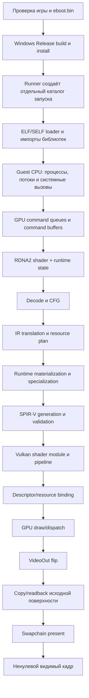

# Ghost of Yōtei в KytyPS5 на Windows: прогресс и план запуска

Checkpoint **2 октября 2026 года** (native Windows; `40582634` + ещё не
закоммиченное общее исправление достижимости SRT-слотов):

- Синтетический `resource_tracking_tests --conditional-planning-srt-only`
  дал ожидаемый RED на старом `RefreshFlatBuffer`: при невзятой ветке он
  пытался читать недоступный planning-only scalar slot. Тот же тест после
  исправления GREEN; дополнительно проверены взятая ветка, общий слот с
  активным владельцем, неизвестное условие, запись шейдера и обновление
  `nonzero → inactive zero`. Логи `_Build/logs/conditional-planning-srt-*20261002.log*`.
  Полные `resource_tracking_tests`, `resource_materialization_tests`, три
  соседних GPU compute-кейса, native MSVC build/install — GREEN. Полный CTest
  после этого исправления не запускался; предыдущий checkpoint сообщает 60/71.
- Installed exe SHA-256
  `9332B4B37D1091A027F835CA80277D892A63B8F9028FC5AE3F224344CC716755`.
  Retry `yotei-integrated-20261002-150513-menucheck-gpuav-sync` в 1280×720,
  GPUAV+SyncDiag, readback с кадра 180: natural exit321, maxShown162, без
  readback. Прежний VS `ee4f153aa500d327` теперь проходит materialization и
  выпускает SPIR-V 7628/7632 слов (`_kyty.txt:7796275-7796277`,
  `:7796347-7796348`). Это подтверждает прохождение прежней границы, но не
  доказывает видимый кадр или успешное создание каждого graphics pipeline.
- Новая runtime-граница того же retry: CS `7ceb0f3417f926f9`, clean flat
  slot31, raw planning-only `ReadConstBuffer`, PC `0x294`, memory index60:
  `runtime SRT evaluation failed` (`_kyty.txt:7796656`, `stderr.txt:1`).
  Старые сохранённые SPIR-V этого шейдера существуют, но причина текущего
  отказа не установлена; требуется адрес/descriptor/extent и отдельный RED.
- Отдельный retry `yotei-integrated-20261001-220919-menucheck-gpuav-sync`
  с readback с кадра 1 завершился exit321 при maxShown1: Vulkan validation
  увидела `TRANSFER_DST_OPTIMAL` вместо ожидаемого `TRANSFER_SRC_OPTIMAL`
  при `copyImageToBuffer` подготовленного кадра (`stdout.txt:1673`). Это
  дефект диагностического readback-пути; он не доказывает состояние картинки
  и не подтверждает выполнение VS/CS выше. `coloredProven=false` в обоих
  запусках, процессы после каждого отсутствуют. Первый ненулевой кадр, меню
  и gameplay остаются PENDING.

Checkpoint **2 октября 2026 года** (Windows; рабочее дерево на базе `98a46e46`
с общим исправлением scalar `ConditionRef` selector guard):

- Native MSVC Developer Environment build/install завершились успешно. Новый
  `resource_tracking_tests --inline-scc-selector-guard-only` дал ожидаемый RED
  до изменения `ResourceTracking.cpp` (`not a valid runtime value`), затем тот
  же тест GREEN. Синтетические CPU проверки image/sampler selector keys и
  обратной полярности/EXEC/VCC тоже GREEN; полный `resource_tracking_tests`
  GREEN. Три ограниченных GPU compute-кейса dynamic material pairs/image table
  pairs/wave64 image loop GREEN. Логи `_Build/logs/inline-*20261002.log*`.
- Общий CTest: 60/71, `resource_tracking` и `resource_materialization` GREEN;
  11 других тестов не прошли, включая отдельные renderer/cache проверки и
  дочерние процессы, которым Windows отказала в резервировании 13,8 ГБ guest
  direct memory. Полный suite GREEN не заявляется.
- Retry `_Build/runs/yotei-integrated-20261001-214503-menucheck-gpuav-sync`:
  tested game path `G:\games\Kyty\PPSA26344\PPSA26344` (as recorded in
  `run.json`); the originally named `dow[PS5]` path was unavailable in this
  Windows environment. Это не доказательство идентичности двух копий.
  installed exe SHA-256 `4FA00D1536F084804A56E62F511BEE29A2BC48881A34592C93EB0B7499384F2D`,
  1280×720 GPUAV shader instrumentation + SyncDiag, natural exit321,
  `maxShown=170`. PS `f8927c09f4b928c7` теперь прошёл materialization:
  386 images / 383 sampled pairs, SPIR-V 295 838 слов; сохранены два `.spv`.
  Предыдущей ошибки 607/512 в этом запуске нет. Отдельное предупреждение
  Vulkan validation: запрошено 12 320 sampled-image дескрипторов при pool
  capacity 8 192; оно не было зарегистрировано как причина завершения.
- Новая подтверждённая граница: VS `ee4f153aa500d327`, runtime SRT evaluation
  flat slot 2 failed (`LoadAddressU32`, `raw=true`, `kind=2`, `planning=true`,
  `slot_kind=0`) на `TrackResources`/`MaterializeResources`; stderr и хвост
  `_kyty.txt` в указанном run. Нельзя подменять непрочитанный адрес нулём без
  доказательства optional-null семантики и причин текущего значения.
- Readback был настроен начиная с кадра 180 и не успел выполниться; `coloredProven=false`.
  Первый ненулевой кадр на этой ревизии, меню и gameplay остаются PENDING.
  Процессы запуска и сборки после завершения отсутствуют. Следующий шаг —
  ограниченная диагностика SRT slot 2, независимый RED и общий фикс, затем
  повтор игры с проверкой пикселей.

Предыдущий checkpoint **28 сентября 2026 года**. Игра: **Ghost of Yōtei, PPSA26344**.
Рабочая ветка — `yotei-windows-bringup` в локальном fork `fxpw/KytyPS5`.

Checkpoint реального запуска `8cb79392` **28 сентября 2026 года**:

- Committed native Windows MSVC Developer Environment build/install GREEN.
  Retry `yotei-integrated-20260928-205136-menucheck-gpuav-sync`, 1280×720 GPUAV shader
  instrumentation + SyncDiag, readback disabled. UTC 2026-09-28T20:51:37.4832364Z →
  2026-09-28T20:53:17.8675287Z; natural exit321, maxShown119. Emulator SHA-256
  `7A47287F763756571347A747D497C327686540C2A577786893B0644A0A9AFAE7`.
- CS `8457901d80b91921` PASSED: 81 bounded columns preserve count65536,
  materialization succeeds, SPIR-V54523 words, vkCreateComputePipelines Success
  elapsed_ms2041, subsequent compute/draw work continues. Log references:
  `_kyty.txt:5619740` / `:5619824`, stdout tail and stderr in the completed run.
- New confirmed boundary: PS `f8927c09f4b928c7`, MaterializeResources /
  BuildResourceSpecialization: inline sampled pairs exceed dense image limit;
  size23184, stride368, probes1439, pairs297, accumulated images607.
  No limit increase, error suppression or game-specific workaround.
- DesktopCopy shown29/114 is black. No nonzero frame/menu/gameplay proof.
  Emulator and other task-owned build/test processes closed. Committed-source
  `Wave64ImageReadLoopAccumulatesWithoutFeedback` numerical neighbor also GREEN
  (`bounded-scalar-budget-8cb79392-wave64-neighbor-20260928.txt`). Regression debt
  records the new admission boundary and hypotheses for independent reproduction.
- Normal push8cb79392 complete. Exact-source CI36482065792: Build/Test/Install GREEN on Windows/Linux/macOS;
  overall run failed only at macOS artifact upload (`getaddrinfo ENOTFOUND` for
  GitHub Actions blob storage). Documentation checkpoint push will retry CI;
  do not call that overall run GREEN. Previous4db9964a CI36479506102 GREEN.

Checkpoint finite scalar-buffer snapshot budgets **28 сентября 2026 года**:

- Source `4db9964a` + generic materialization correction: descriptor-proven OOB
  rows keep their logical positions and zero values, without consuming coherent
  memory probes. Existing 65536-probe and 64MiB bounded-column storage caps retained.
  No game/hash/address conditions; guest bounds/address arithmetic unchanged.
- Native CPU RED → GREEN and native finite 16-bit selector GPU RED → GREEN;
  keys0/1/65535, in-bounds output then OOB zeros, backing sentinels unchanged.
  Wrap re-entry, zero work/extent, exact/plus-one probe/storage limits covered.
  Native MSVC Developer Environment build GREEN, CTest22/22 and scalar/EXEC/image
  GPU neighbors GREEN (`bounded-scalar-budget-*` logs). Full compute suite is not
  claimed GREEN; unrelated unaligned scalar and DCC/cache debt remain.
- Committed build/install and game retry pending. Latest completed runtime still
  c8aaaa5b / maxShown113 / black client / CS845790 snapshot capacity boundary.
  No nonzero frame, menu or gameplay claim. Previous4db9964a CI36479506102 confirmed
  GREEN Windows/Linux/macOS; new exact-head CI pending.

Checkpoint реального запуска `c8aaaa5b` **28 сентября 2026 года**:

- Committed native Windows build/install GREEN. Retry
  `yotei-integrated-20260928-202341-menucheck-gpuav-sync`, 1280×720 GPUAV+SyncDiag,
  readback disabled; UTC 20:23:41.2849348 → 20:25:49.1894739, exit321,
  maxShown=113. Emulator SHA-256
  `D110EC723793DA809EE0A236A4826AB2B30D70B7C4FDB04A8822DD458F450A10`.
- `5f3fdf61a7ca4a20` boundary PASSED: bounded columns count=6, SPIR-V 150116
  words, vkCreateComputePipelines Success elapsed_ms=2912; subsequent dispatches
  continue. Native nested-image regression and neighboring cases stay GREEN.
- Следующая граница: CS `8457901d80b91921`, MaterializeResources bounded SRT.
  stderr confirms read1 candidate/snapshot limit: count=65536, stride=592,
  bias=0, accumulated words=131072, candidate_limit=65536, word_limit=65536.
  Не повышать лимит и не подставлять нули: следующий test должен отличать finite
  selector range, actual descriptor extent и required snapshot dependencies.
- DesktopCopy shown=37/106 показывает чёрную client area. Ненулевой кадр / меню /
  gameplay не подтверждены. Все task-owned процессы закрыты.
- Normal push c8aaaa5b выполнен, PR497 MERGEABLE; exact-source CI36478770112
  выполняется, его GREEN pending. Предыдущий 4a556c73 CI GREEN подтверждён.

Checkpoint nested post-test image proof **28 сентября 2026 года**:

- Tested source: `4a556c73` + shared SrtWalker dominance correction. SSA split latch
  placed i+1/compare before an empty backedge block. Old equality check rejected
  a bounded dense image selector. No guest-specific branches or relaxed bounds.
- Regression debt recorded before fix. CPU RED → unchanged oracle GREEN
  (4 positives / 6 negatives); native shader RED PC 0x38 image root → SPIR-V and
  six numerical values GREEN. Wave32 regression isolates descriptor proof.
- Captured 5f3f CPU audit GREEN in both explicit diagnostic barrier profiles;
  native build GREEN, CTest22/22; image table / wave64 image loop / bounded scalar
  store / native EXEC upper GPU neighbors GREEN (`nested-posttest-*` logs).
- Committed build/install/game retry pending; latest real runtime remains
  `10961866` shown92 / image-origin boundary. Nonzero frame/menu/gameplay pending.
- Exact-head CI `4a556c73`: run36468596026 confirmed GREEN Windows/Linux/macOS,
  release skipped. This does not validate the new working source patch.

Checkpoint upstream merge `10961866` **28 сентября 2026 года**:

- Committed native Windows build/install GREEN; required CTest 22/22,
  NGS2/ATRAC9 GREEN. Partial-mip CPU + native EXEC full/upper + bounded store
  + zero-stride OOB numerical GPU fixtures GREEN (`merge-10961866-*`).
- Retry `yotei-integrated-20260928-185252-menucheck-gpuav-sync`, 1280×720,
  GPUAV+SyncDiag, readback disabled, UTC 18:52:52.8928254 → 18:53:59.4207626,
  exit 321, maxShown=92. Emulator SHA-256
  `E2410310C5C3CB5B8F1C4D7AC63BA5E38B163FF40A20109DC25B3FF94730CEB1`.
  Та же граница: CS `5f3fdf61a7ca4a20`, PC 0x26c, GetImageResource dword 0
  rejects root LoadAddressU32. DesktopCopy shown=6/65 — чёрная client area.
  Ненулевой кадр / меню / gameplay не подтверждены. Все task-owned процессы закрыты.
- CPU-only audit старого dispatched capture воспроизводит тот же image tracking
  error в двух явно заданных legacy barrier profiles. Logs
  `srt-5f3f-cpu-audit-input-fixed-{false,true}-20260928.*`; profile inputs kept
  under `_Build/analysis/srt-5f3f-cpu-profiles-20260928`. Первый audit имел
  input_error (не reproduction); corrected profiles дали intended exit 321.
- Normal push выполнен; PR #497 MERGEABLE. Exact-source CI `36467910181`
  выполняется, GREEN ещё не объявляется. Fresh PR selective review:
  `docs/open-pr-usefulness-review.md`. Полный compute/cache suite не GREEN:
  DCC/video-out alias и unaligned scalar-buffer read остаются отдельным debt.

Checkpoint реального запуска `2e3a2a13` **28 сентября 2026 года**:

- Native Windows committed build/install GREEN. Retry
  `yotei-integrated-20260928-183223-menucheck-gpuav-sync`, 1280×720 GPUAV+SyncDiag,
  readback disabled, UTC 18:32:23.4871409 → 18:35:19.0282480, exit 321,
  **maxShown=101**. SHA-256 emulator
  `2B57A93F6350BB1F95CB083BA2CCD197CA2C8AC1AD0EBEF5B5DD7CAACB264D9D`.
- d895 / 86da descriptor-store boundaries пройдены; presentation возобновился.
  Новая граница: CS `5f3fdf61a7ca4a20`, PC 0x26c, GetImageResource dword 0
  runtime validation rejects root LoadAddressU32. Требуется отдельная image
  descriptor origin/table/guard регрессия; не подменять image пустым resource.
- DesktopCopy активного task-owned окна: `owned-window-desktop.png` при shown=0
  и `owned-window-shown43-desktop.png` фактически при shown=66. Оба показывают
  чёрную client area. Ненулевой кадр / меню / gameplay не подтверждены;
  maxShown=101 не является доказательством изображения.
- Upstream `8e61798b` (5 commits после `22ff4693`) интегрирован с разрешением
  2 conflicts (textureCache.h / descriptors.cpp). Native Windows emulator/launcher/
  kyty_tests build GREEN, required CTest 22/22, NGS2/ATRAC9 synthetic GREEN.
  Bounded buffer limits, aligned uploads и SelectUploadRange сохранены; upstream
  image-local ownership и buffer naming приняты. Runtime нового merge pending.
- Расширенный `--buffer-cache-range-only` RED на существующей DCC/video-out alias
  metadata проверке до новых ownership cases. Scoped baseline без двух upstream
  textureCache changes даёт тот же RED. Логи `merge-8e-image-ownership*`:
  это не доказательство GREEN ownership suite; отдельный debt остаётся.
  Все task-owned процессы закрыты.

Checkpoint native EXEC / finite selectors **28 сентября 2026 года**:

- `05d10203` собран/установлен и normal-pushed; exact-head CI `36463341547`
  GREEN Windows/Linux/macOS. Retry `yotei-integrated-20260928-181147-menucheck-gpuav-sync`:
  1280×720 GPUAV+SyncDiag, UTC 18:11:47.3992189 → 18:12:03.6160404,
  exit 321, shown=0. SHA-256 `11B8D7A9B94F36894EE597DE6A8761C890EC89BDD03991BBED7D27AE261B6255`.
  d895 bounded table materialized count=3 and emitted SPIR-V (3334 words).
  Новая граница: CS `86da5eb7b8257bb0`, PC 0x530 BUFFER_STORE_DWORD;
  конечный GPU selector идёт через V_READFIRSTLANE под EXECZ guard.
- CPU и два numerical native-CFG fixtures дали RED до shared proof fix.
  После него full EXEC GREEN, upper-only дал отдельный numerical RED
  (272/7032 DWORD). Split compute ConditionRef возвращал lane predicate вместо
  решения всей wave64; planner не учитывал его ballot scratch. Отдельный budget
  RED записан до исправления emitter/scheduler/requirements/planner.
- GREEN: неизменённые native EXEC CPU 6 positive / 12 negative, оба GPU fixtures
  с прежними oracles для всех 7032 DWORD, прежние finite full/upper neighbors,
  bounded scalar store, cooperative LDS **9/9**, required CTest **22/22**,
  14-case ConditionRef planner с exact/one-byte-short scratch budgets.
  Логи `native-exec-*-20260928.*`. Captured shader CPU tracking GREEN в двух
  явно заданных diagnostic barrier profiles; materialization/GPU оттуда не следует.
- Дополнительный unaligned scalar-buffer neighbor RED (1024/1032 DWORD),
  воспроизводится без нового wave-emitter patch; старый EmitReadConstBuffer
  не применяет host-view byte adjustment. Отдельный regression debt pending;
  broad compute suite не объявляется GREEN.
- Native Windows emulator/launcher/kyty_tests build GREEN; committed install/retry
  с новым исправлением pending. Ненулевой кадр / меню / gameplay не подтверждены.

Checkpoint bounded scalar ConditionRef **28 сентября 2026 года**:

- `5b63741c` собран/установлен и normal-pushed; exact-head CI `36460716685`
  GREEN Windows/Linux/macOS. Retry `yotei-integrated-20260928-174752-menucheck-gpuav-sync`:
  UTC 17:47:52.4257579 → 17:48:02.6048640, 1280×720 GPUAV+SyncDiag,
  естественный exit 321, shown=0. SHA-256 emulator
  `953452159F914977933A2144DE78FDF78E8EDF4EF46EF2FE2D74856FC5884E01`.
- CS `d8959888aafd2552`, PC 0x1b4 — **BUFFER_STORE_DWORD**, а не single-DWORD
  load. Raw vector fallback исправлен независимо, но этой записи недостаточно.
  Эксперимент x1 сохранён в ignored analysis patch и убран из исходников.
- CPU RED доказал, что bounded loop proof теряет SCC `ConditionRef` нового CFG.
  Общая коррекция снимает только scalar SCC wrapper, сохраняя polarity,
  induction/guard/root proofs и snapshot budgets; GPU-selected writes запрещены.
- GREEN: 6 положительных / 12 отрицательных CPU cases, numerical native-CFG
  descriptor-store loops 1/3 × Full/Sparse **4/4**, bounded zero-stride neighbors
  **4/4**, native emulator/launcher/kyty_tests build и required CTest **22/22**.
  Логи `bounded-condition-{cpu-boundaries-green,gpu-*,neighbor-*,ctest}-20260928.*`.
  Legacy captured shader CPU audit GREEN в двух явно заданных barrier variants;
  это не подтверждение materialization/GPU/frame.
- Committed install/game retry `05d10203` завершены, новая граница приведена выше.
  Первый ненулевой кадр, меню и gameplay не подтверждены.

Checkpoint GPU-selected raw buffers **28 сентября 2026 года**:

- `a233dfe1` собран/установлен и normal-pushed; exact-head GitHub CI
  `36459385052` GREEN Windows/Linux/macOS (release skipped).
- Retry `yotei-integrated-20260928-173637-menucheck-gpuav-sync`:
  1280×720 GPUAV+SyncDiag, UTC 17:36:37.9351123 → 17:36:59.5233657,
  естественный exit 321, shown=0; ordinary-payload SRT blocker пройден.
  Installed SHA-256 `9578B4DD2506E0B8DADCAE84EA623295E3B30FE7E15917965FC9979A74375FF2`.
  Следующий отказ: CS `d8959888aafd2552`, PC 0x1b4, dynamic buffer descriptor
  root LoadAddressU32 не принимается host validator.
- Существующий upstream raw x2/x3/x4 GPU path был недостижим через local
  GetHandle; после его подключения обнаружены два host dense-index assumptions
  в liveness/specialization. CPU/GPU RED записаны до соответствующих fixes.
- GREEN: CPU matrix raw x2/x3/x4 против x1/formatted/typed/store через
  materialization/specialization; полный resource suite; CTest 22/22.
  Два numerical GPU-descriptor fixtures проходят прежние oracles для 11
  variations bounds/swizzle/OOB/unmapped, без fake host binding.
  Логи `indirect-buffer-{specialization-green,ctest,final-*}-20260928.*`.
- Committed build/install/retry `5b63741c` завершены; его результат приведён
  в следующем checkpoint выше. Первый ненулевой кадр/меню/gameplay не подтверждены.

Checkpoint ordinary scalar payload **28 сентября 2026 года**:

- Retry `yotei-integrated-20260928-172154-menucheck-gpuav-sync` на `76d56359`:
  1280×720, GPUAV+SyncDiag, UTC 17:21:54.8448430 → 17:22:11.1730053,
  естественный exit 321, shown=0. ConditionRef blocker пройден; новая граница:
  CS `8968b4b53e5a246a`, runtime SRT evaluation failed, flat slot 209.
  Installed SHA-256 `D7105638CB043F797F57D1441208AE65579D3952F47884567FB6247C11BFDDB8`.
- Diagnostic retry `...-172639-menucheck-gpuav-sync` доказал eager host read
  адреса 0 в S_LOAD_DWORDX8 PC 0x39dc: ordinary payload находится под EXECZ,
  новый planner выносил его из guest control flow. Это не повод zero-fill.
- CPU RED до production fix записан в debt. Общая коррекция сохраняет payload
  memory operations в guest IR; descriptor/address dependencies остаются host
  recipes. Тот же CPU matrix GREEN; CTest 22/22; bounded numerical 4/4;
  cyclic scalar-address GPU GREEN и cooperative LDS 9/9.
- BDA-coefficients fixture исправляет пропущенный bounds mode 3 в своём
  user-data descriptor; все 16516 ожидаемых DWORD сохранены и GREEN.
  Ранее он запрашивал mode-0 zero-stride OOB, поэтому возвращал верные zeros.
- Temporary diagnostics удалены. Native build `scalar-payload-fix-build-20260928.log`
  GREEN; committed install/game retry pending. Ненулевой кадр/меню не подтверждены.

Checkpoint wave64 `ConditionRef` **28 сентября 2026 года**:

- Свежий merge `4fcc3575` собран/установлен и normal-pushed; PR #497
  `MERGEABLE`, exact-head CI `36456692100` ещё выполняется.
- 1280×720 GPUAV+SyncDiag retry `yotei-integrated-20260928-171407-menucheck-gpuav-sync`
  на этом commit завершился exit 321 при shown=0: CS `a7661ff4ea282325`,
  wave64 splitting does not support operation ConditionRef. Installed SHA-256
  `CE6876FDBAA7237A8684D32EC7E1009C21300500C92DD1C4B434AF27D98E37DC`.
- Синтетическая CPU-регрессия воспроизвела этот отказ до production fix.
  Общий planner теперь учитывает whole-wave mask reduction и сохраняет
  varying ScalarInstruction rejection. GREEN 14-input matrix + 6 соседних
  CPU/CFG selectors; CTest 22/22; numerical subvector/VCC и cooperative LDS 9/9.
  Логи `condition-ref-{red,green,ctest,multiwave-gpu}-20260928.*`.
- Повтор игры с исправлением pending; ненулевой кадр/меню/gameplay не подтверждены.

Checkpoint свежей интеграции upstream `22ff4693` **28 сентября 2026 года**:

- 26 конфликтных файлов разрешены с сохранением bounded/inline resource tables,
  wave64/D16 и strict FP64 admission. Старые неиспользуемые CFG helper paths
  удалены при переходе на новый transactional structurizer.
- Перед production corrections зафиксированы RED: descriptor cleanup терял
  runtime table selector, tracking DCE пропускал validation preplanned IR,
  record-key capture терял writable alias rejection, UInt sampler routing
  расходился с новым integer-border policy. Подробности в emulator-test-debt.
- Native Windows emulator/launcher/kyty_tests build GREEN:
  `merge-22ff-build9-20260928.log`. Required CTest **22/22**, дополнительные
  upstream CPU tests **12/12**; shared-merge CFG execution/SPIR-V GREEN.
- Numerical GPU: bounded Raw/Formatted/D16/Scalar **4/4**, соседние
  zero-stride/format-store/D16/indirect-image/F64-conversion **5/5**,
  sampler-border GREEN после его отдельного RED. Логи `merge-22ff-verified-*.txt`,
  `merge-22ff-sampler-border-green-20260928.txt`.
- Install и game retry на завершённой интеграции pending. Последняя реальная
  граница пока CS `8457901d80b91921`, bounded SRT materialization failed,
  shown=161; ненулевой кадр, меню и gameplay не подтверждены.

Checkpoint bounded zero-stride lowering **28 сентября 2026 года**:

- `56429ffd` — переносимая aggregate initialization двух CPU fixtures вместо
  zero-argument optional emplace (точный CI d690678c: Windows/macOS GREEN,
  Linux compile RED). `ea76c166` — общий candidate-specific vector OOB lowering
  для bounded buffer tables; normal candidates читают данные, mode-0 zero-stride
  возвращают ISA-defined zero/SEL_1 defaults, включая D16 packing. Scalar-buffer
  reads сохраняют отдельный bounds path. Workgroup bounds не подменяются count.
- RED до production fix записан в `docs/emulator-test-debt.md`, включая повтор
  исправленного D16 encoding на исходном production. GPU numerical GREEN 4/4:
  Raw, Formatted, D16, Scalar; четыре соседних selectors GREEN. Логи
  `_Build/logs/bounded-zero-*-final-20260928.txt` и `bounded-zero-neighbor-*.txt`.
- Native Windows MSVC Developer Environment: emulator, launcher, kyty_tests
  build/install GREEN; focused CTest **22/22**. Логи
  `bounded-zero-native-{build,ctest,install}-20260928.log`. Исходники:
  d690678c + проверенные изменения, сохранённые в 56429ffd/ea76c166;
  binary SHA-256 `E2CA13121A9D57058FDB9BAF7CE402A4531A1F97DF909672FC93947A5EE68232`.
- Первый 1280×720 GPUAV+SyncDiag retry `yotei-integrated-20260928-162700-menucheck-gpuav-sync`:
  timeout 180s, exit -1, shown=53. Это остановка watchdog, не emulator crash.
- Повтор `yotei-integrated-20260928-163025-menucheck-gpuav-sync`:
  UTC 16:30:25.8741454 → 16:33:48.6334300, естественный exit **321**, shown=**161**.
  Старый zero-stride blocker пройден; достигнуты 128 CS / 25 PS / 12 VS.
  Новая граница: `MaterializeResources failed ... bounded SRT materialization failed`
  в CS `8457901d80b91921`, dispatch 2×1×1, до SPIR-V emit этого shader.
- DesktopCopy активного собственного окна `window-desktop-initial.png` при shown=7
  показывает чёрную игровую область. `window-printwindow-later.png` при shown=160
  — дополнительный capture; PrintWindow сам по себе не доказывает GPU pixels.
  Readback отключён: transition перед image-to-buffer copy ещё не проверен.
  Ненулевой кадр, меню и gameplay **не подтверждены**. После обоих retries
  emulator/shader tests/ninja/MSBuild процессов нет.
- Normal push до ea76c166 выполнен. Свежий upstream main — 22ff4693,
  PR #497 снова CONFLICTING; новая интеграция и её повторная проверка pending.
  Следующее: интегрировать новые общие resource/memory/CFG corrections,
  локализовать bounded snapshot отказ без ослабления alias/readability/probe limits.

Checkpoint интеграции upstream и повторного game retry **27 сентября 2026 года**:

- Текущие изменения сохранены коммитом `e0c73250`; upstream `421684e7`
  интегрирован merge-коммитом `6238c2ed`. Все 17 конфликтных файлов разрешены,
  незавершённого merge и unmerged index entries нет. History не переписана.
- Общие исправления после регрессионных RED: `0c71c8cc` (SRT admission,
  fallible host copy, alias/limit checks и conditional materialization),
  `1f1f7665` (cube metadata и decoded guest operand layout), `e47a15c7`
  (live bounded-table candidates), `e55e5053` (vector table/direct rewrite
  distinction). Проверки названия игры, shader hash и guest address не добавлены.
- Native Windows source `e55e5053`: MSVC Developer Environment явно
  инициализирован через `vcvars64.bat`; emulator, launcher и `kyty_tests`
  собраны, install выполнен. Логи `_Build/logs/merge-table-final-build-20260927.log`
  и `merge-table-final-install-20260927.log`. Binary SHA-256:
  `86D7F0D0C57186F99AB80CE442A5D4A9EB6320F9FC0AFF78C669276A1FD4499B`.
- Выбранный CTest GREEN **22/22**, включая восемь обязательных Windows CI
  проверок: `_Build/logs/merge-table-final-ctest-20260927.log`.
  Synthetic GPU selectors GREEN **8/8**: float-image-atomic, buffer-format-store,
  buffer-d16, sdwa-mov, sdwa-ffbh, zero-stride-oob, f64-conversion, indirect-image.
  Логи `merge-gpu-*-table-final-20260927.txt` и `.run.json`. Это focused checks,
  не утверждение о полном shader corpus или другой игре.
- Отдельные RED остаются: NVIDIA `nvgpucomp64.dll` при FP64 reciprocal
  (arithmetic selector проходит четыре предыдущих случая, затем `0x80000003`),
  и `ComparisonDepthTexture` до numerical stage на opcode assertion.
  Детали/регрессионный долг: `docs/emulator-test-debt.md`.
- Game retry `_Build/runs/yotei-integrated-20260927-202436-menucheck-gpuav-sync`:
  UTC `20:24:36.7888297` → `20:24:58.8427248`, окно **1280×720**,
  GPUAV instrumentation + SyncDiag, exit **321**, `shown=0`.
  Предыдущие collector bounds error и host AV в direct zero-stride rewrite
  пройдены. Текущий явный blocker:
  `bounded zero-stride mode-0 vector reads require candidate-specific lowering`.
  Readback выключен (limit 0): его image transition требует проверки;
  ненулевой кадр, меню и gameplay **не подтверждены**. После retry процессы
  kyty_emulator, shader_cfg_tests, ninja и MSBuild отсутствуют.
- Следующий шаг: сначала synthetic table с обычным и mode-0 zero-stride
  кандидатом, численная проверка результата выбранного кандидата, formatted
  defaults/D16 и sparse EXEC; затем общий candidate-specific lowering.
  Не подменять отсутствующее lowering нулём для всей таблицы и не повышать
  snapshot/resource limits без независимого RED/GREEN.
- Лишние корневые temp logs и неиспользуемая копия SDL2 архивированы внутри
  `_Build`; пользовательские файлы, captures и game data сохранены.

Checkpoint проверки текущего WIP **27 сентября 2026 года**:

- Основа `1c421608`; чужие незакоммиченные изменения сохранены. Windows
  перезагружена в 15:27 UTC. Изолированный probe на сохранённом CS
  `b90e2024732c6111` всё ещё падает при `vkCreateComputePipelines`
  (exit `-1073741819`): `_Build/logs/b90e-probe-post-reboot-20260927.txt`.
  Одна перезагрузка не устраняет ошибку; GPUAV instrumentation остаётся
  необходимым диагностическим режимом для дальнейшего game retry.
- Незакоммиченный `EmitHomogeneousIndirectSample` нарушал SPIR-V:
  `OpSampledImage` нельзя передавать через `OpPhi`/между блоками.
  CPU RED `homogeneous-image-red2-20260927.txt.stderr`, unchanged GREEN
  `homogeneous-image-green2-20260927.txt` после удаления этого варианта.
  Сохранён диагностический patch в `_Build/analysis/`; обычная выборка
  numerical results остаётся. Причина прежнего DeviceLost не доказана.
- `ValueEmitContext` обходил общий graphics wave64 partition helper:
  lane 63 попадал в subgroup32 shuffle напрямую, верхняя половина ballot
  не получала partition mask. Synthetic Vertex/Pixel CPU RED
  `graphics-wave64-red-20260927.txt.stderr` → unchanged GREEN
  `graphics-wave64-green-20260927.txt` после восстановления общего routing.
  Partitioned graphics loop, cooperative collectives, split-wave64 ballot
  также GREEN. Это восстановление существующего partition lowering,
  а не доказательство полной cross-subgroup wave64 эквивалентности.
- Native MSVC Developer Environment: сборка/установка emulator успешны.
  Новая сборка SHA-256
  `D2D853FD3CFBB702CAD8D56B2807F7D9B3991527BD6E49BE54CB1EB9963E6756`.
- Завершён baseline `_Build/runs/yotei-integrated-20260927-182113-menucheck-gpuav-sync`:
  прежняя сборка `DC2E8DC8…`, окно 1280×720, GPUAV instrumentation,
  SyncDiag; shown=123. Процесс закрыт вручную для проверки новой сборки,
  exit -1 не является самостоятельным emulator crash. PrintWindow чёрный,
  меню и новый полезный кадр не подтверждены.
- Retry новой сборки `…-183108-menucheck-gpuav-sync` завершён вручную для
  актуализации ветки по команде пользователя: shown=154, exit -1.
  Все 34 readback кадров 120–153 имеют RGB=0, alpha=3. Прежний draw
  `e312…` ещё не достигнут; runtime эффект wave routing не доказан.
  Меню и новый ненулевой кадр не подтверждены. Старые checkpoint ниже —
  история; не переносить их spinner/DeviceLost результат на новый WIP.
- Synthetic material images: исправлена потерянная привязка
  `use_runtime_samplers` в стенде; unchanged GPU oracle GREEN 2/2,
  `_Build/runs/synthetic-image-20260927-runtime-samplers-green/report.json`.
- Восстановлен отсутствовавший RO aligned-upload regression: на HEAD
  descriptor path RED при adj=2, на сохранённом WIP GREEN с GPU-readback
  смещений 1/2/3 и padding. Логи `ro-align-restored-{red,green}-20260927.txt`.
  Временный raw-frame diagnostic сохранён отдельным patch в `_Build/analysis`,
  в production checkpoint не включён. Misplaced root logs и untracked SDL2
  source перенесены в `_Build`; игровые данные и артефакты сохранены.
- Перед checkpoint-коммитом native focused CTest GREEN **9/9**:
  wave routing, opaque image validation, cache identity/reuse/mode, GDS
  admission, D16_HI, gather variants и RO aligned-upload.
  `_Build/logs/precommit-focused-20260927.log`. Полная suite и меню pending;
  после upstream merge требуется повторная native сборка и проверки.


Checkpoint Flip queue lock-order (Reserve cfg→m_mutex ABBA) **26 сентября 2026 года**:

1. `bd6ee368` (unlock cfg before publish) не снял soft-stall:
   `_Build/runs/yotei-integrated-20260926-045245-presentfix` — shown=125 /
   ready=126 / stale pstg=11 на 300s (title застывал на PresentDone).
2. Реальный ABBA: `ReserveFlipRequest` держал `cfg.mutex` → `Reserve(m_mutex)`,
   а Flip publish берёт `m_mutex` → `cfg.mutex`. Title `GetDiagnostics` тоже
   брал `m_mutex` внутри Present до `shown++`.
3. Фикс `fd614ef1`: Reserve всегда `m_mutex` затем `cfg.mutex`; title после
   publish + heartbeat PresentThread; pstg=13 FlipPublishWait; GetDiagnostics
   без блокирующего Lock.
4. Game `_Build/runs/yotei-integrated-20260926-051020-presentfix`: **present
   soft-stall снят** — ready=shown=137, pstg=10 (VblankEnd), PresentThread
   ~60fps (frame→44k). Новый стопор: guest/GPU перестал вызывать
   `CommandProcessor::Flip` (ровно 137); Sync after-complete balanced; нет
   Fatal/Materialize.
5. Retries `…-052812` / `…-053958` + WaitFlipDone/WaitRegMem logs: после
   последнего `Flip()`+`WriteAtEndOfPipe64(refclock)` нет ни WaitFlipDone,
   ни WaitRegMem — DCB просто кончается, guest больше не сабмитит GPU.
   Present здоров. `TriggerVideoOutEvents Flip listeners=0` (игра не зовёт
   AddFlipEvent).
6. **277× unresolved stub** `gWT7X8H0bYs` (VideoOutGetVrrStatus) — NID был в
   тесте, но не в `LIB_FUNC`. Фикс `…` / commit: зарегистрировать GetVrrStatus.
   RED/GREEN: `shader_cfg_tests --videoout-vrr-status-only`.
7. Game `_Build/runs/yotei-integrated-20260926-060211-presentfix`: **shown=151**
   (прошлый soft-stall ~137 снят), gWT7 stubs=0, Present 60fps. Fatal был:
   `sampled HTile import has unsupported GPU image or raw-buffer ownership`
   (`textureCache.cpp:1452`), exit 321.
8. Фикс `73c99f03`: при наличии native depth owner всегда возвращать его;
   buffer-dirty depth без image — ReadMemory перед clear-import.
9. Game `_Build/runs/yotei-integrated-20260926-061925-presentfix`: **shown=164**,
   HTile ownership fatal снят (0). Present 60fps до стопора. Exit `-805306369`
   (`0xcfffffff`) без `--- Error ---`: first-use CS `0x8000198700` /
   hash `54904fb419d79e49` (SPIR-V ~739k words, LDS 3200 dwords, wg 512)
   застрял в `vkCreateComputePipelines` под GPUAV lite; AJM продолжал,
   shown не рос → frame watchdog Kill. `PipelineTrace: begin` есть, `done` нет.
10. Следующее: Sync present-fix **без GPUAV** + elapsed на CreatePipeline;
    если pipeline создаётся — гнать следующий fatal. Меню/gameplay PENDING.
11. **FPS без картинки (26 сен)**: shown/ready растут ~60fps, `last≥0`, окно
    чёрное — Present blit жив, guest surface пустая (исторически RGB=0/A=3 до
    spinner на `96611fe`). Readback в `PrepareFrame` крашил (0xC0000409): copy
    ещё не submitted. Перенесён в `Present` после EOP Complete; формат
    `A2R10G10B10` добавлен. Доказать pixel stats, затем producer RT.
12. **Конфликты с main (локальные refs, fetch github:443 timeout)**:
    `origin/main`=`c47c3d55`, `upstream/main`=`5ce4f083` — оба ancestors of
    `yotei-windows-bringup` (`3d117be3`+); `merge-tree` → 0 CONFLICT. Удалённый
    main новее локального refs — не проверен, пока нет сети.
13. **Скорость до spinner**: present-fix переведён на
    `--shader-optimization-type None` (Performance давал ~241 с SPIR-V optimizer
    на холодном старте). GPUAV+instrumentation обязателен (без него
    `b90e2024` → nvgpucomp `0x80000003`). Цель readback: colored>0 около
    prepared frame ~236.
14. Cold GPUAV+instr+None `…-071734-presentfix-gpuav`: **timeout 900s на
    shown=136** (colored=0, readback START=200 не достигнуто). Bottleneck —
    `vkCreateComputePipelines` 5–35 с на GPUAV-SPIR-V (`6cc64dee` ~16 с,
    пики ~35 с). Cache load 331 MB → save **369 MB**. Следующее: тёплый
    повтор (тот же blob), без core validation (`-NoVulkanValidation`),
    Timeout 1800 / ReadbackStart 130; параллельно снять зависимость от
    GPUAV для `b90e` (корневой ускоритель до spinner).
15. Warm `…-073326`: **shown=166 hang** — CS `54904fb419d79e49` (~755k SPIR-V)
    `vkCreateComputePipelines` ~278 с, затем **4× полный recompile** того же
    hash (specialization churn). Watchdog 900s. Prepared readback RGB=0/A=3.
16. Merge `upstream/main` (`fd2e15ee`): конфликты PR #497 —
    `CMakeLists.txt` (оба набора тестов), `ShaderIR.h` (`MaxBuffers=64` +
    `MaxImages=512`), `ResourceTrackingTests.cpp` (64-buffer layout +
    transactional limits). Запушено: PR **MERGEABLE**. present-fix →
    **2560×1440 + `--fullscreen`**.
17. **Первый ненулевой кадр доказан** (`fb1cc8b`, warm pipeline cache):
    `_Build/runs/yotei-integrated-20260926-081515-presentfix-gpuav` —
    prepared **frame=250** `colored=10` max RGB `45/45/45` (spinner);
    frame 251–276 растут до `colored=108` / max `546/525/546`. shown=277,
    auto-stop `colored-proven` ~147 с. Меню/gameplay **PENDING**.
18. Open-PR review **переснят 26.09**: GitHub **113** open (было 68 в снимке
    8.09). Каталог в `docs/open-pr-usefulness-review.md` полный; очередь к меню
    — long run + `54904` compile cost; кандидаты #718/#842–#845/#537/#761 только
    с RED, без whole mega-bundles.
19. Long run past spinner `…-081840-presentfix-gpuav` (rev `23e4fd74` /
    binary `fb1cc8b`, ContinueAfterColored, Timeout 2400 / watchdog 900):
    **frame watchdog** — `shown=prepared=ready=159` не двигался 900 с;
    `sawColored=false` (readbackStart=240 не достигнут). CS `54904fb419d79e49`
    (~755k SPIR-V) **4× specialization recompile**: CreatePipeline
    `elapsed_ms≈289750 / 295490 / 286829` + 4-й `begin` без `done` на Kill.
    Fatal/EXIT на large upload/download **не** наблюдались. Меню **PENDING**.
20. **Merge decision 26.09 (после #19):** чужой PR в ветку **не** вливался.
    `#718` (precompile) — CONFLICTING vs tip (`CMakeLists`, `pipelineCache`,
    `window`); cold boot не ускоряет; ключ `KYTY_GIT_REVISION` сбрасывает set
    на каждый commit; под GPUAV минуты CreatePipeline просто переедут на boot.
    `#842/#844/#845` — MERGEABLE, но EXIT не hit. Mega-bundles не трогать.
    Следующее: shared RED на specialization churn / SPIR-V size `54904`, не
    слепой merge.
21. Long run `…-090122` (watchdog 3600): прошёл первый CreatePipeline `54904`
    (`shown` 154→160), затем **STATUS_STACK_OVERFLOW** (`exit=-1073741571`) на
    `shown=164` при повторном TranslateProgram. Фикс: `/STACK:16777216` для
    clang-cl `kyty_emulator` / full-emulator tests + SPIR-V permutation reuse
    (одинаковый XXH3 → тот же `ShaderProgram.id`, без второго CreatePipeline).
    RED/GREEN: `shader_cfg_tests --spirv-permutation-reuse-only`.
22. Long run `…-093517` (dirty tip с #21): **shown=197** (раньше crash 164 /
    watchdog 159). Exit **321** —
    `MaterializeResources` fail в `ProgramCache::Get` (specialization refresh).
    Меню **PENDING**; следующий шаг — явный `LastResourceSpecializationError` в
    Fatal и RED на этот fail-closed путь.
23. `…-101557`: Fatal reason printed —
    `bounded buffer 3 exceeds the dense buffer limit (... buffers=65 limit=64)`
    for CS `0x8457901d80b91921`. Raise shared `ShaderInfo::MaxBuffers` 64→128
    (device DescriptorBudget remains the hard host gate). Menu still **PENDING**.
24. `…-104613` still Fatal at limit=128 (`buffers=129`, candidates=69, count=65536).
    Raise `MaxBuffers` 128→512. `…-112601` (512): densify **passed** (8457901d with
    buffers=232; SpirvReuse hits on 6cc64dee). New Fatal at shown≈196:
    `storage buffer offset adjustment is unsupported` (adj=2, backing=0x6d22,
    align=16, stage=CS slot=193) — dword-indexed SSBO cannot carry a non-multiple-of-4
    host rebase. Menu **PENDING**.
25. RO dword SSBO host adj∈{1,2,3}: `NativeStorageBuffer` stages an aligned Upload
    copy when `read && !written && !atomic` and guest backing is not GPU-dirty;
    publishes `buffer_offset=0`. Writable/atomic/GPU-dirty stay fail-closed.
    RED: `_Build/logs/ro-align-red.out.txt` (EXIT adj=2 written=0).
    GREEN: `--storage-buffer-ro-aligned-upload-only` → `KYTY_RO_ALIGN_UPLOAD_PASS`;
    neighbors `--storage-buffer-byte-offset-{binding,boundary}-only` still pass.
    Long run `…-120514-presentprobe-gpuav`: **cleared adj=2 Fatal** (shown past
    196 → **198**). New Fatal exit 321: CFG
    `MIMG opcode=0x4c` (`IMAGE_GATHER4_C_L`) on CS `0x0041b6a03db7472d`; log also
    lists unimplemented MUBUF `0x27`. Menu **PENDING**.
26. Shared MIMG gather `0x4c` / `0x5c` (`IMAGE_GATHER4_C_L` / `C_L_O`) decode +
    translate to `ImageGatherRaw`; specialization allows gather on indirect roots.
    Lod on gather remains level-zero approximation (existing gather-L contract).
    RED was DCE of unused gathers before tracking; GREEN fixture stores results.
    `shader_cfg_tests --image-gather-variants-only` → `KYTY_IMAGE_GATHER_VARIANTS_PASS`
    (`_Build/logs/gather-pass.out.txt`).
    Long run `…-130714-presentprobe-gpuav` (GPUAV+instr, ContinueAfterColored,
    Timeout 7200 / Watchdog 3600): **cleared MIMG 0x4c** — decode shows
    `IMAGE_GATHER4_C_L` on CS `0x0041b6a03db7472d`. Flip events to **arg=193**.
    New Fatal exit **321**: CFG `MUBUF opcode=0x27` at pc `0x000014e4` (same CS;
    eight `0x27` sites). Menu **PENDING**.
27. Shared MUBUF `0x26` / `0x27` (`BUFFER_LOAD_FORMAT_D16_HI_X` /
    `BUFFER_STORE_FORMAT_D16_HI_X`): GCN1.4 format D16 X with VDATA high half.
    Decode sets `sdwa_sel=5`; translate reuses packed formatted D16 buffer IR.
    RED: `shader_cfg_tests --mubuf-format-d16-hi-only` failed decode metadata
    (`_Build/logs/mubuf-format-d16-hi-red.txt`).
    GREEN: same selector → `KYTY_MUBUF_FORMAT_D16_HI_PASS`; GPU neighbors
    `shader_recompiler_compute_tests --mubuf-format-d16-hi-only` →
    `KYTY_MUBUF_FORMAT_D16_HI_GPU_PASS` (HI store / D16_X low neighbor / HI load).
    Long run `…-133640-presentprobe-gpuav` (GPUAV+instr, ContinueAfterColored,
    Timeout 7200 / Watchdog 3600, ~34m): **cleared MUBUF 0x27 CFG** — Flip through
    **arg=193**; shaders to VS47/PS70/CS286. New Fatal exit **321**: SPIR-V
    validation `hash=0x0041b6a03db7472d` —
    `wave64 splitting does not support guest shared or scratch memory`
    (`SpirvEmitter.cpp`). `maxShown=0`, colored not proven. Menu **PENDING**.
28. CS `0x0041b6a03db7472d` uses acyclic single-wave `DS_ADD_RTN_U32` **GDS**
    (`gds=1`, live old value → `ReadFirstLane`), not Scratch (`scratch_dwords=0`).
    Split-wave planning already admitted dead GDS atomics and live LDS/buffer
    atomics; live GDS returns were an overly narrow gate. Shared fix: admit
    acyclic single-wave 32-bit GDS atomics with live returns under the same
    device-scope contract. Multiwave / GDS loads stay rejected.
    RED: `shader_cfg_tests --single-wave64-gds-atomic-admission-only` →
    `acyclic single-wave GDS atomic lost its wave64 execution plan`
    (`_Build/logs/gds-live-atomic-red.*`).
    GREEN: same selector → `KYTY_SINGLE_WAVE64_GDS_ATOMIC_ADMISSION_PASS`;
    neighbor `--single-wave64-lds-atomic-return-only` PASS; GPU
    `--gds-atomic-add-return-wave64-only` →
    `KYTY_GDS_ATOMIC_ADD_RETURN_WAVE64_PASS`
    (`_Build/logs/gds-rtn-gpu-green.*`).
    Long run `…-142251-presentprobe-gpuav` (GPUAV+instr, ContinueAfterColored,
    Timeout 7200 / Watchdog 3600, ~9m): **cleared GDS live-atomic Fatal** —
    CS `0x0041b6a03db7472d` SPIR-V EmitProgram **words=94120**. Present
    **maxShown=196** (past prior adj=2 / gather / MUBUF frontiers; Flip ready
    matched shown). New exit **321**: `vkWaitSemaphores` **ErrorDeviceLost**
    (`masterSemaphore.cpp`, wait_tick≈41054 / known≈41052) while compiling
    graphics VS `0xd75722a398fb037a` / PS `0xe678d49d7cc1e490` after heavy CS
    work — TDR-class hang, not SPIR-V validation. Menu still **PENDING**;
    next retry without GPUAV instr to separate hang from instrumentation.
    Follow-up `…-143254-presentfix-noval` / `…-143531-presentfix-val` exited
    immediately `exit=-2147483645` during `vkCreateComputePipelines` for CS
    `0xb90e2024732c6111` — residual TDR after DeviceLost; not a new semantic
    frontier.
29. Retry `…-143703-presentfix-gpuav` (GPUAV+instr, ContinueAfterColored,
    Timeout 7200 / Watchdog 3600) after cool-down: **cleared GDS Fatal again**;
    **first COLORED present proven** —
    `COLORED frame=247 width=480 height=270 ... colored=10` (readback).
    Present advanced to **shown≈318** / ready=318 while compiling large CS
    `0xfc6f8c56eb7e168f` (SPIR-V words≈760605). Exit again **DeviceLost** on
    `vkWaitSemaphores` while emitting VS `0xd75722a398fb037a` (same graphics
    frontier as `…-142251`). Menu/gameplay still **PENDING**; isolate hang
    without GPUAV instr once the driver is healthy after TDR.
    Note: immediate post-TDR retries without GPUAV abort in
    `vkCreateComputePipelines` (`exit=-2147483645`); GPUAV path recovers after
    a few minutes of cool-down.
30. Shared **pipeline-cache validation-mode identity** (enables safe no-GPUAV
    isolation of the DeviceLost hang without mixing NVIDIA compiler blobs):
    KytyPC3 signature + `_PipelineCache/{TITLE}-{core|gpuav}.bin`. Mode tag
    `v0`/`v1` is part of the driver implementation identity (cross-mode load
    rejected). GREEN: `shader_cfg_tests --pipeline-cache-validation-mode-only`
    → `KYTY_PIPELINE_CACHE_VALIDATION_MODE_PASS`; neighbors
    `--pipeline-cache-revision-only` / `--pipeline-cache-identity-only`.
    Historical RED: GPUAV-lite-warmed `PPSA26344.bin` + no-GPUAV launch APPCRASH
    in `nvgpucomp64.dll` at frame 12/13 (debt § GPUAV-sensitive cache).
    Long run `…-152514-presentprobe-gpuav` (pre-rebuild binary, GPUAV+instr,
    ContinueAfterColored): soft-stall **shown=304** ~17m during heavy CS
    CreatePipeline (ws≈31GB), then advanced past prior DeviceLost frontier
    (**shown=345**, colored proven). Exit **321** again (`FINISHED exit=321`
    in `yotei-gds-rtn-gpuav4.stdout`). Title/progress:
    `C:\Users\fxpw\AppData\Local\Temp\kyty-progress.log`. Run `_kyty.txt` on G:
    was orphaned mid-flight. Menu/gameplay still **PENDING**. Post-rebuild
    no-GPUAV (`…-160929` / `…-161556-presentprobe-noval`) still immediate
    `exit=-2147483645` on `vkCreateComputePipelines` CS `0xb90e2024732c6111`
    after TDR (separate `PPSA26344-core.bin` written ~3.5MB before crash —
    identity split works; driver still unhealthy for core). Retry
    `…-161820-presentprobe-gpuav` (cache-identity tip, fresh
    `PPSA26344-gpuav.bin`, ContinueAfterColored): recovered after cool-down;
    colored proven; stalled ~15m on CS `0x54904fb419d79e49` CreatePipeline
    (SPIR-V **words=755335**); advanced to **shown=305**; exit **321**
    DeviceLost (`wait_tick≈49622`). Post-TDR: no-GPUAV and GPUAV-lite (no
    instr) still immediate `exit=-2147483645` even after 12m cool-down; only
    GPUAV+instr recovers. Menu still **PENDING**. Next offline: bound/analyze
    CS `54904`/`fc6f8c56`-class hangs without reset loops; longer cool-down
    before core-cache noval isolation.
31. Warm GPUAV+instr `…-173836` (restored `PPSA26344-gpuav-instr-warm`):
    **shown=195**, colored not proven (readbackStart=200); exit **321**
    DeviceLost `wait_tick≈41099` while emitting VS `0xd75722a` — same early
    frontier as `…-142251`. Scan showed **no** `54904` CreatePipeline in that
    short warm run; hang is from earlier GPU work overlapping compile.
32. SyncDiag `…-181001-presentprobe-gpuav-sync` (`KYTY_GPU_SYNC_DIAGNOSTICS=1`,
    `MIN_WORKGROUPS=1`): **identified** guest CS `0x8000198700` (= hash
    `54904fb419d79e49`). `GpuDispatchSync` after-complete elapsed
    **≈285–295 s** on first-use / new specialization (CreatePipeline under
    GPUAV of ~755k SPIR-V words), then **≈23 ms** when the pipeline is warm.
    Soft-stall **shown=151** is serialized CreatePipeline of `54904`, not an
    infinite GPU loop. **DeviceLost root (SyncDiag):** not an incomplete
    dispatch — last `GpuDispatchSync` phases all `after-complete`; hang is
    `GpuDrawSync` **after-wait** on indexed draw `count=119856 instances=1`
    `ps=0x803fe78e00` `es=0x803f946a00` (prior draws with same PS +
    `es=0x803fba0000` completed). `GpuDrawSync` is printf-only (stdout), so
    `_kyty.txt` scans miss it. Exit `vkWaitSemaphores` DeviceLost
    `wait_tick≈128120` while CPU also emitted VS `0xe3125617f3efc38f`.
33. Warm GPUAV+instr `…-185358-presentprobe-gpuav` (cool-down ~42m, warm
    `PPSA26344-gpuav.bin`): soft-stall **shown=154** during CS `54904`
    **4×** `SpecializationMiss` (`buffers=31 bounded_srt=7`, `prior_perms`
    1→3) — EmitProgram words `755123 / 755359 / 755335 / 755335`,
    **SpirvReuse=0**, four distinct `vkCreatePipelineLayout` +
    `vkCreateComputePipelines` (~265–271 s each under GPUAV+instr). Advanced
    to **shown≈190** then exit **321** DeviceLost `wait_tick≈41237`
    (same early tick band as `…-142251` / `…-173836`). Colored not proven
    (readbackStart=200). Menu still **PENDING**.
34. Shared fix (tip after `…-185358`): workgroup-axis bounded SRT layouts
    reserve a stable equal share of the 65536-probe budget so guest grid
    size no longer splinters `ResourceSpecialization` / SPIR-V identity
    (`ResourceMaterialization.cpp`). GREEN:
    `resource_tracking_tests --workgroup-srt-materialization-only` →
    `KYTY_WORKGROUP_SRT_MATERIALIZATION_PASS`. Also `GpuDrawSync` now
    `LOGF`s into `_kyty.txt` (was stdout-only). Game retry
    `…-193928-presentprobe-gpuav`: still **4×** EmitProgram + ~270s
    CreatePipeline for `54904` with **miss549=0 during those four** —
    not SpecializationMiss (stable SRT helped that path); likely
    **ProgramKeySplit** (static_state / user_data). After the four,
    shown advanced **151→189**, miss549=3, then exit **321** DeviceLost
    `wait_tick≈40968` (early frontier again; colored not proven,
    readbackStart=200). Menu still **PENDING**; hanging draw
    `ps=0x803fe78e00`+`es=0x803f946a00` remains the DeviceLost root
    after 54904.

34. Warm GPUAV+instr `…-202653-presentprobe-gpuav` (ProgramKeySplit tip,
    workgroup-SRT reserve in binary): soft-stall **shown=151** while
    **4×** `54904` EmitProgram words `755123/755359/755335/755335` and
    **3×** `vkCreateComputePipelines` ≈267–279 s. `std::printf`
    diagnostics (`ProgramKeySplit`/`SpecializationMiss`/`SpirvReuse`)
    went only to truncated `stdout.txt` (~98 KB), so `_kyty` had
    **split549=0 miss549=0** despite recompiles — switched those paths
    to `LOGF` + `SpecializationMissDiff` / `SpecializationCompile`
    fingerprints. Forced stop mid-54904; immediate noval/val retries
    (`…-000028-nogpuav`, `…-210153-val`) died at early
    `vkCreateComputePipelines` for CS `b90e2024732c6111` (driver cool-down).
    Short abort logs already show `ProgramKeySplitDiff` on
    `dispatch_thread_dimensions` for CS `2bd3cd129405f9a9` (1162→811
    words). Shared cross-`ProgramKey` `SpirvReuse` by `spirv_hash`
    staged to avoid a 4th duplicate module when words match. Next:
    cool-down + GPUAV8 with LOGF tip; classify 54904 as ProgramKey vs
    remaining specialization topology churn; then past shown=190/345
    toward menu.

35. GPUAV8 `…-212219-presentprobe-gpuav` (LOGF tip, warm `gpuav.bin`):
    **shown≈191** then exit **321** DeviceLost `wait_tick≈40765`.
    `54904` root cause classified: **SpecializationMiss** on
    **selector/count-source** `bounded_srt[2..4]` counts
    `16→14→19→11` (layouts not workgroup-reserved; flat offsets shift).
    `split549=0`. Warm cache made CreatePipeline ~seconds not ~270s.
    **DeviceLost root:** first-use VS `0xe3125617f3efc38f` (guest ES
    `0x803f946a00`, with PS `0x803fe78e00`, indexed draw count=119856).
    SyncDiag: prior draws with same PS + ES `0x803fba0000` complete;
    hang on `GpuDrawSync` after-wait after compiling VS 51.
    SpecializationCompile for `e3125617`: **buffers=13 images=251
    sampled_pairs=250**, `image[1] indirect_search_iterations=9`
    (≈256-key indirect table → 250-way OpSwitch samples). Post-TDR
    retries (`noval9`, `gpuav10`) crash inside
    `vkCreateComputePipelines` for CS `b90e…` (driver wedged;
    `nvlddmkm`). Tip: clearer CreatePipeline failure EXIT; next Fast
    (no Vulkan validation / no GPUAV) after ≥45m cool-down + SPIR-V
    dump of `e312` toward menu / colored (shown≥345).

36. Fast12 `…-230512-presentprobe-noval` after cool to 02:05: **immediate
    exit -2147483645** (`STATUS_BREAKPOINT`) at
    `vkCreateComputePipelines` for CS `b90e2024732c6111`, **maxShown=0**.
    Driver still wedged post-TDR; loading `PPSA26344-core.bin` does not help.
    Tip now has shared **homogeneous indirect-sample** emit (Phi SampledImage
    + one `OpImageSample*`; hetero path unchanged). Next: quarantine
    `core.bin`, **90m** cool-down, then warm **GPUAV without instrumentation**
    (`gpuav.bin`) + e312 dump + ContinueAfterColored toward menu.

37. After quarantining `PPSA26344-core.bin` and **90m** cool-down, GPUAV12
    `…-004128-presentprobe-gpuav` (warm `gpuav.bin`, no instr, homog tip):
    again **immediate** `exit=-2147483645` at `vkCreateComputePipelines`
    for CS `b90e…`, **maxShown=0**. Non-elevated PnP disable/enable of
    RTX 5060 Ti failed («Общий сбой»). Cool-down alone is insufficient.

38. Elevated display disable/enable + `pnputil /restart-device` + NVIDIA
    container service bounce: GPUAV13/14 still immediate `b90e`
    CreatePipeline `STATUS_BREAKPOINT`. Cold GPUAV15 (gpuav.bin quarantined)
    same death. **nvlddmkm shader compiler remains wedged** — needs a full
    **Windows reboot** (adapter restart is not enough). Homogeneous e312
    emit stays on tip; warm `gpuav.bin` restored for post-reboot retry.
    After reboot: warm GPUAV no-instr + ContinueAfterColored + e312 dump.

Checkpoint present soft-stall (shown≈130 / ready=shown+1) **26 сентября 2026 года**:

1. Корневая гипотеза по `_Build/runs/yotei-integrated-20260926-023701-fb471f`:
   Present-поток блокировался в `UpdateTitle` → `SDL_RunOnMainThread(..., true)`,
   пока window loop не качает события; GPU продолжал Sync, `ready=131`,
   `shown=130` на 300s watchdog.
2. `UpdateTitle` больше не ждёт main thread: pending title + `SDL_PushEvent`
   wake, apply в `WindowContext::Run`.
3. `FlipQueue::Flip` не держит `cfg.mutex` через весь `Present`.
4. `vkAcquireNextImageKHR` timeout 1s → recreate (вместо infinite wait).
5. `flip_rate` pacing: relative к `last_presented_vblank` (не absolute
   `count % (rate+1)`), чтобы Ready не голодал на odd-phase.
   RED/GREEN: `video_out_flip_due_tests` (`VideoOutFlipDueTests.cpp`).
6. Game `_Build/runs/yotei-integrated-20260926-031246-presentfix`
   (rev `79e5736d` binary label dirty/`2836fb8`): title unblock сработал
   (shown рос с обновлением title до **121**), затем снова soft-stall
   `ready=122/shown=121` на 300s — Present ждёт `renderer.GetMutex`,
   удерживаемый GPU compile/materialize. Следующий фикс: TryLock timeout 5s.
7. Коммиты `2b08434a` / `b60b9283` / `fcd1711b`: mutex TryLock 5s, poll
   `acquireNextImage` timeout=0, cfg.mutex снова держится через Present
   (отпускание давало interleave со guest vblank wait).
8. Retries `…-032603` / `…-034036` / `…-035330`: максимум **shown=137** /
   ready=138, watchdog 180s; presentKHR begin/end сходятся (не hang в
   presentKHR). Корневая причина: `PresentThread` SleepMicro на весь
   накопленный pacing credit (до ~UINT32_MAX us).
9. Коммит clamp pacing ≤ 1 vblank period + тест `ClampPresentPacingWait`.
   Маркер `PresentThread: pacing clamp enabled` подтверждён в
   `_Build/runs/yotei-integrated-20260926-041932-presentfix` — **stall всё
   равно shown=133/ready=134 на 300s**. Значит корень не (только) sleep credit.
10. Mailbox present-mode retry `…-043153`: stall **shown=122/ready=123** —
    не специфично для FIFO presentKHR.
11. Меню/gameplay **PENDING**. Следующее: heartbeat стадии PresentThread /
    Flip при Ready>N секунд (где именно стоим). Branch ahead локально.

Checkpoint bounded SRT unmapped/coherent reads **26 сентября 2026 года**,
источник `84cbbb85` (локально; `git push` на origin таймаутится к github.com:443):

1. Dense bounded scalar snapshots: unmapped rows (`clamp==0`) → zero word;
   mapped-but-dirty still reject. `SnapshotReader` forwards clamp to caller's
   userdata. RED/GREEN:
   `resource_tracking_tests --bounded-unmapped-scalar-only`
   (`_Build/logs/bounded-unmapped-{red,green}.*`).
2. Specialization reads use `TryReadGpuCoherentBacking` (drain GPU-dirty
   buffer bytes on GPU thread; texture-modified still rejected).
3. Game `_Build/runs/yotei-integrated-20260926-014926-100df0` (и соседние
   Sync+GPUAV lite): Materialize fatal снят; стопор **shown≈120–130**.
   `Presenter::Present` доходит до `end` — hang не в acquire/present.
   `FlipQueue::Flip front not Ready id=… state=1 (Recording) queue=1`: EOP-flip
   застрял после `Prepare`, до `CompleteFlip` (priority op после GPU tick).
4. Коммит `59d8f991`: `FlushAndWait` + Flip ждут priority ops → Recording→Ready.
5. Коммиты `4cd0c88a`/`ae6eb916`: `ObtainBufferForImage` читает clamped mapped
   prefix и zero-fill хвост.
6. Коммиты `0dd4f0df`/`16a8daa8`: GPU download priority больше не EXIT на
   unmapped/non-writable guest (в т.ч. `0x200000208` у default map base).
7. Game `_Build/runs/yotei-integrated-20260926-023701-fb471f` (**shown=130**,
   ready=131, exit watchdog 300s): fatals сняты; снова soft-stall present.
   `front not Ready`/`Flip not due` в хвосте нет (лимит логов / другой путь).
8. Меню/gameplay **PENDING**. Локально `yotei-windows-bringup` ahead 9;
   `git push` к github.com:443 таймаутится.

**Уточнение 27 сентября:** описанная ниже подстановка нулей для unreadable/OOB
`planning_only` roots оказалась нарушением существующих регрессионных проверок.
При текущей интеграции она удалена: такие чтения завершаются ошибкой. Локальный
порядок чтений/записей также больше не разрешает алиас immutable SRT между
invocations; суммарный лимит logical probes вновь проверяется на 65 536.
Подтверждение CPU: `_Build/logs/merge-resource-image-abi-green-20260927.txt`.
Исторические результаты ниже сохраняются, но не подтверждают корректность
этих прежних обходов. Новый запуск игры после исправления пока не выполнен.

Checkpoint planning_only SRT zeros + dense budgets **26 сентября 2026 года**,
источник `1cdc1998` / `37584633`:

1. `MaxImages`/`MaxSampledPairs`=512: PS `f8927c09` Emit SPIR-V ≈297k.
2. VS `4c26e33f`: `ReadConst`→`LoadAddressU32`/`ReadConstBuffer` на
   `planning_only` roots с unmapped/OOB payload → zero word (как optional null
   SRT). Game `_Build/runs/yotei-integrated-20260925-235234-814b80`
   (SHA dirty/`1cdc1998`+, frame 214, **shown=127**, flips gpu 128):
   прошёл прежние Materialize fatals. Следующий был — `bounded SRT read 0
   index 0 cannot read coherent source at 0x5000f37f80` (закрыт выше).
3. Меню/gameplay **PENDING**.

Checkpoint materialization + VOPC `0xbd` + LDS atomic return + workgroup
buffer descriptors + VOP2 DPP8 / split-wave64 Ballot **26 сентября 2026 года**,
источник `55f7b047` (поверх `0a323df7` / `777bce5d`):

1. Indirect compute `DispatchIndirect` не передавал `guest_workgroups` в
   `GetComputeProgram` / materialization. Workgroup-axis bounded SRT для CS
   `40395313615abcc8` требовал реальных grid counts; direct path уже имел их.
   Коммит `6a58b494` читает indirect args и вызывает `ComputeGuestWorkgroups`
   до materialize. Run `_Build/runs/yotei-integrated-20260925-191542-2194df`
   прошёл прежний Materialize fatal; следующий отказ — CFG unsupported
   `VOPC 0xbd` на CS `a0c48e952fde451a` PC `0x228` (frame 209, VS7/PS6/CS56,
   `shown=0`).
2. Merge с upstream `5a705dd` вернул соседние `V_CMPX_{LT,EQ}_U16` (`0xb9`/`0xba`)
   и вытеснил ранее добавленный `V_CMPX_NE_U16` (`0xbd`) из `VOPC_OPCODE_LIST`,
   хотя translate/`IsVopcCompareExec` и focused test остались. RED:
   `shader_cfg_tests --vopc-cmpx-ne-u16-only` →
   `decoder rejected captured VOPC V_CMPX_NE_U16 fields`
   (`_Build/logs/vopc-cmpx-ne-u16-red.*`). После восстановления `{0xbdu, …}` —
   GREEN `KYTY_VOPC_CMPX_NE_U16_PASS`; сосед `--vopc-sdwa-cmpx-ge-i16-only` PASS.
   Коммит `ba8530b4`.
3. После restore run `_Build/runs/yotei-integrated-20260925-192322-a2a957`
   (SHA `e9b5fdc8…`, frame 180, VS6/PS12/CS114, `shown=0`) прошёл decode
   `a0c48e` и остановился на
   `wave64 splitting does not support live atomic return values` для
   `SharedAtomicIAdd32`. RED `--single-wave64-lds-atomic-return-only`;
   admission acyclic single-wave LDS returns (как buffer atomics);
   GDS/cyclic/cooperative live returns по-прежнему rejected. GREEN +
   neighbor GDS admission PASS; audit `a0c48e` →
   `compute_execution_precheck` `not_rejected` / `split_wave64=true`
   (`_Build/logs/lds-atomic-return-*.log`, `a0c48e-audit-green.log`).
   Коммит `faca6d52`. Game retry
   `_Build/runs/yotei-integrated-20260925-193049-d265cc` прошёл `a0c48e`;
   fatal `GetBufferResource`/`ReadConstBuffer` на `8368b02a` PC `0x378`
   (`descriptor dependency is indexed by a workgroup axis`).
4. `MakeBoundedBufferSource`/`Expression` принимают коррелированные
   workgroup-axis DWORD-колонки (image/sampler expression — нет). Audit
   `_Build/logs/8368b02a-audit-manifest` → `status=passed`. Коммит `777bce5d`.
   Game retry `_Build/runs/yotei-integrated-20260925-193948-f02429`
   (SHA `2876ac9a…`, frame 182, VS8/PS11/CS81, `shown=0`) прошёл `8368b02a`;
   следующий fatal — `unsupported scalar source operand 0xe9` at PC `0x10c`
   на CS `4e7da7be` (`ShaderDecoder.cpp`).
5. `0xe9` / SRC0=233 на VOP2 — не scalar aperture, а **DPP8 escape** (как у
   VOP1/VOPC). Соседние слова `0xfa` уже шли в DPP16; VOP2 не обрабатывал
   233/234. RED `--vop2-dpp8-add-f32-only` → EXIT `0xe9`; GREEN после
   `DecodeVop2Dpp8`/`Fi`. Коммит `0a323df7`. Retry
   `_Build/runs/yotei-integrated-20260925-213801-699f5c` прошёл decode `4e7da7be`
   и упал на SPIR-V validation:
   `OpGroupNonUniformBallot` без `CapabilityGroupNonUniformBallot` (split
   wave64 объявлял только Arithmetic). DS swizzle/`EmitSubgroupLaneActiveBool`
   эмитил bare Ballot. RED `--split-wave64-swizzle-ballot-only` → missing
   capability 64; fix: Ballot cap при любом `subgroup_ballot` + route через
   `EmitWaveBallot`. GREEN. Коммит `55f7b047`.
6. Game retry `_Build/runs/yotei-integrated-20260925-214903-b1087e`
   (SHA `23c9063a…`, frame 170, `shown=0`, flips 0/0): **нет** SPIR-V validation /
   `--- Error ---`; `4e7da7be` больше не блокирует. Watchdog 120s во время
   compile CS `623128a1`. Long retry
   `_Build/runs/yotei-integrated-20260925-215227-da3924` (тот же SHA,
   FrameWatchdog 420s): **`shown=250`**, flips gpu 251 / prepared 251 /
   ready 251, support 505 — первый rendered/shown progress. Затем fatal
   SPIR-V validation на CS `5f3fdf61a7ca4a20`:
   `ID %658 defined in block %655 does not dominate use in block %664`
   (LocalSize 16×16×1, cooperative wave64 helpers present). Меню/gameplay
   **PENDING**.

Предыдущие закрытые blockers (коммит `5af1cbb6`): ballot active-mask
`86da5eb7`, SAVEEXEC `Logical*` `f00717de`, dedicated continue `7291c10b`,
LDS u64/`shaderSharedInt64Atomics` `e94e0c58`. Следующий шаг — RED CFG/SPIR-V
dominance для `5f3fdf61` (phi / block order), без title branching.
Ветка на `origin/yotei-windows-bringup` (`1f6d08d8` + `55f7b047`).

Checkpoint ballot active-mask + SAVEEXEC + loop continue + LDS u64
**25 сентября 2026 года** (`5af1cbb6` поверх `ab644239`): закрыты четыре
последовательных runtime blocker без title/hash branching.

1. Address-backed **buffer** `86da5eb7…` PC `0x530`: `ProveActiveMaskNonempty`
   принимает ballot-zero guard (`Ballot(active)==0`) и `Dominates(guard, read)`.
   `--finite-selector-active-proof-only` RED→GREEN (4 positives / 9 boundaries);
   exact audit buffers=4. Логи `_Build/merge-validation-20260925/86da-final-audit.*`,
   `finite-active-clean.*`.
2. Merge-регрессия SAVEEXEC: Scalar передаёт `LogicalAnd`/`LogicalOr`, а
   `S_SAVEEXEC` после конфликта ждал `BitwiseAnd32`. Восстановлен путь main
   (`Logical*` + `Emit` для B64). RED:
   `--compute-case ScalarSaveexecSccIsWaveUniform`; соседи ORN2/raw PASS.
   Game run `_Build/runs/yotei-integrated-20260925-181803-91f939` останавливался
   на `unsupported SAVEEXEC` в `f00717de…`; после фикса шейдер проходит.
3. SPIR-V continue CFG `7291c10b…`: empty-header / conditional latch — тело было
   continue target при вложенных SelectionMerge. `DedicatedContinueBody` принимает
   latch `ConditionalBranch(header|merge)` и прямой `Branch` header→body.
   RED: game validation
   «continue … not structurally post dominated by the back-edge»; после фикса
   emit words≈25998 без validation fail. Селектор
   `--direct-conditional-latch-nested-selection-only` и
   `--buffer-descriptor-loop-only` PASS.
4. LDS `e94e0c58…`: `PackedLds64Pointer` индексировал `lds_dwords` (u32) как ulong.
   Восстановлены `lds_qwords` (`TypeScalarU64ArrayPointer`) при
   `shared_int64_atomics`, packed store/atomic пути и
   `shaderSharedInt64Atomics` в required Vulkan 1.2 features. Game run
   `_Build/runs/yotei-integrated-20260925-183704-d75ba2` уже не падает на
   AccessChain; следующий отказ был VUID SharedInt64Atomics (до enable feature).

Ограниченные GPUAV-lite retries: frame 173 (SAVEEXEC) → 178 (7291 CFG) → 193
(e94e AccessChain) → 200 (SharedInt64 VUID) → 186 после enable feature →
209 после indirect guest_workgroups (`2194df`, VOPC `0xbd`).
Run `_Build/runs/yotei-integrated-20260925-183912-301bdc`: VS 7 / PS 6 / CS 55,
`shown=0`, Fatal на `MaterializeResources` для CS `40395313615abcc8` —
**FIXED** в `6a58b494`. Внешние PR целиком не мержились: #811 image side уже в
ветке; correctness очередь — текущие shared fixes, не #506/#373.

Checkpoint конфликтов draft [#497](https://github.com/KytyPS5/KytyPS5/pull/497)
**25 сентября 2026 года**, head `e1c6502d`: влит реальный `upstream/main` до tip
`5ce4f083` (NGS2/ATRAC9 audio, void translator dispatch, `V_CMPX_O_F32`, sync/EOP
и прочие коммиты main после `5a705dd`). Конфликты с bringup разрешены без
title/hash branching: void/`Logical*` SAVEEXEC и NGS2-тесты взяты с main;
CMPX/F64 покрытие и address-backed/`protected_image` materialization сохранены.
GitHub: `mergeable=true`, `mergeable_state=unstable` (CI, не dirty). Случайный
gitlink `3rdparty/SDL2` из merge убран отдельным коммитом. Обзор полезных
внешних PR — `docs/open-pr-usefulness-review.md`.

Checkpoint интеграции upstream PR #811 **25 сентября 2026 года**: конфликты с
текущей архитектурой resource plan/materialization разрешены без потери
`memory_limit_dword`, bounded SRT, cooperative wave64 и прочих локальных полей.
В общую materialization перенесены address-backed / `record_key` probes, допуск
таблицы pointer `dword_count==2` и защита `protected_image` (masked или
`record_key`) с capture/alias-check для записываемых буферов. Селектор
`--address-backed-indirect-only` (address-backed materialize, shared uniform
loop index, buffer record image key) — **PASS**; логи
`_Build/merge-validation-20260925/pr811-address-backed-green.*`. Полный
`TestInvariantIndirectImageMaterialization` по-прежнему упирается в уже
зафиксированный долг wrapped scalar immediate (`docs/emulator-test-debt.md`).

Checkpoint buffer-table emitter **25 сентября 2026 года**, исходный код
`2fa67d53` (native build выполнен до commit и имеет штамп `0e481ca-dirty`): существующий
`--buffer-descriptor-loop-only` до исправления воспроизвёл отказ SPIR-V emitter
`resource=UINT32_MAX` на таблице native buffer descriptors. Теперь каждый
ограниченный runtime selector выбирает конкретный специализированный ресурс;
его stride, границы и byte offsets не смешиваются с другими кандидатами.
Continue у простого цикла указывает на отдельный блок после сгенерированных
проверок таблицы, поэтому вложенный `OpUnreachable` не нарушает SPIR-V CFG.
Native Windows build/install и неизменённые GPU selectors
`--buffer-descriptor-loop-only` (две записи) и
`--buffer-descriptor-neighbors-only` (чтение и нулевой цикл) — **PASS**;
логи `_Build/merge-validation-20260925/buffer-table-*` и `d895-*`.

Ограниченный GPUAV-lite game run
`_Build/runs/yotei-integrated-20260925-124349-f8a36b` дошёл до guest frame 95,
`shown=0`, и остановился на другом, более раннем compute shader
`86da5eb7b8257bb0`: в PC `0x530` четыре `LoadAddressU32` формируют
`GetBufferResource` по вычисляемому ключу, который resource tracking не может
доказать. Прогресс точного `d8959888aafd2552` в этом run не проверен, потому
что запуск остановился раньше. Следующий шаг — synthetic RED для
address-backed buffer descriptor и общая коррекция tracking/materialization
с сохранением guard, диапазонов и проверки alias; новые rendered frames
**PENDING**.
Повтор `_Build/runs/yotei-integrated-20260925-124926-24004d` достиг frame 198,
`shown=0` и подтвердил тот же отказ на PC `0x530`. Существующий
`--finite-selector-active-proof-only` PASS (3 допустимых случая и 9 границ
отказа): при пустом EXEC произвольное старое значение selector нельзя
безусловно считать ограниченным.

Checkpoint следующего ограниченного запуска **25 сентября 2026 года**:
после `da92d369` (fork CI [36133265663](https://github.com/fxpw/KytyPS5/actions/runs/36133265663):
Windows/Linux/macOS PASS на точном SHA) исправлены две следующие общие причины
отказа. Неизбежные scalar-address SRT reads по-прежнему снимаются в snapshot,
а чтение внутри условной ветки остаётся runtime-операцией: нулевой указатель
в пропущенной ветке больше не останавливает materialization. При inline image
с динамическим и обычным sampler каждая sampled-связка сохраняет свой sampler;
разные динамические источники по-прежнему запрещены. Неизменённые после
исправления регрессии `--conditional-scalar-address-only` и
`--inline-image-mixed-samplers-only` PASS, соседние ordinary/dynamic sampler
связки PASS. Native Windows build/install и шесть профильных CTest — **6/6 PASS**;
логи в `_Build/merge-validation-20260925/`.

GPUAV-lite run `_Build/runs/yotei-integrated-20260925-122507-cd0bd8` прошёл
оба прежних materialization-отказа, дошёл до guest frame 175 (`shown=0`) и
остановился на новом compute shader `d8959888aafd2552`: SPIR-V emitter не
находит binding для buffer resource `UINT32_MAX`. Это текущий runtime blocker.
Новые rendered frames, меню и gameplay на интегрированном коде **PENDING**.
Следующий шаг — воспроизвести и исправить resource tracking для этого shader
без подстановки фиктивного binding, затем повторить bounded game/readback.

Checkpoint повторной сборки **25 сентября 2026 года**: базой служит
`4e20c90` с regression-first исправлениями после интеграции; они отправлены
как `da92d369`. Native Windows build и
установка прошли. Декодер вновь принимает `MIMG 0x1e/0x1f` (float image
atomic FMIN/FMAX); R32F backing получает совместимый `R32Uint` storage view
для атомика. Скалярные переходы EXEC/VCC проверяют всю 32/64-битную маску,
а не активность отдельного потока. Split-wave64 пересылает булев EXEC как
0/1 в 32-битной общей памяти; планировщик считает WQM от wave-uniform
ballot-маски равномерным, сохраняя запрет на WQM от разного по потокам
значения. Каждый дефект сначала воспроизведён отдельным неизменённым
тестом, затем прошёл после исправления. Логи RED/GREEN находятся в
`_Build/merge-validation-20260925/` (`atomic-*`, `scalar-branch-*`,
`permlane-*`, `wqm-*`); точный shader `a7661ff4ea282325` теперь проходит
precheck (`a766-ir-audit-green`).

Ограниченные GPUAV-lite повторы с shader validation последовательно прошли
ранние отказы: `MIMG 0x1f`, неверный UINT/SFLOAT view, branch `a766`,
ошибку типа SPIR-V в `a766` и WQM branch `34be6ffcc212383c`.
Run `_Build/runs/yotei-integrated-20260925-120320-100a79`
достиг компиляции 28 compute-шейдеров и остановился на materialization
`8968b4b53e5a246a` до показа кадра. Временная диагностика (не входит в
исправление) локализовала невычисляемый SRT flat slot 209: физическое чтение
`LoadAddressU32` по адресу 0 при PC `0x39dc` в ветке с нулевым указателем.
Нельзя подставлять нулевое значение или убирать проверку: нужно доказать,
почему этот путь активен и как корректно обрабатывать условный runtime read.
На этом checkpoint новые rendered frames, меню и gameplay были **PENDING**;
подтверждённый старый spinner на `96611fe` описан ниже.

Checkpoint интеграции **25 сентября 2026 года**: исходные коммиты удалённой
ветки сопоставлены с перенесённой историей (`_Build/merge-validation-20260925/
origin-rebase-range-diff.txt`), а восстановленные после ребейза интерфейсы
шейдеров, ресурсов и Windows runtime закреплены в `47ef501f`. История удалённой
ветки включена merge-коммитом без force push. Выборочно перенесены upstream PR
#798 (таргет тестов сохранений), #799 (stage/hash в ошибках CFG), #812
(инструкция по сборке без Qt) и #820 (обнуление повторно выделенной direct memory).
Для #820 неизменённый тест сначала воспроизвёл чтение старых байтов, затем
полностью прошёл после исправления; логи `pr820-red` и `pr820-green` находятся в
`_Build/merge-validation-20260925/`.

Проверенный кодовый checkpoint `9a29c306`: native Windows build `launcher` и
`kyty_tests` прошёл (`final-full-build`), шесть профильных CTest, включая три
обязательных Windows CI, прошли **6/6** (`final-tests`). Расширенная CPU-проверка
прошла **1/3** (`extended-cpu-tests`): `scalar_provenance` GREEN,
`shader_cfg` останавливается на nested-tail CFG instruction coverage, а
`resource_tracking` — на wrapped scalar immediate в invariant-image proof.
Другие дополнительные selector-проверки ресурсов также требуют отдельной
правки; они перечислены в `docs/emulator-test-debt.md`. Полный набор 55 CTest
и игра на этой ревизии **не запускались**. Подтверждённый rendered-frame
результат ниже относится к старой ревизии `96611fe`; меню и gameplay для
текущего кода остаются **PENDING**. Следующий шаг — regression-first исправить
оставшиеся CFG/resource failures, затем выполнить ограниченный GPU/game retry
с сохранением логов и source readback.

Checkpoint синхронизации **9 сентября 2026, 15:55 UTC**: merge-коммит
`a309653` включает `upstream/main` до `0b4e78c` и устраняет конфликты PR #497
без title/hash branching. Помимо upstream DB render-override copy, CES, APR и
shader ISA изменений, интеграция добавила недостающую поддержку live-return
`DS_INC_RTN_U32`/`DS_DEC_RTN_U32` для cooperative wave64 LDS/GDS. Неизменённый
upstream selector `--ds-atomics-only` сначала дал RED на
`SharedAtomicInc32`, затем полностью GREEN; `--context-state-only`, три
SAVEEXEC wave cases, `kernel_file_system_tests` и
`resource_materialization_tests` также GREEN. Native Windows build завершён,
локальный эквивалент Windows CI — **3/3 PASS**. Полный расширенный CTest —
**46/51 PASS**: пять ранее существующих веточных долгов перечислены в
`docs/emulator-test-debt.md`; этот merge не объявляет нового игрового кадра.

Текущий rendered-frame checkpoint **9 сентября 2026, 10:10–10:18 UTC**
впервые доказал ненулевой source RGB на `96611fe` (RTX 5060 Ti). Bounded
GPUAV-lite run `_Build/runs/yotei-integrated-20260909-101008-669804` с
`ShaderOptimizationType=None` достиг `shown=280`. Readback
`_Build/analysis/yotei-present-none-96611fe-20260909.txt` остаётся нулевым до
source frame 235, затем фиксирует анимированный белый loading spinner:
frame 236 имеет `colored=10`, frame 242 — `colored=214`, а максимум RGB доходит
до `658/670/658`. Screenshot
`_Build/analysis/yotei-first-nonzero-96611fe.png` визуально подтверждает spinner
в правом верхнем углу. Критерий **первого ненулевого кадра выполнен**; меню и
gameplay остаются **PENDING**.

Перед этим checkpoint `96611fe` добавил regression-first объединение
последовательных read-only LDS accesses в одну cooperative scheduler phase.
Неизменённый synthetic сначала дал RED
`consecutive read-only LDS accesses created an unnecessary cooperative rendezvous`,
затем GREEN; `read -> write -> read` сохраняет две hazard-границы. Соседние
cooperative CPU selectors и четыре Vulkan compute tests GREEN. Точный
`54904fb419d79e49` уменьшился с 702 611 до 697 920 SPIR-V слов, но 60-секундный
watchdog остановил run на `VkCreateComputePipelinesBegin`: этого уменьшения пока
недостаточно для bounded driver compile.

Performance A/B показал, почему холодный запуск выглядит как очень низкий FPS:
на предыдущем run 269 SPIR-V optimizer calls заняли суммарно 241 с (до 8,7 с
на permutation), тогда как traced `vkCreateComputePipelines` для обычных модулей
завершался быстро. Режим `None` дошёл до первого spinner примерно за 77 с, но
для огромного cooperative module переложил стоимость в NVIDIA pipeline compiler.
Следующий шаг — regression-first factoring повторяющихся software wave64
collectives в общие SPIR-V functions, затем повторный bounded run с watchdog
60 с. Отключение Vulkan/GPUAV validation остаётся небезопасным из-за
воспроизводимого `0x80000003` около guest frame 13.

Текущий performance/runtime checkpoint **8 сентября 2026, 20:04–20:12 UTC**
проверил `f1776f0` на RTX 5060 Ti. Общая CFG-правка ограничивает semantic
shared-tail cloning размером локального региона, а не размером всего shader.
Exact `6cc64dee32dc7094` больше не падает в dispatcher fallback: structured CFG
имеет 376 blocks, а полный audit этого manifest сократился примерно с 13,02 до
3,45 с. Полный corpus `_Build/shader-audits/yotei-local-region-clone-20260908`
дал **743/825 passed, 82 failed за 37,851 с** против 741/825 за 57,019 с; новых
status regressions нет. Synthetic selector `--shared-merge-cfg-only`, exact
manifest и патологический соседний manifest GREEN/bounded.

Холодный GPUAV-lite run
`_Build/runs/yotei-integrated-20260908-200400-74722b` завершился сам за 145 с
на frame 133 / 119 shown вместо 1123 с у сопоставимого диагностического run:
время до нового фронтира улучшилось примерно в **7,7 раза**. Кратковременно до
тяжёлого участка наблюдалось около 2,73 FPS против прежних 0,062 FPS. Новый
decoder fatal — compute shader `c8e8f554efbfadef`, MUBUF opcode `0x87`, raw
`[0xe21c6000 0x8002000e]`, PC `0xc6c`. Прогретый GPUAV-lite run
`_Build/runs/yotei-integrated-20260908-201027-d8c982` завершился сам за 120 с на
frame 130 / 117 shown; 118 source readbacks 480x270 имеют `colored=0`, RGB=0 и
alpha=3. Первый ненулевой кадр остаётся **PENDING**.

Отключение GPUAV пока не является безопасным fast path. Два bounded запуска без
GPUAV на frame 12/13 воспроизвели одинаковый Windows APPCRASH внутри
`nvgpucomp64.dll` 32.0.16.1664 с exception `0x80000003`; это не emulator fatal.
GPUAV и non-GPUAV driver cache сохранены отдельными файлами, смешивать их нельзя
до отдельной cache-identity/driver regression. Для следующих correctness
итераций остаётся GPUAV-lite с прогретым cache: дорогой 15-минутный stall уже
устранён, а следующий обязательный шаг — RED/общая реализация MUBUF `0x87` и
повторный source readback, а не ожидание дополнительных кадров.

Текущий runtime checkpoint **8 сентября 2026, 17:19–17:50 UTC** проверил
`672af1f` на RTX 5060 Ti с GPU-assisted validation lite и source readback.
Процесс завершился сам, не по таймауту: exit code `321`, frame 222, 193 GPU
flips, 192 shown. Все 192 readback 480×270 имеют RGB=0 и alpha=3, поэтому
первый ненулевой кадр остаётся **PENDING**. При этом прежний
`34e090c623ad611c` materialization blocker пройден, тяжёлый dispatcher
`6cc64dee32dc7094` выпустил 359 238 SPIR-V слов, а driver cache был сохранён
размером 18 031 187 байт. Новый первый fatal находится раньше CFG следующего
compute shader `c8e8f554efbfadef`: compact VOPC opcode `0xbd`, raw
`0x7d7a40ff`, PC `0xf4`.

Checkpoint `5aaf3b4` реализует общий GFX10 `V_CMPX_NE_U16`: decoder читает
literal/operands, направляет compare mask в EXEC, lowering выполняет unsigned
16-bit `not equal`, SPIR-V проходит validator. Окончательный неизменённый
synthetic test сначала дал RED `decoder rejected captured VOPC
V_CMPX_NE_U16 fields`, затем GREEN `KYTY_VOPC_CMPX_NE_U16_PASS`. Полный
CPU-аудит `_Build/shader-audits/yotei-current-20260908-vopc-bd/report.json`
дал **741/825 passed, 84 failed** против прежних 714/825: исчезли обе группы
`0xbd` — 19 compact и 7 SDWA manifests. Bounded game-проверка `5aaf3b4`
остаётся следующим действием; этот synthetic/corpus результат сам по себе не
объявляется первым кадром.

Текущий цикл **8 сентября 2026, 14:21–15:14 UTC** выборочно перенёс доказанный
подкласс heterogeneous indirect images из PR #383. Synthetic RED воспроизвёл
таблицу, где sampled candidates совпадают по numeric/mip/conversion/cube/compare,
но имеют dimensions 2D и 1D. В `22242aa` materialization допускает только этот
безопасный подкласс, а `ImageRead`/`ImageSampleRaw` строят координаты и image type
для каждого candidate отдельно; несовпадающие numeric class и неподдержанные
query/gather остаются fail-closed. Неизменённые resource и SPIR-V тесты GREEN.

Установленный emulator SHA-256:
`1c4a3d2dc6a80c5896f2849774cdb6dc9e1d49e1b14275ed5d550488392bed50`.
Bounded GPUAV run `_Build/runs/yotei-integrated-20260908-150356-e59dec` с окном
320×180 достиг frame 132 / 120 GPU flips / 119 shown и прошёл прежний PC `0x7c4`.
Новый первый fatal — indirect image table PC `0x78b8`: candidates отличаются
dimension 2D/1D и shader swizzle `0x24c/0`. Source readback frames 110–119 всё ещё
RGB=0, alpha=3. Первый ненулевой RGB остаётся **PENDING**.

Текущий цикл **8 сентября 2026, 13:26–14:06 UTC** исправил точный dispatcher
variant compute shader `6cc64dee32dc7094`. Прежний run до frame 179 не
компилировал этот variant, поэтому вывод о том, что `b247c0f` закрыл PC `0x656c`,
был неверным. Новый synthetic RED воспроизвёл signed runtime loop со stride 196,
дополнительным mask guard и четырьмя correlated scalar-buffer descriptor words.
Общий signed-loop proof уже существовал, но был отключён для dispatcher. В
`90fed2b` dispatcher строит полный CFG и допускается в тот же строгий proof;
неизменённый тест и exact manifest проходят resource tracking.

Установленный emulator SHA-256:
`ee33baac73ada2a5c29686a1bdbdec842c64f58276e67bd692441df06682c269`.
Bounded GPUAV run `_Build/runs/yotei-integrated-20260908-140320-cf909d` достиг
frame 139 / 125 GPU flips / 124 shown и прошёл PC `0x656c`. Новый первый fatal —
`indirect image table at pc 0x000007c4 has incompatible candidates`; это точно
совпадает с классом heterogeneous indirect images из PR #383. В новом тихом run
source readback не записывался; последний доказанный результат остаётся 55 кадров
110–164 с RGB=0, alpha=3. Первый ненулевой RGB остаётся **PENDING**.

Цикл **8 сентября 2026, 08:31–09:30 UTC** выборочно перенёс общий механизм из
upstream PR #500: строгий recognizer полного DWORD pattern fill, сохранение точного
HTILE fill value и его guest-memory side effect, а также materialization
канонических `0`/`0xfffffff0` в native D32 при sampled-depth чтении. Синтетический
RED сначала остановился на `complete dword-pattern HTile fill was not recognized`,
а расширенный RED выявил stale raw metadata при повторном texture acquisition.
Неизменённый selector после исправления проходит три фазы, включая
`tracked-pattern-clear-one`; соседние array/admission/meta/subset selectors и тот
же тест с реально загруженным GPUAV layer также GREEN. Логи сохранены в
`_Build/logs/pattern-htile-20260908/`.

Затронутые translation units текущего дерева компилируются native Windows, но
полный target в исходном dirty tree отдельно остановлен незавершённым ballot
изменением: `spirvEmitterProgram.cpp` обращается к отсутствующему
`EmitterState::wave_ballot_word_variables`. Для bounded проверки был собран
отдельный test-only executable с временной нулевой декларацией; после сборки она
удалена, `spirvEmitterInternal.h` снова не отличается от исходного рабочего
дерева. Два run этого binary —
`yotei-pattern-htile-current-20260908-092819-bb437d` и прогретый
`yotei-pattern-htile-current-warm-20260908-092936-fda3a1` — воспроизвели прежний
driver breakpoint `0x80000003` при `b90e2024732c6111` до guest VideoOut. Поэтому
игровой nonzero-RGB критерий этим циклом **не проверен и остаётся PENDING**;
synthetic GREEN не объявляется первым кадром.

Последний цикл **7 сентября 2026, 21:11–21:14 UTC** добавил общий lowering
для доказанно инъективных split-wave64 LDS DWORD stores: адрес
`(LaneId << 2) + offset` при одной полной host workgroup теперь использует
обычный `OpStore`, а неопределённые/конфликтующие адреса сохраняют
`OpAtomicStore`. Synthetic RED/GREEN с прямым и EXEC-select адресом пройден,
а реальный RTX 5060 Ti run создал и выполнил прежние `b90e`/`a766` границы.
Installed emulator SHA-256:
`c3088432abe5babdbe573b8f651a74f11976129b9dbb0a639e8789d7a254570c`.

Предыдущий цикл **7 сентября 2026, 18:50 UTC** добавил общий lowering
zero-tested `BitwiseOr32` для split-wave64: когда integer OR имеет единственного
потребителя `IEqual32`/`INotEqual32` с нулём, emitter сохраняет точную семантику
через два integer compare и `OpLogicalAnd`/`OpLogicalOr`, не выпуская
compiler-sensitive integer OR над Workgroup-derived словами. Synthetic RED/GREEN,
`spirv-val` и изолированный Vulkan probe пройдены. Installed emulator SHA-256:
`69459c99af122d2dd14e751e2e77c73794e9556546b662e06b0d70b71e8ca64d`.
Fast-прогон `yotei-integrated-20260907-184839-3aecc7` дошёл до более поздних
frame-39 dispatches; старый диагностический GPUAV-прогон
`yotei-integrated-20260907-185013-3a240a` был остановлен на
`a7661ff4ea282325`, что устранено следующим LDS lowering. Ненулевой rendered
frame, меню и gameplay всё ещё **PENDING**.

**Последний диагностический запуск дошёл до frame 158, 146 GPU flips и 145 shown,
но первый ненулевой кадр, меню и управляемая сцена пока не подтверждены.**
Signed storage shader
`753c552fae650ec4` и packed-D16/descriptor shader `da7e70d9fcafe48c` теперь
выпускают SPIR-V и создают Vulkan pipelines. Зависимые bounded buffer/image/sampler
descriptors для `8457901d80b91921` теперь материализуются, а scalar-address branch
на guest PC 612 доказана wave-uniform. Guard-bounded inline table у
`f8927c09f4b928c7` теперь использует 255 допустимых selector values вместо
1 445 ложных wrap-кандидатов; shader выпустил 203 924 SPIR-V слова. Optional SRT
с null base в vertex shader `ee4f153aa500d327` теперь выпускает SPIR-V. Точный
byte-limit и cross-DWORD доступ устранили renderer blocker на R16 storage buffer с residual 6.
Активные fragment inputs теперь входят в static key парного vertex shader, а producer outputs
объявляются и collision-remap aliases записываются в точные host locations. Прежний VUID по
Location 2 пройден. Экспоненциальный обход общих descriptor-зависимостей устранён
memoization завершённых узлов, а восемь согласованных wave-uniform image DWORD у
`7ceb0f3417f926f9` теперь образуют конечную таблицу кандидатов. Shader проходит
resource tracking, выпускает 103 404 SPIR-V слова и создаёт pipeline. Прежний image
blocker также пройден: 256-байтный placed-view адрес больше не проверяется как
начало отдельной 4-КБ allocation. Проверочный readback первых восьми source
frames соседнего запуска 960×540 всё ещё показал нулевой RGB, поэтому первый
полезный кадр пока не доказан.

Прежняя граница с reset NVIDIA пройдена. На native subgroup32 graphics wave64
теперь использует конечную partitioned-модель: lane targets ограничиваются
локальной половиной, ballot согласован между двумя guest mask words, а pixel-loop
имеет общий бюджет 256 входов в тело. Захваченный PS `964747887d898821` выпускает
валидный SPIR-V, auto draw из четырёх вершин получает `after-complete`, и после
него завершились последующие draw/dispatch без нового System event `nvlddmkm`.
GFX10 byte-to-D16 opcodes `0x20...0x23` теперь декодируются как общая группа с
unsigned/signed расширением, выбором low/high half и сохранением соседней половины
VGPR. Compute shader `d7a83911714a58ee` выпустил SPIR-V и завершил dispatch.
В большом compute shader `6cc64dee32dc7094` теперь доказан конечный selector
0...31 и однозначный dispatcher entry prefix для buffer table с шагом 16;
прежний отказ на PC `0x530` пройден. Scalar-buffer image table с ключом
`ReadFirstLane(Phi) << 5` теперь проходит общий inline image-table путь, включая
`ImageRead`; текущая граница того же shader — отдельный `GetBufferResource` с root
`ReadConstBuffer` на guest PC `0x656c`.

Persistent Vulkan pipeline cache работает и переживает перезапуск. Новые driver
pipelines сохраняются каждые 16 созданий, поэтому принудительный timeout больше
не теряет весь прогрев; одинаковый payload повторно на диск не записывается. Cache убрал
примерно 60-секундную первую компиляцию самого тяжёлого pipeline, но не устранил
постоянное время GPU-исполнения. CFG-исправление снизило steady-время
`e52e19c6923301d0` примерно с 8,37 с до 14–16 мс; `916ea8893e5b276a`
по-прежнему занимает около 6,05 с. Phase-liveness снизил его оптимизированный
SPIR-V со 170 999 до 146 134 слов, `OpLoad` с 11 561 до 8 993 и `OpStore` с
3 408 до 1 410, но это не изменило GPU-время. Следующий уровень оптимизации —
структура программного cooperative wave64 scheduler. Изображение осталось чёрным.

Последующий readback/resource trace уточнил источник чёрного RGB. В capture
`yotei-integrated-20260907-231606-784e0c` `CS 79b9dff52896199d` читает
`0x5000920000` и записывает `0x50318b0000`; входной depth ресурс остаётся нулевым,
а `PS 63971eb3488c4486` поэтому оставляет `0x5000860000` с RGB=0
(формат A2R10G10B10, alpha=3). Все найденные draw states для
`z_write_base_addr=0x5000920000` имеют `z_enable=false` и `z_write_enable=false`;
подходящего clear или первого writer в capture не найдено. Это пока не доказывает
ошибку depth path: depth attachment нельзя включать принудительно и нельзя подменять
другим адресом без bounded RED-теста первого producer. Отдельный доказанный defect
RenderTarget→VideoOut aliasing — потеря DCC/compression metadata — исправляется
   shared merge в `textureCache.cpp`; новый readback уже показывает `compression=1`,
   но сам по себе этот fix не создаёт upstream цветные пиксели. Синтетический
   non-zero HTILE depth producer/readback теперь GREEN. Следующая обязательная
   граница — завершить соседний ballot build/runtime path, затем повторить тот же
   bounded game run и проверить source RGB без принудительного включения depth.

8 сентября добавлено исправление GPU sync diagnostics: `DrawIndex` и `DrawIndexAuto`
теперь трассируют любой непустой draw при валидной диагностике даже при заданных
`KYTY_GPU_SYNC_MIN_WORKGROUPS`/`KYTY_GPU_SYNC_GROUPS`; эти фильтры применяются только
к dispatch. RED/GREEN helper-тест пройден, а `graphicsRun.cpp` и compute-test harness
скомпилированы native Windows. Это исправляет диагностику, но не доказывает первый
ненулевой кадр: upstream `0x5000920000` по-прежнему требует отдельного producer-теста.

Этот документ — текущая сводка, а не первоначальный план от 5 сентября.
Ожидание загрузки файлов, первый запуск Windows-сборки и поиск начального
MIMG/DPP8 препятствия уже пройдены. Исторические результаты вынесены ниже;
они не заменяют последнюю проверку игры.

Текущий быстрый цикл аудита исправил общий случай buffer descriptor table,
где индекс образован unsigned bitfield extraction. Native Windows-сборка
`shader_cfg_tests` прошла, а `cs_00010f14` и `cs_000153d4` теперь доходят до
`compute_execution_precheck` в обеих конфигурациях барьеров. Из прежней группы
из семи shader Phi-барьер также снят для `cs_00016ff4`, `cs_00016cd4` и
`cs_00017c74`: они доходят до следующего общего precheck и останавливаются уже
на ограничениях cooperative wave64/ImageWrite либо loop memory independence.
Оставшиеся `cs_0001a6a4` и `cs_0001a834` теперь проходят resource tracking с
`ReadLane`-индексом и четырёхсловным scalar-buffer источником; их следующие
препятствия — недоказанная wave-uniform branch. Ациклический live buffer atomic
return для одного полного split wave64 также поддержан и проверен в игре на
`f802a6b9d9904f74`. Новый полный batch `yotei-fast-cycle-20260907-01` проверил все 825
manifest: **714 прошли, 111 остановились на известных следующих границах**.
Это на 28 проходов больше последнего сопоставимого отчёта
`yotei-gds-offsets-20260906` (686/825). Старое значение 731 относилось к более
ранней и менее строгой границе аудита, поэтому напрямую с текущим не сравнивается.
Требуемые позже регрессии записываются в
[emulator-test-debt.md](emulator-test-debt.md).

## Полный поток от запуска до кадра


```mermaid
flowchart TD
    A[Проверка игры и eboot.bin] --> B[Windows Release build и install]
    B --> C[Runner создаёт отдельный каталог запуска]
    C --> D[ELF/SELF loader и импорты библиотек]
    D --> E[Guest CPU: процессы, потоки и системные вызовы]
    E --> F[GPU command queues и command buffers]
    F --> G[RDNA2 shader + runtime state]
    G --> H[Decode и CFG]
    H --> I[IR translation и resource plan]
    I --> J[Runtime materialization и specialization]
    J --> K[SPIR-V generation и validation]
    K --> L[Vulkan shader module и pipeline]
    L --> M[Descriptor/resource binding]
    M --> N[GPU draw/dispatch]
    N --> O[VideoOut flip]
    O --> P[Copy/readback исходной поверхности]
    P --> Q[Swapchain present]
    Q --> R[Ненулевой видимый кадр]
```

Один кадр проходит следующие этапы. Статус `PASS` означает только указанную
границу; он не переносится автоматически на следующий этап.

| № | Этап | Что происходит | Как подтверждаем | Текущий статус |
| ---: | --- | --- | --- | --- |
| 0 | Входные данные | Runner проверяет каталог игры, `eboot.bin` и выбранный executable. | Preflight без `-Run`, затем `run.json` с абсолютными путями и SHA-256 emulator. | **PASS** для `PPSA26344`, APP_VER `01.512.000`. Текущий `eboot.bin` локально и обратимо переведён с 3840×2160 на 480×270; оригинал сохранён отдельно. |
| 1 | Сборка | CMake/Ninja собирают Release `kyty_emulator`, тесты и install tree с DLL/plugins. | Native Windows build, CTest, hash установленного executable. | **PASS для `672af1f`; PARTIAL для нового `5aaf3b4`.** Полный native emulator `672af1f` собран и запущен, SHA-256 `24a86e70d9ea8d2764ddad6631a41f35237e14cd05c282c455583c18fb84097d`. На `5aaf3b4` native `shader_cfg_tests` собран и focused test GREEN; новый emulator build ещё не выполнен. |
| 2 | Загрузка гостя | Loader читает executable и модули, разрешает импорты, создаёт память и стартовые потоки. | Отсутствие loader/import fatal; прогресс гостевого лога. | **PASS**. Игра многократно доходит до графической инициализации. |
| 3 | Команды GPU | Guest записывает PM4/compute/draw команды; Kyty разбирает очереди и формирует renderer calls. | Логи `GraphicsRenderDispatchDirect`, draw/dispatch counters. | **PASS** для достигнутого пути. Выполнены сотни команд и повторяющиеся кадры. |
| 4 | Поиск и декодирование shader | Hash и статическое состояние образуют ключ программы; RDNA2 инструкции декодируются, строится CFG. | Capture/audit каждого manifest, точная фаза ошибки. | **FIXED, game retry pending.** Run `672af1f` дошёл до `c8e8f554efbfadef` и точно остановился на `VOPC 0xbd`; `5aaf3b4` добавляет `V_CMPX_NE_U16`, focused RED/GREEN и полный corpus 741/825. |
| 5 | IR и ресурсы | Строится IR, доказывается происхождение buffer/image/sampler descriptors, runtime выбирает допустимую specialization. | Синтетический RED/GREEN, ResourceTracking tests, materialization с реальными runtime данными. | **PASS для достигнутого пути.** `6cc64dee32dc7094` проходит signed-loop resource proof, heterogeneous sampled/storage images специализируются, `34e090c623ad611c` проходит oversized bounded-writer alias validation. Следующий runtime frontier был уже в decoder другого shader. |
| 6 | CFG → SPIR-V | CFG структурируется; затем выпускается SPIR-V. Если структурирование невозможно, используется большой dispatcher с `OpSwitch`. | SPIR-V validation, размер модуля, отсутствие dispatcher fallback там, где добавлено доказательство. | **PASS до shader 176.** В run `672af1f` dispatcher `6cc64dee32dc7094` выпустил 359 238 слов и pipeline был создан; следующий shader остановился в decoder до CFG. Synthetic `V_CMPX_NE_U16` после fix также выпускает валидный SPIR-V. |
| 7 | Vulkan pipeline и кэш | Создаются shader modules/layout/pipelines. In-process cache переиспользует их в одном запуске; `VkPipelineCache` сохраняет driver blob между запусками. | Сообщения `loaded/checkpointed/saved`, одинаковая build/GPU/driver signature, сравнение холодного и тёплого запуска. | **PASS для достигнутой границы.** Run `672af1f` сохранил совместимый blob 18 031 187 байт после тяжёлого `6cc64dee32dc7094`; fatal был CPU decoder, не Vulkan/driver failure. |
| 8 | Исполнение GPU | Bind ресурсов, barriers, draw/dispatch и ожидание выполнения. | Синхронные timing-прогоны отдельно от обычной асинхронной проверки. | **PASS для достигнутого пути.** Run `672af1f` дошёл до frame 222 без `ErrorDeviceLost`; завершился сам на явном unsupported opcode следующего shader. |
| 9 | VideoOut | Готовая гостевая поверхность ставится в очередь flip и передаётся presentation path. | `prepared/ready/shown`, flip counters, отсутствие зависшего процесса после timeout. | **PASS механически.** Последний запуск: 193 GPU flips, 192 shown. Это ещё не доказывает полезные пиксели. |
| 10 | Содержимое поверхности | До преобразования и swapchain читаются пиксели source image. | GPU readback: размеры, формат, min/max RGB/A. | **PASS для первого ненулевого изображения.** На `96611fe` readback остаётся чёрным до source frame 235; frame 236 уже содержит 10 ненулевых RGB pixels, а frame 242 — 214. Артефакт: `_Build/analysis/yotei-present-none-96611fe-20260909.txt`. |
| 11 | Видимый кадр | Swapchain показывает ненулевое изображение, затем должны появиться меню и ввод. | Screenshot/readback + стабильный прогон без fatal/VUID. | **PARTIAL (26.09 tip):** spinner на prepared frame 250 (`…-081515-presentfix-gpuav`, `colored=10`→108). Long run `…-081840` → watchdog shown=159 на 4× `54904` CreatePipeline (~290 с). Исторический screenshot `yotei-first-nonzero-96611fe.png`. Меню/gameplay **PENDING**. |

### Где кэшируются шейдеры и что это даёт

Сейчас есть два уровня переиспользования:

1. `ProgramCache` хранит переведённые shader permutations и созданные Vulkan
   shader modules в памяти процесса. Повтор того же состояния внутри одного
   запуска не переводит программу заново.
2. Persistent `VkPipelineCache` хранит непрозрачные данные драйвера в
   `_PipelineCache/PPSA26344.bin`. Подпись включает полный commit, fingerprint
   dirty worktree, GPU, версию драйвера и Vulkan cache UUID. Несовместимый файл
   отвергается, а нормальное закрытие сохраняет обновление.

Заранее «посчитать все 825 шейдеров» недостаточно. Manifest хранит код и часть
контекста, но реальный pipeline также зависит от runtime descriptor contents,
resource specialization, layout, render state и выбранных игрой permutations.
Некоторые варианты появляются только в следующих сценах. Driver cache к тому же
ускоряет создание pipeline, а не само выполнение shader на GPU.

Практический результат уже измерен: пустой cache дал около **60,15 с** на первую
компиляцию `916e…`; повторный запуск с cache убрал этот пик, но steady dispatch
остался около **24,32 с** в 4K. После согласованного перехода внутренних targets
на 1920×1080 он снизился примерно до **6,13 с**. Значит, прогрев уменьшает
стартовые заикания, а нормальный FPS требует исправления структуры и стоимости
исполнения shader.

### Текущий порядок работ и границы коммитов

На этапе быстрого bring-up автоматические regression-тесты временно вынесены в
[emulator-test-debt.md](emulator-test-debt.md). Один цикл теперь выглядит так:

1. Ограниченный запуск игры или пакетный аудит находит первый текущий блокер и
   сохраняет его точную фазу, manifest и диагностический лог.
2. До изменения кода в test-debt записывается контракт будущих positive,
   rejection и boundary-тестов для общего механизма.
3. Исправляется общий механизм эмулятора без проверки по title/hash игры.
4. Собирается затронутый Windows target, затем повторяются проблемные manifests
   и при необходимости полный batch. Успешный этап фиксируется отдельным коммитом.
5. После обновления установленного эмулятора повторяется ограниченный запуск
   игры. Следующий фактический блокер начинает новый цикл.

После первого ненулевого кадра накопленный test-debt возвращается в основной
поток: обязательные CPU/GPU regression-тесты, полный CTest, Vulkan validation и
длинный стабильный прогон должны быть закрыты до отправки изменений upstream.

Сейчас быстрый цикл довёл текущую сборку до 181 полностью скомпилированного shader-варианта;
последний диагностический запуск `082303-3ae95a` дошёл до frame 124, а максимум
счётчика в более длинном capture-прогоне остаётся frame 126.
Runtime-регрессия
`5be616…` устранена, `e52e…` переведён с dispatcher на валидный structured CFG,
а несовместимый sampled color view поверх depth/stencil backing заменяется
отдельным цветовым образом с переносом 32-битных texel-данных. Ациклический
buffer atomic return для `f802a6b9d9904f74` также пройден. Ограниченная таблица
image-дескрипторов `5f3fdf61a7ca4a20` материализуется. Signed storage image
`753c552fae650ec4`, GFX10 packed D16 loads и две loop-indexed scalar-buffer
descriptor tables в `da7e70d9fcafe48c` также проходят до успешного создания
pipeline. Фикс отделил 256-байтное выравнивание адреса image SRD от allocation
alignment tiled surface и сохранил точный placed-view guest range. После
`053b2c82226fe5ed` успешно созданы pipelines `c090…`, `be4e…`, `3176…` и
`916e…`; `c6b0…` теперь проходит Normalize, TrackResources и SPIR-V emission.
Независимый phase trace сократил журнал этого пути до сотен KiB и выявил
последовательность причин в `8457901d80b91921`. Общий materializer теперь
распознаёт зависимые buffer/image/sampler expressions, связывает image/sampler
кандидаты одним selector group, откладывает GPU-selected flat slots, сохраняет
scalar-buffer OOB/null tails как нулевые descriptors и отделяет предел одного
16-битного домена от общего 64-МиБ snapshot budget. Shader прошёл
`MaterializeResources`. Отдельный uniformity-анализ доказал scalar `LoadAddressU32`
по `ScalarAddress` metadata и uniform operands; `8457…` выпустил SPIR-V и стал
shader №136. Inline sampled table у `f8927c09f4b928c7` сохраняет доказанный
доминирующим CFG guard предел selector, канонизирует null image/sampler пары и
укладывается в bounded compiler budget 512 images/pairs; shader стал №139.
Optional null SRT root у `ee4f153aa500d327` теперь специализируется до нулевых
descriptor words до сложения адреса; с текущей byte-limit ABI shader выпустил
16 490 SPIR-V слов и стал №142.
Renderer передаёт каждому storage buffer точную guest byte-limit отдельно от выравнивающего
residual; R16 subword loads/stores поддерживают пересечение границы DWORD. Проблемный vertex
slot 6 с guest address `0x80760a1a16`, residual 6 и размером `0x240` успешно привязан.
Парный graphics linker собирает фактически используемые pixel parameters, добавляет их mapping
в vertex static key и создаёт точный producer interface. Реальные vertex exports дублируются
для collision-remap locations, а отсутствующие guest exports остаются синтетическими
неинициализированными outputs и не попадают в `param_export_mask`. Validation-run прошёл прежний
Location 2 VUID и скомпилировал ещё 16 shader-вариантов.
Для `7ceb0f3417f926f9` завершённые descriptor DAG узлы больше не обходятся повторно,
а согласованные `ReadFirstLane` image-кандидаты материализуются одной конечной таблицей.
После этого shader выпустил 103 404 SPIR-V слова и стал №159; ещё шесть shaders дошли
до pipeline. Фильтрованная синхронизация сначала исключила `128x128x1` dispatch
(305–321 мс), затем полная синхронизация compute/draw точно выделила auto draw 4×1
с PS `964747887d898821` и VS `f0a524a3bcc360f1`. После ограничения graphics
wave64 lane targets до native subgroup32 и добавления конечного pixel-loop budget
этот draw получил `after-complete`; без нового `nvlddmkm` завершились и следующие
команды. Следующим общим исправлением добавлены четыре GFX10 byte-to-D16 buffer
load opcode. `d7a83911714a58ee` стал shader №172 и завершил dispatch; ещё два
shader-варианта скомпилировались. В `6cc64dee32dc7094` общий bounded proof теперь
принимает конечную buffer table из dispatcher entry prefix и проходит прежний
PC `0x530`; следующий blocker — runtime-происхождение DWORD 0 image descriptor
из `LoadAddressU32` на PC `0x7c4`.

## Состояние по уровням проверки

<!-- STATUS: обновлять вместе с LATEST-RUNTIME и CORPUS; не переносить PASS между уровнями. -->

| Уровень | Последний подтверждённый результат | Что этим ещё не доказано |
| --- | --- | --- |
| Установленный эмулятор | Committed `8cb79392`, native Windows build/install GREEN; SHA-256 `7A47287F763756571347A747D497C327686540C2A577786893B0644A0A9AFAE7`. | Build не доказывает пиксели. |
| Native Windows CTest | Required checks22/22 GREEN (`bounded-scalar-budget-ctest-20260928.log`). | Полный compute/cache suite не GREEN: отдельные unaligned scalar и DCC/video-out debt. |
| CPU regression | Finite scalar-buffer snapshot RED → GREEN; zero rows, wrap, zero work, exact/plus-one probe/storage caps и транзакционность. | Новый PS image-resource admission ещё требует независимой регрессии. |
| GPU/Vulkan | FiniteScalarBufferDescriptorExtent numerical GREEN; scalar sparse store / upper EXEC / nested image neighbors GREEN. | Это synthetic coverage, не cross-game compatibility. |
| CPU-аудит корпуса | Последний точечный5f3f audit GREEN в двух explicit legacy barrier profiles; исторический общий audit ниже. | Полный корпус после8cb79392 не повторён; audit не равен GPU результату. |
| Реальная игра | Run `yotei-integrated-20260928-205136-menucheck-gpuav-sync`, maxShown119; CS845790 materialization/pipeline passed, PSf8927 image limit fails. | DesktopCopy shown29/114 чёрный; ненулевой кадр, меню и gameplay не подтверждены. |

Доказательства предыдущего GDS-этапа:
`_Build/gds-append-offset-regression/native-validation.json` и
`_Build/logs/gds-offset-final-ctest.log`. Пять GPUAV readbacks используют
compute-test SHA-256
`53590ffe5ceedd42c3c4440dae54fbf7b5967b8cfa059399071d66a0d3890cc4`;
CPU admission и новый аудит — shader-cfg executable
`e0b017f2e1988ec47e6851b1409c27beb4d1511ebb237b8f028842e019f1e5cf`.
Их hashes не относятся к установленному emulator.

Предыдущий LDS-этап, **47/47 CTest за 44,31 с**:
`_Build/lds-same-address-regression/native-validation.json` и
`_Build/logs/lds-store-final-ctest.log`. Все 14 заключительных GPUAV readback
используют compute-test executable SHA-256
`4b9dc97e6b4372bf7f6dcf73dafa18268687c7659c5b65902ec84f32f3171361`.
Это отдельный executable; его hash нельзя переносить в карточку emulator.

Предыдущий этап workgroup snapshots: **47/47 за 41,55 с**,
`_Build/workgroup-srt-regression/native-validation.json`,
`_Build/logs/wg-srt-final-ctest.log`. Два заключительных validation-запуска
проверили GPU readback всех **16516 DWORD** коэффициентного сценария и оба
clear classifier, без VUID. Classifiers проверяют допустимость ускорения и
состояние cache, а не второй GPU readback. Compute-test SHA-256:
`161d82ed04cec3c16cf74ef2b66b63b3689e51d2323ad644be48aeaabfbe1039`;
resource-tracking executable для двух CPU selectors:
`87bdd4cd5840a0b6ff9269a9bcaeaf54541f69a44f2997311c70ba018a314c4b`.

Предыдущие этапы сохранены для сравнения: 47/47 за 41,02 с с 20 сценариями
аудитора — `_Build/shader-audit-precheck/native-validation.json`; интеграция
cooperative SSBO, #459 и #476 — 46/46 за 39,24 с и 9 последовательных запусков
с 12 GPU readback и одной renderer binding проверкой, 0 VUID:
`_Build/upstream-pr-audit/20260906/native-validation.json`.

Каталоги `_Build` содержат локальные, исключённые из Git доказательства. Эти пути
служат указателями для рабочего стенда; опубликованный документ не предоставляет
сами журналы, игровые бинарные данные или captures.

## Последний диагностический запуск и ближайший блокер

<!-- LATEST-RUNTIME-BEGIN: заменять карточку только по завершённому run.json и логам. -->

| Поле | Значение |
| --- | --- |
| Source | `8cb79392` (committed) |
| Версия / каталог игры | `01.512.000`, `G:\games\Kyty\PPSA26344\PPSA26344` |
| Завершённый run | `_Build/runs/yotei-integrated-20260928-205136-menucheck-gpuav-sync` |
| SHA-256 emulator | `7A47287F763756571347A747D497C327686540C2A577786893B0644A0A9AFAE7` |
| Время UTC | `2026-09-28T20:51:37.4832364Z` → `2026-09-28T20:53:17.8675287Z` |
| Режим | Native Windows / RTX 5060 Ti, окно1280×720, GPUAV shader instrumentation + SyncDiag; readback disabled |
| Завершение | Natural exit321; task-owned processes закрыты |
| Прогресс | maxShown119; CS845790 passed (81 columns, SPIR-V54523 words, pipeline2041ms); PSf8927 inline sampled image admission fails |
| Текущий blocker | PS `f8927c09f4b928c7`: size23184 stride368 probes1439 pairs297 accumulated images607 exceed dense image limit |
| Пиксели | DesktopCopy shown29/114 чёрный; ненулевой кадр/меню/gameplay не подтверждены |
| Подтверждённый отдельный blocker | Saved `b90e…` standalone NVIDIA compiler crash; GPUAV проходит эту точку в игре |
| Следующая проверка | Independent multi-root sampled pair/domain/resource admission regression, candidate identity diagnostics и pixel proof |


### Исторические performance наблюдения (сентябрь 2026)


Текущий game executable получен из сохранённого исходного файла обратимым
диагностическим преобразованием. Все три начальных значения 3840×2160 и полная
16-уровневая таблица dynamic resolution согласованно уменьшены в восемь раз. Исходный
SHA-256 — `5178cf80b86e3b6644a3324ebb4f61a3336ee5ccc17d83e84f71bfee86134d86`;
полученный — `4d98c4cfe549f9fd679e71c82e37dac7aae0e476fd7187df60f896c74302557d`.
Это локальная диагностическая модификация игры, не production-условие Kyty и не
основание для title/hash-specific кода в эмуляторе.

Persistent cache проверен двумя последовательными запусками одного emulator.
Первый начал с пустого cache и сохранил 5 408 282 байта driver payload.
Второй загрузил его и сохранил обновлённый payload. У главного shader первая
компиляция/создание pipeline занимала около 60,15 с; после загрузки cache первый
вызов приблизился к steady времени. Подпись cache версии `KytyPC2` связывает
его с точным worktree fingerprint и Vulkan device/driver/cache UUID, поэтому
после изменения исходников старый blob корректно не переиспользуется.

Commit `3a73ed7` добавил промежуточное сохранение после каждых 16 новых graphics
или compute pipelines. Проверочный принудительно завершённый запуск сохранил семь
последовательных checkpoints от 462 474 до 7 069 215 байт; следующий процесс
загрузил последний файл и продолжил создание pipelines. Хэш уже записанного
payload подавляет повторную замену файла, когда тёплый driver cache не изменился.

Согласованное половинное разрешение уменьшило dispatch `916e…` с 240×135 до
120×68 и steady время примерно с 24,32 до 6,13 с. Shader `e52e…` сохранил
геометрию 1×64×36 и примерно 8,37 с. Попытка пропустить его большой
dispatcher-SPIR-V через bounded optimizer уменьшила модуль с 241 100 до 215 072
слов, но не улучшила минимальное runtime-время (примерно 8,367 → 8,365 с) и
добавила compile cost. Изменение отклонено и убрано из исходников.

Для текущего короткого bring-up внутреннее разрешение дополнительно снижено до
480×270. После начальной компиляции наблюдаемый FPS вырос до 2,307803, и за
133 секунды запуск достиг frame 116. Это ускоряет поиск последовательных
блокеров, но не считается пользовательским качеством изображения.

Последующее CFG-исправление решило причину fallback до выпуска SPIR-V: для
малого графа клонируется только короткий straight-line tail, в который внешний
переход входит мимо внутреннего selection header. После этого внутренний
selection получает собственный merge. Для `e52e…` итоговый CFG содержит 176
блоков, модуль — 221 088 слов до optimizer, validation проходит, а steady
dispatch занимает примерно 13,9–15,6 мс. Сложные, циклические и большие графы
по-прежнему сохраняют безопасный dispatcher fallback.

Readback `_Build/analysis/yotei-quarter-resolution-readback.txt` снят с source
image до оконного масштабирования. В первых восьми кадрах 960×540 все пиксели
имели R=G=B=0 и A=3. Поэтому presentation path способен принять и показать surface,
но полезное содержимое либо не записывается предыдущим render/compute pass,
либо обнуляется/теряется до flip. Поиск продолжится от первой записи в эту image
с проверкой layout, format, compression metadata, alias ownership и barriers.

<!-- LATEST-RUNTIME-END -->

## Что уже сделано

В таблице указаны реализованные механизмы и проверенная область их применения.
Это не заявление о полной поддержке соответствующей подсистемы PS5.

| Слой | Реализованный результат | Сохраняющиеся границы |
| --- | --- | --- |
| Windows и первые ISA-препятствия | Native emulator/launcher, IMAGE_ATOMIC_FMIN/FMAX, DPP8; исправление numeric class atomic image. Исходные коммиты #490 включены в fork. | Старые отчёты `doesnt-boot`, MIMG `0x1f` и `LocalSize Z 256 > 64` — история, а не нынешняя точка отказа. |
| Дескрипторы и SRT | Compact/full inline images, sampler pairs, ограниченные динамические таблицы; лимиты 128 buffers/samplers и 512 images/pairs с compiler/device budget guards. | Не все виды динамической адресации, неоднородных image candidates и происхождения дескрипторов доказаны. |
| Scalar masks и инструкции | Числовые EXEC/VCC, ballot, raw-word aliases, SCC/ветвления, проверенные SAVEEXEC/WQM_B64, SDWA MOV и четыре неформатных D16 MUBUF операции. | `S_WQM_B32` и форматные D16 остаются отдельными задачами; старую boolean-only модель маски возвращать нельзя. |
| Wave64 на native subgroup32 | Логические lane/mask, обмен между половинами, корректные guest IDs; разделение независимых волн и отдельный cooperative режим с одной полной host workgroup. Guest LDS и split-wave scratch — один Workgroup `u32` массив (префикс LDS, суффикс scratch); 64-bit LDS atomics остаются отдельным `u64` array. | Каждый режим проходит проверку применимости. Перенос индекса через `&31`, пропуск волн или снятие всех guards не заменяют wave64. |
| LDS и cooperative исполнение | Shared LDS, min/max/OR, guest barriers, разные числа итераций волн, раннее завершение и разные acyclic static barrier sites одного rendezvous. Конкурирующие DWORD stores используют Workgroup atomic store; четыре collision-регрессии и семь multiwave-сценариев проходят с GPUAV. `916e…` выполнился в игре. | Wide stores остаются отдельными DWORD-записями, а не одной транзакцией; cyclic guest barriers и остальные неподтверждённые случаи отвергаются. |
| Cooperative SSBO | Ограниченный producer/consumer сценарий; `Coherent` buffer declarations и публикация через Workgroup barrier с `UniformMemory`. Полный readback, включая guards, проходит. | Общий BDA/SSBO alias-обмен и image publication не включены автоматически. Для доказанных коэффициентных чтений добавлены отдельные immutable snapshots. |
| Depth/HTile | Раздельные comparison bindings, законное R32 → отдельное D32 представление, проверенный PCF; coherent импорт канонических HTile clear 0/1, metadata-only переходы, сохранение native depth owner/subview. | Смешанное/неизвестное HTile состояние, опасные writable aliases и неподдержанные layout/lifecycle переходы отвергаются. Это не общий HTile decompressor. |
| FP64 | Точные I32/U32 → F64 bit pairs; сертифицированный конечный zero/normal класс MUL/FMA/RCP/F64 → F32 с проверкой FP mode и возможностей устройства. | Произвольные raw FP64, subnormal/Inf/NaN и недоказанные режимы не поддерживаются этим контрактом. Native FMA требует `OpFmaKHR`; подробности в tools README. |
| Bounded scalar loops | Доказанное `i=0; i<N; ++i`, invariant bound, clean SRT snapshots, четыре коррелированных столбца buffer descriptor, разные strides, zero-trip и alias guards. `d895…` прошёл в игре. | Нельзя выбирать начальную ветвь Phi или считать изменяемую память константой без доказательства. |
| Коэффициенты по workgroup ID | Доказанные affine-адреса scalar reads по X/Y/Z преобразуются в индексируемые immutable SRT snapshots. Границы берутся из фактической guest-сетки до host partitioning; общие roots сохраняются при DCE. | Не произвольный BDA доступ. Нужны доказанные адреса, доступная coherent память, ограниченный размер и отсутствие writable aliases. |
| Dispatch и ускоренные clear | Безопасный ceil для перевода числа потоков в guest groups; исходная сетка согласована со snapshot/cache layout. Оба fastpath отказывают при bounded snapshots/immutable ranges до изменения image, HTile или DCC state. | Constant-clear baseline сохранён. Snapshot-зависимый store нельзя заменять значением из user data без отдельного доказательства. |
| GDS append offset | Для одной полной wave64 допускается aligned 16-bit byte offset **0…65532** к DWORD-счётчику. Общий predicate planner/emitter, прежние M0/backing/EXEC проверки; 18 CPU и 5 GPUAV случаев проходят. `7655…` выполнился в игре. | Интерпретация поддержана LLVM и синтетическими тестами, но не отдельной аппаратной проверкой RDNA2; противоречие руководства описано ниже. Не добавлены CONSUME, LDS append или multiwave cooperative GDS. |
| #459 / #476 | Безопасный raw host-read fallback; сохранение младших битов host byte offset, overflow guards и однократное применение offset для atomic64. RED/GREEN и соседние отрицательные сценарии сохранены. | #459 не назван исправлением текущего игрового пути: ProgramCache уже имел bounded callbacks. Новая renderer admission #476 ограничена доказанными 8-bit компонентами и полным последним DWORD. R16, смешанные обращения и partial tail не объявлены поддержанными. |

Первоначальная Windows baseline `74a78f3` и её **36/36 CTest** относятся к
5 сентября. Они полезны для истории и сравнения, но не являются результатом
текущей установки. Прежние этапы и счётчики корпуса сохраняются для сравнения;
последний полный CTest — 48/48 за 43,05 с, расширенный аудит — 731/94.

### Доказательства GDS append offset в `c226b41`

До production-правки получены три намеренных native RED: один CPU admission
и два GPU-сценария отвергнуты прежним zero-offset guard, без timeout.
Сохранённые oracles затем прошли: **18 CPU случаев и 5 GPUAV readbacks**,
включая два новых сценария и три прежних соседа.

| Новый GPU-сценарий | Полный readback |
| --- | --- |
| `DsAppendWave64OffsetsSelectIndependentCounters` | 1160 DWORD output и 70 DWORD GDS; разные counters, full/sparse/upper/lower/empty EXEC и guards |
| `DsAppendWave64OffsetLoopCompactsSparseReservations` | 520 DWORD output и 70 DWORD GDS; три ограниченных sparse reservations, counter 7 → 19 |

В первом тесте M0 base равен 8 байтам, size — 272; offsets **4, 12, 0x104**
выбирают три независимых счётчика. Проверяются общий pre-operation result для
активных lanes и отдельный MBCNT prefix. Во втором активны lanes 1, 31, 33, 63;
два native subgroup32 не должны выполнять две guest reservations вместо одной.
Соседи: `DsAppendWave64ReturnsOneBaseAcrossNativeHalves`,
`DsAppendWave64BoundedLoopCompactsThreeReservations`, `DsAppendGdsSelector`.

Общий predicate допускает только DWORD-aligned unsigned 16-bit byte offset
**0…65532**. Существующая формула M0 base + byte offset, проверки runtime
backing, EXEC и broadcast результата сохранены. Offset не умножается на четыре
и не обрезается при сложении. Это расширение одной полной гостевой wave64;
CONSUME, LDS append, разделённые multiwave GDS и неподтверждённые зависимости
управления остаются отдельными ограничениями. Новая семантика misaligned M0,
нулевого size или адреса за backing этим изменением не установлена.

Основание именно компиляторное: [LLVM 18.1.8 codegen test](https://github.com/llvm/llvm-project/blob/llvmorg-18.1.8/llvm/test/CodeGen/AMDGPU/llvm.amdgcn.ds.append.ll#L92-L102)
сворачивает GDS pointer + 16383 DWORD в byte offset 65532;
[instruction selector](https://github.com/llvm/llvm-project/blob/llvmorg-18.1.8/llvm/lib/Target/AMDGPU/AMDGPUISelDAGToDAG.cpp#L2280-L2314)
обрабатывает byte displacement отдельно от признака GDS. Эти codegen-тесты
нацелены на gfx6–9 и не являются аппаратной проверкой RDNA2. Подробное описание
DS_APPEND в [AMD RDNA2 ISA](https://docs.amd.com/api/khub/documents/Et~wpu9g~Ffl7d9q0QZ~Og/content)
требует zero GDS immediate, несмотря на общую
формулу base+offset и приведённое compiler/capture evidence. Поэтому здесь
зафиксирован ограниченный compiler-supported контракт, **не безусловная
аппаратная гарантия консоли**. Разбор источников:
`_Build/data-append-regression/nonzero-offset-contract.md`;
`hardware_conformance_tested = false` сохранён в validation manifest.

Доказательства RED/GREEN: `_Build/gds-append-offset-regression/native-red.json`
и `native-validation.json`. Новый игровой запуск `111603-11370e` на
установленном `c226b41` подтвердил выполнение `7655…`, после чего обнаружен
отдельный ResourceTracking-отказ. Это игровой результат сверх CPU-аудита;
сам precheck такого исполнения не доказывает.

### Доказательства LDS-исправления в `ad580fa`

Четыре новых теста получили **намеренный native GPUAV RED до правки**:
одинаковые значения записывались несколькими invocations в один LDS-адрес.
Это `DS_WRITE_B32` и `DS_WRITE_B96`, 128/256 потоков, две workgroup,
полный/разреженный EXEC и ограниченный цикл из двух итераций.
Plain readback мог совпадать даже при гонке, поэтому RED проверял сообщение
работающей GPUAV-инструментации, а не только содержимое буфера.

| Неизменный GPU-сценарий | Проверенные DWORD, включая guards |
| --- | ---: |
| `LdsSameAddressB32Full128` | 1800 |
| `LdsSameAddressB32Sparse256Loop` | 3592 |
| `LdsSameAddressB96Sparse128` | 1800 |
| `LdsSameAddressB96Full256Loop` | 3592 |

Общий helper теперь выпускает `OpAtomicStore` со scope `Workgroup` и relaxed
memory semantics для DWORD-записей в LDS, если host workgroup содержит больше
одной invocation. Сохраняются все активные writers и существующие проверки
EXEC/границ. Один lane не выбирается представителем остальных. Широкие записи
раскладываются на отдельные DWORD; упорядочивание последующих чтений по-прежнему
обеспечивают существующие DS/guest barriers.

Для LDS в storage class `Function` и compute host local size **1×1×1**
конкурирующих invocations нет: DWORD stores остаются обычными, а B8/B16 store
использует обычный read-modify-write. Последний случай отдельно воспроизведён
на неизменном `DsReadWriteVariants`: GPUAV RED на прежнем atomic subword пути,
затем GREEN после устранения ненужного CAS. CAS для конкурирующего LDS,
SSBO и GDS сохранён; scratch остаётся private.

Это также учитывает ограничение проверяемого validation layer
`ad4ed518`: его shared-memory tracker теряет идентичность владельца atomic
access и может сообщать о смешанном atomic/plain доступе даже одной invocation.
Разбор закреплённого исходника сохранён в
`_Build/lds-same-address-regression/gpuav-single-invocation-diagnosis.md`.
Данная особенность не отменяет реальную конкуренцию stores разных invocations
в исходной collision-регрессии и предыдущем игровом запуске.

Все четыре исходных readback-oracle прошли без изменения. Заключительная серия
включает **14 GPUAV readbacks**: эти четыре, пять multiwave LDS и
`DsReadWriteVariants`, `DsReadWrite2EqualOffsetsUseData0`,
`DsWideLdsPartialBounds`, `DsWideGdsPartialBounds`, `ScratchIsPrivatePerInvocation`.
В логах подтверждена `SharedMemoryDataRacePass` instrumentation; все семь
процессов завершились с exit 0, без timeout и ошибок validation.
CPU-проверки дополнительно сохраняют границы host size 1/2, Function LDS
для VS/PS, Workgroup scope/semantics и существующее упорядочивание RAW/WAR.

До исправления: `_Build/lds-same-address-regression/native-red.json`,
compute-test SHA-256
`e98a6aa36b35cde5d6283f505c601c4e9c805e3388126eb9fa5f223597a1176a`.
Заключительные GREEN, hashes исходников, **47/47 CTest за 44,31 с** и hash
установленного emulator: соседний `native-validation.json`.
Последующий реальный запуск `105553-f26fe5` подтвердил выполнение `916e…`
без прежней LDS race; найденный тогда GDS append отказ затем исправлен и
проверен отдельным этапом `c226b41`, описанным выше.

### Доказательства workgroup snapshots в `975f9e3`

Native RED был получен до изменения механизма; после него сохранены прежние
oracles и проверены соседние отрицательные границы. Доказанный класс использует
аффинный адрес одного guest workgroup ID. Scalar U32-offset сохраняет wrap до
отдельного знакового SMEM immediate; общий бюджет snapshot — 65536 DWORD.
Память читается через coherent callback, точные source ranges участвуют в
проверке immutable aliases. Снимок обновляется при каждом dispatch, включая
попадание в shader cache: изменение count/layout меняет специализацию,
изменение только данных обновляет payload без требования нового модуля.
Планирующие roots не теряются при DCE.

GPU-сценарий `Wave64CooperativeBdaCoefficientsByWorkgroup` использует
**2×3 workgroup, по 128 потоков**, разные X/Y-коэффициенты, LDS/barrier и
ограниченный SSBO-цикл. Проверены все **16516 DWORD**, включая входные таблицы,
результаты всех волн, промежутки и guards. Он не требует определённого BDA
lowering в SPIR-V и не доказывает произвольный обмен SSBO → physical pointer.
Оба clear classifier проверены отдельно: допустимые константные очистки
сохранились, snapshot-зависимые варианты не принимаются и не меняют cache.
Два заключительных запуска прошли с загруженным validation layer без VUID.
Следующая найденная в игре LDS race была отдельной регрессией; её исправление
и новый игровой результат описаны выше, в этапе `ad580fa`.

## Аудит всех 825 manifests: известные ошибки и пределы отчёта

<!-- CORPUS-BEGIN: обновлять из report.json + сравнения по каждому manifest, не только totals. -->

### Последний расширенный прогон

Отчёт этапа GDS offset:
`_Build/shader-audits/yotei-gds-offsets-20260906/report.json`,
сравнение по всем manifests — соседний `comparison.json`.
Начало **11:13:19.699 UTC**, время **43,378 с**, timeout **0**.
Auditor SHA-256: `e0b017f2e1988ec47e6851b1409c27beb4d1511ebb237b8f028842e019f1e5cf`.
Профиль RTX 4060 сохранён вместе с отчётом: native subgroup 32,
максимальная workgroup `(1024,1024,64)` / 1024 потока, 49152 байта shared memory.

| Результат нового этапа | Шейдеров | Значение |
| --- | ---: | --- |
| `not_rejected` | 177 | До специализации ресурсов планировщик не нашёл безусловного отказа. У одного шейдера сохранён условный отказ, зависящий от неизвестного ADD_TID. |
| `rejected` | 45 | Дополнительные ранние отказы при выбранном host/header profile. |
| `not_checked` | 603 | 94 прежних отказа на более ранних стадиях и 509 manifests, проверенных только до CFG. |

Итог доступных стадий — **686 passed / 139 failed**. При том же inventory и
host profile относительно предыдущего **681/144** улучшились ровно пять
manifests: `cs_00005474.json`, `cs_00006174.json`, `cs_0000b604.json`,
`cs_000156f4.json`, `cs_00017314.json`. Последние два содержат один и тот же
код, точно совпадающий с игровым `7655afaf219f230f`; это две записи корпуса,
а не два доказательства аппаратного исполнения.
**820 результатов семантически неизменны, регрессий и timeout нет.**
У всех пяти снят zero-offset GDS guard при обоих LDS-barrier и ADD_TID
предположениях. Runtime context, descriptors, materialization, SPIR-V и GPU
этим аудитом по-прежнему не проверены.

Предыдущий snapshot-аудит сохранён:
`_Build/shader-audits/yotei-workgroup-snapshots-20260906/report.json`,
**681/144 за 39,078 с**, 172 precheck / 509 CFG, auditor
`b5ac81a9cc14856050526547015430c0d38081cc7534f729463b9d2bc35b3e71`.
Тогда относительно precheck **680/145** изменился только `cs_00010744.json`
(`916e…`), остальные 824 результата сохранились. Это история отдельного
snapshot-механизма; нынешние пять улучшений относятся к GDS offset.

Прежний baseline **731/94** проверял более ранние стадии. Добавленный precheck
сначала выявил 51 дополнительный отказ, из которых шесть теперь устранены.
Сравнивать 731 с 686 как ухудшение исполнения игры нельзя: глубина аудита разная.
Новый этап использует общий `PlanComputeExecution`, но **не читает гостевые
адреса, не материализует runtime descriptors, не выпускает SPIR-V и не исполняет
GPU-код**. Даже допущенный здесь `916e…` затем выявил реальную LDS race,
исправленную и проверенную отдельным native GPUAV/игровым этапом.

Все **10 групп** оставшихся ранних отказов (вместе с 32 базовыми — **42 группы**).
Из прежних 43 удалена только zero-offset GDS группа из пяти manifests;
числа и состав остальных групп сохранены:

| Причина | Шейдеров |
| --- | ---: |
| Используется возвращаемое значение атомарной операции в wave64 | 12 |
| Не доказана независимость памяти цикла от условия ветвления | 10 |
| Не доказано одинаковое решение ветвления внутри гостевой волны | 5 |
| Неподдержанная shared/scratch память для выбранного режима wave64 | 4 |
| Для выбранного режима wave64 не получен структурированный control flow | 4 |
| Не доказана независимость чтений/записей в циклах от других волн | 4 |
| Сочетание циклических buffer-обращений с другими неподтверждёнными видами доступа | 2 |
| Guest barriers находятся в цикле, не покрытом cooperative scheduler | 2 |
| SharedAtomicIAdd32 не поддержан в выбранном режиме разделения wave64 | 1 |
| GDS append требует полной гостевой волны и допустимых metadata | 1 |

Точные исходные сообщения и manifests находятся в `report.json`/`report.md`.
Исторический контроль `_Build/shader-audits/cooperative-admission-smoke-20260906`
показывал отказ настоящего `916e…` и успешную проверку следующего синтетического
шейдера: пачка не останавливалась на отказе. В текущем полном отчёте этот
manifest уже прошёл precheck; в его прежней группе остались `cs_00017e04.json`
и `cs_0001dee4.json`. Причины разных групп могут пересекаться; их количества
не нужно суммировать в число уникальных отказавших шейдеров.

### Текущий повторный аудит: 741/825

После runtime-fix `V_CMPX_NE_U16` выполнен полный аудит того же inventory и
того же RTX 4060 host profile:
`_Build/shader-audits/yotei-current-20260908-vopc-bd/report.json`. Начало
**18:08:43 UTC**, длительность **57,019 с**, auditor SHA-256
`0fc2854f3f147025c9af0d93ec350fffc196b9b0ca4d76108ffb979e837db8de`.
Результат: **825 всего, 741 passed, 84 failed**; coverage — 228
`compute_execution_precheck`, 510 `cfg_structured`, 3
`cfg_dispatcher_fallback_required`.

По сравнению с последним сопоставимым `yotei-fast-cycle-20260907-01`
(714/825) добавилось 27 проходов. Старые группы `VOPC 0xbd` — 19 compact и
7 SDWA manifests — полностью исчезли; также в новом состоянии уже отсутствуют
закрытые runtime-путём MUBUF D16 и часть resource/image причин. Это не означает,
что оставшиеся 84 можно игнорировать или что все 741 исполнимы в игре: аудит не
материализует реальные guest descriptors, не выпускает каждый runtime SPIR-V и
не запускает GPU. Поэтому долги сохраняются, но приоритет задаёт первый
фактически достигнутый runtime fatal. Сейчас это был `0xbd`, он закрыт; следующий
приоритет определит bounded run `5aaf3b4`.

Крупнейшие оставшиеся группы: VOPC `0x9e` SDWA (13), SOP1 `0x21` (11), SOPP
`0x19` (10), MIMG `0xe5` (10), DS `0xe1` (10), SOP1 `0x0c` (10), MIMG `0xe6`
(7), VOPC `0x99` SDWA (6), scalar source `0x73` (6), а также несколько
compute-admission/resource групп. Их нельзя «закрыть отчётом»: каждый требует
ISA/ABI-контракта и RED/GREEN. Но их не следует внедрять вслепую до runtime
достижимости, если они не являются общим correctness prerequisite.

### Базовые стадии и прежние 94 отказа

Базовый отчёт без нового этапа:
`_Build/shader-audits/yotei-cooperative-upstream-20260906/report.json`.
Начало **09:23:20.129 UTC**, длительность **41,024 с**;
auditor SHA-256 `10ee22b2c4930df18f01c940255d81f13205f07ce9fd2e9df2e5317aefd2d92c`.
В соседнем `comparison.json` нет изменившихся статусов относительно
`yotei-bounded-srt-20260906`: **825 всего, 731 passed, 94 failed**.

В базовом прогоне у 731 успешного manifest были достигнуты разные уровни:

| `checked_through` | Количество | Доказанный результат |
| --- | ---: | --- |
| `resource_tracking` | 222 | Compute translation и resource plan с доступным header profile. |
| `cfg_structured` | 503 | Decode/структурированный CFG; последующие стадии не подтверждены этим статусом. |
| `cfg_dispatcher_fallback_required` | 6 | CFG построен, определена необходимость fallback; его translation/execution этим аудитом не проверены. |

Отчёт не выполняет полный runtime materialization, SPIR-V emission/validation
или GPU dispatch. Извлечённый compute header не содержит всех runtime user-data,
SRT contents и host properties; `metadata_complete` и
`runtime_context_complete` не становятся истинными от одного наличия профиля.
Поэтому прошедший CPU-аудит шейдер может стать следующим отказом в игре.

Ниже **все 32 группы причин прежних 94 отказов**. Число — distinct shaders внутри
одной группы. Один manifest может иметь несколько ошибок, поэтому значения
**пересекаются и не суммируются в 94**. Числовые opcodes оставлены там, где
точная семантика ещё требует самостоятельного разбора поколения ISA. Имена
форматных D16 load `0x80`/`0x83` сверены с определениями GFX10 в
[LLVM BUFInstructions.td, tag llvmorg-18.1.8](https://github.com/llvm/llvm-project/blob/llvmorg-18.1.8/llvm/lib/Target/AMDGPU/BUFInstructions.td#L2740-L2747).

| Слой / причина | Шейдеров | Что известно |
| --- | ---: | --- |
| MUBUF `0x83` | 29 | Не реализован форматный `BUFFER_LOAD_FORMAT_D16_XYZW`. |
| VOPC `0xbd` | 19 | Opcode не реализован. |
| VOPC `0x9e`, SDWA | 13 | Не поддержан данный modifier. |
| SOP1 `0x21` | 11 | Opcode не реализован. |
| MUBUF `0x80` | 11 | Не реализован форматный `BUFFER_LOAD_FORMAT_D16_X`. |
| MIMG `0xe5` | 10 | Opcode не реализован. |
| SOPP `0x19` | 10 | Не реализован control-flow opcode. |
| DS `0xe1` | 10 | Opcode не реализован. |
| SOP1 `0x0c` | 10 | Opcode не реализован. |
| VOP2 `0x00` | 8 | Opcode не реализован. |
| `GetBufferResource`, barriers on | 7 | DWORD 0 не является допустимым runtime value для существующей модели происхождения. |
| VOPC `0xbd`, SDWA | 7 | Отдельная неподдержанная форма modifier. |
| MIMG `0xe6` | 7 | Opcode не реализован. |
| `GetImageResource`, barriers on | 7 | DWORD 0 не является допустимым runtime value. |
| Scalar source `0x73` | 6 | Декодер отвергает код source operand. |
| VOPC `0x99`, SDWA | 6 | Не поддержан данный modifier. |
| MUBUF `0x26` | 4 | Opcode не реализован. |
| MIMG `0x4c` | 3 | Opcode не реализован. |
| MUBUF `0x20` | 2 | Opcode не реализован. |
| MIMG `0xe7` | 2 | Opcode не реализован. |
| SOP1 `0x09` | 2 | `S_WQM_B32`: тестовый черновик подготовлен, production ещё нет. |
| `GetBufferResource`, barriers off | 1 | Отдельный отказ resource tracking без вставки LDS barriers. |
| FLAT `0x24` | 1 | Opcode не реализован. |
| VOPC `0xfc`, SDWA | 1 | Не поддержан данный modifier. |
| Scalar source `0xeb` | 1 | Декодер отвергает код source operand. |
| MUBUF `0x87` | 1 | Opcode не реализован. |
| VOP3 `0x305`, source modifiers | 1 | Не поддержана модифицированная форма. |
| DS `0x40` | 1 | Opcode не реализован. |
| MUBUF `0x27` | 1 | Opcode не реализован. |
| DS `0x4a` | 1 | Opcode не реализован. |
| VOP2 `0x12`, SDWA | 1 | Не поддержан данный modifier. |
| MUBUF `0x84` | 1 | Opcode не реализован. |

**Расширение выполнено:** `-ComputeHostProfile` включает описанный выше
предварительный planner-аудит. После materialization ещё могут измениться
требования, например ADD_TID; неизвестный ADD_TID проверяется при обоих
предположениях, условные ошибки сохраняются отдельно. Возможность compute
derivatives определяется по живому ImageQueryLod. Успех до специализации
не считается успехом после неё. При fatal в translation worker не может
проверить следующие профили этого manifest, но остальные шейдеры продолжаются.
Для дальнейшего полного SPIR-V/GPU-аудита всё ещё нужны runtime descriptors,
содержимое памяти и параметры графических стадий; эти проверки остаются открытыми.

<!-- CORPUS-END -->

## Как выбираются следующие исправления

Первый приоритет — **подтверждённый следующий отказ реального запуска**:
сейчас ResourceTracking image descriptor в `6cc64dee32dc7094`, PC `0x7c4`.
Коэффициентные snapshots, LDS-записи и aligned GDS append доставлены;
`916e…` и `7655…` завершились в игре без прежних отказов.
Полный корпус нужен параллельно, чтобы собирать общие группы ошибок и не
исправлять инструкции по одному hash. Закрытие всех 139 текущих отказов не
является доказанным условием первого кадра; неизвестны ни все реально
исполняемые пути, ни будущие runtime отказы.

| Приоритет / слой | Следующая проверяемая работа | Условие завершения |
| --- | --- | --- |
| 1. Runtime image descriptor | Доказать согласованность восьми DWORD двух image tables, индексируемых конечным selector после control-flow split в `6cc64dee…`, включая execution scope и null/OOB варианты. | Exact audit проходит PC `0x7c4`, затем shader достигает materialization/SPIR-V и реальный 4096×1×1 dispatch завершается. |
| 2. Batch diagnostics | Ранний planner-аудит выполнен по всему корпусу. Следом — capture недостающих runtime descriptors и параметров графических стадий для materialization/SPIR-V. | Полные стадии проверены с реальным контекстом; неизвестные данные не заменены фиктивными ресурсами. |
| 3. ISA-группы из корпуса | WQM_B32; затем подтверждённые MUBUF/VOPC/SOP/DS/MIMG семейства по семантике, а не только частоте. | Независимые exact oracles, decoder/CPU/GPU проверки; повторный корпус. Для D16 отдельно доказать packing, unused half, преобразования/rounding и OOB. |
| 4. Resource provenance | Оставшиеся buffer/image origins, неоднородные candidates и динамические runtime зависимости. | Корректные correlation/bounds/lifetime/alias правила без подмены ненулевого дескриптора «похожим». |
| 5. Graphics / память | Новые реальные drawing, texture, HTile и synchronization отказы по мере достижения. | Capture с корректным контекстом и регрессия на публичных синтетических данных. Непроверенные состояния не объявлять реализованными. |
| 6. Первый кадр и управление | После снятия compile/admission stops проверить present, меню, ввод и сцену. | Сохранённое изображение и повторяемый сценарий управления на указанной сборке; счётчик frame сам по себе недостаточен. |
| 7. Скорость и устойчивость | Измерить compile/cache/runtime время, загрузку и повторные запуски после корректного изображения. | Сравнимые измерения; синхронный debug режим отделён от обычного исполнения. |

Отдельный неподтверждённый пункт backlog: `SnapshotReader::Ordinary` в
`ResourceMaterialization.cpp` при отсутствующем `read_memory` callback всё ещё
использует raw `memcpy`. Этот старый wrapper может обходить исправленный в #459
безопасный fallback основного evaluator. Для данного пути ещё нет собственного
native RED и исправления. Текущий игровой `ProgramCache` передаёт callback,
поэтому этот пункт не объявляется причиной последней остановки или регрессией
нового snapshot-механизма. Нужен отдельный тест с отсутствующим callback и
недоступным адресом до production-изменения.

Для каждого изменения сохраняется цепочка: **воспроизводящий тест до правки →
подтверждённый нужный отказ → общий механизм → тот же oracle проходит →
соседние границы и независимое review → полный CTest/корпус → новая установка
и запуск игры**. Ошибка сборки, timeout или падение теста по другой причине не
считаются нужным RED. Срок появления меню или геймплея пока не установлен.

### Что дал обзор upstream PR

Обзор от 6 сентября охватил **73 PR по метаданным и 29 адресно по коду**.
Это не полное review всех 73 и не проверка авторских игровых заявлений.
Подробности локально: `_Build/upstream-pr-audit/20260906/REPORT.md`.

| PR / группа | Решение для текущей ветки |
| --- | --- |
| [#490](https://github.com/KytyPS5/KytyPS5/pull/490) | Уже включён; не повторять merge. Дополнительная регрессия numeric class сохранена. |
| [#459](https://github.com/KytyPS5/KytyPS5/pull/459) | Перенесён отдельным исправлением безопасного host-read fallback; восемь native CPU случаев проверены. |
| [#476](https://github.com/KytyPS5/KytyPS5/pull/476) | Адаптирован к текущей модели ресурсов с более узкими admission rules, overflow и atomic64 проверками. Не wholesale merge. |
| [#468](https://github.com/KytyPS5/KytyPS5/pull/468) | Нужен числовой `S_WQM_B32`, а не старый boolean WQM. Подготовлены decoder и wave32/wave64 GPU-тесты raw words, SCC, aliases и сохранения соседнего DWORD. Native RED и production ещё впереди. |
| [#458](https://github.com/KytyPS5/KytyPS5/pull/458) | SAVEEXEC_B32 — отдельный кандидат. В проверенном декодированном инвентаре не найдено его неподдержанных форм; ни один текущий reported failure этим PR пока не объяснён. |
| #338/#340, #361, #457, #470 | Полезные исходные направления уже покрыты или существенно расширены локальными механизмами DPP8, lane/masks, caps и wave64. Старые ветки нельзя накладывать автоматически. |
| #383, #353, #463 и широкие resource/NGG ветки | Требуется отдельный reproducer и проверка совместимости. Не считаются готовыми исправлениями нынешнего отказа. |

Для #468 доказаны **10 инструкций в двух compute manifests**: семь
`VCC_LO ← VCC_LO`, две `VCC_HI ← VCC_LO`, одна `VCC_HI ← s10`.
Устранение этой opcode-группы может закрыть **decode gaps двух шейдеров**;
оно не доказывает переход полного аудита `94 → 92` и тем более GPU PASS.
Инвентарь не основан на поиске случайных DWORD: использованы границы
последовательно декодированных инструкций. В семи manifests декодирование
обрывается на scalar source, поэтому отсутствие #458 нельзя распространять
на неизвестный остаток их кода.

## Воспроизводимая Windows-сборка

Стенд: Windows 11 Pro build 26200, Ryzen 9 5950X, 64 ГБ RAM, RTX 4060 с
**8188 MiB VRAM (около 8 GiB)**, драйвер 610.88, Vulkan 1.4.341.
`maxComputeWorkGroupSize = (1024, 1024, 64)`,
`maxComputeWorkGroupInvocations = 1024`; native subgroup size на стенде — 32.
Это описание проверенного компьютера, не минимальные требования игры.
Vulkan capabilities зафиксированы в `_Build/host-vulkan.txt`.

Текущий checkout: `G:\repos\KytyPS5`, в WSL — `/mnt/g/repos/KytyPS5`.
Старые пути `F:\repos\KytyPS5` в журналах относятся к прежнему расположению.
Сборку и GPU-проверки выполнять нативно в Windows; WSL используется для работы
с исходниками и анализа. Не запускать два экземпляра игры или GPU-тестов
одновременно.

Нужны Git, CMake, Ninja, Visual Studio/Build Tools 2022 с C++/Windows SDK,
**clang-cl** и Qt для MSVC 2022 x64. `cl.exe` не заменяет clang-cl в этой
конфигурации. Проверенный набор: clang-cl 18.1.8, Ninja 1.12.1, CMake 3.31.5,
MSVC toolset 14.42.34433, SDK 10.0.26100.0, Qt 6.10.3
(qtbase/qttools/qtsvg), glslang 16.5.0. Qt и glslang на стенде лежат в
`_Build/tools`; на другом компьютере пути нужно задать явно.

Submodules сохранять на закреплённых ревизиях. Обновление всех зависимостей
до последних версий — отдельное изменение, а не способ починить игровой отказ.
Команды из корня repo в x64 Developer PowerShell:

```powershell
git submodule update --init --recursive
git submodule status --recursive

$glslangPath = (Resolve-Path "_Build/tools/glslang-16.5.0/bin/glslang.exe").Path
$qtPath = (Resolve-Path "_Build/tools/Qt/6.10.3/msvc2022_64").Path
cmake -S . -B _Build/windows -G Ninja `
  -DCMAKE_BUILD_TYPE=Release `
  -DCMAKE_C_COMPILER=clang-cl -DCMAKE_CXX_COMPILER=clang-cl `
  -DCMAKE_PREFIX_PATH="$qtPath" `
  -DKYTY_GLSLANG_VALIDATOR="$glslangPath" `
  -DKYTY_BUILD_ORIGIN=Fork -DKYTY_BUILD_REPOSITORY=fxpw/KytyPS5 `
  -DKYTY_BUILD_LAUNCHER=ON -DBUILD_TESTING=ON
cmake --build _Build/windows --target kyty_emulator launcher kyty_tests --parallel 16
ctest --test-dir _Build/windows --output-on-failure
cmake --install _Build/windows --prefix _Build/windows/install
Get-FileHash .\_Build\windows\install\kyty_emulator.exe -Algorithm SHA256
```

CMake option называется `KYTY_GLSLANG_VALIDATOR`, хотя executable в указанном
архиве — `glslang.exe`. Тесты нужно собирать явно через `kyty_tests`: они
объявлены с `EXCLUDE_FROM_ALL`. Установка должна содержать соседние DLL и Qt
plugins; копирования одного `launcher.exe` недостаточно.

На данном стенде есть локальный `_Build/windows-local.cmd` с действиями
`configure`, `build`, `test`, `install`, а также `build-core`/`build-target`.
Он не входит в Git и не является обязательным файлом свежего clone.
Общие зависимости и параметры: [README](../README.md),
[CMakeLists.txt](../CMakeLists.txt), [Windows CI](../.github/workflows/build.yml).

## Запуск, capture и повторение проверок

### Игра на текущем стенде

Файлы уже доступны, доступ к ним разрешён. Старый запрет запускать игру до
окончания скачивания не является текущим состоянием. Локальный runner
`_Build/run-yotei.ps1` читает `_Build/yotei-session.json`, проверяет каталог с
`eboot.bin`, создаёт уникальный run directory и записывает hash установленного
executable. Сначала можно вывести параметры без запуска; `-Run` выполняет
ограниченный по времени запуск:

```powershell
powershell.exe -NoProfile -ExecutionPolicy Bypass -File .\_Build\run-yotei.ps1 `
  -Build Integrated -CaptureShaders -SyncDispatches -GpuAssistedValidation `
  -TimeoutSeconds 120

powershell.exe -NoProfile -ExecutionPolicy Bypass -File .\_Build\run-yotei.ps1 `
  -Build Integrated -CaptureShaders -SyncDispatches -GpuAssistedValidation `
  -TimeoutSeconds 120 -Run
```

Для обычной быстрой итерации используется отдельный профиль. Сначала его можно
проверить без `-Run`, затем тем же набором параметров выполнить запуск:

```powershell
powershell.exe -NoProfile -ExecutionPolicy Bypass -File .\_Build\run-yotei.ps1 `
  -Build Integrated -Fast -TimeoutSeconds 600

powershell.exe -NoProfile -ExecutionPolicy Bypass -File .\_Build\run-yotei.ps1 `
  -Build Integrated -Fast -TimeoutSeconds 600 -Run
```

`-Fast` сохраняет `_kyty.txt`, использует shader optimization `Performance` и
present mode `Immediate`, но отключает Vulkan validation, SPIR-V validation,
shader/IR files и graphics debug dump. Он не создаёт каталог `shaders/` и не
меняет внутреннее разрешение guest render targets. Runner запрещает совмещать
`-Fast` с `-CaptureShaders`, `-SyncDispatches` или `-GpuAssistedValidation`.
Профиль уменьшает запускной CPU/I/O overhead; сравнимый прирост runtime FPS ещё
нужно измерить на первом корректном изображении.

При необходимости `-GameDirectory "D:\Games\GhostOfYotei"` заменяет локальную
настройку; это пример, не обязательный путь. Runner и portable validation layer
в `_Build/tools/vulkan-validation-ad4ed518` — локальные файлы стенда. Общие
параметры emulator: `--game`, `--printf-direction File`,
`--printf-output-file`, `--vulkan-validation true`, `--shader-validation true`,
`--graphics-debug-dump true`, `--shader-log-direction File`,
`--shader-log-folder`, `--shader-optimization-type Performance`.

Каждый запуск сохраняет `run.json`, `_kyty.txt`, `stdout.txt`, `stderr.txt` и
`shaders/`. Не переиспользовать каталог предыдущего запуска. Перед следующим
процессом нужно подтвердить завершение предыдущего, включая останов по timeout.
Runner скрывает консоль дочернего процесса и читает stdout/stderr асинхронно.

`-SyncDispatches` включает `KYTY_GPU_SYNC_DIAGNOSTICS=1`: ожидание после dispatch
помогает точно назвать сбойную команду, но меняет расписание и не является
проверкой производительности. После получения корректной сцены нужен отдельный
обычный асинхронный запуск. Наличие слоя и нулевое число VUID подтверждать по
реальным логам; отсутствие VUID не доказывает правильность изображения.

### Все manifests и отдельные GPU-сценарии

Подробный формат capture, extractor, coverage и finite FP64 contract описаны в
[tools/README.md](../tools/README.md). Для существующего локального корпуса:

```powershell
cmake --build _Build/windows --target shader_cfg_tests --parallel 16
powershell.exe -NoProfile -ExecutionPolicy Bypass -File .\tools\audit-shaders.ps1 `
  -CorpusDirectory .\_Build\shader-corpus\yotei-all-shaders-profile `
  -ComputeHostProfile .\_Build\shader-audits\rtx4060-compute-host.json `
  -Jobs 4 -TimeoutSeconds 30
```

Профиль текущей RTX 4060 подготовлен локально; формат и пример для других
компьютеров описаны в [tools/README.md](../tools/README.md#check-compute-execution-planning-for-a-host).
Без `-ComputeHostProfile` сохраняется прежняя глубина проверки.

Без `-OutputDirectory` script создаёт уникальный каталог. Если указать его
явно, он должен быть **новым или пустым и вне каталога корпуса**. Сохраняются `report.md`, `report.json`,
`results.jsonl` и логи каждого manifest. CPU workers скрытые, их число и время
ограничены; успешный запуск одного worker не прекращает сбор остальных ошибок.
Четыре CPU worker здесь не означают разрешение четырёх параллельных GPU dispatch.

Для нового стандартного KCAP-контейнера доступен extractor
`tools/extract-shader-corpus.py` с необязательным `--compute-header-profile`.
Он принимает собственный входной файл и новый/пустой каталог. Извлечение не
добавляет недостающий runtime context и само по себе ничего не запускает на GPU.

Именованные синтетические compute-тесты выполняются последовательно:

```powershell
cmake --build _Build/windows --target shader_recompiler_compute_tests --parallel 16
powershell.exe -NoProfile -ExecutionPolicy Bypass -File .\tools\run-compute-cases.ps1 `
  -CasePattern 'Wave64CooperativeBufferProducerConsumer' -TimeoutSeconds 30
```

Проверенный новый этап можно повторить отдельными selectors; executable сначала
нужно собрать, а GPU/Vulkan проверки выполнять последовательно:

```powershell
.\_Build\windows\resource_tracking_tests.exe --workgroup-srt-proof-only
.\_Build\windows\resource_tracking_tests.exe --workgroup-srt-materialization-only
.\_Build\windows\shader_cfg_tests.exe --compute-guest-workgroups-only
.\_Build\windows\shader_cfg_tests.exe --gds-append-admission-only
.\_Build\windows\shader_recompiler_compute_tests.exe --cooperative-bda-coefficients-only
.\_Build\windows\shader_recompiler_compute_tests.exe --compute-clear-snapshots-only
```

Загрузка validation layer зависит от окружения runner; эти команды сами по себе
не являются подтверждением включённого GPUAV. Режим и факт загрузки слоя
сохранены в `native-validation.json` соответствующего запуска.

Для LDS collision-регрессий нужно явно включить GPUAV в compute harness и
указать каталог проверенного слоя. Из корня repo, последовательно и без
одновременно работающей игры:

```powershell
$ldsLayerPath = (Resolve-Path "_Build/tools/vulkan-validation-ad4ed518").Path
$ldsPreviousLayerPath = $env:VK_LAYER_PATH
$ldsPreviousGpuav = $env:KYTY_TEST_GPU_ASSISTED_VALIDATION
$ldsPreviousLayers = $env:VK_INSTANCE_LAYERS
$ldsPreviousInstrumentation = $env:VK_LAYER_GPUAV_DEBUG_PRINT_INSTRUMENTATION_INFO
try {
  $env:VK_LAYER_PATH = if ($ldsPreviousLayerPath) {
    "$ldsLayerPath;$ldsPreviousLayerPath"
  } else { $ldsLayerPath }
  $env:KYTY_TEST_GPU_ASSISTED_VALIDATION = "1"
  $env:VK_INSTANCE_LAYERS = "VK_LAYER_KHRONOS_validation"
  $env:VK_LAYER_GPUAV_DEBUG_PRINT_INSTRUMENTATION_INFO = "1"
  powershell.exe -NoProfile -ExecutionPolicy Bypass -File .\tools\run-compute-cases.ps1 `
    -CasePattern '^LdsSameAddress' -TimeoutSeconds 30
} finally {
  $env:VK_LAYER_PATH = $ldsPreviousLayerPath
  $env:KYTY_TEST_GPU_ASSISTED_VALIDATION = $ldsPreviousGpuav
  $env:VK_INSTANCE_LAYERS = $ldsPreviousLayers
  $env:VK_LAYER_GPUAV_DEBUG_PRINT_INSTRUMENTATION_INFO = $ldsPreviousInstrumentation
}
```

Этот runner сохраняет отдельные stdout/stderr и ограничивает каждый дочерний
процесс по времени. В закреплённом layer `ad4ed518` shared-memory race detection
включена по умолчанию; debug print делает инструментирование видимым в логах.
Те же четыре случая доступны одним selector
`shader_recompiler_compute_tests.exe --lds-same-address-only` в таком же
окружении; сам selector **не включает GPUAV**. Для доказательства нужны строки
`[GPUAV] enabled`, фактическая загрузка нужного layer, работа
`SharedMemoryDataRacePass`, четыре `Readback PASS`, отсутствие validation errors
и подтверждённое завершение процессов. Одних переменных окружения, отсутствия
VUID или совпавшего readback недостаточно. Соседние пять multiwave-сценариев
доступны через `--wave64-multiwave-lds-only`.

Для GDS offset используются то же GPUAV-окружение и существующие имена:
`--compute-case DsAppendWave64OffsetsSelectIndependentCounters` и
`--compute-case DsAppendWave64OffsetLoopCompactsSparseReservations`.
В runner им соответствует `-CasePattern '^DsAppendWave64Offset'`; CPU selector
`--gds-append-admission-only` отдельно проверяет 18 случаев допуска и отказа.

`--list-compute-cases` перечисляет имена без GPU init, `--compute-case NAME`
выполняет один случай; неизвестное имя — ошибка. Общий runner сохраняет все
отказы и подтверждает останов worker. WQM_B32 selectors пока относятся к
игнорируемому тестовому черновику, а не установленной программе.

## Guarded inline buffer descriptor tables

Status: shared synthetic regression GREEN for the constant guarded-selector shape; exact Yōtei
applicability disproved by the later captured variant.

The next `6cc64dee32dc7094` failure at guest PC `0x656c` is the buffer analogue of the
existing inline image-table path: `S_BUFFER_LOAD_DWORDX4` reads one 16-byte descriptor selected
by a loop-carried `ReadFirstLane(Phi)`. Resource tracking now accepts that shape only when a
dominating unsigned CFG guard proves the finite selector domain. Materialization snapshots the
four correlated words for every candidate through the coherent specialization reader, emits one
logical buffer table, and keeps the selector in the shader for runtime choice. There is no title,
shader hash, guest address or install-path condition.

The unchanged RED is `_Build/logs/inline-buffer-table-red-20260908-v2.txt`; GREEN including
unguarded-selector and mismatched-column rejection boundaries is
`_Build/logs/inline-buffer-table-green-20260908-v2.txt`. The frame-179 run did not compile the
problematic `6cc64dee32dc7094` variant and therefore did not validate this mechanism against PC
`0x656c`. Run `_Build/runs/yotei-integrated-20260908-132617-aaa93b` later reproduced the exact
failure: signed runtime Phi loop, stride 196 and an additional mask guard, not the constant
`selector * 16` regression shape. The mechanism remains useful neighboring coverage, but it is
not credited as the game fix.

## Dispatcher signed scalar-buffer descriptor loops

Status: synthetic RED/GREEN, exact manifest audit and bounded native game retry GREEN; first
nonzero frame pending.

The exact `6cc64dee32dc7094` IR carries an induction Phi from zero, unit increment, signed runtime
count, extra bit-mask guard and four correlated `ReadConstBuffer` columns indexed at 196-byte row
stride. `BoundedReadProof` already implemented the strict signed-loop semantics, including zero
and negative count behavior, but resource tracking rejected all dispatcher programs before that
proof. `90fed2b` always builds the graph for dispatcher IR and allows it into the existing proof
only after the complete CFG validates. No title, shader hash, guest-address or install-path branch
was added.

RED is `_Build/logs/dispatcher-signed-buffer-loop-red-20260908.txt`; unchanged GREEN with bypassed
count guard and non-unit increment rejection plus zero/negative materialization boundaries is
`_Build/logs/dispatcher-signed-buffer-loop-green-20260908.txt`. Exact captured manifest audit is
`_Build/logs/6cc64dee-dispatcher-signed-green-20260908.stdout.txt`. Bounded GPUAV run
`_Build/runs/yotei-integrated-20260908-140320-cf909d` reaches frame 139, passes PC `0x656c`, and
reveals the next first fatal: incompatible indirect image table candidates at PC `0x7c4`.

Next: reproduce the exact heterogeneous image candidates, compare with PR #383, port only the
missing shared resource-table semantics, then repeat the bounded game run with source readback.

## Как поддерживать этот статус

1. После завершённого запуска заменить карточку `LATEST-RUNTIME`: commit,
   installed SHA, banner, UTC, параметры, exit/timeout, последний завершённый
   dispatch, точный следующий отказ и наличие изображения. Не переносить hash
   test executable в поле emulator.
2. Для тестов указать конкретный набор и executable: build, CTest, GPU readback,
   renderer admission и VUID имеют разные пределы доказательства. Сбой окружения
   отделять от намеренно воспроизведённой семантической ошибки.
3. После полного batch обновить `CORPUS` из нового `report.json`, сравнить
   статусы **по manifests**, обновить все группы и достигнутые стадии. Сохранять
   прежний отчёт. Изменение покрытия не маскировать простым сравнением totals.
4. Выполненный пункт переносить из backlog в реализованные механизмы только с
   доказательствами. Подготовленный тест, прошедший CPU-аудит, установленный
   binary и реально выполнившийся игровой шейдер отмечать раздельно.
5. После первого подтверждённого кадра записать воспроизводимый путь к меню и
   управлению, затем проверять стабильность. Не назначать неподтверждённую дату
   готовности игры.

Исторические внешние отправные точки:
[compatibility report](https://github.com/KytyPS5/kytyps5.github.io/blob/main/src/content/compat/ghost-of-y-tei-windows.md),
[issue #108](https://github.com/KytyPS5/KytyPS5/issues/108),
[issue #281](https://github.com/KytyPS5/KytyPS5/issues/281).
Их результаты на других ревизиях остаются историей; текущий статус определяется
сохранёнными результатами этого стенда.
